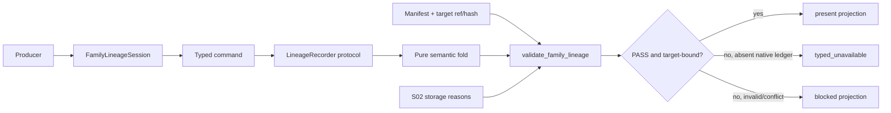

# LLD: CR163-S01 — Experiment-family contract and validator

## 0. 工程依据（上游设计依据）

| 来源 | 路径 / ID | 被本 LLD 消费的内容 |
|---|---|---|
| CP5 capsule | `process/context/CP5-CR163-TRIAL-LINEAGE-INSTRUMENTATION-LLD-CONTEXT.yaml` | 五 Story 独立 full-lld、DAG、typed-unavailable ceiling、授权边界 |
| Story | `process/stories/STORY-CR163-S01-family-contract-validator.md` | 文件 owner、6/6 对象、state/count/availability AC |
| HLD | `docs/design/HLD-TRIAL-LINEAGE-INSTRUMENTATION.md` §5-7 | session + typed commands、六对象、state/count、validator/projection |
| ADR | `docs/design/ARCHITECTURE-DECISION-TRIAL-LINEAGE-INSTRUMENTATION.md` ADR-001..004、008、010、012 | family/run 分离、对象与 count、fail-closed availability、授权 ceiling |
| Feature Matrix | `docs/design/FEATURE-DESIGN-MATRIX.md#cr163-cp4-增量trial-lineage-instrumentation` | S01 full-lld 与 CP5-FOCUS-CR163-001 |
| Feature DESIGN | `docs/features/experiment-family-lineage/DESIGN.md` | public module、command/session、validation/projection contract |
| Feature TEST-PLAN / TASKS | `docs/features/experiment-family-lineage/TEST-PLAN.md`、`TASKS.md` | TP20-01/02/05 与 TASK-CR163-20-01/02 |

CP3 已由 capsule 记录批准 `DQ-CP3-CR163-001..004`；HLD/ADR 文件中的 `draft-for-cp3` frontmatter 是未回填的派生状态，不重开已批准决策。

## 1. Goal

创建 `engine/experiment_family_lineage.py`，冻结六个持久化 lineage 对象、唯一 session façade、typed commands、状态/count/error 与 pure validation/projection contract，使 S02-S05 只能通过同一 fail-closed 公共接口生产或消费 family lineage，且 CR163 不计算 effective trial count。

## 2. 需求（Requirements：Functional / Non-Functional）

### 2.1 Functional

- 持久化对象严格为 6/6：`ExperimentFamilySpec`、`ExperimentTrial`、`TrialAttempt`、`TrialSelection`、`ExperimentFamilyManifest`、`FamilyLineageValidationResult`；`FamilyLineageSession` 是唯一 façade，不作为第七持久化对象。
- 命令严格覆盖 `DeclareFamily`、`DeclareTrial`、`StartAttempt`、`FinishAttempt`、`FinalizeTrial`、`RecordSelection`、`RequestSeal`、`AppendCorrection`、`RequestSupersedingSeal`，并携带公共 envelope：`event_id/family_id/sequence/schema_version`。
- family、trial、attempt 的每个合法与非法转换均返回确定 machine result；非法转换、orphan、post-hoc declaration、identity-content conflict 不抛出含糊异常后继续，而是生成 blocked receipt/reason 并阻断 seal。
- `stable_trial_id` 由 `family_id + canonical(normalized_parameters) + seed` 的域分离 SHA-256 派生；raw count 只统计 distinct declared stable trial ids，attempt、selection、wrapper/hook delivery 均不增加计数。
- `validate_family_lineage` 必须绑定 `target_ref + target_hash`，检查 identity、parent、transition、terminal completeness、raw count、effective ceiling 与 forbidden counters；S02 在相同结果模型上追加 storage/hash/chain checks。
- `project_family_evidence` 只允许：valid native + target-bound PASS → `present`；完全未 instrumented → `typed_unavailable`；明确排除 → `not_applicable_with_reason`；其他不完整/冲突/tamper 输入 → `blocked`。
- 所有 projection 中 `effective_trial_count_availability=typed_unavailable`、`effective_trial_count=null`、`effective_ref=""`、`effective_method=""`；C1 只能标记 `raw_input_ready` 或 `input_blocked`，不可标记 computable/computed。

### 2.2 Non-Functional

- immutable value contracts 使用 `@dataclass(frozen=True, slots=True)`；序列字段用 tuple，mapping 在构造时深复制并冻结为 JSON-safe canonical projection，避免调用方后改写。
- core module 只依赖 Python 标准库；不得 import producer、consumer、storage 实现、credentials、data/lake/runtime 或外部服务模块。
- pure validator 对同一输入返回 byte-for-byte 等价的排序 reason/code/counter projection；blocked code 使用稳定 lowercase snake_case。
- fixture/static only；禁止真实 data/runtime、credential、provider、NAS、broker、trading、external registry、Git remote 与 historical backfill。
- 未识别 enum/schema/command/transition 必须 fail closed，不能忽略或降级为 warning。

## 3. 模块拆分与职责

| 模块 / 文件组 | 职责 | 说明 |
|---|---|---|
| `engine/experiment_family_lineage.py` — enums/constants | schema v1、availability/state/decision/command/status/blocked-code | 是 S02-S05 唯一枚举 owner |
| `engine/experiment_family_lineage.py` — persistent contracts | 六个 frozen objects 与 JSON-safe `to_dict()` | 不执行 I/O，不嵌套单次-run manifest |
| `engine/experiment_family_lineage.py` — commands/session | typed command envelope、receipt、recorder protocol、session ordering | session 每次调用立即 submit，不在 close 时生成 snapshot |
| `engine/experiment_family_lineage.py` — validator/projection | pure fold、transition/count/availability checks、consumer DTO | storage integrity checks 由 S02 注入/合并，不反向 import store |
| `tests/test_experiment_family_lineage_contracts.py` | object/enum/transition/id/count/availability/import-boundary fixtures | S01 独占；S05 另做跨模块验证 |

依赖方向：producer/consumer/store → `experiment_family_lineage`；core → Python stdlib。禁止 core → producer/consumer/store。

## 4. 代码结构与文件影响范围

| 动作 | 文件路径 | 变更内容 |
|---|---|---|
| 创建 | `engine/experiment_family_lineage.py` | 六对象、enums、九 typed commands、receipt/session/protocol、pure validator/projection |
| 创建 | `tests/test_experiment_family_lineage_contracts.py` | contract shape、合法/非法转换、idempotency signal、raw count、availability/effective ceiling、no-forbidden-import tests |

不修改 S01 Story 的 forbidden producer/consumer modules、`data/**`、`runtime/**`，也不修改现有 `ExperimentManifest` / `BacktestRunSpec` owner 文件。

## 5. 数据模型与持久化设计

### 5.1 六个持久化对象

| 对象 / 字段 | 类型 | 约束 | 说明 |
|---|---|---|---|
| `ExperimentFamilySpec` | frozen dataclass | `schema_version, family_id, producer_chain_id, declared_sequence, objective_ref, parameter_space_ref, run_refs, experiment_refs, metadata`；非空 id/ref，sequence≥0 | create-only family definition；不含 trial results |
| `ExperimentTrial` | frozen dataclass | `family_id, trial_id, normalized_parameters, seed, declared_sequence, state, terminal_reason, run_refs, experiment_refs, artifact_refs` | `trial_id=derive_stable_trial_id(...)`；terminal/never-started 状态必须 reason |
| `TrialAttempt` | frozen dataclass | `family_id, trial_id, attempt_id, ordinal, state, terminal_reason, run_ref, experiment_ref, artifact_refs` | ordinal≥1；同 trial retry 使用新 ordinal/attempt id |
| `TrialSelection` | frozen dataclass | `family_id, trial_id, selection_id, sequence, decision, reason, artifact_refs` | selected/rejected/excluded 均 append-only；不改变 membership/count |
| `ExperimentFamilyManifest` | frozen dataclass | `schema_version, family_id, manifest_version, spec_ref, events_ref, sealed_event_count, sealed_last_sequence, raw_trial_count, trial_ids, supersedes_ref, supersedes_hash, supersession_reason, seal_hash, sealed_at` | version≥1；event boundary冻结该版本复算范围；trial ids 唯一排序；`sealed_at` 审计用且不进 hash；v1 prior 字段为空 |
| `FamilyLineageValidationResult` | frozen dataclass | `schema_version, validation_id, target_ref, target_hash, availability, validation_status, blocked_reasons, unavailable_reason, recomputed_raw_trial_count, declared_raw_trial_count, effective_trial_count_availability, effective_trial_count, effective_ref, effective_method, forbidden_operation_counts` | PASS 必须绑定非空 target ref/hash；effective 四字段固定 unavailable/null/empty/empty |

以上对象提供 deterministic `to_dict()`；只允许 JSON scalar、tuple/list、string-key mapping。额外的 command、receipt、fold state 与 `FamilyEvidenceProjection` 是传输/应用 DTO，不属于持久化 inventory，不得被 store 作为第七种 family artifact 写盘。

### 5.2 状态与枚举

| Enum | 冻结值 |
|---|---|
| `LineageAvailability` | `present`, `typed_unavailable`, `not_applicable_with_reason`, `blocked` |
| `ValidationStatus` | `pass`, `unavailable`, `blocked` |
| `FamilyState` | `absent`, `declared`, `recording`, `sealed`, `superseded` |
| `TrialState` | `declared`, `active`, `succeeded`, `failed`, `cancelled`, `excluded`, `never_started` |
| `AttemptState` | `declared`, `running`, `succeeded`, `failed`, `cancelled` |
| `SelectionDecision` | `selected`, `rejected`, `excluded` |
| `C1InputStatus` | `raw_input_ready`, `input_blocked` |

合法转换：family `absent→declared→recording→sealed`，以及旧 sealed head `sealed→superseded`；trial `declared→active→{succeeded,failed,cancelled,excluded}` 或 `declared→{never_started,excluded}`；attempt `declared→running→{succeeded,failed,cancelled}`。自环只通过相同 `event_id + canonical payload` 的 recorder 幂等处理，不作为第二次状态转换。

### 5.3 Machine blocked codes

固定 `LineageBlockedCode`：`schema_version_unsupported`、`required_field_missing`、`invalid_identifier`、`family_identity_mismatch`、`event_identity_conflict`、`sequence_not_monotonic`、`post_hoc_declaration`、`orphan_trial`、`orphan_attempt`、`orphan_selection`、`illegal_family_transition`、`illegal_trial_transition`、`illegal_attempt_transition`、`duplicate_attempt_ordinal`、`stable_trial_id_mismatch`、`terminal_reason_missing`、`active_entity_at_seal`、`raw_trial_count_mismatch`、`target_ref_missing`、`target_hash_missing`、`target_mismatch`、`effective_trial_claim_forbidden`、`forbidden_operation_nonzero`、`storage_artifact_missing`、`canonical_bytes_mismatch`、`seal_hash_mismatch`、`immutable_version_conflict`、`supersession_prior_missing`、`supersession_version_invalid`、`supersession_broken_chain`、`supersession_cycle`。S02 使用后九项，但不得另建近义 code。

## 6. API / Interface 设计

| 接口 / 入口 | 输入 | 输出 | 调用方 | 说明 |
|---|---|---|---|---|
| `canonical_lineage_value_bytes(value)` | supported JSON-safe value/contract | deterministic UTF-8 bytes | trial-id、S02 canonicalizer、tests | canonical primitive由core拥有，S02不得复制或形成core→store依赖 |
| `derive_stable_trial_id(family_id, normalized_parameters, seed)` | non-empty family id、JSON-safe parameters、JSON-safe seed | `str`：`trial-sha256:<64 lowercase hex>` | session、producer adapters、tests | 域 `quant-lab.experiment-family-lineage.trial-id.v1`；调用core canonical primitive |
| `transition_family_state/current,event`、`transition_trial_state(...)`、`transition_attempt_state(...)` | current enum + requested enum | `TransitionResult(accepted,state,blocked_reason)` | validator/session | 全表驱动；unknown/illegal fail closed |
| 九个 typed command dataclasses | common envelope + command-specific payload | immutable command | session/store/tests | `command_type` 固定为类对应值，调用方不能覆盖 |
| `LineageRecorder.submit(command)` protocol | typed command | `CommandReceipt(event_id,accepted,idempotent,blocked_reasons,artifact_ref)` | session → S02 store | same id/same payload 返回原 receipt；same id/different payload blocked |
| `FamilyLineageSession.open(spec, recorder, lineage_root)` | valid spec、protocol、explicit local root token | session + declare receipt | S03 producer adapters | open 立即 submit `DeclareFamily`；root 只是 opaque 参数，core 不访问文件系统 |
| `session.submit(command)` | 与 session family 相同的 typed command | receipt | producer adapters | family mismatch 在 recorder 前 blocked；每次立即转交 recorder |
| `session.seal(version, prior_head=None, reason="")` | version 与可选 prior head | `SealRequestResult(request_receipt, manifest?, validation?)` | producer adapters | 只提交 request；实际 manifest/validation 由 S02 recorder/sealer 返回 |
| `fold_family_lineage(spec, commands)` | spec + 已按 `(sequence,event_id)` 排序 commands | `LineageFoldResult` | validator/store/tests | pure semantic fold；保留所有 declared terminal trials |
| `validate_family_lineage(manifest, spec, commands, *, target_ref, target_hash, storage_reasons=(), forbidden_operation_counts=None)` | 六对象/commands + target binding + S02 reason injection | `FamilyLineageValidationResult` | S02、S04、S05 | reason code排序去重；任一 semantic/storage/counter issue → blocked |
| `unavailable_family_lineage(reason)` | non-empty reason | validation + projection typed unavailable | uninstrumented producer/consumer | 不接受 count/ref/hash |
| `project_family_evidence(manifest, validation)` | exact matching target ref/hash 的 pair | nonpersistent `FamilyEvidenceProjection` | S04 existing consumers | status 不提升；effective 固定 unavailable，C1 不可计算 |

每个接口分别由第 10 节 `T-S01-API-*` 对应覆盖。

## 7. 核心处理流程

1. Producer 在首个 trial 前创建 spec 并 `FamilyLineageSession.open`；open 即提交 `DeclareFamily`。
2. Session 对每个 typed command 校验 family identity，立即转交 recorder；receipt 原样返回，不积累 close-time snapshot。
3. Validator 对 spec/commands 做确定性排序与 fold，逐项验证 parent、state、terminal reason 与 duplicate identity signals。
4. Validator 从 declared trial id set 重算 raw count，与 manifest `trial_ids/raw_trial_count` 双向比对；attempt/selection 不进入 set。
5. Validator 合并 S02 storage/hash/chain reasons 和 forbidden counters，并强制 effective ceiling。
6. 只有 target ref/hash 非空、manifest 完整、所有 reason 为空时输出 PASS/present；无 instrumentation 走专用 typed-unavailable factory；其他情况 blocked。
7. Projection 再次校验 validation target 与 manifest ref/hash 一致，输出 existing-consumer DTO；任何不一致只可降级为 blocked。

## 8. 技术细节（技术设计细节）

- 关键算法 / 规则：command 先按 `(sequence,event_id)` 排序；同 sequence 不同 event id 允许 deterministic replay，但同一 entity 的转换仍按该顺序；sequence 负数或同 event id 冲突 blocked。raw set 在 `DeclareTrial` 成功时加入，后续状态与 selection 不删除。
- Identity：trial id hash 输入为 canonical object `{domain,family_id,normalized_parameters,seed}`；hash 前先拒绝 NaN/Infinity、非 string mapping key 与不支持类型。canonical primitive由 S01 core 公开拥有，S02 store 单向调用它；不得复制算法或形成 circular import。
- Command payload：采用九个具名 frozen dataclass，而不是 untyped `dict[type,payload]`；公共 base 只含 envelope。Correction 命令必须引用 `corrects_event_id` 和 reason，并追加事实，不覆写旧 command。
- Validation precedence：`blocked > typed_unavailable > present`。`not_applicable_with_reason` 只能由调用方明确的 excluded path factory 生成，不能由 validator 用来掩盖 included producer gap。
- Compatibility：`ExperimentManifest` / `BacktestRunSpec` 仅以 string refs 出现在对象字段；本模块不 import 或扩写其类。legacy manual count 不进入 validator present 路径，由 S04 reconciliation。
- 图示类型选择：跨 session、recorder、validator、consumer 的流程图，见第 7 节。

## 9. 安全与性能设计

| 维度 | 设计措施 | 验证方式 |
|---|---|---|
| 安全 / 权限 | core 只处理内存对象；无 env、credential、network、lake/NAS/provider/runtime/external write API | import/static scan + monkeypatch forbidden counters 均为 0 |
| 完整性 | immutable DTO、target ref/hash binding、unknown fail closed、reason code稳定 | mutation、target mismatch、unknown enum fixtures |
| 数据最小化 | artifact 仅存 refs，不读取 artifact 内容；reason 不回显 secret/path 内容 | fixture 检查 result 只含安全 ref/code |
| 性能 | fold 为 `O(E log E)` 排序 + `O(E)` replay，内存 `O(E+T+A)`；本地 family fixture目标≤100k events | 100k synthetic static fixture 可作为非门禁 benchmark；单元测试验证无二次嵌套遍历 |
| 确定性 | tuple/sorted mapping/reason 排序，禁止 clock/path/mtime 参与 identity | randomized mapping key order 产生同 id/result |

## 10. 测试设计

| 测试场景 | 前置条件 | 操作 | 预期结果 | 验证方式 |
|---|---|---|---|---|
| `T-S01-API-OBJECTS` 六对象 inventory | import core | inspect public persistent registry/dataclasses | 6/6 names；session不在 persistent registry | pytest |
| `T-S01-API-ID` stable id | same params reordered；seed A/B；different params | derive ids | reordered相同；seed/params变化产生不同 id | pytest |
| `T-S01-API-TRANSITIONS` legal tables | each legal family/trial/attempt edge | transition | accepted且目标 state准确 | parametrized pytest |
| `T-S01-NEG-TRANSITIONS` illegal tables | every non-listed edge + unknown | transition | 100% rejected，machine code准确 | exhaustive parametrized pytest |
| `T-S01-API-COMMANDS` typed commands | instantiate 9 commands | serialize/inspect | 9/9 type固定、envelope完整、immutable | pytest |
| `T-S01-API-SESSION` immediate submit | spy recorder | open + trial/attempt/selection/seal | 每次1个 command，顺序一致，无 close snapshot | pytest |
| `T-S01-IDEMPOTENCY-SIGNAL` duplicate delivery | fake recorder same/different payload | session submit twice | same→idempotent receipt；different→`event_identity_conflict` | contract fixture |
| `T-S01-COUNT` raw membership | seed A/B；trial A 3 attempts；failed/cancelled/excluded/never-started | fold | raw=declared distinct trial ids；attempt/selection不增减 | TP20-02 pytest |
| `T-S01-ORPHAN` parent/terminal failures | orphan attempt/selection、active at seal、missing reason | validate | blocked codes 4/4，未映射=0 | TP20-01/02 pytest |
| `T-S01-API-VALIDATE` target binding | complete manifest/spec/events | validate correct/missing/mismatch ref/hash | correct PASS；其余 blocked | pytest |
| `T-S01-API-UNAVAILABLE` no instrumentation | explicit reason | unavailable factory/project | typed_unavailable；ref/count为空 | TP20-05 pytest |
| `T-S01-API-PROJECTION` effective ceiling | PASS/blocked validation | project | effective availability unavailable、count null、ref/method empty；C1 never computed | TP20-05 pytest |
| `T-S01-FORBIDDEN` forbidden counters/imports | each counter=1；module import scan | validate/import | counter case blocked；forbidden imports/operations=0 | static/pytest |

## 11. 实施步骤

| TASK-ID | 动作 | 目标文件 | 详细描述 | 对应测试 |
|---|---|---|---|---|
| TASK-CR163-S01-01 | 创建 | `engine/experiment_family_lineage.py` | 定义 schema constants、enums、六对象与 deterministic serialization | `T-S01-API-OBJECTS/ID` |
| TASK-CR163-S01-02 | 修改 | `engine/experiment_family_lineage.py` | 增加九 typed commands、receipt/protocol、session immediate-submit façade | `T-S01-API-COMMANDS/SESSION/IDEMPOTENCY-SIGNAL` |
| TASK-CR163-S01-02 | 修改 | `engine/experiment_family_lineage.py` | 增加 transition tables、pure fold、validator、unavailable/not-applicable factories 与 projection | `T-S01-API-TRANSITIONS` 至 `T-S01-API-PROJECTION` |
| TASK-CR163-S01-03 | 创建 | `tests/test_experiment_family_lineage_contracts.py` | 实现全部 S01 contract/negative/count/security fixtures | 第 10 节全表 |

Story 卡的三个 TASK-ID 保持不变；同一实现 TASK 覆盖一个 owner 文件内的 command 与 validator 两个确定切片。

## 12. 风险、难点与预研建议

### 12.1 实现灰区与取舍记录

| Clarification ID | 问题 | 选项与推荐 | 决策 / 答案 | 影响面 | 证据 | 重访条件 |
|---|---|---|---|---|---|---|
| N/A | 是否需新增用户/上游决策 | 推荐按已批准 session+commands、六对象与 typed-unavailable contract 落地；备选 pure commands/DB 已由 CP3拒绝或延后 | 已由 DQ-CP3-CR163-001..004 收敛，无 lane clarification | 接口 / 文件 owner / 测试 / 安全 / 跨 Story | capsule、ADR-002..012 | 出现跨语言 transport、并发 writer、effective-statistics 新 CR |

| 风险 / 难点 | 影响 | 缓解措施 / 预研建议 |
|---|---|---|
| S01/S02 canonical normalization 漂移 | trial id 与 seal 对同 payload 不一致 | canonical primitive唯一 owner为core，store只调用；同一 golden vector覆盖trial id与seal，禁止复制实现 |
| reason code 漏项或近义重复 | 下游无法稳定 fail closed | 使用本 LLD 固定 enum；S02-S05 只能复用；新增 code 需 design delta/CR |
| session façade吞掉中间失败 | post-hoc/失败事件不可审计 | 每调用立即 submit + spy recorder contract test |
| `not_applicable` 被用于 included mapping | 覆盖率被虚假满足 | 仅 explicit excluded factory；S03 included mappings只能 present/unavailable/blocked |

### OPEN / Spike 跟踪

| ID | 类型（OPEN / Spike） | 问题 | 下一动作 | 责任方 |
|---|---|---|---|---|
| N/A | OPEN | 无 OPEN / Spike；canonical owner 已以依赖方向约束收敛 | N/A | N/A |

## 13. 回滚与发布策略

- 发布方式：仅在全量 CP5 批准后，按 W1 独立实现 core/tests；验证 fixture/static 后才允许 S02 dev gate。无 migration、真实 runtime 或数据发布。
- 回滚触发条件：六对象 inventory、state/count、reason enum、target binding 或 effective ceiling 与 CP3 冲突；任一 forbidden operation/import 非零。
- 回滚动作：撤销尚未被下游采用的 S01 source/test diff；若已被 S02-S04 消费则停止后续 Wave，保留证据并通过 design clarification/CR 统一修订公共 contract，禁止单 lane 私改兼容层。无持久化 artifact 删除动作。

## 14. DoD（Definition of Done）

- [ ] 六个持久化对象 6/6 与唯一 `FamilyLineageSession` façade 可导入，额外持久化对象数=0。
- [ ] 九 typed commands 9/9、全部合法/非法 family/trial/attempt transitions 与 machine codes 有 contract tests，未映射转换=0。
- [ ] raw count 对 seed、retry、failure/cancel/exclude/never-started fixtures准确，attempt/selection/wrapper delivery 增量=0。
- [ ] validator PASS 100% 绑定 target ref/hash；orphan、incomplete、identity conflict、count mismatch 100% blocked。
- [ ] manifest 的 `sealed_event_count/sealed_last_sequence` 可冻结每个 version 的事件边界，使旧 seal 在后续 append 后仍可复算。
- [ ] present / typed_unavailable / not_applicable / blocked projection contract完整；effective available声明=0、effective ref/method非空=0、C1 computed声明=0。
- [ ] core 对 producer/consumer/store/runtime/data/credential/external service 的 forbidden import=0，forbidden operation counters=0。
- [ ] 第 10 节接口各至少有 1 条测试；文件影响项和 Story TASK-ID 双向覆盖。
- [ ] 14 个章节、灰区、OPEN/Spike 均已清点；`confirmed=false`，未越过 CP5 或进入实现。

## 人工确认区

> 本文件只是 `CP5-CR163-ALL-STORIES-LLD-BATCH` 的一项独立证据；Host 收齐 5/5 LLD 与自动预检后统一发起人工门禁。

| # | 检查项 | 状态 | 证据 |
|---|---|---|---|
| 1 | LLD 覆盖 AC | 待检查 | 第 2 / 10 / 14 节 |
| 2 | 与 HLD / ADR 一致 | 待检查 | 第 0 / 3 / 8 / 12 节 |
| 3 | 文件影响范围明确 | 待检查 | 第 4 / 11 节 |
| 4 | 接口契约完整 | 待检查 | 第 5 / 6 节 |
| 5 | 测试与 dev_gate 可计算 | 待检查 | 第 10 / 14 节 |
| 6 | clarification queue 已收敛 | 待检查 | 第 12.1 节；无 lane clarification |

**人工审查结果回填**：

- 结论：`pending`
- 审查人：
- 审查时间：
- 修改意见：
- 风险接受项：
