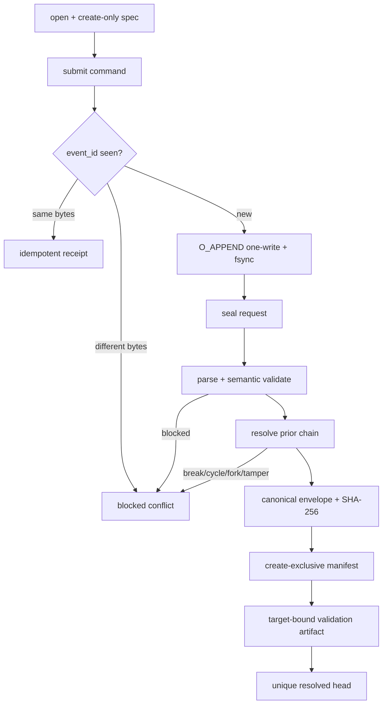

# LLD: CR163-S02 — Append-only recorder, deterministic seal and supersession

## 修订记录

| 版本 | 日期 | 修订人 | 变更要点 |
|---|---|---|---|
| 1.0 | 2026-07-11 | meta-dev | 初始 S02 full LLD，冻结 append-only recorder、canonical seal 与 supersession。 |
| 1.1 | 2026-07-11 | meta-dev | 明确长期搜索在损坏 ledger 后不可原地续跑的产品影响；新增 10k synthetic 性能刻画与后续 storage CR 触发条件。 |

## 0. 工程依据（上游设计依据）

| 来源 | 路径 / ID | 被本 LLD 消费的内容 |
|---|---|---|
| CP5 capsule | `process/context/CP5-CR163-TRIAL-LINEAGE-INSTRUMENTATION-LLD-CONTEXT.yaml` | S01→S02 contract edge、独立 full-lld、static-only 与授权边界 |
| Story | `process/stories/STORY-CR163-S02-recorder-seal-supersession.md` | store/test owner、determinism、5 negative classes、supersession AC |
| S01 declared contract | `process/stories/STORY-CR163-S01-family-contract-validator-LLD.md` | 六对象、commands/receipt/protocol、blocked codes、validator injection interface |
| HLD | `docs/design/HLD-TRIAL-LINEAGE-INSTRUMENTATION.md` §7、§14、§16 | JSON/JSONL layout、seal domain、immutable version、rollback gotchas |
| ADR | `docs/design/ARCHITECTURE-DECISION-TRIAL-LINEAGE-INSTRUMENTATION.md` ADR-005..007、012 | canonical local store、SHA-256、supersession、design-only authorization |
| Feature Matrix | `docs/design/FEATURE-DESIGN-MATRIX.md#cr163-cp4-增量trial-lineage-instrumentation` | S02 full-lld 与 CP5-FOCUS-CR163-002 |
| Feature DESIGN / TEST / TASKS | `docs/features/experiment-family-lineage/{DESIGN,TEST-PLAN,TASKS}.md` | recorder/sealer/resolver、TP20-03/04、TASK-CR163-20-03/04 |

## 1. Goal

创建 `engine/experiment_family_lineage_store.py`，实现 S01 `LineageRecorder` contract 的单写、append-only 本地 store，以及确定 canonical bytes、SHA-256 immutable seal、target-bound validation artifact 和 full supersession-chain resolver；任何 duplicate conflict、tamper、count/hash/chain 异常均 fail closed 且不覆盖旧版本。

## 2. 需求（Requirements：Functional / Non-Functional）

### 2.1 Functional

- 为每个 `family_id` 使用固定相对 layout，spec create-only、events JSONL append-only、manifest/validation 按四位版本 create-exclusive；不实现可变 latest pointer。
- `submit` 对相同 `event_id + canonical command bytes` 返回原 receipt且不追加第二行；相同 event id + 不同 bytes 返回 `event_identity_conflict` 并记录内存/验证 blocked 状态，不修改原行。
- seal 前重放完整 ledger 并调用 S01 semantic validator；active/orphan/terminal/count/conflict 任一异常不创建 manifest/validation PASS artifact。
- canonical profile精确拒绝非有限数、不支持类型、非 string key；dict递归排序、无空白、UTF-8、LF；同一语义输入的 key/insertion order 不影响 bytes/hash。
- seal hash 对一个域分离 canonical envelope 计算 SHA-256 lowercase hex；path、mtime、current clock、`sealed_at`、validation 与 seal hash自身不进入 envelope。
- v1 无 prior；vN (N>1) 必须引用当前唯一合法 head 的 ref/hash并提供非空 correction reason；新 version创建后旧 manifest bytes/ref/hash 不变。
- resolver 不信任目录最大版本或 pointer，必须从所有 manifests 建图，复算每个 seal、检查 version monotonic、断链、分叉与循环，返回唯一合法 head；异常全部 blocked。
- malformed/partial/conflicting ledger 不支持截断、修补后原地 resume，也不允许把已完成 trial 搬入同一个 family 继续；必须保留原 family 为 blocked evidence，并用全新 `family_id` 从 pre-search declaration 重新启动整次搜索。

### 2.2 Non-Functional

- Python stdlib + S01 core only，无 DB/MLflow/external registry/network/credential/data/runtime import。
- 并发模型固定 single writer per family；同一 process 使用 per-family lock；跨 process 写入不被支持并必须由 create-exclusive/conflict fail closed，不能静默 last-write-wins。
- event append：一个 canonical line 在单次 `os.write` 中写入已用 `O_APPEND` 打开的 fd，然后 `fsync`；partial/malformed tail 被 validator blocked，不截断修复。
- immutable artifact publish 使用 temp file（同目录、`O_CREAT|O_EXCL`、write/fsync）+ create-exclusive hard-link 到 final + directory fsync；final 已存在时比较 bytes：相同返回 idempotent，差异 blocked，绝不 `replace` final。
- 所有 public path 输入须经 `resolve` 后仍位于 explicit lineage root；family id 到目录名使用受控 slug/散列，拒绝 `..`、absolute、separator 与 symlink escape。
- 必须用恰好 10,000 条 deterministic synthetic commands 记录 open/rebuild elapsed time、seal elapsed time、peak memory 与 manifest byte size 四项观测值；该结果只是当前实现/机器/fixture 的性能刻画，不是 supported-capacity、SLA、生产规模或长期搜索可恢复性承诺。

### 2.3 长期搜索产品影响与支持边界

- 对持续数小时或数天的搜索，若进程/主机在 JSONL append 中断并留下 partial/malformed tail，当前 first-slice 无 checkpoint resume、tail truncation、ledger repair 或 event migration。即使前 9,999 条 command 已完整写入，也不能在原 family 上从第 10,000 条继续。
- 用户可见结果是：原 family 保留并投影为 `blocked`，已耗费的搜索计算不能作为 native present lineage 继续累积；操作者必须创建新 `family_id`、重新执行 pre-search declaration，并从 trial 计划起点重新运行。两次 family 的 trial/count 不得合并或伪装为同一 lineage。
- 该取舍优先保护 append-only/tamper evidence，代价是长任务故障后的计算浪费、交付延迟和重复资源消耗。产品/运行手册必须在任何真实长任务启用前显式披露 “no in-place resume; restart as a new family”。
- CR163 first slice 因此只声明本地 fixture/static correctness，不声明适合任意长时、超大 family 或高故障成本搜索。

## 3. 模块拆分与职责

| 模块 / 文件组 | 职责 | 说明 |
|---|---|---|
| `experiment_family_lineage_store.py` — layout/path guard | root/family relative refs、安全路径、版本文件名 | refs一律相对 lineage root 的 POSIX path |
| `...` — canonicalizer | 调用 S01 `canonical_lineage_value_bytes`，组装 JSONL、seal envelope bytes、SHA-256 | core是canonical primitive唯一 owner；store不读 clock/path metadata |
| `...` — `LocalFamilyLineageRecorder` | create spec、append command、event id index/idempotency、seal request | 实现 S01 protocol；single-writer |
| `...` — sealer/publisher | fold/validate、构造 manifest、create-exclusive artifact | 不覆写旧 version；PASS validation 绑定 manifest ref/hash |
| `...` — resolver | discover versions、复算 hash、验证完整链、返回唯一 head | pointer/mtime/version filename均不单独构成真相 |
| `tests/test_experiment_family_lineage_store.py` | canonical golden、I/O atomicity、idempotency/conflict、tamper/chain/recovery fixtures | 只用 `tmp_path`，无真实 data/runtime |
| `tests/test_experiment_family_lineage_store.py` — characterization fixture | 构造 10,000 commands并输出四项性能观测 | 非容量门禁；不得转写为 production benchmark/SLA |

## 4. 代码结构与文件影响范围

| 动作 | 文件路径 | 变更内容 |
|---|---|---|
| 创建 | `engine/experiment_family_lineage_store.py` | fixed layout、canonical helpers、local recorder、sealer、validation writer、full-chain resolver |
| 创建 | `tests/test_experiment_family_lineage_store.py` | 10x deterministic seal、golden bytes/hash、append/idempotency、tamper/broken/cyclic/fork/supersession fixtures |

不修改 S01 core owner、任何 producer/consumer、`data/**`，不创建 database、migration、runtime service 或 latest pointer。

## 5. 数据模型与持久化设计

### 5.1 Exact layout 与 refs

```text
<lineage-root>/
  families/
    <family-id>/
      spec.json
      events.jsonl
      manifests/
        family-manifest-v0001.json
        family-manifest-v0002.json
      validations/
        family-manifest-v0001.validation.json
        family-manifest-v0002.validation.json
      .tmp/                         # only unlinked temp files; not truth
```

- `<family-id>` 必须匹配 `^[A-Za-z0-9][A-Za-z0-9._-]{0,127}$` 且不等于 `.`/`..`；否则 `invalid_identifier`。manifest version范围 `1..9999`，超出需 schema/format CR。
- artifact ref 格式固定为相对 root POSIX path，例如 `families/family-001/manifests/family-manifest-v0001.json`；manifest 内不得存 absolute root。
- `spec.json` 是 `ExperimentFamilySpec.to_dict()` canonical bytes；`events.jsonl` 每行是完整 typed command canonical dict，末尾恰好一个 LF。空 ledger 文件允许存在但不可 seal。
- validation JSON 是 S01 `FamilyLineageValidationResult.to_dict()`；它不进入 seal domain，不自证 manifest。

### 5.2 Restricted canonical JSON v1

| 输入类型 | canonical 输出规则 |
|---|---|
| `null/bool/string` | JSON literals；string按 JSON UTF-8 escaping，`ensure_ascii=False` |
| integer | base-10，无前导零；bool 不按 integer |
| finite float / Decimal | 先用 `Decimal(str(value))`；`-0`→`0`；移除无意义尾零和正号；使用 plain decimal、禁止 exponent；NaN/Infinity blocked |
| sequence | 保持业务顺序；无空白的 `[...]` |
| mapping | key必须 string；按 Unicode code-point 顺序递归排序；无空白的 `{...}` |
| enum / frozen contract | 先投影为 `.value` / `to_dict()`，再按上述规则 |

canonical JSON bytes不带尾 LF；JSONL line = canonical bytes + `b"\n"`。events seal projection按 `(sequence,event_id)` 排序，不依赖物理重放以外的 dict order。duplicate identical event只出现一条。

### 5.3 Seal envelope v1

hash 输入是以下对象的 canonical bytes，而非路径拼接：

```json
{
  "domain": "quant-lab.experiment-family-lineage.seal.v1",
  "schema_version": "1.0",
  "family_id": "<family-id>",
  "manifest_version": 1,
  "spec": {"...": "canonical spec projection"},
  "events": [{"...": "commands sorted by sequence,event_id"}],
  "supersedes": {"ref": "", "hash": ""}
}
```

v1 的 prior ref/hash 必须均为空；vN 必须均非空且恰指向 vN-1 的合法 current head。`supersession_reason` 是审计/validation必需字段，但不进入 hash，避免修改解释文字改变事实 seal；correction事实本身必须通过 appended `AppendCorrection` command 进入 `events`，因此仍被 hash覆盖。manifest 的 `seal_hash`、`sealed_at`、artifact path、mtime、validation均排除。`sha256(canonical_envelope_bytes).hexdigest()` 是唯一 seal算法。

## 6. API / Interface 设计

| 接口 / 入口 | 输入 | 输出 | 调用方 | 说明 |
|---|---|---|---|---|
| `canonical_json_bytes(value)` | supported JSON-safe value/contract | `bytes` | recorder、sealer、tests | 对 S01 `canonical_lineage_value_bytes` 的store层稳定别名；非法输入沿用typed canonical error |
| `canonical_jsonl_line(command)` | S01 typed command | `bytes` ending LF | recorder/tests | command type与envelope一起序列化 |
| `build_seal_envelope(spec, commands, version, supersedes_ref, supersedes_hash)` | canonical facts | immutable mapping | sealer/tests | 唯一 hash domain builder |
| `compute_family_seal_hash(...)` | same as envelope builder | 64-char lowercase hex | sealer/resolver/tests | 不接收 clock/path/mtime/hash 参数 |
| `LocalFamilyLineageRecorder.open(root, spec)` | explicit local root + valid spec | recorder + DeclareFamily receipt | S01 session/S03 | create root dirs与spec create-only；不同既有 spec blocked |
| `recorder.submit(command)` | S01 typed command | S01 `CommandReceipt` | session | append/idempotency/conflict；family/path/sequence guard |
| `recorder.seal(version=1, prior_head=None, reason="")` | requested version/prior/reason | `SealResult(manifest,validation,manifest_ref,validation_ref)` or blocked result | session/S03 | semantic validate first；create manifest then matching validation；失败不声称 present |
| `load_family_artifacts(root,family_id)` | safe root/id | spec + commands + manifests + validations | resolver/S05 | malformed/missing artifacts以 machine reasons返回，不猜测修复 |
| `resolve_family_head(root,family_id)` | complete local artifact set | `ResolvedFamilyHead(manifest,validation,ref,hash,chain_refs)` or blocked reasons | S04/S05 | 全链复算；唯一 root/head；拒绝 break/cycle/fork |
| `verify_immutable_artifact(root,ref,expected_bytes)` | safe relative ref + bytes | idempotent/present or conflict reason | publisher/tests | final存在且bytes不同=`immutable_version_conflict` |

第 10 节为每个 API 提供对应 `T-S02-API-*` 测试。

## 7. 核心处理流程

1. `open` 校验 root/id，创建受控目录；以 create-exclusive publish `spec.json`，已有相同 bytes视为 idempotent，不同 bytes blocked。
2. recorder 在锁内扫描/维护 `event_id → canonical line/receipt` index；submit 相同 line 返回原 receipt，不同 line blocked；新 line以 `O_APPEND` 单 write + fsync追加。
3. seal 读取 spec/events，拒绝 malformed/partial line，按 `(sequence,event_id)` 解析，并调用 S01 fold/semantic validation。
4. 对 v1强制 empty prior；对 vN 调用 resolver取得唯一合法 head，要求 `version=head.version+1`、prior ref/hash exact match、reason非空且 ledger含 correction command。
5. 构造 seal envelope、计算 hash和 manifest；先 create-exclusive publish manifest，再生成绑定该 manifest ref/hash 的 validation artifact。
6. resolver枚举所有 manifest内容，按内嵌 version/prior建图；逐节点从其对应 spec/events projection复算 seal，验证单一 v1 root、无断链/循环/分叉，最终返回唯一 head。
7. tamper/conflict/chain错误返回 blocked reasons；旧 artifact不修改、不删除，consumer不得使用目录最大版本猜 head。
8. partial/malformed/conflicting ledger 终止该 family；系统不提供 resume token 或 repair API。操作者保留 blocked family，生成全新 family id，并从 declaration 与完整 trial plan 重新开始。



## 8. 技术细节（技术设计细节）

- Append atomicity：single writer是 contract，不宣称通用多进程 transaction。每行先在内存完整 canonicalize，长度超过 configurable 1 MiB 上限即 blocked；一次 `os.write` 必须返回完整长度，否则记录 I/O failure并停止该 recorder。重新打开时 partial/malformed tail使 family blocked；不得 truncate。
- Idempotency index：以完整 ledger重建，不能只依赖进程内 cache；发现同 event id 不同 canonical line时 family永久 blocked直到通过新、独立 family lifecycle恢复，不能用 supersession掩盖冲突事实。
- Create-exclusive：temp与final同文件系统；hard-link是原子 no-clobber publish primitive。平台不支持 hard-link时回退为 final `O_EXCL` 写入，且失败/partial final一律 blocked，不使用 `os.replace`。这一 fallback只面向 fixture/local filesystem。
- Seal consistency：manifest publish成功但 validation publish失败时，manifest仍是 immutable evidence；resolver将其视为 `validation missing` blocked，重试只能 create identical validation。不得删除 manifest重试。
- Supersession：chain节点按 embedded version/ref/hash，不信任 filename；filename与embedded version不一致 blocked。v2 correction events包含 v1全部事件加 correction append，因此 v1 hash仍可用 v1 seal envelope复算；resolver需保留每一 version sealing时的 event boundary（manifest字段 `sealed_event_count` 与 `sealed_last_sequence`），否则后续 events会改变 v1复算输入。S01 manifest实现时必须包含这两个完整性字段，属于 S02对 S01 declared manifest contract的必要细化。
- S01 declared contract已包含 `sealed_event_count:int`、`sealed_last_sequence:int`；S02严格消费这两个边界字段。这是 HLD“旧 hash永久复算”与持续append ledger的必要派生，不是新的用户决策。
- No-resume contract：`LocalFamilyLineageRecorder.open` 不接受 `resume_from_sequence`、checkpoint、truncate 或 repair 参数；resolver 也不返回可继续写入的 recovery cursor。新 family 必须有新 identity，旧/new family 不合并 raw count。
- 10k characterization fixture：固定 schema/version、seed、payload shape 与 command mix，先写满恰好 10,000 条 commands，关闭后从磁盘重新 `open/rebuild`，再执行一次 v1 seal。用 `time.perf_counter()` 分别记录 rebuild 与 seal elapsed seconds；用 `tracemalloc` 记录测试进程区间 peak allocated bytes（同时注明它不是进程 RSS）；用 `stat().st_size` 记录 manifest bytes。测试报告必须同时记录 Python版本、OS、CPU标识与 fixture hash，避免跨环境误比。
- 这四项观测值不设容量通过阈值；测试只要求流程完成、正确性断言仍 PASS、四项为非负整数/有限数且证据可定位。任何文档不得从单机 synthetic 观测推导 “支持 10k+”、吞吐 SLA 或生产容量。
- 图示类型选择：append/idempotency/seal/supersession的异常流程图，见第 7 节。

## 9. 安全与性能设计

| 维度 | 设计措施 | 验证方式 |
|---|---|---|
| 路径安全 | explicit root、family allowlist、relative refs、resolve containment、拒绝 symlink escape | traversal/absolute/symlink fixtures 100% blocked |
| 完整性 | create-exclusive final、fsync、full-chain recompute、target-bound validation | tamper/overwrite/broken/cycle/fork tests |
| 权限 | 只写调用方显式 `tmp_path`/lineage root；无 env/credential/data/lake/NAS/provider/runtime/external writes | monkeypatch/static forbidden counters=0 |
| 机密性 | artifact payload只含传入 contract/ref；error不回显任意文件内容或 credentials | error snapshot tests |
| 性能复杂度 | submit平均 O(1) index；open/rebuild O(E)；seal O(E log E)；resolver O(V·E) first slice，V≤9999 | code review + 10k characterization；禁止每次 submit全 ledger扫描 |
| 10k 性能刻画 | 恰好 10,000 synthetic commands，记录 `open_rebuild_elapsed_seconds`、`seal_elapsed_seconds`、`peak_tracemalloc_bytes`、`manifest_bytes` 4/4；附环境与fixture hash | pytest characterization evidence；无数值 pass threshold，不构成 supported-capacity promise |
| 长任务恢复 | fail closed；无原地 resume/truncate/repair/merge；新 family 从 declaration 重跑 | partial-tail fixture + API signature/static check + product-boundary assertion |
| 并发 | per-family in-process lock + OS create-exclusive；跨进程冲突 fail closed | two-recorder conflict fixture，不声称 multiwriter安全 |

### 9.1 后续 storage CR 触发条件

命中以下任一条件即停止扩大本实现，创建独立 storage CR/ADR；不得在 S02 内静默增加新 artifact 形态：

1. 产品要求长任务从已确认 event boundary 原地恢复，或一次失败重跑成本不可接受。
2. 产品要求声明 10,000 或更多 commands 的 supported capacity、明确 latency/peak-memory/manifest-size SLO，或 10k characterization 暴露不可接受的资源曲线。
3. 单 family 需要 bounded rebuild/seal latency、并行 writer、跨进程协调或局部读取，而当前 `O(E)` rebuild / `O(E log E)` seal不满足。
4. manifest/trial inventory 大到必须分片，或单个 seal envelope/manifest bytes 超过下游审查与传输边界。

后续 CR 才能评估 segmented ledger/checkpoint、incremental seal/index、sharded manifest（以及必要时 SQLite/registry）；必须定义迁移、旧 hash可复算、跨 segment canonical order、partial segment recovery 与兼容回滚。CR163 不预选其中任何方案。

## 10. 测试设计

| 测试场景 | 前置条件 | 操作 | 预期结果 | 验证方式 |
|---|---|---|---|---|
| `T-S02-API-CANONICAL` golden bytes | nested keys、Unicode、int/float/Decimal/-0 | canonicalize | exact committed byte vectors；NaN/Inf/non-string key blocked | pytest golden |
| `T-S02-API-HASH` deterministic seal | identical semantic fixture with randomized key order | seal 10 fresh roots | distinct hash count=1 | TP20-03 pytest |
| `T-S02-HASH-DOMAIN` exclusions | vary path/mtime/current clock/sealed_at/hash field | compute | hash不变；vary spec/event/version/prior则hash变化 | pytest |
| `T-S02-API-OPEN` create-only spec | same/different spec at same family | open twice | same idempotent；different blocked，旧bytes不变 | pytest |
| `T-S02-API-SUBMIT` append/idempotency | new + duplicate same/different command | submit | one line；same receipt；conflict blocked | pytest |
| `T-S02-PARTIAL` malformed/partial tail | manually truncated tmp fixture ledger | load/seal | blocked且不truncate/overwrite | pytest |
| `T-S02-NO-RESUME` 长期搜索中断 | 9,999 valid commands + partial 10,000th line | reopen/inspect APIs/new family start | 原 family blocked且无 resume/repair cursor；新 family id从DeclareFamily开始；跨 family count merge=0 | pytest + API static check |
| `T-S02-API-SEAL` happy seal | complete semantic ledger | seal v1 | manifest/validation create-exclusive、target-bound PASS | pytest |
| `T-S02-COUNT` manifest mismatch | declared count/trial ids altered | seal/resolve | `raw_trial_count_mismatch` blocked | TP20-02/03 |
| `T-S02-TAMPER` sealed mutation | mutate v1 manifest/events/spec independently | resolve | 3/3 `seal_hash_mismatch`/canonical blocked；present=0 | TP20-03/T01 |
| `T-S02-API-SUPERSEDE` valid v1→v2 | append correction + correct prior/reason | seal v2/resolve | v2 unique head；v1 ref/hash/bytes仍可复算 | TP20-04 |
| `T-S02-BROKEN` missing/wrong prior | v2 prior absent/wrong hash | resolve | broken chain blocked | TP20-04 |
| `T-S02-CYCLE` cyclic refs fixture | two manifests reference cycle | resolve | cycle blocked | TP20-04 |
| `T-S02-FORK` two children of v1 | create fixture branches | resolve | no unique head，blocked | pytest |
| `T-S02-IMMUTABLE` final collision | precreate same/different v path | seal | same idempotent；different conflict；in-place mutation count=0 | pytest |
| `T-S02-API-LOAD/RESOLVE` discovery | filename/version mismatch、missing validation、directory order shuffled | load/resolve | deterministic sorted reasons；不按mtime/max filename猜测 | pytest |
| `T-S02-PATH` traversal/symlink | malicious family/ref/root fixture | open/load | 100% blocked；root外write=0 | pytest |
| `T-S02-FORBIDDEN` operation boundary | monkeypatch forbidden APIs/counters | full suite | credential/lake/NAS/provider/runtime/external writes=0 | static/pytest |
| `T-S02-PERF-10K` synthetic characterization | fixed seed/schema/mix生成恰好10,000 commands；记录环境与fixture hash | cold open/rebuild + v1 seal + memory/size capture | correctness PASS；4/4 metrics可定位且为有限非负值；不设置容量阈值、不输出supported-capacity结论 | pytest characterization report |

五个 Story AC negative classes对应：duplicate-conflict、count mismatch、tamper、broken chain、cyclic chain = 5/5 blocked。

## 11. 实施步骤

| TASK-ID | 动作 | 目标文件 | 详细描述 | 对应测试 |
|---|---|---|---|---|
| TASK-CR163-S02-01 | 创建 | `engine/experiment_family_lineage_store.py` | 冻结 layout/path guard、canonical JSON/JSONL、seal envelope/hash与typed errors | `T-S02-API-CANONICAL/HASH/HASH-DOMAIN/PATH` |
| TASK-CR163-S02-02 | 修改 | `engine/experiment_family_lineage_store.py` | 实现 local recorder、single-write append、ledger-rebuilt idempotency、create-exclusive publisher | `T-S02-API-OPEN/SUBMIT/PARTIAL/IMMUTABLE` |
| TASK-CR163-S02-02 | 修改 | `engine/experiment_family_lineage_store.py` | 实现 sealer、target-bound validation writer、full chain resolver 与 supersession boundary复算 | `T-S02-API-SEAL/SUPERSEDE/BROKEN/CYCLE/FORK/LOAD` |
| TASK-CR163-S02-03 | 创建 | `tests/test_experiment_family_lineage_store.py` | 实现第 10 节 golden/integrity/recovery/path/permission/no-resume fixtures与10k synthetic characterization | 第 10 节全表 |

S02 开发前置仍是 S01 contract confirmed + implemented；本 LLD 的 declared edge只允许设计，不授权提前 import 未实现 core。

## 12. 风险、难点与预研建议

### 12.1 实现灰区与取舍记录

| Clarification ID | 问题 | 选项与推荐 | 决策 / 答案 | 影响面 | 证据 | 重访条件 |
|---|---|---|---|---|---|---|
| N/A | immutable publish与持续 append ledger如何保证旧 hash可复算 | 推荐 manifest记录 sealed event boundary并由resolver按边界复算；备选每version复制events snapshot会增加第七 artifact类别与存储重复 | 采用 event count + last sequence；是 HLD“旧 hash永久复算”的必要派生，不改变批准架构 | S01 manifest字段 / S02 seal / tests / chain | HLD §7、ADR-007、Story v1复算 AC | 若 ledger分片/DB backend获新 ADR批准 |
| N/A | no-clobber publish primitive | 推荐 same-fs temp + hard-link；备选 `O_EXCL` direct write；禁止 `replace` | 主选 hard-link，平台不支持时fail-closed direct create fallback | filesystem / recovery / platform | ADR-005..007 | 多平台正式发布或非本地 filesystem进入范围 |

| 风险 / 难点 | 影响 | 缓解措施 / 预研建议 |
|---|---|---|
| JSONL crash留下 partial tail | family无法继续seal | fail closed、不truncate；保留artifact，启动新 family lifecycle；未来若要求自动恢复，另起 segmented-log/storage CR |
| 长期搜索接近完成时发生 partial write | 已完成 trial 不能在原 family续跑，造成计算浪费、交付延迟与重复资源消耗 | 启用前披露 no-resume；保留 blocked evidence；全新 family从pre-search declaration重跑；恢复需求触发独立 storage CR |
| manifest已发布但validation失败 | 出现不可消费版本 | resolver要求matching validation；允许仅创建identical validation重试，禁止删改manifest |
| hard-link在部分filesystem不可用 | create-exclusive publish无法用主路径 | capability test；仅本地 `O_EXCL` fallback且partial即blocked；外部/NAS不授权 |
| chain复算错误使用最新全量events | v1被后续correction伪判tamper | `sealed_event_count + sealed_last_sequence`双边界与v1→v2复算fixture |
| concurrent writers突破single-writer假设 | duplicate sequence/partial ordering | per-family lock + conflict detection；出现真实多writer需求立即新 storage ADR/CR |
| 10k synthetic结果被误写为容量承诺 | 用户把单机fixture理解为生产SLA或可恢复性保证 | 只记录四项observed metrics + 环境/fixture hash；无阈值；发布文档明确not a supported-capacity promise |

### OPEN / Spike 跟踪

| ID | 类型（OPEN / Spike） | 问题 | 下一动作 | 责任方 |
|---|---|---|---|---|
| FU-S02-STORAGE-CR | OPEN | segmented ledger、incremental seal、sharded manifest 或 checkpoint resume 是否需要 | 仅在第 9.1 节任一触发条件命中时创建 follow-up storage CR/ADR；当前不实现、不预选 | host-orchestrator / storage owner |

## 13. 回滚与发布策略

- 发布方式：全量 CP5 批准且 S01 dev/contract通过后按 W2 实现；仅 `tmp_path`/显式本地 lineage root fixture 验证，不接真实 data/runtime。manifest v1功能先通过，再启用v2 supersession fixture。
- 发布限制：任何面向长任务的启用说明必须包含 `no in-place resume`、`blocked family is retained`、`restart from pre-search declaration with a new family_id`、`do not merge counts across families`；10k结果只进入 characterization evidence，不进入容量/生产就绪声明。
- 回滚触发条件：golden bytes/hash漂移、旧版本任何 mutation、target validation不匹配、五类negative未全部blocked、path/root外write或 forbidden counter非零。
- 回滚动作：停止新 recorder/session 接入并撤销未发布 source/test diff；已产生的 append-only fixture artifacts保留为失败证据且不原地修改。若 schema/canonical profile已被下游消费，创建新 schema/version与 superseding design delta/CR，绝不覆盖旧 seal。

## 14. DoD（Definition of Done）

- [ ] fixed layout、canonical bytes、seal envelope/hash domain 与 public APIs 在文件级冻结并实现；golden vectors稳定。
- [ ] identical fixture连续 seal 10 次 distinct hash=1；path/mtime/current clock/sealed_at/hash自身进入hash domain字段数=0。
- [ ] duplicate identical不新增行；duplicate conflict、count mismatch、tamper、broken chain、cyclic chain 5/5 blocked。
- [ ] valid v1→v2 chain coverage=100%；v1 ref/hash/bytes在v2后仍可按 sealed event boundary复算；prior ref/hash/reason完整率=100%。
- [ ] sealed in-place mutation count=0；所有 final publish create-exclusive，latest pointer实现数=0。
- [ ] traversal/symlink escape/root外write=0；forbidden credential/data/lake/NAS/provider/runtime/external operation counters=0。
- [ ] partial/malformed/conflicting ledger 的原 family 100% blocked；resume/truncate/repair API数=0；恢复只能以新 family id从pre-search declaration重跑，跨 family count merge=0。
- [ ] 恰好10,000条 synthetic commands完成 cold open/rebuild 与 v1 seal；`open_rebuild_elapsed_seconds`、`seal_elapsed_seconds`、`peak_tracemalloc_bytes`、`manifest_bytes` 4/4连同环境/fixture hash写入可定位证据。
- [ ] 10k characterization无容量数值阈值，supported-capacity/SLA/production-scale声明数=0；segmented/incremental/sharded/resume需求明确路由 follow-up storage CR。
- [ ] 第 6 节每个接口至少对应第 10 节一条测试；2个文件影响项与3个 Story TASK-ID双向覆盖。
- [ ] 14章、取舍、OPEN/Spike已清点；`confirmed=false`，S01未confirmed/implemented前不进入S02开发。

## 人工确认区

> 本文件只是 `CP5-CR163-ALL-STORIES-LLD-BATCH` 的一项独立证据；Host 收齐 5/5 LLD 与自动预检后统一发起人工门禁。

| # | 检查项 | 状态 | 证据 |
|---|---|---|---|
| 1 | LLD 覆盖 AC | 待检查 | 第 2 / 10 / 14 节 |
| 2 | 与 HLD / ADR 一致 | 待检查 | 第 0 / 3 / 8 / 12 节 |
| 3 | 文件影响范围明确 | 待检查 | 第 4 / 11 节 |
| 4 | 接口契约完整 | 待检查 | 第 5 / 6 节 |
| 5 | 测试与 dev_gate 可计算 | 待检查 | 第 10 / 14 节 |
| 6 | clarification queue 已收敛 | 待检查 | 第 12.1 节；无 lane clarification |

**人工审查结果回填**：

- 结论：`pending`
- 审查人：
- 审查时间：
- 修改意见：
- 风险接受项：
