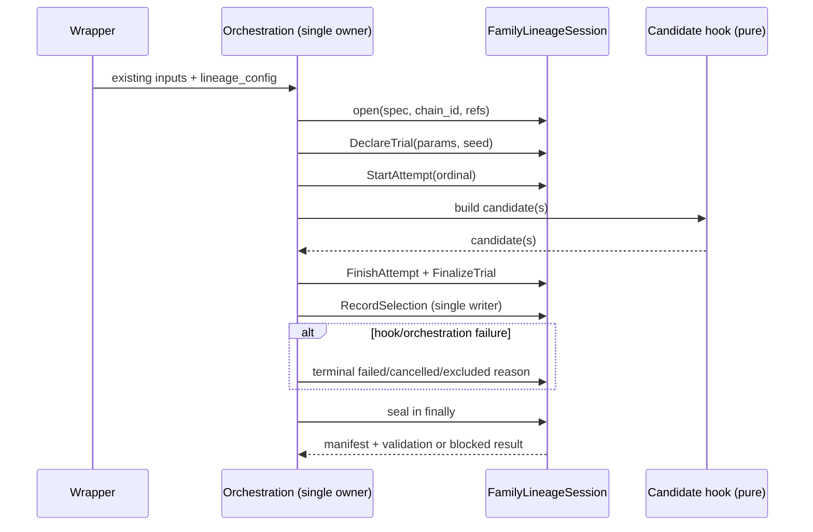

# LLD: CR163-S03 — Two producer chains and four instrumentation mappings

## 修订记录

| 版本 | 日期 | 修订人 | 变更要点 |
|---|---|---|---|
| 1.0 | 2026-07-11 | meta-dev | 初稿；冻结 2/2 chain、CPI-CR163-001..004、session owner、post-hook selection writer、失败路径与测试。 |
| 1.1 | 2026-07-11 | meta-dev | 按 CP5 rework 冻结 `ProducerLineageConfig | None`、CLI spec/root pair、共享 parser/error contract、禁止推断与 fail-closed 矩阵（§§2、3、5-11、13-14）。 |

## 0. 上游设计依据（工程依据）

| 来源 | 路径 / ID | 被本 LLD 消费的内容 |
|---|---|---|
| CP5 capsule | `process/context/CP5-CR163-TRIAL-LINEAGE-INSTRUMENTATION-LLD-CONTEXT.yaml` | S03 必须独立 full-lld；2/2 chains、4/4 mappings、不得 wrapper/hook 双计数。 |
| Story | `process/stories/STORY-CR163-S03-two-producer-chain-instrumentation.md` | 文件 ownership、TASK-ID、量化 AC、S01/S02 contract dev gate。 |
| HLD | `docs/design/HLD-TRIAL-LINEAGE-INSTRUMENTATION.md` §§5-7 | session façade、stable identity、raw count、producer 调用方向与 fail-closed。 |
| ADR | `docs/design/ARCHITECTURE-DECISION-TRIAL-LINEAGE-INSTRUMENTATION.md` ADR-001..008 | family/run 分离、session+commands、本地 ledger、manual count 不得生成 present。 |
| Feature Matrix | `docs/design/FEATURE-DESIGN-MATRIX.md#cr163-cp4-增量trial-lineage-instrumentation` | `full-lld` 判定与 FEAT-20/21 引用。 |
| Feature DESIGN | `docs/features/trial-lineage-producer-adapters/DESIGN.md` | 两条 chain、四 mapping、single owner/single writer、异常与回退。 |
| Feature TEST/TASKS | `docs/features/trial-lineage-producer-adapters/TEST-PLAN.md`; `TASKS.md` | TP21-01..05 与 TASK-CR163-21-01..03。 |
| Core contract | `docs/features/experiment-family-lineage/DESIGN.md` | `FamilyLineageSession.open/submit/seal`、stable trial id、validation projection。 |
| 现有接口核验 | 四个 Story primary 源文件 | public wrapper 当前转发 legacy `main`；orchestration 与 hook 的当前签名和调用顺序。 |

S01/S02 的公共 contract 是实现前依赖：本 LLD 只消费 Feature 已冻结的 façade 语义；实际 import 名与字段必须以经 CP5 确认的 S01/S02 LLD/实现为准，出现不一致时停止实现并路由 `NEEDS_DESIGN_CLARIFICATION`，不得在 adapter 内另建兼容 contract。

## 1. Goal

在 public Stage3 与 legacy CR039 两条且仅两条 producer chain 中接入同一 family-lineage contract：每条 chain 由 orchestration 创建一个 session，wrapper 只透传配置，候选 hook 保持纯计算，orchestration 在 hook 返回后作为唯一 selection writer；以此覆盖 CPI-CR163-001..004 4/4，同时保证 wrapper、hook、retry 与候选列表长度均不增加 raw trial count。

## 2. Requirements（Functional / Non-Functional）

### 2.1 Functional

- chain inventory 固定为：`public_stage3`（CPI-001 wrapper/orchestration + CPI-003 candidate hook）与 `legacy_cr039`（CPI-002 wrapper/orchestration + CPI-004 candidate hook），coverage 分母分别为 2 chains 与 4 mappings。
- 每条运行链必须在首个 trial 前 `FamilyLineageSession.open`；session owner count 必须为 1，wrapper 与 hook 均不得 open session。
- 程序化 contract 固定为 keyword-only `lineage_config: ProducerLineageConfig | None = None`；调用方不得传裸 mapping、path 字符串、manual count 或隐式 sentinel。
- CLI contract 固定为 `--lineage-spec <local-json-path>` 与 `--lineage-root <explicit-local-output-root>` 成对出现：两者均缺失映射为 `lineage_config=None` 和 `typed_unavailable`；两者均出现时由共享 parser 在首 trial 前严格解析 `ExperimentFamilySpec` 并构造 `ProducerLineageConfig`。
- 两条 wrapper 复用同一个 `parse_producer_lineage_cli_pair(lineage_spec, lineage_root)` parser 与同一 machine-error contract；wrapper 只解析/透传，orchestration 从 typed config、run id、normalized search parameters 与 seed 声明 family/trial/attempt。
- CLI pair 只要 partial、spec/root path 非本地或非法、spec JSON 非法、schema 不支持、required field缺失或 spec/config identity冲突，就必须在 session open/首 trial 前 blocked，`present` count=0。
- 禁止从环境变量、默认输出目录、历史 lineage artifact、既有 manifest、manual count 或 caller工作目录扫描推断 lineage spec/root/config；禁止 invalid config 降级成 `None`。
- selection writer 统一选择“orchestration 在候选 hook 返回后记录”：`build_strategy_candidate` 与 `build_strategy_candidates` 不提交 lineage command，避免 hook 和 orchestration 双写。
- stable trial identity 为 `family_id + normalized parameters + seed`；attempt ordinal 不进入 trial identity。同一 trial 三次 attempt 的 raw count 为 1，不同 seed 为 2。
- failed、cancelled、excluded 与 never-started-with-reason trial 全部保留；异常路径在 re-raise/return 前完成 terminal command，并在 `finally` 请求 seal。
- duplicate event id + identical canonical payload 幂等；相同 id + 不同 payload、post-hoc declaration、orphan selection 或 incomplete seal 必须 blocked。
- adapter disabled/absent 时输出 `typed_unavailable`，不得用 wrapper 调用次数、hook 调用次数、候选数或手填 count 生成 `present`。

### 2.2 Non-Functional

- 所有测试仅使用 fixture/temp root 与 patched writer；真实 lake/NAS/provider/credential/runtime/trading/external registry/Git remote 操作计数均为 0。
- core module 单向依赖：producer 可 import core，core 不 import producer；S03 不 import consumer modules。
- instrumented 与 disabled 两条路径的既有研究计算结果保持兼容；lineage 失败不得被吞掉或降级为正向状态。
- 对同 fixture 重放具有确定 identity/event id；重复投递不改变 raw count。
- CP5 未确认、S01/S02 contract 未 confirmed 或文件 ownership 冲突时禁止实现。

## 3. 模块拆分与职责

| 模块 / 文件组 | 职责 | 说明 |
|---|---|---|
| public Stage3 wrapper | `scripts/research/run_multifactor_strategy_research.py` 接收 lineage CLI/config 并透传 | CPI-001；不得 open/submit/seal。 |
| shared CLI parser contract | 同文件 `parse_producer_lineage_cli_pair`，由 legacy wrapper import复用 | 唯一 CLI pair→`ProducerLineageConfig | None` parser与 machine error owner；无 env/default/history/manual inference。 |
| Stage3 orchestration | `engine/mature_multifactor_research.py::run_stage3_mature_multifactor_research` | `public_stage3` 唯一 session owner；声明 trial/attempt，调用 hook 后记录 selection，finally seal。 |
| Stage3 hook | 同文件 `build_strategy_candidate` | CPI-003 纯候选构建；返回对象由 orchestration 映射到 selection；自身不写 lineage。 |
| legacy CR039 wrapper | `scripts/legacy/research/run_multifactor_strategy_candidates.py::run_strategy_candidates_from_paths` | CPI-002；调用共享 parser并透传 typed config；不得复制 parser、成为第二 owner或推断 config。 |
| legacy orchestration | `engine/multifactor_strategy_candidates.py::run_strategy_research` | `legacy_cr039` 唯一 session owner；按 normalized portfolio/seed 声明 trial，调用 hook 后记录 decisions。 |
| CR039 hook | 同文件 `build_strategy_candidates` | CPI-004 纯列表构建；列表长度不是 raw count；orchestration 逐 declared trial 关联 selection。 |
| core façade | S01/S02 的 `engine/experiment_family_lineage*.py` | 提供 session、typed commands、seal/validation；S03 只调用，不复制 schema/storage。 |

## 4. 代码结构与文件影响范围

| 动作 | 文件路径 | 变更内容 |
|---|---|---|
| 修改 | `scripts/research/run_multifactor_strategy_research.py` | 增加 CLI pair、canonical `parse_producer_lineage_cli_pair` 与 error mapping；两者全缺→None，两者全有→strict typed config；记录 CPI-001，不创建 session。 |
| 修改 | `engine/mature_multifactor_research.py` | 在 orchestration 首 trial 前 open；围绕既有 `build_strategy_candidate` 调用声明 trial/attempt并 post-hook 写 selection；finally seal；冻结 CPI-003。 |
| 修改 | `scripts/legacy/research/run_multifactor_strategy_candidates.py` | 增加同名 CLI pair并 import/reuse canonical parser；`run_strategy_candidates_from_paths` 只透传 `ProducerLineageConfig | None`；记录 CPI-002，不创建 session。 |
| 修改 | `engine/multifactor_strategy_candidates.py` | `run_strategy_research` 成为唯一 owner；以 input portfolio/seed 映射 trial，在 `build_strategy_candidates` 返回后写 selection；冻结 CPI-004。 |
| 创建 | `tests/test_cr163_trial_lineage_producer_adapters.py` | 2/2 chain、4/4 mapping、ordering、retry/seed、terminal retention、duplicate/conflict 与 forbidden-counter fixtures。 |

不修改 S01/S02 core、S04 consumer、真实数据或外部 runtime 文件。

## 5. 数据模型与持久化设计

S03 不新增持久化 schema；只构造 S01/S02 contract 已定义的 commands。adapter 层运行时值如下：

| 对象 / 字段 | 类型 | 约束 | 说明 |
|---|---|---|---|
| `ProducerLineageConfig` | frozen adapter DTO | `family_spec: ExperimentFamilySpec`, `lineage_root: Path`, `producer_chain_id`；不得有 `enabled`、manual/raw count、history/default/env source字段 | wrapper → orchestration 唯一程序化配置载体；配置存在即严格 instrument，缺失只用 `None` 表示。 |
| `lineage_config` | `ProducerLineageConfig | None` | keyword-only；默认 `None`；裸 mapping/string/partial DTO blocked | 两个 orchestration 的统一 programmatic contract。 |
| `--lineage-spec` | local JSON file path | 与 root 成对；存在、regular、可读；JSON object；strict `ExperimentFamilySpec` schema/required fields | 不允许 URI、stdin、env、history或目录扫描。 |
| `--lineage-root` | explicit local output root | 与 spec成对；非空 local path；拒绝 URI、文件路径、非法/越界 root | 无默认 root，不从 spec父目录或cwd推断。 |
| `producer_chain_id` | enum/string | 仅 `public_stage3` / `legacy_cr039` | 两个 chain 各生成独立 family，默认不共享 family id。 |
| normalized trial parameters | canonical mapping | public：搜索配置；legacy：portfolio/candidate 输入参数；键稳定排序 | 与 seed 一起生成 stable trial id。 |
| `seed` | integer | 必须显式；既有固定 seed 使用 0 | seed 不同即不同 trial。 |
| `attempt_ordinal` | positive integer | retry 递增；不进入 trial id | 三 attempts 仍一个 raw trial。 |
| selection payload | trial/candidate ref + decision + reason | 仅 orchestration 写；必须引用已声明 trial | hook 返回多个 candidates 只产生 selections，不隐式扩充 family membership。 |

core 的 spec JSON、events JSONL、immutable manifest/validation 由 S02 唯一持久化；S03 不直接写这些文件。

### 5.1 Shared parser / machine error contract

`parse_producer_lineage_cli_pair(*, lineage_spec: str | None, lineage_root: str | None, producer_chain_id: str) -> ProducerLineageConfig | None` 是两条 CLI chain 的唯一 parser contract。public wrapper拥有实现，legacy wrapper import复用；不得复制一份近似 parser。parser 必须在 engine orchestration调用前完成，且输出只有 typed config、`None` 或 typed blocked error三种。

| 输入 / 失败 | Machine code | 结果 |
|---|---|---|
| spec/root均缺失 | N/A | 返回 `None`；lineage=`typed_unavailable`；session open=0。 |
| 仅出现一个参数 | `lineage_cli_pair_required` | blocked；不得回退 None/default；present=0。 |
| spec不是存在、可读的本地 regular JSON文件，或为 URI/目录 | `lineage_spec_path_invalid` | blocked；session open=0；present=0。 |
| root空、URI、指向 regular file或不满足显式 local-root约束 | `lineage_root_invalid` | blocked；不得改用 cwd/spec parent/default；present=0。 |
| JSON语法错误或顶层非 object | `lineage_spec_json_invalid` | blocked；present=0。 |
| schema未知/版本不支持 | 复用 S01 `schema_version_unsupported` | blocked；present=0。 |
| `ExperimentFamilySpec` required field/identifier/类型非法 | 复用 S01 `required_field_missing` / `invalid_identifier` | blocked；present=0。 |
| CLI chain id与spec `producer_chain_id`不符 | 复用 S01 `family_identity_mismatch` | blocked；present=0。 |

parser 只读用户显式指定的 spec path；不得读环境变量、默认配置、旧 manifest/ledger、manual count或相邻目录。

## 6. API / Interface 设计

| 接口 / 入口 | 输入 | 输出 | 调用方 | 说明 |
|---|---|---|---|---|
| `parse_producer_lineage_cli_pair(...)` | exact CLI spec/root pair + expected chain id | `ProducerLineageConfig | None` or typed blocked error | 两个 wrappers | 唯一 parser/error contract；strict parse发生在首 trial前。对应 T-S03-06/10/11。 |
| public `main` → `run_stage3_mature_multifactor_research(..., *, lineage_config: ProducerLineageConfig | None = None)` | 既有参数 + exact typed config/None | 既有 `Stage3ResearchRunResult`，lineage receipt/ref 通过既有结果证据面附加 | public wrapper/programmatic caller | None 为 typed unavailable；非typed/invalid config blocked；wrapper 不 open。对应 T-S03-01/06/12。 |
| Stage3 orchestration → `FamilyLineageSession.open` | chain id=`public_stage3`, spec, run/experiment refs, root | one session + declaration receipt | Stage3 orchestration | 必须早于首 trial。对应 T-S03-01/03。 |
| `build_strategy_candidate(...)` | 既有参数，签名保持纯计算 | one `StrategyCandidate` | Stage3 orchestration | orchestration post-hook 记录 selection；hook 不接 session。对应 T-S03-01/05。 |
| legacy wrapper → `run_strategy_research(..., *, lineage_config: ProducerLineageConfig | None = None)` | 既有 inputs + exact typed config/None | 既有 `StrategyResearchResult` 附加 lineage evidence | legacy wrapper/programmatic caller | 复用同一 parser；None unavailable，invalid blocked；wrapper 不 open。对应 T-S03-02/06/12。 |
| CR039 orchestration → `FamilyLineageSession.open` | chain id=`legacy_cr039`, spec, run/experiment refs, root | one session + declaration receipt | CR039 orchestration | 首个 `build_strategy_candidates` 前完成。对应 T-S03-02/03。 |
| `build_strategy_candidates(payload)` | 既有 payload，签名保持纯计算 | candidate list | CR039 orchestration | orchestration 将 declared trial 与返回 candidate decision 关联；列表长度不作 raw count。对应 T-S03-02/05。 |
| `session.submit(command)` | deterministic event id/sequence/family id/payload | idempotent receipt | 两个 orchestration | conflict/orphan/illegal state 抛 typed blocked error。对应 T-S03-04/07。 |
| `session.seal(...)` | completion + artifact refs | manifest + validation | orchestration `finally` | incomplete/exception evidence保留；不得伪造 PASS。对应 T-S03-03/07。 |

兼容性：新增参数必须 keyword-only、精确类型为 `ProducerLineageConfig | None` 且默认 `None`；None不改变既有研究算法/返回类型，但 lineage明确 unavailable。不得接受旧式 dict/string再猜测。若 S01 `ExperimentFamilySpec` exact字段变化，只更新严格 decoder；不得改变 CLI pair、typed config边界或失败语义。

## 7. 核心处理流程

1. wrapper 把两个 CLI值交给同一 parser：both absent→None；both present→读显式 local JSON、strict decode `ExperimentFamilySpec`、校验 root/chain并返回 typed config；任何错误立即 blocked。wrapper不实例化 session。
2. orchestration 仅接受 `ProducerLineageConfig | None`。None→typed unavailable；typed config在任何 trial/hook调用前 open恰好一次并提交 family declaration。
3. orchestration 对预先声明的 search member 计算 canonical parameters+seed，提交 trial 与 attempt start。
4. 调用既有纯 hook；成功时先 terminal attempt/trial，再由 orchestration 单点提交 selection；失败时提交 typed terminal reason 后 re-raise/返回既有 blocked 结果。
5. `finally` 请求 seal；validation blocked 时结果保持/变为 blocked，绝不回退手填 count。
6. coverage fixture 从静态 mapping inventory 与 event trace 分开计算：四 mapping 命中数 4，按 `producer_chain_id` 去重后 chain 数 2；同一事件不得在两个分母内作为 trial 重复累计。

## 8. 技术设计细节（技术细节）

- 关键算法 / 规则：
  - CLI truth table固定为 `00→None/typed_unavailable`、`11 valid→typed config`、`01/10/11 invalid→blocked`；blocked分支 session/trial/manifest/present count均为0。
  - `ExperimentFamilySpec` 必须从用户显式 `--lineage-spec` strict解析；`--lineage-root` 必须显式提供。环境变量、cwd、默认目录、spec parent、历史artifact与manual count均不是输入源。
  - `trial_id = stable_id(family_id, canonical(normalized_parameters), seed)`；attempt/event/selection ids 派生自 trial id + kind/ordinal，保证幂等重放。
  - public Stage3 当前是一次固定配置研究：该配置+seed=0 声明一个 trial；legacy CR039 按预先可枚举的 source portfolio/config+seed 声明 membership，候选过滤/返回不删除已声明 trial。
  - selection 写入策略固定为 post-hook orchestration writer；禁止 hook import session 或 wrapper submit commands。
  - coverage report 使用静态表 `{CPI-001: public wrapper/orchestration, CPI-003: public hook boundary, CPI-002: legacy wrapper/orchestration, CPI-004: legacy hook boundary}`，chain key 分别为 `public_stage3`、`legacy_cr039`。
- 依赖选择与复用点：只复用 S01/S02 session/commands，不实现第二 recorder、hash 或 projection。
- 兼容性处理：`lineage_config=None` 保持旧调用可运行但 lineage 为 typed unavailable；partial/invalid CLI或非typed programmatic config必须 blocked，不能转换为None；任何 typed config无法 open/submit/seal 的路径 blocked，不 silent-disable。
- 图示类型选择：时序图，因为同一 chain 跨 wrapper/orchestration/hook/core 且异常终态顺序决定是否可 seal。

### 前置校验与失败决策表

| 条件 | 行为 | 状态 / 后续 |
|---|---|---|
| CP5/S01/S02 dev gate 未满足 | 不进入实现 | blocked at dev gate。 |
| CLI pair均缺失 / programmatic None | 不创建 session、不手填 count、不查 env/default/history | `typed_unavailable`；present=0。 |
| CLI pair partial | 共享 parser返回 `lineage_cli_pair_required` | blocked；session/present=0。 |
| spec/root path非法、JSON/schema/required field非法 | 返回固定 machine code；不进入orchestration | blocked；session/present=0。 |
| programmatic value不是 `ProducerLineageConfig | None` | 拒绝裸 mapping/string/sentinel | blocked；不猜测/转换。 |
| config present但 family declaration 晚于 trial | 拒绝事件，不补造历史 | blocked/post-hoc；新 native run。 |
| hook 在无 session 下被纳入 instrumented denominator | 拒绝 positive mapping | blocked/missing mapping。 |
| duplicate identical command | 返回同 receipt | raw count不变。 |
| duplicate conflicting command/orphan selection | 拒绝 seal | blocked，保留 evidence。 |
| producer exception | 写 terminal failure；finally seal | failed trial retained；异常语义不吞。 |

## 9. 安全与性能设计

| 维度 | 设计措施 | 验证方式 |
|---|---|---|
| 安全 | config 不含 credential/manual count；spec/root只能来自显式 CLI；只读指定 local spec并写指定 local root；禁env/default/history推断、真实 data/provider与runtime auth；非零 forbidden counter blocked。 | parser source-spy、patched env/filesystem/external counters与静态 import/调用审查。 |
| 完整性 | stable ids、append-only commands、single owner/single selection writer、post-hoc/conflict fail closed。 | duplicate/conflict/orphan/order fixtures。 |
| 性能 | 每事件 O(1) submit；canonical parameters 只含 search identity，不复制 DataFrame；候选列表不影响 trial membership 计算。 | fixture 断言 event 数随 declared trials/attempts 线性增长。 |

## 10. 测试设计

| 测试场景 | 前置条件 | 操作 | 预期结果 | 验证方式 |
|---|---|---|---|---|
| T-S03-01 / TP21-01 public mapping | fixture session + Stage3 inputs | 调 wrapper→orchestration→hook | CPI-001/003=2/2；session owner=1；declaration 早于 first trial | event trace + static call trace。 |
| T-S03-02 / TP21-02 legacy mapping | fixture CR039 inputs | 调 wrapper→orchestration→hook | CPI-002/004=2/2；session owner=1；declaration 早于 first trial | event trace + static call trace。 |
| T-S03-03 post-hoc | 两条 chain fixture | 先 trial/hook 后 declaration | 2/2 blocked；无补造 present | typed error/result assertions。 |
| T-S03-04 retry/seed | one trial 3 attempts；seed A/B | submit attempt/retry与两 seed trial | raw 分别为 1 与 2 | manifest distinct trial ids/count。 |
| T-S03-05 no double count | wrapper重复透传、hook返回多候选 | 重放相同 event；记录多个 selections | duplicate raw trial count=0；wrapper/hook/list length均不加 raw | event/idempotency + count assertions。 |
| T-S03-06 absent adapter | `lineage_config=None` | 调两条旧路径 | 100% typed_unavailable；研究算法兼容；present=0 | result/projection assertions。 |
| T-S03-07 failure retention | failed/cancelled/excluded fixtures | 注入 hook/attempt异常并 seal | terminal retention=100%；orphan=0；invalid incomplete blocked | ledger replay/validation。 |
| T-S03-08 coverage inventory | frozen mapping table | 汇总 mapping与chain keys | CPI=4/4；deduplicated chains=2/2；第三 chain=0 | exact-set equality。 |
| T-S03-09 permission boundary | patched external ops | 跑全部 fixture | forbidden operation counters 全 0 | counter equality。 |
| T-S03-10 CLI truth table/shared parser | 两个 wrappers；00/01/10/11 inputs | 通过同一 parser运行两 chain | 00→typed_unavailable；valid 11→strict typed config；01/10 blocked；parser identity/error codes一致 | parameterized exact result/error set。 |
| T-S03-11 invalid/path/schema matrix | URI/目录/缺失spec、file root、bad JSON、unknown schema、missing field、chain mismatch | 在首 trial前解析 | 100% blocked；session/trial/manifest/present count=0 | spy + machine code assertions。 |
| T-S03-12 programmatic contract/no inference | None、typed config、dict/string；设置诱导env/default/history/manual count | 直接调两个 orchestration | None unavailable；typed config accepted；dict/string blocked；所有诱导源读取次数=0 | type/error assertions + source spies。 |

每个第 6 节接口均由 T-S03-01..12 至少一项覆盖。

## 11. 实施步骤

| TASK-ID | 动作 | 目标文件 | 详细描述 | 对应测试 |
|---|---|---|---|---|
| TASK-CR163-S03-01 / TASK-CR163-21-01 | 修改 | `scripts/research/run_multifactor_strategy_research.py`; `engine/mature_multifactor_research.py` | 实现 canonical CLI pair parser/error contract与 CPI-001/003；programmatic exact typed config，Stage3 one session，post-hook selection writer。 | T-S03-01/03/06/10/11/12 |
| TASK-CR163-S03-02 / TASK-CR163-21-02 | 修改 | `scripts/legacy/research/run_multifactor_strategy_candidates.py`; `engine/multifactor_strategy_candidates.py` | legacy wrapper import/reuse canonical parser；实现 CPI-002/004、exact typed config、one session、预声明 membership。 | T-S03-02/03/06/10/11/12 |
| TASK-CR163-S03-03 / TASK-CR163-21-03 | 修改 | 上述四个 production 文件 | 统一 stable ids、strict pre-trial parse、fixed error mapping、typed unavailable/blocked、S01/S02 imports与evidence；禁止env/default/history/manual inference。 | T-S03-01..12 |
| TASK-CR163-S03-04 | 创建 | `tests/test_cr163_trial_lineage_producer_adapters.py` | 建立4/4、2/2、ordering、retry/seed、retention、duplicate/conflict、CLI truth/invalid matrix、programmatic type/no-inference与permission fixtures。 | T-S03-01..12 |

## 12. 风险、难点与预研建议

### 12.1 实现灰区与取舍记录

| Clarification ID | 问题 | 选项与推荐 | 决策 / 答案 | 影响面 | 证据 | 重访条件 |
|---|---|---|---|---|---|---|
| LCQ-CR163-S03-01 | hook还是orchestration写 selection | A hook写；B orchestration post-hook写（推荐） | 采用 B；hook纯计算、orchestration唯一 writer | 接口、double-count、测试 | FEAT-21 DESIGN integration/失败规则；现有 hook 为纯函数 | 若 hook 变为独立异步进程，发起新 CR/ADR。 |
| LCQ-CR163-S03-02 | 两 chain 是否共享 family | A共享；B按 chain/spec 分离（推荐） | 采用 B；除非未来明确证明同一 search family | identity、count、seal | FEAT-21 Gotchas | 新需求要求跨 chain 同 family 时重访。 |

| 风险 / 难点 | 影响 | 缓解措施 / 预研建议 |
|---|---|---|
| public entrypoint 当前仅 re-export legacy main | CPI-001 透传点可能被错误放到非 owned 文件 | 在 owned public wrapper 建立显式 adapter/main 边界；不修改未授权 legacy Stage3 runner；保持 CLI兼容测试。 |
| 既有函数并非显式搜索循环 | 容易把候选数或函数次数当 trial | LLD 明确以预声明 params+seed 为 membership；不从 hook 输出反推 trials。 |
| S01/S02 exact symbol 尚属上游 contract | import/字段漂移可导致重复 adapter schema | 实现前核对 confirmed contract；不一致路由 design clarification。 |
| 两 wrapper出现parser漂移 | 同一CLI输入在两 chain产生不同availability/error | public wrapper单点拥有纯 parser；legacy直接import；共享参数化fixture对两 wrapper做exact equality。 |

### OPEN / Spike 跟踪

无。上述取舍已有上游证据且不需要用户澄清。

## 13. 回滚与发布策略

- 发布方式：CP5 全量确认且 S01/S02 dev gate满足后，按单 Story owner 合并四 production 文件与一 fixture test；先 fixture/static-only，不触发真实 run。
- 回滚触发条件：mapping coverage 非4/4、chain count非2/2、session owner≠1、duplicate raw count>0、CLI partial/invalid未blocked、两wrapper parser/error漂移、出现env/default/history/manual inference、post-hoc未blocked、forbidden counter非0或既有研究结果回归。
- 回滚动作：移除 CLI pair/parser透传和 producer session调用，使无显式合法config的路径回到 `typed_unavailable`；invalid config仍必须blocked，禁止以回滚为由宽松推断；保留既有append-only artifact，不删除/覆盖。

## 14. Definition of Done（DoD）

- [ ] 14 个章节全部填写完成。
- [ ] CPI-CR163-001..004 exact mapping coverage=4/4，deduplicated chain coverage=2/2，未建立第三 chain。
- [ ] 两条 chain session owner count=1，selection writer count=1，wrapper/hook duplicate trial count=0。
- [ ] declaration-before-first-trial 与 post-hoc 2/2 blocked 通过。
- [ ] same trial 3 attempts raw=1；different seed trials raw=2。
- [ ] failed/cancelled/excluded retention=100%，forbidden operation counters=0。
- [ ] programmatic entrypoints精确接受 keyword-only `ProducerLineageConfig | None`；None=typed_unavailable，裸 mapping/string/invalid config=blocked。
- [ ] 两个 CLI flags只允许both absent或both present；both absent typed_unavailable，partial 2/2 blocked，valid pair在首 trial前strict parse `ExperimentFamilySpec`。
- [ ] path/JSON/schema/required-field/chain mismatch invalid matrix 100% blocked，session/trial/manifest/present count全0。
- [ ] 两条 chain复用同一 parser与machine-error contract；环境变量、默认目录、cwd/spec parent、历史artifact与manual count inference读取次数全0。
- [ ] 第 4 节每个文件均由第 11 节 TASK覆盖；第 6 节每个接口均由第 10 节测试覆盖。
- [ ] S01/S02 confirmed contract 与 imports/fields 一致；无 adapter 私有复制 schema。
- [ ] `confirmed=false` 且 CP5 全量人工确认前不进入实现。
- [ ] 实现灰区已决，无 OPEN / Spike。

## 人工确认区

> **CP5 — Story 设计证据可实现性门**：本文仅为待统一审查证据，不代表实现授权。

| # | 检查项 | 状态 | 证据 |
|---|---|---|---|
| 1 | LLD 覆盖 AC | 待检查 | §§2、10、14 |
| 2 | 与 HLD / ADR 一致 | 待检查 | §§0、3、8、12 |
| 3 | 文件影响范围明确 | 待检查 | §§4、11 |
| 4 | 接口契约完整 | 待检查 | §6 |
| 5 | 测试与 dev_gate 可计算 | 待检查 | §§10、14 |
| 6 | clarification queue 已收敛 | 待检查 | §12.1（无阻断 clarification） |

**人工审查结果回填**：

- 结论：`approved | changes_requested | rejected`
- 审查人：
- 审查时间：
- 修改意见：
- 风险接受项：
