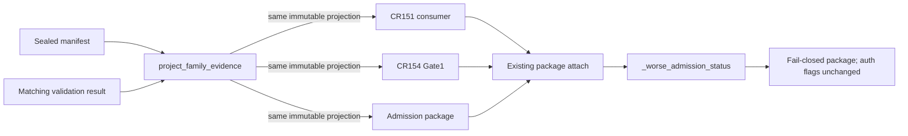

# LLD: CR163-S04 — Existing admission consumer lineage projection

## 修订记录

| 版本 | 日期 | 修订人 | 变更要点 |
|---|---|---|---|
| 1.0 | 2026-07-11 | meta-dev | 初稿；冻结 validation-bound DTO、三 existing consumers、manual reconciliation、claim ceiling 与 fail-closed。 |

## 0. 上游设计依据（工程依据）

| 来源 | 路径 / ID | 被本 LLD 消费的内容 |
|---|---|---|
| CP5 capsule | `process/context/CP5-CR163-TRIAL-LINEAGE-INSTRUMENTATION-LLD-CONTEXT.yaml` | 使用 existing consumers、fail closed、effective unavailable、CR155 blocked。 |
| Story | `process/stories/STORY-CR163-S04-existing-admission-projection.md` | 三 primary modules、TASK-ID、量化 AC、S01/S02 dev gate。 |
| HLD | `docs/design/HLD-TRIAL-LINEAGE-INSTRUMENTATION.md` §§5-7 | consumer projection 表、manual count 限制、status-worsening。 |
| ADR | `docs/design/ARCHITECTURE-DECISION-TRIAL-LINEAGE-INSTRUMENTATION.md` ADR-001..008 | native sealed validation 是唯一 present 来源；effective/FDR/PBO/DSR不在范围。 |
| Feature Matrix | `docs/design/FEATURE-DESIGN-MATRIX.md#cr163-cp4-增量trial-lineage-instrumentation` | `full-lld` 与 FEAT-20/22 约束。 |
| Feature DESIGN | `docs/features/strategy-admission-lineage-projection/DESIGN.md` | 四类 availability、三 consumer surfaces、manual reconciliation、回退。 |
| Feature TEST/TASKS | `docs/features/strategy-admission-lineage-projection/TEST-PLAN.md`; `TASKS.md` | TP22-01..05 与 TASK-CR163-22-01..04。 |
| Core contract | `docs/features/experiment-family-lineage/DESIGN.md` | `project_family_evidence`、validation target binding、typed projection。 |
| 现有接口核验 | 三个 Story primary engine 文件 | CR151 DTO/evaluator、CR154 Gate1 artifact policy、package attach 与 `_worse_admission_status`。 |

S01/S02 exact projection type/field names 是实现前 contract 依赖；若 confirmed contract 与本 LLD 的语义字段不一致，必须停止并路由 `NEEDS_DESIGN_CLARIFICATION`，不得在 consumer 中复制 validator 或伪造兼容 DTO。

## 1. Goal

将同一份由 sealed manifest 与 matching validation result 生成的 immutable family evidence projection 接入现有 CR151 statistical gate、CR154 reliability Gate1 与 `StrategyAdmissionPackage` 三个 consumer surface；仅在五类检查全 PASS 时提供 validated raw count/ref/hash，其他情况 typed unavailable 或 blocked，并始终保持 effective trial count/ref/method 为空、C1 non-computable、status 只恶化不改善、runtime flags 不变。

## 2. Requirements（Functional / Non-Functional）

### 2.1 Functional

- 三 consumer 必须消费同一 projection 实例/序列化 payload，且 lineage ref、hash、raw count 三元组 3/3 一致。
- `present` 的必要且联合充分前置为：sealed、completeness、target ref/hash binding、raw count consistency、tamper/integrity 五类检查全部 PASS。
- 无 native instrumentation 时为 `typed_unavailable`；excluded path 只有具备 scope reason 才可 `not_applicable_with_reason`；included CPI-001..004 不得 N/A。
- invalid、incomplete、target mismatch、tamper、identity conflict、manual mismatch 全部 blocked；unknown availability/status 也 blocked。
- CR151 现有 `BacktestOverfitRiskReport.trial_count` 只能与 validated raw count对账：无 sealed ref 的手填 count 不能生成 present；不一致 blocked。
- CR154 现有 `trial_count_and_effective_trials` 只写 validated raw/provenance；`effective_trial_count` 继续 unavailable，ref/method 空，因此依赖 effective>=1 的 policy 应继续 blocked。
- package 只 attach lineage summary/ref/reasons 并复用 `_worse_admission_status`；不得创建新 gate ID/family，不得把 present 解释为 statistical proof 或 runtime readiness。
- CR155 无 native ledger，保持 blocked 1/1、`paper_candidate=false`，不 historical backfill。

### 2.2 Non-Functional

- projection 为纯、immutable、validation-bound 数据；consumer 不读取 lineage storage、不重新 hash、不重新计算 raw count。
- backward compatibility 必须 fail closed：旧 caller 不传 projection 时不 silent present；原 public signatures 通过 optional keyword 扩展或既有 mapping slot 适配。
- 所有 fixture/static 测试禁止真实 data/credential/provider/runtime/broker/trading/external registry/Git remote操作；计数全 0。
- runtime authorization flags、not-authorized counters、existing gate thresholds/policy 不改变。
- CP5/S01/S02 dev gate未满足或 primary file冲突时禁止实现。

## 3. 模块拆分与职责

| 模块 / 文件组 | 职责 | 说明 |
|---|---|---|
| core projection | S01 `project_family_evidence` | 唯一执行 manifest/validation binding 并产出 typed projection；S04只读消费。 |
| CR151 consumer | `engine/strategy_admission_statistical_gate.py` | 对账 `BacktestOverfitRiskReport.trial_count` 与 validated raw count；缺失/冲突追加 blocked issue。 |
| CR154 consumer | `engine/cross_strategy_reliability_gates.py` | 将 projection 适配到 Gate1 `trial_count_and_effective_trials`，raw only；effective保持 unavailable。 |
| admission package consumer | `engine/strategy_admission_package.py` | attach projection summary/refs/reasons，复用 `_worse_admission_status`，保持 auth flags。 |
| fixture tests | `tests/test_cr163_trial_lineage_admission_projection.py` | 3/3一致、五检查、typed unavailable/blocked、claim ceiling、CR155与 forbidden counters。 |

不创建第四 consumer、新 gate family、consumer-owned validation/store，也不修改 S03 producer/core files。

## 4. 代码结构与文件影响范围

| 动作 | 文件路径 | 变更内容 |
|---|---|---|
| 修改 | `engine/strategy_admission_statistical_gate.py` | evaluator 接受 optional family projection；校验 availability/validated raw count 与 overfit report手填值；生成 typed blocked issue/ref。 |
| 修改 | `engine/cross_strategy_reliability_gates.py` | 在 existing Gate1 artifacts 入口适配 projection；构造 raw provenance，显式 effective unavailable，不放宽现有 policy。 |
| 修改 | `engine/strategy_admission_package.py` | 新增 existing package 的 lineage attachment helper/summary字段，复用 status mapping和 `_worse_admission_status`，保持所有 auth flags。 |
| 创建 | `tests/test_cr163_trial_lineage_admission_projection.py` | 构造 present/unavailable/blocked/manual mismatch/CR155 fixtures与 3-consumer equality assertions。 |

无新增 production module、gate ID、持久化路径或 schema family。

## 5. 数据模型与持久化设计

S04 无新增持久化；消费 S01 immutable projection。语义字段冻结如下（exact Python 名以 confirmed S01 contract 为准）：

| 对象 / 字段 | 类型 | 约束 | 说明 |
|---|---|---|---|
| `availability` | enum | `present | typed_unavailable | not_applicable_with_reason | blocked`；unknown→blocked | consumer 分支主键。 |
| `family_id` | string | present时非空 | 不替代 target binding。 |
| `lineage_ref` / `lineage_hash` | string | present时均非空且等于 validation target；unavailable时均空 | 三 consumers 必须相同。 |
| `raw_trial_count` | positive int or absent | present时由 validator重算/确认；其他状态不提供 positive truth | 不接收 consumer 手填作为 truth。 |
| `validation_status` / `reason_codes` | enum + tuple | present=PASS；blocked含 machine code | package 与 gates 只投影，不重判 hash。 |
| `effective_trial_count` | absent | availability=`typed_unavailable` | 本 CR 永不填 0/1/raw count。 |
| `effective_trial_count_ref` / `effective_trial_count_method` | string | 恒为空 | C1 保持 non-computable。 |
| manual reconciliation | `absent | match | mismatch` + supplied count | match仅诊断；mismatch blocked | manual count 永不成为 provenance。 |

### Availability → consumer 决策表

| 输入 | CR151 | CR154 Gate1 | Package | 最终语义 |
|---|---|---|---|---|
| `present` + 五检查 PASS | raw count只用于对账/输入 | raw/provenance可附加；effective缺失仍按既有 policy fail closed | attach refs/summary；不改善当前 status | `raw_lineage_input_ready`，非统计/运行就绪。 |
| `typed_unavailable` | blocked issue / no positive trial count | missing trial evidence，existing policy blocked | attach unavailable reason并 worsen/保持 blocked | fail closed。 |
| `not_applicable_with_reason` | 仅 excluded scope 可接收 | 不进入 included denominator | attach reason，不生成 present | included CPI禁止使用。 |
| `blocked` / unknown | blocked issue | Gate1 blocked claim | append blocked reason并 `_worse...(..., BLOCKED)` | fail closed。 |

## 6. API / Interface 设计

| 接口 / 入口 | 输入 | 输出 | 调用方 | 说明 |
|---|---|---|---|---|
| `project_family_evidence(manifest, validation)` | sealed manifest + matching result | immutable projection | adapter/caller before consumers | 唯一 validation-bound 来源；target mismatch blocked。对应 T-S04-01/02。 |
| `evaluate_strategy_admission_statistical_gate(..., family_lineage_projection=None)` | 既有 reports/counters + optional projection | existing `StrategyAdmissionStatisticalGate` | CR151 caller | `None/unavailable/conflict` 追加 blocked issue；present raw只与 `BacktestOverfitRiskReport.trial_count` 对账。对应 T-S04-01/03/04。 |
| `evaluate_gate1_statistical_reliability(... artifacts ...)` | existing artifacts，含 projection 或由 adapter生成的 lineage slot | existing `ReliabilityGateSummary` | CR154 caller | raw ref/count进入 `trial_count_and_effective_trials`；effective absent，现有 policy不改。对应 T-S04-01/03。 |
| `attach_family_lineage_to_admission_package(package, projection)` | existing package + typed projection | JSON-safe package payload | package assembler | 新 helper 属于 existing package consumer，不是新 gate；复用 `_worse_admission_status`。对应 T-S04-01..05。 |
| existing `attach_statistical_gate_to_admission_package` / `attach_cross_strategy_reliability_to_admission_package` | gate summaries | package payload | package assembler | 调用顺序不影响最差 status；lineage attach不能改善。对应 T-S04-05。 |

`family_lineage_projection=None` 的兼容语义固定为 typed unavailable/fail closed，不能用 default positive count。projection unknown fields可忽略，unknown availability/status必须 blocked。所有新增参数使用 keyword-only 或 existing mapping slot，避免破坏 positional callers。

## 7. 核心处理流程

1. caller 使用 S01 pure projection，一次绑定 manifest ref/hash 与 validation target；consumer 不自行读取文件。
2. adapter 验证 availability enum。present 时再次做结构性 invariant（ref/hash/raw count非空）；结构不完整转 blocked，不自行修复。
3. 同一 immutable payload传给 CR151、CR154与 package，保存/比较同一 ref/hash/raw count三元组。
4. CR151 仅对账手填 `trial_count`；match不提升状态，mismatch blocked。CR154只投影 raw与provenance，effective保持 unavailable，既有 Gate1 policy自然 fail closed。
5. package attach typed summary；对于 unavailable/blocked/unknown 追加 machine reason，并用 `_worse_admission_status`。present 也只附加 raw-lineage claim，不把原状态提升为 PASS。
6. 最终断言 runtime flags/counters不变、effective/C1 claim ceiling与CR155 regression。

## 8. 技术设计细节（技术细节）

- 关键算法 / 规则：
  - `present = sealed_pass AND completeness_pass AND target_binding_pass AND raw_count_pass AND integrity_pass`；五项任一非 PASS 即不得 present。
  - projection equality key 固定为 `(family_id, lineage_ref, lineage_hash, raw_trial_count, validation_status)`；3 consumers以 exact equality校验。
  - manual reconciliation：无 manual值=`absent`；等于 validated raw=`match`诊断；不等=`mismatch`并 blocked。manual值从不填 projection。
  - package status 使用现有优先级 `PASS < WARN < FAIL < BLOCKED`；lineage attachment 的输出为 `max(current, lineage_status)`。
  - effective fields恒 absent/empty；不得用 raw复制、0 sentinel或默认 1。由此 C1 remains non-computable 是正确 fail-closed结果。
- 依赖选择与复用点：复用 S01 projection、CR151 issue DTO/evaluator、CR154 Gate1 artifact policy、package reason/claim DTO 与 `_worse_admission_status`。
- 兼容性处理：旧 caller不提供 projection时明确 unavailable/blocked；不改变 thresholds、release profile或 auth flags。
- 图示类型选择：flowchart，因为一个 validated projection分发给三个下游并收敛到最差状态。

### 前置校验与失败决策表

| 条件 | 行为 | 后续状态 |
|---|---|---|
| CP5/S01/S02 dev gate未满足 | 不实现 | blocked at dev gate。 |
| validation target ref/hash mismatch | 不消费 manifest值；附 machine reason | blocked/tamper。 |
| projection absent | 不读取 manual count生成 truth | typed unavailable；consumers fail closed。 |
| present结构缺 ref/hash/raw | 转 blocked | malformed projection。 |
| manual count mismatch | 保留双方诊断值，不选择其一 | blocked。 |
| effective field非空 | 拒绝 overclaim | blocked/design contract violation。 |
| unknown availability/status | 不做宽松映射 | blocked。 |

## 9. 安全与性能设计

| 维度 | 设计措施 | 验证方式 |
|---|---|---|
| 安全 | pure in-memory projection；consumer不读 storage/credential；不改 runtime flags；unknown/tamper fail closed。 | patched forbidden counters=0；auth field before/after equality。 |
| 完整性 | validation target binding、3-consumer exact tuple、manual mismatch blocked、status only worsens。 | target mismatch/tamper/manual/status fixtures。 |
| 性能 | projection一次生成并共享；三个 consumer只做 O(1)字段校验，不重放 ledger/重算 hash。 | spy断言 projector调用一次；无 filesystem calls。 |

## 10. 测试设计

| 测试场景 | 前置条件 | 操作 | 预期结果 | 验证方式 |
|---|---|---|---|---|
| T-S04-01 / TP22-01 valid projection | sealed + completeness/ref/count/integrity 5/5 PASS | 同 projection依次进入三 consumer | availability present；3/3同 ref/hash/raw；status不改善 | exact tuple + status assertions。 |
| T-S04-02 five-check matrix | 每次使五类之一失败 | project并分发 | present count=0；invalid/tampered 100% blocked | parameterized 5-case fixture。 |
| T-S04-03 absent/claim ceiling | no native instrumentation | 三 consumer处理 None/unavailable | 100% typed_unavailable；effective available=0、ref/method非空=0、C1 computed=0 | DTO/gate/package assertions。 |
| T-S04-04 manual reconciliation | manual absent/match/mismatch | CR151对账 validated raw | absent不生成 truth；match仅诊断；mismatch 100% blocked | issue/reason code assertions。 |
| T-S04-05 status precedence | package初始 PASS/WARN/FAIL/BLOCKED | attach present/unavailable/blocked及现有 gate summaries | status从不改善；unknown blocked；auth flags不变 | priority matrix + before/after auth equality。 |
| T-S04-06 CR154 effective policy | present raw但 effective空 | evaluate Gate1 existing policy | raw attached；effective仍 unavailable；需要effective的claim blocked | summary blocked claim assertions。 |
| T-S04-07 CR155 regression | no native CR155 ledger | 尝试 projection/package | blocked 1/1；paper_candidate=false；backfill=0 | regression fixture/counters。 |
| T-S04-08 scope/gate inventory | 三 modules loaded | 扫描新增 IDs/入口 | consumer count=3；new gate count=0 | exact symbol/gate-id set。 |
| T-S04-09 permission boundary | patched external ops | 跑全部 fixtures | runtime auth flag changes=0；forbidden counters全0 | counters/equality。 |

每个第 6 节接口均由 T-S04-01..09 至少一项覆盖。

## 11. 实施步骤

| TASK-ID | 动作 | 目标文件 | 详细描述 | 对应测试 |
|---|---|---|---|---|
| TASK-CR163-S04-01 / TASK-CR163-22-01 | 修改 | 三个 production modules | 冻结 projection invariant、availability/status/manual reconciliation表与 shared tuple；以 S01 exact contract替换语义名。 | T-S04-01..05 |
| TASK-CR163-S04-02 / TASK-CR163-22-02 | 修改 | `engine/strategy_admission_statistical_gate.py` | optional projection接入 evaluator；validated raw/manual count对账；missing/mismatch/unknown fail closed。 | T-S04-01/03/04 |
| TASK-CR163-S04-03 / TASK-CR163-22-03 | 修改 | `engine/cross_strategy_reliability_gates.py` | 将 present raw/provenance适配 existing Gate1 artifacts；effective保持空，不改 policy。 | T-S04-01/03/06 |
| TASK-CR163-S04-04 / TASK-CR163-22-04 | 修改 | `engine/strategy_admission_package.py` | 增加 lineage attachment helper与 reason/refs/limitations，复用最差状态，保持 auth flags。 | T-S04-01/02/03/05/07/09 |
| TASK-CR163-S04-05 | 创建 | `tests/test_cr163_trial_lineage_admission_projection.py` | 建立 present/五检查/unavailable/manual/status/CR155/gate inventory/permission矩阵。 | T-S04-01..09 |

## 12. 风险、难点与预研建议

### 12.1 实现灰区与取舍记录

| Clarification ID | 问题 | 选项与推荐 | 决策 / 答案 | 影响面 | 证据 | 重访条件 |
|---|---|---|---|---|---|---|
| LCQ-CR163-S04-01 | projection由consumer重算还是core生成 | A各consumer重算；B core pure projector一次生成（推荐） | 采用 B；三 consumer共享 immutable payload | 接口、完整性、性能 | FEAT-20/22 API/call direction | core contract发生独立CR变更时重访。 |
| LCQ-CR163-S04-02 | CR154 effective字段如何兼容 | A raw复制；B 0 sentinel；C typed unavailable且ref/method空（推荐） | 采用 C；existing effective policy继续blocked | claim ceiling、Gate1 | CP3 DQ与FEAT-22 Gotchas | FU-CR161-002批准统计方法后重访。 |
| LCQ-CR163-S04-03 | package是否新建 lineage gate | A新gate；B existing package attachment（推荐） | 采用 B；new gate count=0 | 架构、status、测试 | HLD非目标；FEAT-22边界 | 独立gate family需求获新CR批准时重访。 |

| 风险 / 难点 | 影响 | 缓解措施 / 预研建议 |
|---|---|---|
| CR151现有 report只有 caller-supplied trial_count | 容易继续把手填值当 truth | projection必传才可形成 native raw evidence；manual仅对账，mismatch blocked。 |
| CR154 policy要求 effective>=1 | positive raw仍可能 blocked | 明确这是正确 claim ceiling，不修改 policy/fixture迎合 PASS。 |
| package多 attach顺序 | 后 attach可能错误改善状态 | 全部复用 `_worse_admission_status`；全排列测试 status monotonicity。 |
| S01 exact DTO尚属上游 contract | 字段漂移可能诱发 consumer私有 schema | 实现前核对 confirmed contract；不一致路由 design clarification。 |

### OPEN / Spike 跟踪

无。所有取舍由已批准 CP3/Feature contract确定，无需用户澄清。

## 13. 回滚与发布策略

- 发布方式：CP5 全量确认且 S01/S02 confirmed后，以一个 S04 owner合并三 existing consumer修改与 fixture test；仅 static/fixture验证，不访问真实 runtime/data。
- 回滚触发条件：三 consumer tuple不一致、任一五检查失败仍 present、manual mismatch未 blocked、effective/ref/method出现正向值、status改善、CR155不再 blocked、新 gate count>0或 auth/counter变化。
- 回滚动作：移除/disable consumer projection adapter与package attachment，使三 consumer回到既有 fail-closed/typed unavailable语义；不删除 core lineage artifact，不修改历史 count，不进行 backfill；contract缺陷通过新 superseding evidence/CR修复。

## 14. Definition of Done（DoD）

- [ ] 14 个章节全部填写完成。
- [ ] 3/3 consumers消费相同 validation-bound ref/hash/raw count。
- [ ] present仅在 seal/completeness/ref-count-binding/integrity五类检查全 PASS 时出现。
- [ ] uninstrumented=100% typed_unavailable；invalid/tampered/manual mismatch=100% blocked。
- [ ] effective available=0、effective ref/method nonempty=0、C1 computed=0。
- [ ] status从不改善；runtime auth flags变化=0；new gate count=0。
- [ ] CR155 blocked 1/1、paper_candidate=false、historical backfill=0、forbidden counters=0。
- [ ] 第 4 节每个文件均由第 11 节 TASK覆盖；第 6 节每个接口均由第 10 节测试覆盖。
- [ ] S01/S02 confirmed contract一致；consumer无 validator/storage复制。
- [ ] `confirmed=false` 且 CP5 全量人工确认前不进入实现；无 OPEN / Spike。

## 人工确认区

> **CP5 — Story 设计证据可实现性门**：本文仅为待统一审查证据，不代表实现授权。

| # | 检查项 | 状态 | 证据 |
|---|---|---|---|
| 1 | LLD 覆盖 AC | 待检查 | §§2、10、14 |
| 2 | 与 HLD / ADR 一致 | 待检查 | §§0、3、8、12 |
| 3 | 文件影响范围明确 | 待检查 | §§4、11 |
| 4 | 接口契约完整 | 待检查 | §6 |
| 5 | 测试与 dev_gate 可计算 | 待检查 | §§10、14 |
| 6 | clarification queue 已收敛 | 待检查 | §12.1（无阻断 clarification） |

**人工审查结果回填**：

- 结论：`approved | changes_requested | rejected`
- 审查人：
- 审查时间：
- 修改意见：
- 风险接受项：
