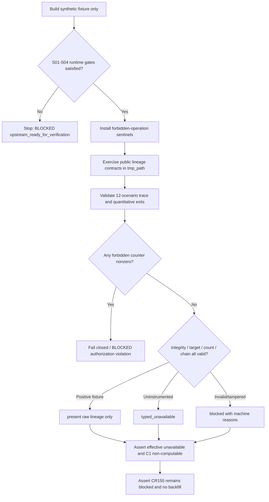

# LLD: CR163-S05 — Integrity, recovery, permission and CR155 regression

## 修订记录

| 版本 | 日期 | 修订人 | 变更要点 |
|---|---|---|---|
| 1.0 | 2026-07-11 | meta-dev | 初版；冻结 12 场景 fixture/trace matrix、五类 negative、确定性 seal、tamper/supersession recovery、权限计数和 CR155 负回归设计。 |

## 0. 上游设计依据（工程依据）

| 来源 | 路径 / ID | 被本 LLD 消费的内容 |
|---|---|---|
| CP5 context | `process/context/CP5-CR163-TRIAL-LINEAGE-INSTRUMENTATION-LLD-CONTEXT.yaml` | 五 Story 必须独立 full LLD；S05 为 verification lane；实现、真实数据、credential、external write、统计计算和 CR155 backfill 均未授权。 |
| Story | `process/stories/STORY-CR163-S05-integrity-recovery-permission-regression.md` | 三个独占测试文件、S01-S04 runtime gates、8/8 requirements、12/12 scenarios 和定量退出条件。 |
| HLD | `docs/design/HLD-TRIAL-LINEAGE-INSTRUMENTATION.md` | 六对象与 session façade、12 场景、2 chains/4 mappings、canonical seal、supersession、existing-consumer-only 与 claim ceiling。 |
| ADR | `docs/design/ARCHITECTURE-DECISION-TRIAL-LINEAGE-INSTRUMENTATION.md` / ADR-CR163-001..012 | append-only JSON/JSONL、SHA-256 immutable seals、reconciliation-only、CR155 blocked/no reconstruction、design-only authorization。 |
| Feature Matrix | `docs/design/FEATURE-DESIGN-MATRIX.md#cr163-cp4-增量trial-lineage-instrumentation` | FEAT-23 standalone waived；S05 仍为 full-lld；CP5 focus 为 12/12、10 seals=1 hash、5/5 blocked、permission zero、CR155 1/1 blocked。 |
| Core Feature | `docs/features/experiment-family-lineage/{DESIGN,TEST-PLAN,TASKS}.md` | TP20-01..05、core integrity fixtures、canonical/tamper/recovery/permission contract。 |
| Producer Feature | `docs/features/trial-lineage-producer-adapters/{DESIGN,TEST-PLAN,TASKS}.md` | TP21-01..05、CPI-001..004、2/2 chains、single session owner 与 wrapper/hook no-double-count。 |
| Consumer Feature | `docs/features/strategy-admission-lineage-projection/{DESIGN,TEST-PLAN,TASKS}.md` | TP22-01..05、三 consumer 同一 projection、effective/C1 ceiling、manual mismatch 与 CR155 regression。 |
| Scoped plan | `process/DEVELOPMENT-PLAN-CR163-TRIAL-LINEAGE-INSTRUMENTATION.yaml` | S05 file ownership、TASK-CR163-S05-01..03、DAG `S01 -> S02 -> (S03 || S04) -> S05` 与 implementation gate。 |

Ready Check 结论：Story 卡片状态为 `draft`，CP5 capsule 状态为 `ready-for-lld-drafting`，属于等价待设计状态；四项依赖已声明公共 contract，允许起草 LLD。实现仍必须等待全量 CP5 批准且 S01-S04 均达到各自 `ready-for-verification`/`verified` runtime gate。本 LLD 不推进 Story 状态、不授权实现。

## 1. Goal

创建三个 S05 独占测试模块的可实施设计，以纯 synthetic fixture、临时目录和静态 contract inspection 验证 CR163 的 8/8 requirements、12/12 P0 scenarios、确定性 seal、tamper 与合法 supersession recovery、权限边界以及 CR155 negative regression；不修改生产模块，不读取真实数据，不接触 credential，不执行研究/runtime/trading，不重建历史 lineage。

## 2. Requirements（需求：Functional / Non-Functional）

### 2.1 Functional

- `REQ-CR163-001`：验证两条 producer chain 都在首个 trial 前 declare；post-hoc declaration fixture 必须 blocked。
- `REQ-CR163-002`：验证 trial、attempt、selection 的 parent/identity/state 关系；orphan、identity-content conflict 和非法状态必须 blocked。
- `REQ-CR163-003`：验证 `raw_trial_count=count(distinct stable_trial_id)`；不同 seed 计两个 trial，单 trial 三次 retry 仍计一个 raw trial，terminal/excluded/never-started-with-reason 不被删减。
- `REQ-CR163-004`：相同 logical fixture 在 randomized input key order 下 seal 10 次，distinct content hash 必须为 1；sealed v1 不得原位变化，合法 v2 必须完整引用 v1 ref/hash/reason。
- `REQ-CR163-005`：验证 CPI-CR163-001..004 mapping=4/4、deduplicated producer chains=2/2、每 chain session owner=1、wrapper/hook duplicate delivery 不增加 raw count。
- `REQ-CR163-006`：验证 CR151、CR154 与 admission package 三个既有 consumer 接收相同 validated lineage ref/hash/raw count；status 不改善；effective 仍 typed unavailable 且 C1 不可计算。
- `REQ-CR163-007`：五类 negative fixture——post-hoc/incomplete、identity/orphan conflict、count mismatch、sealed tamper、broken/cyclic supersession——每类至少一个代表 fixture，5/5 全部 blocked，并保留 machine reason/evidence binding。
- `REQ-CR163-008`：验证 lake、NAS、provider/network、credential/env-secret、research runtime、simulation/paper/live、broker/trading、external registry/store/catalog、Git remote/publish 和 historical backfill 操作计数全部为 0；任一计数非 0 时测试结论必须 fail closed。
- 12 个 P0 场景固定为 `P01,P02,P03,N01,N02,B01,B02,F01,R01,T01,A01,G01`，每个恰有可定位的 fixture/test，planned coverage=12/12；不得以一个泛化 happy-path 名称掩盖缺失场景。
- CR155 regression 使用 synthetic legacy evidence fixture：无 native sealed family ledger 时 lineage 不得 present，admission 必须 blocked 1/1，`paper_candidate=false`，historical family/trial reconstruction count=0。

### 2.2 Non-Functional

- Determinism：10 次 seal 的 hash distinct count=1；golden bytes/hash 断言失败即 blocked，不以重新生成期望值绕过。
- Integrity：orphan/count mismatch=0 才可能通过；validation 必须绑定 target ref/hash，不能仅检查 `passed=true`。
- Recovery：恢复只允许 append correction + 新 version supersession；旧 v1 bytes/hash/ref 必须保持不变，断链和循环 100% blocked。
- Security：测试只使用内存对象、repo source 的静态 import/inspection 和测试框架临时目录；真实数据路径、credential、runtime 与外部系统调用次数均为 0。
- Compatibility：不创建新 gate ID/family，不修改 existing consumer precedence，不把 raw count 复制到 effective count。
- Traceability：REQ=8/8、scenario=12/12、CPI=4/4、chain=2/2；每一 interface、失败路径和 TASK-ID 均映射到测试入口。
- Scope：只创建 Story 所有权内的三个测试文件；`engine/**`、`scripts/**`、`data/**` 和历史 CR155 artifacts 都是禁止写入面。

## 3. 模块拆分与职责

| 模块 / 文件组 | 职责 | 说明 |
|---|---|---|
| Integrity fixture suite | `tests/test_cr163_trial_lineage_integrity.py` | 构造 synthetic family lifecycle；覆盖 P01/P02/P03/N01/N02/B01/B02/F01/R01/T01，以及 2 chains/4 mappings、hash/tamper/supersession 和三 consumer projection。只消费 S01-S04 public contracts。 |
| Authorization guard suite | `tests/test_cr163_trial_lineage_authorization.py` | 安装 deny-by-default sentinels 与 operation counters；覆盖 A01，验证所有 forbidden categories=0，并对任一 synthetic nonzero counter fail closed。不得发起真实探测。 |
| CR155 regression suite | `tests/test_cr163_trial_lineage_cr155_regression.py` | 构造无 native family ledger 的 legacy CR155 fixture；覆盖 G01，断言 blocked、`paper_candidate=false`、no reconstruction/backfill/no runtime-ready claim。不得读取或修改 CR155 历史文件。 |
| Upstream public contracts | S01 core/validator、S02 recorder/sealer/resolver、S03 producer adapters、S04 projection | read-only dependency；S05 不复制生产算法。若实际 export 与 CP5 批次确认的 contract 不一致，S05 实现停止并路由 design clarification，不以私有 helper 模拟通过。 |

职责边界：S05 拥有验证 orchestration 和 fixtures，不拥有 lineage schema、storage、producer mapping 或 consumer policy。测试可定义局部 fixture builder/counter dataclass，但不得形成可被生产代码 import 的共享 runtime/schema。

## 4. 代码结构与文件影响范围

| 动作 | 文件路径 | 变更内容 |
|---|---|---|
| 创建 | `tests/test_cr163_trial_lineage_integrity.py` | 创建 12-scenario trace constants、synthetic lineage builders、positive/count/determinism/tamper/recovery/producer/consumer contract tests；不创建生产 fallback。 |
| 创建 | `tests/test_cr163_trial_lineage_authorization.py` | 创建 forbidden-operation category matrix、monkeypatch sentinels、zero-counter assertion 和 nonzero fail-closed meta-fixture。 |
| 创建 | `tests/test_cr163_trial_lineage_cr155_regression.py` | 创建 CR155 legacy synthetic fixture 与 blocked/paper-candidate/backfill/claim-ceiling regression assertions。 |

禁止修改：`engine/**`、`scripts/**`、`data/**`、任何 credential/runtime/external system、任何 historical lineage artifact。测试 fixture 只写 pytest 提供的 `tmp_path`；不得把临时 lineage root 指向 repo data/lake/NAS 路径。

## 5. 数据模型与持久化设计

无新增生产数据模型 / 持久化变更。测试数据均为运行期 synthetic fixture，生命周期限于单个 test/`tmp_path`。

| 测试对象 / 字段 | 类型 | 约束 | 说明 |
|---|---|---|---|
| `SCENARIO_TRACE` | immutable mapping | 恰含 12 个唯一 ID；每项含 requirements、feature test scope、test function | 用于静态覆盖断言，不写外部 manifest。 |
| `CPI_TRACE` | immutable mapping | `CPI-CR163-001..004` 恰好 4 项；chain set 恰好 2 项 | 验证 inventory denominator，不把 wrapper/hook 当四条 chain。 |
| `ForbiddenOperationCounters` | test-local immutable/mutable counter holder | 固定类别均为非负整数；pass 条件为所有值 0 | 不读取环境 secret；sentinel 在调用入口自增后立即抛错。 |
| `SyntheticFamilyFixture` | test-local builder result | 固定 family/trial/attempt/selection ids；clock/path 不进 hash | 只通过 upstream public commands/session 构造事实。 |
| `LegacyCR155Fixture` | test-local immutable value | native lineage ref/hash 为空；paper candidate 初始 false | 不从历史 artifacts 推断 trial/family。 |

测试不得持久化第七个 lineage 公共对象，也不得提交 golden output 到 `data/`。若 canonical golden bytes 需要常量，直接放在 integrity test 文件内作为 byte literal，并同时断言 schema version，避免测试运行更新 golden。

## 6. API / Interface 设计

| 接口 / 入口 | 输入 | 输出 | 调用方 | 说明 |
|---|---|---|---|---|
| `FamilyLineageSession.open` | synthetic spec、chain id、run/experiment refs、`tmp_path` root | session / declare receipt | integrity fixture builder | P01/N01；必须发生在首 trial 前，forbidden root 必须拒绝。 |
| `session.submit` | typed command，含 event/family/sequence/payload | idempotent receipt 或 typed blocked result | integrity fixtures | P02/N02/B01/F01；same id+same payload 幂等，different payload blocked。 |
| `session.seal` / S02 public seal entry | family/version/prior head | immutable manifest + validation | integrity fixtures | P03/R01/T01；10 次 logical-equivalent fixture比较内容 hash，不覆盖同一路径。 |
| `validate_family_lineage` | target ref/hash + fixture artifacts | `FamilyLineageValidationResult` | integrity fixtures | 所有 negative 都检查 machine code 与 target binding。 |
| S02 public supersession resolver | v1/v2 refs/hashes | latest valid head 或 blocked result | recovery fixtures | 合法 v2=100% valid；broken/cyclic chain=100% blocked；实际 symbol 以批次确认的 S02 export 为准。 |
| S03 producer public entrypoints | fixture-only config/session context | event trace + manifest refs | producer coverage fixtures | CPI 4/4、chain 2/2、one session owner/chain、duplicate delivery raw delta=0。不得执行真实研究。 |
| `project_family_evidence` | manifest + matching validation | typed availability/ref/hash/raw/effective fields | consumer fixtures | P03/B02/T01/G01；mismatch blocked，effective unavailable/ref/method empty。 |
| S04 three consumer attachment boundaries | same projection payload | three consumer results/package | consumer fixtures | 3/3 same ref/raw；existing `_worse_admission_status` 等价 precedence；不改善 blocked。 |
| `assert_forbidden_operations_zero`（test-local） | complete counter object | `None` 或 assertion failure | authorization + CR155 suites | A01；缺字段和非零均 fail closed。 |

接口到测试映射：第 10 节 `P01/N01` 覆盖 `open`，`P02/N02/B01/F01` 覆盖 `submit`，`P03/R01/T01` 覆盖 seal/validate/resolver/project，`B02/G01` 覆盖 consumer projection，`A01` 覆盖 authorization guard。若 S01-S04 最终 LLD 改变 symbol 而不改变冻结语义，本文件仅允许在 CP5 批次内同步接口名；若改变语义则 `NEEDS_DESIGN_CLARIFICATION`，不得在测试里适配私有实现。

## 7. 核心处理流程



1. 在实现开始前检查全量 CP5 已批准，且 S01-S04 implementation evidence 与 public exports 均达到各自 `ready-for-verification`/`verified` gate；否则停止，不创建 compatibility shim。
2. 冻结 `SCENARIO_TRACE` 的 12 个 ID、REQ mapping、CPI denominator 与五类 negative class，先执行静态 completeness assertion。
3. 在任何 fixture 构造前安装 forbidden-operation sentinels；sentinel 不探测真实系统，只替换获准代码路径上的潜在调用入口并记录意外调用。
4. 通过 S01/S02 public contracts 在 `tmp_path` 分别构造 valid、post-hoc/incomplete、identity/orphan conflict、count mismatch、tampered、broken/cyclic chain fixtures。
5. 对等价 valid logical fixture 以不同 dict insertion order 构造 10 次，每次写到独立临时 root，断言 canonical bytes/hash 一致；不覆盖 sealed artifact。
6. 保存 v1 bytes/ref/hash，append correction 并生成 v2，断言 v2 引用 v1 且 resolver 选中 v2，同时 v1 bytes/hash 未变；另构造 broken/cyclic refs 并断言 blocked。
7. 以 fixture-only producer entrypoints 覆盖 CPI 4/4，按 chain 汇总 session/trial events，断言 2 chains、one session owner/chain、wrapper/hook duplicate raw delta=0。
8. 将 matching 与 mismatched validation 分别投影到三个 existing consumers，断言 ref/raw 一致、blocked precedence 不改善、effective/ref/method 与 C1 claims 仍为空/不可计算。
9. 以 synthetic CR155 legacy fixture调用同一 projection/consumer boundary，断言 blocked、`paper_candidate=false`、reconstruction/backfill counter=0。
10. 最后统一断言 forbidden counters 全 0 和所有定量出口；任一失败不降级为 warning。

## 8. 技术设计细节（技术细节）

- 关键算法 / 规则：
  - trace completeness：`set(SCENARIO_TRACE) == {P01,P02,P03,N01,N02,B01,B02,F01,R01,T01,A01,G01}`，长度恰为 12；每个 `REQ-CR163-001..008` 至少出现一次，REQ union 恰为 8。
  - deterministic hash：构造同一 logical value、不同 insertion order 的 10 份 fixture；收集 manifest content hash，断言 `len(set(hashes)) == 1`。随机顺序使用固定 seed，只改变输入表示，不改变语义。
  - raw count：按 stable trial id 去重；seed A/B → 2，trial A attempt ordinal 1..3 → raw 仍 1；selection/duplicate delivery 不改变 membership。
  - tamper：复制 valid sealed fixture到独立临时 root后改变受 hash 保护的 byte；validator 必须返回 blocked/target hash mismatch。不得修改作为 recovery prior 的原始 v1。
  - recovery：从未改动的 valid v1 append correction，生成 v2；校验单调 version、`supersedes_ref/hash`、non-empty reason、全链 hash、无循环，且 v1 byte-for-byte不变。
  - five-negative class aggregator：五类各返回 blocked status；断言 blocked class set 恰为 5，不能把 typed-unavailable 的纯未 instrumented case冒充 blocked。
  - permission guard：每个 forbidden category 的 sentinel 若被调用则先计数再抛出明确 assertion；suite teardown仍汇总完整 counters。测试本身不得读取 `.env`、credential names/values 或探测 network/NAS/provider。
  - CR155：只使用 synthetic marker `native_lineage_ref=None`；不得扫描历史目录、猜测 family membership 或调用 backfill/reconstruction helper。
- 依赖选择与复用点：只依赖 Python 标准库、现有 pytest 测试栈及 S01-S04 public exports；不增加第三方 canonicalization、mock server、database 或 external registry dependency。
- 兼容性处理：projection absent 保持现有 fail-closed；manual count 无 native sealed ref 为 typed unavailable，manual/native mismatch 为 blocked；lineage present 只能使 raw input ready，不能提升统计、reliability、package 或 runtime authorization 状态。
- 图示类型选择：第 7 节使用流程图，因为验证跨 core、store、producer、consumer 和 authorization/CR155 分支，且存在 recovery 与 fail-closed 路径。

12 场景与五类 negative 的冻结映射：

| 场景 | 核心 fixture / assertion | REQ | Feature scopes | 归属文件 |
|---|---|---|---|---|
| P01 | 2/2 chains declare before first trial；CPI 4/4 | 001,005 | TP20-01, TP21-01/02/05 | integrity |
| P02 | seed A/B raw=2；retry attempts不增 raw；terminal保留 | 002,003 | TP20-02, TP21-03 | integrity |
| P03 | valid seal/validation→present；3/3 consumers same ref/raw | 004,006 | TP20-03, TP22-01 | integrity |
| N01 | absent native→typed_unavailable；post-hoc/incomplete→blocked | 001,007 | TP20-01/05, TP21-04, TP22-02 | integrity |
| N02 | orphan/identity-content conflict→blocked | 002,007 | TP20-02, TP21-04 | integrity |
| B01 | declared/recomputed raw mismatch→blocked；no shrinkage | 003,007 | TP20-02, TP21-03 | integrity |
| B02 | effective available=0、ref/method nonempty=0、C1 computed=0 | 006 | TP20-05, TP22-03 | integrity |
| F01 | failed/cancelled/excluded/never-started retained 100% | 002,003 | TP20-02, TP21-03 | integrity |
| R01 | v1 immutable；valid v2 100%；broken/cyclic blocked | 004,007 | TP20-04 | integrity |
| T01 | hash/target/manual mismatch 100% blocked；status不改善 | 004,006,007 | TP20-03, TP22-04 | integrity |
| A01 | complete forbidden counter set all zero；nonzero fail closed | 008 | TP20-05, TP21 security, TP22 security | authorization |
| G01 | CR155 blocked 1/1、paper=false、backfill/reconstruction=0 | 006,008 | TP20-05, TP22-05 | CR155 regression |

五类 negative aggregator 固定为：`post_hoc_or_incomplete`（N01）、`identity_or_orphan_conflict`（N02）、`count_mismatch`（B01）、`sealed_tamper`（T01）、`broken_or_cyclic_supersession`（R01）。每类必须独立产生 machine-readable blocked reason；不能仅由一个总异常代表 5/5。

## 9. 安全与性能设计

| 维度 | 设计措施 | 验证方式 |
|---|---|---|
| 数据安全 | 只用 hard-coded/synthetic fixture 与 `tmp_path`；禁止读取 lake、NAS、provider、真实 CR155 artifacts 或 repo `data/**`。 | monkeypatch sentinels + path assertion；data/lake/NAS/provider counters=0。 |
| Credential | 禁止 `os.getenv`/secret loader/credential provider 路径；不记录变量名对应值。 | credential counter=0；sentinel 被调用立即 fail。 |
| Runtime/交易 | 不调用 research run、simulation、paper/live、broker/trading；producer只走 fixture-only seam。 | runtime/simulation/paper/live/broker/trading counters=0。 |
| 外部写入 | 禁止 network、external registry/store/catalog、Git remote/publish。 | network/external/Git counters=0。 |
| Integrity | target ref/hash binding、sealed immutability、全 supersession chain复算、five-negative fail closed。 | 10 seals、tamper、v1→v2、broken/cyclic fixtures。 |
| 权限完整性 | counter schema固定且禁止缺省；未知/缺失 category 也失败。 | 对完整 key set做 equality；注入每类 nonzero 的参数化 meta-test。 |
| 性能 | fixture规模固定且小；10 次 seal 为确定性采样，不做 benchmark；测试不得随真实数据规模增长。 | suite只在临时小 fixture运行；无外部 I/O等待。 |

权限计数固定类别：`lake_read`、`lake_write`、`nas`、`provider_or_network`、`credential_or_secret`、`research_runtime`、`simulation`、`paper`、`live`、`broker_or_trading`、`external_registry_store_catalog`、`git_remote_or_publish`、`historical_backfill_or_reconstruction`。所有类别的 pass 值均严格为整数 0。

## 10. 测试设计

| 测试场景 | 前置条件 | 操作 | 预期结果 | 验证方式 |
|---|---|---|---|---|
| Trace completeness | S01-S04 contract refs可读 | 检查 scenario/REQ/CPI/chain mapping | scenarios=12/12、REQ=8/8、CPI=4/4、chains=2/2 | integrity 静态集合断言 |
| P01 pre-search | fixture-only producer seams | 两条 chain declare后首 trial；另做 post-hoc | valid 2/2；post-hoc blocked | event sequence + machine code |
| P02/F01 count lifecycle | valid family | seed A/B、A三 attempts、全部 terminal classes | raw=2；retry raw delta=0；retention=100% | validator projection + event fold |
| P03 valid projection | valid sealed manifest/result | 投影至 CR151/CR154/package | present；3/3 ref/raw一致；status不改善 | public consumer boundaries |
| N01 availability split | absent与post-hoc/incomplete fixtures | validate/project | absent typed_unavailable；invalid blocked | exact availability/reason |
| N02 identity/orphan | conflicting event与missing parent | submit/seal/validate | 100% blocked；无 orphan accepted | receipt/result machine codes |
| B01 recount | declared与manifest count冲突 | seal/validate | blocked；unexplained mismatch=0 accepted | declared vs recomputed count |
| B02 claim ceiling | positive raw projection | inspect effective/C1 fields | effective available=0；ref/method nonempty=0；C1 computed=0 | exact field assertions |
| Deterministic seal | identical logical fixture | 不同 key order seal 10次至独立 roots | distinct hash=1；canonical bytes一致 | set/hash/golden bytes |
| T01 tamper/target/manual conflict | valid sealed fixture clone | 改受保护 byte；错配 target；manual mismatch | 每项 blocked；status never improves | validator + consumer results |
| R01 valid recovery | untouched v1 | append correction→v2 | v1 unchanged；v2 link有效；resolver=v2 | byte/hash/ref chain assertions |
| R01 invalid recovery | broken/cyclic fixtures | resolve/validate | 100% blocked | machine chain reason |
| Five negative classes | 五类代表 fixtures | 聚合 validation statuses | 5/5 blocked且reason class可区分 | exact class/status set |
| A01 zero boundary | sentinels已安装 | 运行全部 synthetic fixture tests | 所有 13 类 counter=0 | authorization suite final assertion |
| A01 nonzero fail closed | 参数化 synthetic counter | 每次将一个 category设为1 | 每个 case assertion failure | test-local guard meta-test |
| G01 CR155 regression | synthetic legacy CR155，无 native ledger | project/attach；记录reconstruction入口 | blocked 1/1；paper=false；backfill/reconstruction=0 | CR155 suite exact assertions |
| No overclaim | 所有 availability states | 收集 wording/flags | runtime-ready claims=0；statistical proof claims=0 | exact enum/flag/string whitelist |

本表全是 unit/contract/static/fixture 测试；“执行”仅指后续 CP5 与 runtime gates 批准后运行本地测试，不包含真实研究、真实数据或 external system 操作。

## 11. 实施步骤

| TASK-ID | 动作 | 目标文件 | 详细描述 | 对应测试 |
|---|---|---|---|---|
| TASK-CR163-S05-01 | 创建 | `tests/test_cr163_trial_lineage_integrity.py` | 冻结 12-scenario、8-REQ、4-CPI、2-chain trace matrix；创建 synthetic builders；实现 lifecycle/count、10-seal determinism、tamper、supersession recovery、five-negative 与 3-consumer claim-ceiling tests。 | Trace completeness；P01/P02/P03/N01/N02/B01/B02/F01/R01/T01；five negative |
| TASK-CR163-S05-02 | 创建 | `tests/test_cr163_trial_lineage_authorization.py` | 创建完整 13-category counter contract、deny sentinels、zero assertion 与逐类别 nonzero fail-closed 参数化 test；禁止真实探测。 | A01 zero boundary；A01 nonzero fail closed |
| TASK-CR163-S05-02 | 创建 | `tests/test_cr163_trial_lineage_cr155_regression.py` | 创建 synthetic legacy CR155 fixture；验证 no-native-ledger fail closed、paper false、no backfill/reconstruction、no raw→effective/C1/runtime-ready claim。 | G01；No overclaim |
| TASK-CR163-S05-03 | 验证 | 上述三个测试文件 | 在 CP5 批准及 S01-S04 runtime gates满足后运行 scoped tests，汇总所有 quantitative exits；任一 forbidden counter非零或上游 contract drift时返回 BLOCKED/NEEDS_DESIGN_CLARIFICATION，不扩大授权。 | 第 10 节全部测试 |

TASK-ID 沿用 scoped plan 的三个 ID；`TASK-CR163-S05-02` 覆盖两个独立测试文件，因为 plan 将 integrity/recovery/permission/regression test creation 定义为同一 implementation task。三个文件影响项均被 TASK 覆盖，且 TASK-03 不产生新文件。

## 12. 风险、难点与预研建议

### 12.1 实现灰区与取舍记录

| Clarification ID | 问题 | 选项与推荐 | 决策 / 答案 | 影响面 | 证据 | 重访条件 |
|---|---|---|---|---|---|---|
| 无 | 当前没有阻断 LLD 的实现灰区 | 推荐：按 CP3 已批准 public semantics 与 S01-S04 最终 CP5 exports 编写；备选：若 export 语义冲突，停止并路由 Host clarification；不允许私有 shim | 采用推荐方案；`blocks_lld=false` | 接口、测试、跨 Story contract | CP5 capsule；HLD §5-8；ADR-001..012；三套 Feature DESIGN/TEST-PLAN | S01-S04 最终 LLD/实现改变冻结语义或缺少 public fixture seam |

| 风险 / 难点 | 影响 | 缓解措施 / 预研建议 |
|---|---|---|
| 并行 LLD 下游 export 名称尚待全批确认 | 测试 import 可能漂移 | 以语义和 public owner 冻结；实现前消费已确认的 S01-S04 evidence。仅符号重命名可同步；语义变化路由 design clarification。 |
| 测试误用私有 helper 复制生产逻辑 | 假阳性，无法证明真实 contract | positive/negative 都必须经过 public validator/store/projection；test-local helper只构造输入和统计，不重算预期生产结果。 |
| tamper fixture污染合法 recovery prior | recovery 结论失真 | tamper 使用 valid fixture 的独立 copy；recovery只从未修改 v1开始，并 byte-for-byte断言 v1不变。 |
| typed_unavailable 与 blocked 混淆 | 五类 negative 或 CR155结果错误 | 纯未 instrumented=N01 typed_unavailable；post-hoc/incomplete/tamper/conflict=blocked；CR155 consumer/admission结论仍 blocked且paper false。 |
| permission test自身读取 credential/真实系统 | 越权或泄露 | 不探测实际资源；只在 fixture seam 安装 fail-fast sentinel，不读取 env value，不连接 network。 |
| 10-seal 测试误把 path/version/clock混入 hash | 非确定性 flaky | 每次独立 root但固定 logical family/version；path/mtime/clock/sealed_at必须排除 hash；固定 randomized seed。 |
| CR155 fixture被误解为回填授权 | 破坏历史边界 | synthetic marker only；reconstruction函数调用计数必须为0；禁止扫描/修改历史 artifact。 |

### OPEN / Spike 跟踪

| ID | 类型（OPEN / Spike） | 问题 | 下一动作 | 责任方 |
|---|---|---|---|---|
| 无 | N/A | 无 OPEN / Spike；当前 contract 足以完成 LLD | 全量 CP5 后按 runtime gates执行 | host-orchestrator / meta-dev |

## 13. 回滚与发布策略

- 发布方式：本 Story 仅新增本地测试资产；在 CP5 批准且 S01-S04 runtime gates满足后，随 CR163 implementation/verification 一并合入。它不发布 runtime、data migration、credential、external service 或 historical backfill。
- 回滚触发条件：测试引入真实 I/O、credential/runtime/external invocation；与已确认 S01-S04 public contract不一致；出现 flaky/non-deterministic hash；CR155由 blocked变为 present/paper candidate；任一 forbidden counter非零。
- 回滚动作：撤销/禁用 S05 新增测试变更并保持生产代码和历史 artifacts不变；若是 upstream contract drift，路由 `NEEDS_DESIGN_CLARIFICATION` 并修订全批设计；不得删除 sealed lineage、修改历史 CR155 或用放宽断言使测试通过。
- 数据回滚：不适用；S05 不创建生产持久化数据。测试临时目录由测试框架清理。
- 切换条件：只有独立 CR/人工门禁明确批准 runtime/data/credential/backfill/external validation 时，才可新增相应测试模式；不得在本 Story静默扩权。

## 14. Definition of Done（DoD）

- [ ] 14 个章节全部填写完成，`confirmed=false` 且 CP5 人工门前不进入实现。
- [ ] 三个且仅三个 Story-owned test files 创建；生产模块、scripts、data、credentials、runtime、historical artifacts 均未修改。
- [ ] `REQ-CR163-001..008` coverage=8/8；`P01,P02,P03,N01,N02,B01,B02,F01,R01,T01,A01,G01` planned/executed coverage=12/12。
- [ ] CPI-CR163-001..004 mapping=4/4、deduplicated chains=2/2、one session owner/chain、wrapper/hook double trial count=0。
- [ ] raw count语义通过：seed A/B=2；同 trial三 retries raw=1；failed/cancelled/excluded/never-started retention=100%；unexplained orphan/count mismatch=0。
- [ ] 相同 logical fixture seal 10次产生 distinct hash=1；sealed in-place mutation=0。
- [ ] tamper/target mismatch blocked；valid supersession=100%；v1 ref/hash/bytes保留；broken/cyclic chain=100% blocked。
- [ ] 五类 negative fixture class=5/5 且全部 blocked，machine reason/evidence target可定位。
- [ ] 三个 existing consumer=3/3接收同一 validated lineage ref/raw count；status不改善；不创建新 gate。
- [ ] effective available claims=0、nonempty effective ref/method=0、C1 computed evidence claims=0、statistical-proof claims=0、runtime-ready claims=0。
- [ ] 13 类 forbidden operation counters全部=0；任何缺失/非零 counter 均 fail closed。
- [ ] CR155 blocked=1/1、`paper_candidate=false`、historical family/trial reconstruction/backfill=0。
- [ ] 每个第 6 节接口至少被第 10 节一个测试覆盖；三个文件影响项和 TASK-CR163-S05-01..03双向可追踪。
- [ ] 实现前置门满足：全量 CP5 approved；S01-S04均到达其声明的 ready-for-verification/verified gate；否则精确 BLOCKED，不做 shim。
- [ ] clarification queue 无 blocking item；OPEN / Spike 显式为无。

## 人工确认区

> **CP5 — Story 设计证据可实现性门**
>
> 本文件只是 S05 的独立设计证据，由 Host Orchestrator 汇入 `CP5-CR163-ALL-STORIES-LLD-BATCH`。在五份 LLD 全量确认、依赖与文件所有权门满足前不得进入实现。

**CP5 checklist 摘要**：

| # | 检查项 | 状态 | 证据 |
|---|---|---|---|
| 1 | LLD 覆盖 AC | 待检查 | §2、§8、§10、§14 |
| 2 | 与 HLD / ADR 一致 | 待检查 | §0、§3、§7、§8、§12 |
| 3 | 文件影响范围明确 | 待检查 | §4、§11 |
| 4 | 接口契约完整 | 待检查 | §6 |
| 5 | 测试与 dev_gate 可计算 | 待检查 | §7、§10、§14 |
| 6 | clarification queue 已收敛 | 待检查 | §12.1；无 blocking item |

**人工确认回复**：

```text
approve
修改: <具体修改点>
reject
```

**人工审查结果回填**：

- 结论：`pending`
- 审查人：
- 审查时间：
- 修改意见：
- 风险接受项：
