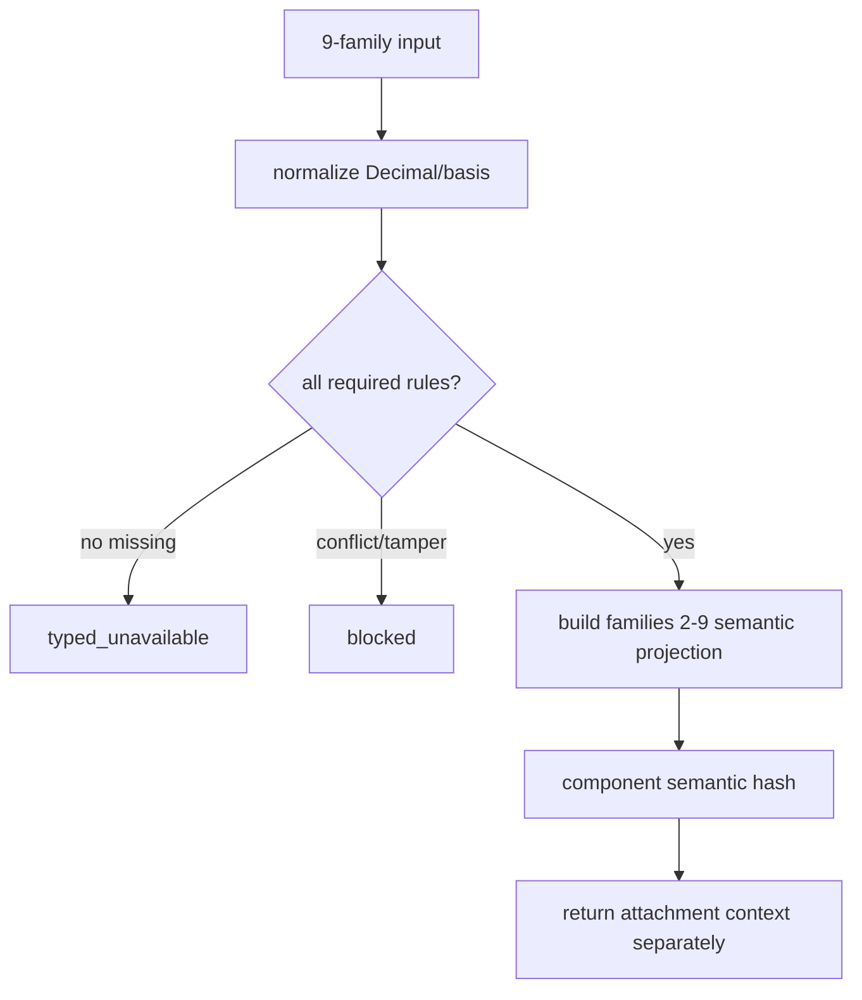

# LLD: CR168-S01 — C3 合同、身份分域与输入校验

## 修订记录

| 版本 | 日期 | 修订人 | 变更要点 |
|---|---|---|---|
| 1.0 | 2026-07-14 | host-orchestrator inline meta-dev | 初始 full LLD。 |
| 1.1 | 2026-07-14 | host-orchestrator inline meta-dev | CP5 评审整改：定义 S01 result 的三元 typed 形态、N01..N10 的精确 code 与排序，明确 S02 只消费 validation-clean input。 |

## 0. 上游工程依据

| 来源 | 消费内容 |
|---|---|
| HLD §5/§6 | 九字段族、Decimal、component/envelope identity 分域。 |
| ADR-001/003 | leaf module、shared attachment header、subject-neutral component。 |
| FEAT-168-01 | value/validator/hash 接口和 EC-T01/05..10。 |

## 1. 目标

创建不可变 C3 contract 与 validator，使字段族 1 只用于 attachment、families 2-9 形成 component semantic projection，任何未充分/不一致输入 fail-closed。

## 2. 需求（Functional / Non-Functional）

### 2.1 Functional

- 定义 `EconomicCostEvidenceInput`、semantic projection、availability/result 与 10 类 machine reason。
- 检查 9/9 字段族、currency/minor unit、finite Decimal、basis、lineage/auth；C3 present 仅允许 square_root。
- hash 使用 explicit domains；component 不保存 family 1 identity，envelope 继续绑定 identity。

### 2.2 Non-Functional

- pure in-memory，外部操作=0；10 次同 semantic input hash distinct=1；tamper false PASS=0。

## 3. 模块拆分与职责

| 模块 | 职责 |
|---|---|
| `economic_cost_evidence.py` | immutable values、normalization、validation、semantic projection/hash/self-validation。 |
| `strategy_evidence.py` | 只读 neutral canonical/envelope public primitive。 |
| contract test | 验证九族与 identity split。 |

## 4. 代码结构与文件影响范围

| 动作 | 文件路径 | 变更内容 |
|---|---|---|
| 创建 | `engine/economic_cost_evidence.py` | C3 contracts、issues、normalization、hash。 |
| 创建 | `tests/research/test_economic_cost_contracts.py` | contract/negative/hash/tamper tests。 |
| 不改 | `engine/strategy_evidence.py` | S03 独占 catalog activation。 |

## 5. 数据模型与持久化设计

| 对象 | 类型 | 约束 |
|---|---|---|
| attachment identity | refs | manifest/run/strategy/package 只进入 envelope context。 |
| semantic input | frozen value | families 2-9；finite Decimal；no binary float。 |
| build issue | code/severity | missing→unavailable，conflict/tamper→blocked。 |
| C3 evidence | frozen value | type/schema=economic_cost/v1；no-real-TCA=true。 |

无持久化、registry 或外部 ref 解引用。

## 6. API / Interface 设计

| 接口 | 输入 | 输出 | 调用方 |
|---|---|---|---|
| `normalize_economic_cost_input` | raw typed input | `NormalizedEconomicCostInput` + `AttachmentContext` | S02 public producer 内部编排 |
| `validate_economic_cost_input` | normalized | `tuple[EconomicCostBuildIssue, ...]`，固定按 N01..N10 排序 | S02 public producer 内部编排 |
| `economic_cost_semantic_hash` | families 2-9 projection | sha256 domain hash | S02/S03/S05 |

### 6.1 S01 result 的精确交接形态

“S01 result” 不是字典、bool 或调用方自称的 validation flag。它是仅由 S02 在同一 in-memory 调用链组装的不可变三元：

```text
EconomicCostValidationResult(
  normalized_input: NormalizedEconomicCostInput,
  attachment_context: AttachmentContext,
  issues: tuple[EconomicCostBuildIssue, ...],
)
```

S01 只拥有 normalizer、validator、issue type 与 hash domain；S02 是唯一把这三个值消费为 producer outcome 的 owner。只要 `issues` 非空，S02 不得调用 calculator。

## 7. 核心处理流程



缺 minor unit/nonfinite/negative forbidden cost/basis mismatch 为 blocked；identity only mutation 不改 component hash，但在 S03 envelope hash 检测。

### 8.1 N01..N10 精确 reason code 表

| 顺序 | P0 失败类 | Reason code | 默认 availability effect |
|---:|---|---|---|
| N01 | gross / performance basis 缺失 | `c3_gross_performance_basis_missing` | typed_unavailable |
| N02 | trade / turnover / notional basis 缺失 | `c3_trade_turnover_notional_basis_missing` | typed_unavailable |
| N03 | cost model / version 缺失 | `c3_cost_model_version_missing` | typed_unavailable |
| N04 | 非有限数值 | `c3_nonfinite_numeric_invalid` | blocked |
| N05 | 非法负成本 | `c3_negative_cost_invalid` | blocked |
| N06 | unit / price / notional basis 冲突 | `c3_unit_price_notional_basis_mismatch` | blocked |
| N07 | currency / price-basis / calendar 跨字段冲突 | `c3_currency_price_calendar_mismatch` | blocked |
| N08 | gross / cost / net 算术冲突 | `c3_gross_cost_net_arithmetic_mismatch` | blocked |
| N09 | lineage / provenance / authorization 缺失或不一致 | `c3_lineage_provenance_authorization_missing_or_mismatch` | typed_unavailable（纯缺失）或 blocked（不一致/越权） |
| N10 | component identity/hash 篡改 | `c3_component_hash_tampered` | blocked |

issue 先按 N01..N10，再按同类稳定字段顺序输出；任何 blocked issue 优先决定最终 producer status。该表与 Domain Map §7 是同一受控枚举。

## 8. 技术细节

使用 CR166 public canonical serializer/hash，domain 常量显式。semantic projection 不包含 `manifest_ref/run_ref/strategy_ref/package_ref` 和 package/run auth/provenance；这些字段不得进入 component body。unsupported family 或 impact N/A 不能成为 present。

## 9. 安全与性能设计

| 维度 | 措施 | 验证 |
|---|---|---|
| 安全 | opaque refs、no env/path/network、fail closed | EC-T06/T10 |
| 性能 | 纯有限值、无 I/O、immutable sorting | 10 reruns |

## 10. 测试设计

| 场景 | 预期 | 验证 |
|---|---|---|
| 9/9 valid | normalized + no issue；三元 S01 result 可被 S02 唯一消费 | EC-T01 |
| missing gross/trade/model | N01/N02/N03 精确 code，unavailable | EC-T06 |
| nonfinite/negative/basis/currency/auth | N04..N09 精确 code，blocked 或规则指定 unavailable | EC-T06 |
| same costs, different subjects | same component hash | EC-T08 |
| semantic/hash tamper | blocked | EC-T09 |

## 11. 实施步骤

| TASK-ID | 动作 | 文件 | 对应测试 |
|---|---|---|---|
| CR168-S01-T01 | 创建 | `engine/economic_cost_evidence.py` values/domains | EC-T01 |
| CR168-S01-T02 | 修改 | 同文件 validator/projection/hash | EC-T05..T10 |
| CR168-S01-T03 | 创建 | contract test | EC-T01..T10 |

## 12. 风险、难点与预研建议

| Clarification ID | 问题 | 决策 | 证据 |
|---|---|---|---|
| LCQ-CR168-S01-01 | component hash 是否含 identity | 已决：不含；envelope 绑定 | CP3 A1 / ADR-003 |

无 OPEN/Spike。风险：C1/C2 API 兼容由 S03 regression 阻断。

## 13. 回滚与发布策略

不发布。若 hash domain 需改变，停止 v1，保留未 attach contract，重开 method/schema CR；不得变更 golden。

## 14. DoD

- [ ] 9/9、10/10、10→1、identity split 测试均通过。
- [ ] C1/C2/canonical source 未改。
- [ ] `confirmed=false` 前不实现。
