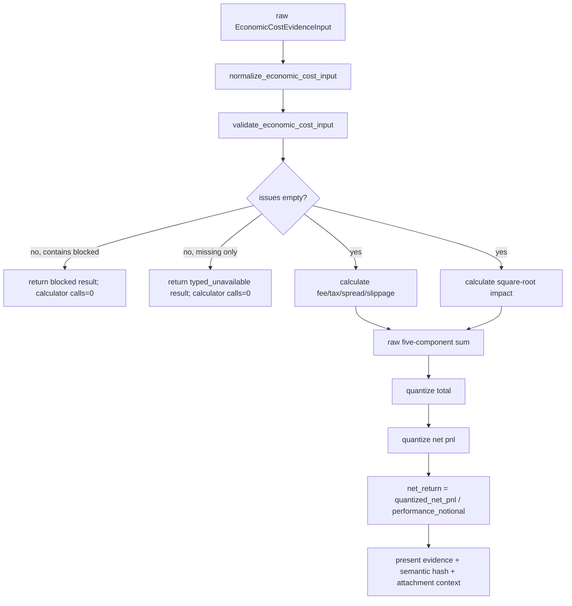

# LLD: CR168-S02 — 确定性经济成本 Producer

## 修订记录

| 版本 | 日期 | 修订人 | 变更要点 |
|---|---|---|---|
| 1.0 | 2026-07-14 | host-orchestrator inline meta-dev | 初始 full LLD。 |
| 1.1 | 2026-07-14 | host-orchestrator inline meta-dev | CP5 评审整改：补足 normalize→validate→issue short-circuit→calculate→produce 编排，固定五分项 basis 和 `net_return` 公式。 |

## 0. 上游工程依据

| 来源 | 消费内容 |
|---|---|
| S01 LLD | normalized input、issues、semantic hash。 |
| HLD §5.2/5.3 | Decimal=28、proxy range、raw sum then quantize。 |
| ADR-002 | v1 only square_root，v1 immutable。 |

## 1. 目标

计算五个静态成本分项、total/net reconciliation 并生成 present/unavailable/blocked C3 producer outcome；不解释为真实 TCA。

## 2. 需求（Functional / Non-Functional）

### 2.1 Functional

- `fee/tax/spread/slippage/impact` 全由显式 static input 计算。
- `proxy=traded_notional/static_reference_notional` 必须 finite `>=0`，`>1` 合法。
- raw components 先 sum；total 和 net 按 positive minor unit `ROUND_HALF_EVEN` 最终量化。

### 2.2 Non-Functional

- 同输入 deterministic；real data/TCA/calibration/ADV/capacity=0。

## 3. 模块拆分与职责

| 模块 | 职责 |
|---|---|
| `economic_cost_calculator.py` | pure Decimal five components/reconciliation。 |
| `economic_cost_evidence.py` | 调用 calculator、组装 availability/evidence。 |
| producer test | formula、proxy、rounding、negative paths。 |

## 4. 代码结构与文件影响范围

| 动作 | 文件 | 内容 |
|---|---|---|
| 创建 | `engine/economic_cost_calculator.py` | `calculate_cost_breakdown`。 |
| 修改 | `engine/economic_cost_evidence.py` | `build_economic_cost_evidence` producer。 |
| 创建 | `tests/research/test_economic_cost_producer.py` | arithmetic/rounding tests。 |

## 5. 数据模型与持久化设计

| 字段 | 约束 |
|---|---|
| components | canonical Decimal intermediate, not quantized individually。 |
| total_cost/net_pnl | raw sum / gross-total 后按 minor unit quantize。 |
| net_return | `quantized_net_pnl / performance_notional`，其中 `performance_notional` 是显式正数且与 gross/net 同一口径；precision=28。 |
| limitations | static/synthetic、no-real-TCA。 |

无持久化。

## 6. API / Interface 设计

| 接口 | 输入 | 输出 | 调用方 |
|---|---|---|---|
| `calculate_cost_breakdown` | validation-clean `NormalizedEconomicCostInput` | breakdown | producer only |
| `build_economic_cost_evidence` | raw `EconomicCostEvidenceInput` | `EconomicCostBuildResult`（evidence 或 issues + attachment context） | S03/S04/S05 |

## 7. 核心处理流程

`build_economic_cost_evidence` 是唯一 public orchestrator：它自行调用 S01 的 normalize/validate，组装 `EconomicCostValidationResult`，并以 blocked 优先于 unavailable 的规则短路。调用方不能传入假定已验证的 mapping；任何 issues 非空时 calculator invocation 必须为 0。reference<=0、coefficient<0、proxy negative/nonfinite、missing minor unit、performance_notional 缺失/非正或 reconciliation drift 均 blocked。

## 8. 技术细节

使用 `Decimal` context=28，拒绝 binary floats。`static_reference_notional` 不命名为 ADV/capacity。五分项的精确 basis/公式为：

| 分项 | required basis | 公式 |
|---|---|---|
| fee | `traded_notional` | `traded_notional × fee_rate + fee_fixed_amount` |
| tax | `sell_notional` | `sell_notional × tax_rate + tax_fixed_amount` |
| spread | `traded_notional` | `traded_notional × effective_spread_rate` |
| slippage | `traded_notional` | `traded_notional × effective_slippage_rate` |
| impact | `traded_notional` | `traded_notional × coefficient × sqrt(traded_notional/static_reference_notional)` |

固定额缺失时必须显式规范化为 `0`；effective spread/slippage rate 已是 all-in rate，禁止隐式 half-spread、FX 或其它转换。`gross_pnl` 若由 gross return 给出，必须以相同 `performance_notional` 推导。rebate 不能以 negative cost 偷渡；新 family、rebate、rounding 变化必须 v2 + method CR。

## 9. 安全与性能设计

| 维度 | 措施 | 验证 |
|---|---|---|
| 安全 | no I/O/no external dereference | forbidden op=0 |
| 可重算 | explicit rates/bases/rounding | EC-T02..T05 |

## 10. 测试设计

| 场景 | 预期 | 验证 |
|---|---|---|
| normalize/validate issue short-circuit | issues 非空时 calculator=0；blocked 优先 | EC-T01/T06 |
| five exact bases / net return | 表中五式及 `quantized_net_pnl/performance_notional` 差异=0 | EC-T02/T04 |
| proxy 0/1/>1 | present and finite | EC-T03 |
| nonfinite/negative/ref<=0 | blocked | EC-T03/T06 |
| three minor-unit invalid states | blocked | EC-T05 |
| per-item premature rounding fixture | mismatch rejected | EC-T04 |

## 11. 实施步骤

| TASK-ID | 动作 | 文件 | 对应测试 |
|---|---|---|---|
| CR168-S02-T01 | 创建 | calculator | EC-T02/03 |
| CR168-S02-T02 | 修改 | evidence producer | EC-T04..T06 |
| CR168-S02-T03 | 创建 | producer tests | EC-T02..T05 |

## 12. 风险、难点与预研建议

无 OPEN。静态模型低估风险保留 limitations + `cost_underestimation_status`; 真实准确度不在此 Story 解决。

## 13. 回滚与发布策略

无发布。计算器错误回退到 S01 unavailable result；不改 static input 语义或 claim ceiling。

## 14. DoD

- [ ] normalize→validate→short-circuit→calculate→produce 顺序可观测，issue path calculator calls=0。
- [ ] five costs、total/net/net_return 可按精确 basis/公式重算。
- [ ] proxy/missing minor unit/rounding negative paths通过。
- [ ] v1 square_root only、external operation=0。
