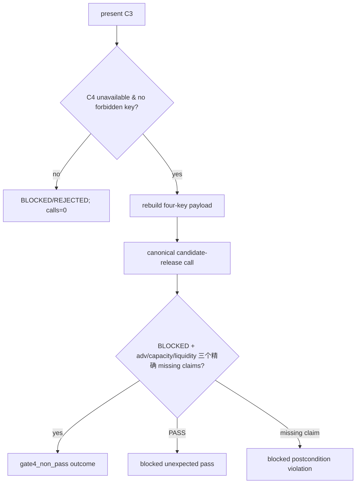

# LLD: CR168-S04 — Gate4 Projection 局部安全封闭

## 修订记录

| 版本 | 日期 | 修订人 | 变更要点 |
|---|---|---|---|
| 1.0 | 2026-07-14 | host-orchestrator inline meta-dev | 初始 full LLD。 |
| 1.1 | 2026-07-14 | host-orchestrator inline meta-dev | CP5 评审整改：固定三个 C4 missing claim ID，选择 keyword-only public-validator 依赖注入，不使用 monkeypatch 或 canonical 私有结构。 |

## 0. 上游工程依据

| 来源 | 消费内容 |
|---|---|
| HLD §7 | strict payload/pre/post contract。 |
| ADR-004 | adapter-local containment, no canonical change。 |
| S01-S03 | present typed C3 / active envelope context。 |

## 1. 目标

用唯一 adapter 把四个 C3 fields 投影给 joint Gate4，并防止缺 C4 ref 通过 `na_reason` 逃逸造成 PASS。

## 2. 需求（Functional / Non-Functional）

### 2.1 Functional

- exact allowlist 4；exact presence denylist 8；C4 refs/reasons absent。
- fixed `candidate-release`; clean path canonical BLOCKED and 3 expected claims。
- unexpected PASS → `gate4_unexpected_pass`; incomplete non-PASS → `gate4_postcondition_violation`。

### 2.2 Non-Functional

- escape calls=0; aggregate calls=0; private helper import=0; canonical/aggregate diff=0。

## 3. 模块拆分与职责

| 模块 | 职责 |
|---|---|
| `economic_cost_gate4_projection.py` | typed precheck/payload/canonical call/postcondition/outcome。 |
| `cross_strategy_reliability_gates.py` | read-only public validator。 |
| projection test | real safe-absent integration + public result double。 |

## 4. 代码结构与文件影响范围

| 动作 | 文件 | 内容 |
|---|---|---|
| 创建 | projection module | four-key build/pre/post guard。 |
| 创建 | projection test | B01/B02/double/operation/source guard。 |
| 禁止 | canonical and package modules | source modifications=0。 |

## 5. 数据模型与持久化设计

| Object | 约束 |
|---|---|
| payload | exact four keys, no C4 keys/reason keys。 |
| outcome | status/reason/canonical_invoked/payload_keys; never aggregate。 |
| C4 marker | unavailable only; present=out-of-scope。 |

无持久化。

## 6. API / Interface 设计

| 接口 | 输入 | 输出 | 调用方 |
|---|---|---|---|
| `project_economic_cost_to_gate4` | present C3, C4 unavailable, zero counts；测试时仅可传 `gate4_validator=` public callable | outcome | S05/integration callers |
| `validate_gate4_capacity_impact` | exact payload + candidate-release | canonical summary | adapter only |

## 7. 核心处理流程

## 8. 技术细节

No runtime `_has_na_reason`; own public constant only。double 一律采用 dependency injection：production 不传 `gate4_validator`，adapter 默认调用 public `validate_gate4_capacity_impact`；G4-T06/T07 通过 keyword-only `gate4_validator=` 传入仅返回 public `ReliabilityGateSummary` 的 fake callable。禁止 monkeypatch canonical module、禁止 import/复制 canonical private helper，fake 只模拟结果而不复制实现。Future C4 adapter path entirely FU-005; direct caller/global remediation FU-007.

## 9. 安全与性能设计

| 维度 | 措施 | 验证 |
|---|---|---|
| security | strict rebuild + key-presence denylist | B02 8/8 |
| claim | never return PASS/aggregate | B01/SIM-05 |

## 10. 测试设计

| 场景 | 预期 | 验证 |
|---|---|---|
| clean absent B01 | blocked + `adv_participation_missing`、`capacity_dollars_missing`、`liquidity_sizing_missing` | G4-T01 |
| every reason key B02 | calls=0 | G4-T02 |
| double PASS | split reason; aggregate=0 | G4-T06 |
| double incomplete claims | split reason; aggregate=0 | G4-T07 |
| C4 present/nonzero operation | rejected/blocked calls=0 | G4-T05/T09 |

## 11. 实施步骤

| TASK-ID | 动作 | 文件 | 对应测试 |
|---|---|---|---|
| CR168-S04-T01 | 创建 | projection module precheck | G4-T01..05 |
| CR168-S04-T02 | 修改 | module canonical/postcondition | G4-T06/07 |
| CR168-S04-T03 | 创建 | projection tests | G4-T01..09 |
| CR168-S04-T04 | 静态检查 | canonical/aggregate | G4-T08 |

## 12. 风险、难点与预研建议

| Clarification ID | 问题 | 决策 | 证据 |
|---|---|---|---|
| LCQ-CR168-S04-01 | canonical permissive semantics | no dependency; adapter safety only | ADR-004 |

无 OPEN。canonical global residual risk remains R-CR168-GATE4-C3-C4-SEMANTIC.

## 13. 回滚与发布策略

若 guard 不足，remove/defer projection and keep component-only; reopen CP2. Never modify canonical to evade scope.

## 14. DoD

- [ ] allowlist=4; denylist=8; escape calls=0。
- [ ] candidate-release B01 blocked + `adv_participation_missing` / `capacity_dollars_missing` / `liquidity_sizing_missing`。
- [ ] two postcondition reasons and aggregate=0。
- [ ] canonical/aggregate source change=0。
