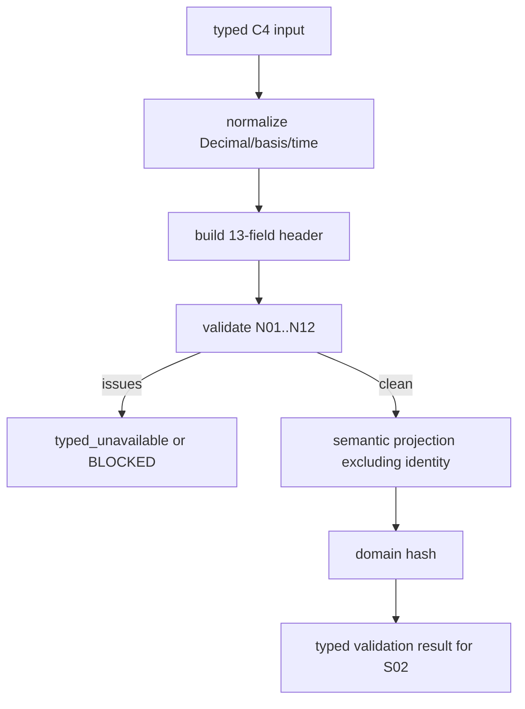

# LLD: CR169-S01 — C4 合同、关联头与输入校验

## 修订记录

| 版本 | 日期 | 修订人 | 变更要点 |
|---|---|---|---|
| 1.0 | 2026-07-14 | host-orchestrator inline meta-dev | 初始 full LLD：typed contract、13-field header、N01..N12、hash 分域与 S02 交接。 |

## 0. 上游工程依据

| 来源 | 消费内容 |
|---|---|
| CR169 HLD §5–7 | C4 input、13-field header、component/envelope hash、12 P0。 |
| ADR-001/002 | static C4 v1 与 exact correlation/hash boundary。 |
| FEAT-169-01/02 | public values、reason codes、tests 与安全边界。 |

## 1. 目标

创建不可变 C4 input/header/issue/build-result primitives，使 12 类输入缺口、冲突、篡改均在计算前 fail-closed，并为 S02/S03/S04 提供唯一 typed contract。

## 2. 需求（Functional / Non-Functional）

### 2.1 Functional

- 定义 `CapacityLiquidityEvidenceInput`、`NormalizedCapacityLiquidityInputV1`、`C3C4CorrelationHeaderV1`、attachment context、issue、validation result、evidence/result enums。
- 校验 exact 13 fields、synthetic basis、method/version、Decimal/unit/calendar/temporal、lineage/auth 与 no-real claims。
- component semantic projection 排除 attachment identity，保留计算语义、basis、temporal、limitations 与 audit declarations。

### 2.2 Non-Functional

- frozen/slotted value-only；外部 I/O=0；binary float/nonfinite accepted=0；同 semantic body 10 runs→1 hash。
- issue 顺序只按 N01..N12，再按 field/name 稳定排序；blocked 只能 worse-state merge。

## 3. 模块拆分与职责

| 模块 | 职责 |
|---|---|
| `capacity_liquidity_evidence.py` | contracts、normalization、validation、semantic projection/hash、self-validation。 |
| `strategy_evidence.py` | 只读 canonical serializer/hash 与 envelope types；S01 不修改。 |
| contract tests | reason、header、hash、tamper、no-I/O。 |

## 4. 代码结构与文件影响范围

| 动作 | 文件 | 内容 |
|---|---|---|
| 创建 | `engine/capacity_liquidity_evidence.py` | public value types、domains、normalizer、validator、hash/self-validation。 |
| 创建 | `tests/research/test_capacity_liquidity_contracts.py` | CL-T05..T10、CH-T01..T06。 |
| 不改 | `engine/strategy_evidence.py` | catalog activation 由 S03 独占。 |
| 禁止 | canonical Gate4、CR168 adapter、admission package | 修改数必须 0。 |

## 5. 数据模型与持久化设计

| Object | 精确字段/形态 | 不变量 |
|---|---|---|
| `CapacityLiquidityAttachmentContext` | manifest/run/strategy/package refs | 只进 envelope binding。 |
| `C3C4CorrelationHeaderV1` | 13 个命名字段 | missing/extra/blank/mismatch/temporal inversion blocked。 |
| `CapacityLiquidityEvidenceInput` | attachment、header、synthetic_adv、requested_notional、turnover_notional、cap、method/version、minor unit、limitations、lineage/provenance/auth | typed values；无真实 data source 字段。 |
| `CapacityLiquidityValidationResult` | normalized_input、attachment_context、header、issues | S02 唯一消费的 typed 四元。 |
| `CapacityLiquidityBuildIssue` | code、field、severity、message | code 仅 N01..N12 table；稳定序。 |

无数据库、文件、registry、store、URL/path dereference。

## 6. API / Interface 设计

| Interface | 输入 | 输出 | 调用方 |
|---|---|---|---|
| `normalize_capacity_liquidity_input` | `CapacityLiquidityEvidenceInput` | normalized + attachment + header | S02 producer |
| `validate_capacity_liquidity_input` | normalized/context/header | ordered issues | S02 producer/S05 |
| `capacity_liquidity_semantic_hash` | normalized computational projection | domain-separated sha256 | S02/S03/S05 |
| `validate_c3_c4_correlation_headers` | two complete headers | tuple issues | S04 |
| `self_validate_capacity_liquidity_evidence` | typed evidence | validation | S03/S04/S05 |

`CapacityLiquidityValidationResult` 只能由 normalizer+validator 在同一 in-memory 调用链组装；调用方不可构造 `validated=true` 或 arbitrary dict 绕过校验。

## 7. 核心处理流程

header mismatch/invalid input 永不调用 calculator 或 canonical。

## 8. 技术细节

### 8.1 精确 header

字段集固定为 `manifest_ref/run_ref/strategy_ref/package_ref/price_basis/notional_basis/currency/calendar/as_of/horizon_start/horizon_end/lineage_context_ref/authorization_context_ref`。`horizon_start <= horizon_end <= as_of`。任何默认填充数=0。

### 8.2 N01..N12

| 顺序 | Code | Availability effect |
|---:|---|---|
| N01 | `c4_identity_binding_missing` | typed_unavailable |
| N02 | `c4_static_liquidity_basis_missing` | typed_unavailable |
| N03 | `c4_proxy_model_version_missing` | typed_unavailable |
| N04 | `c4_nonfinite_numeric_invalid` | blocked |
| N05 | `c4_negative_or_participation_cap_invalid` | blocked |
| N06 | `c4_unit_currency_basis_mismatch` | blocked |
| N07 | `c4_calendar_temporal_mismatch` | blocked |
| N08 | `c4_c3_c4_correlation_header_mismatch` | blocked |
| N09 | `c4_lineage_provenance_authorization_missing_or_mismatch` | missing unavailable；mismatch blocked |
| N10 | `c4_component_or_envelope_hash_tampered` | blocked |
| N11 | `c4_gate4_ref_not_typed_present` | blocked |
| N12 | `c4_projection_reason_escape_or_postcondition_violation` | rejected/blocked |

N11/N12 由 S04 产生，但枚举 owner 在本模块，避免跨 Story 私自增加 reason。

### 8.3 Hash domain

input domain=`quant-lab.capacity-liquidity-input.v1`；component domain=`quant-lab.capacity-liquidity-component.v1`。manifest/run/strategy/package refs 排除；basis/currency/calendar/temporal/model/limitations/audit declarations 纳入 semantic projection。

## 9. 安全与性能设计

| 维度 | 设计 | 验证 |
|---|---|---|
| 权限 | opaque refs；不读 env/credential/path/provider/lake/NAS | operation counts 全 0 |
| 完整性 | immutable + self-hash + explicit domains | tamper false PASS=0 |
| 性能 | O(字段数)，无 I/O/重试/并发状态 | 10 reruns |

## 10. 测试设计

| 场景 | 预期 |
|---|---|
| valid 13/13 + contract | issues=0；hash deterministic。 |
| 13 single-field mismatch | 13/13 blocked；canonical calls=0。 |
| N01..N12 matrix | exact code/order/effect；false PASS=0。 |
| same body/different identity | component hash same；header join mismatch。 |
| hash/body tamper | blocked。 |

## 11. 实施步骤

| TASK-ID | 动作 | 文件 | 测试 |
|---|---|---|---|
| CR169-S01-T01 | 创建 value/domain types | evidence module | CL-T01/T06/T07 |
| CR169-S01-T02 | 创建 normalizer/validator/reason/hash | evidence module | CL-T05/T08/T09/T10 |
| CR169-S01-T03 | 创建 contract/header tests | test module | CH-T01..T06 |

## 12. 风险、难点与预研建议

| Risk | 决策 | 证据 |
|---|---|---|
| identity 污染 component hash | 明确排除；join 单独检查 13 fields | CP3 DQ-HEADER |
| C3 schema 缺 temporal header | S04 由 attachment/component + explicit static join context 构造 view；不改 C3 schema | HLD §6.2 |

无 OPEN clarification / Spike。

## 13. 回滚与发布策略

不发布。若 header/hash/schema 需变化，停止 S02–S05，保留 reserved C4 slot 并回 CP3/新 CR；不得改 golden 掩盖。回滚不触达 canonical、registry 或远端。

## 14. DoD

- [ ] 13/13 fields、12/12 reasons、10→1、identity split 全有可执行测试设计。
- [ ] S02 typed handoff 与 issue short-circuit 明确。
- [ ] source implementation 仍为 0，直到 CP5 approved。
