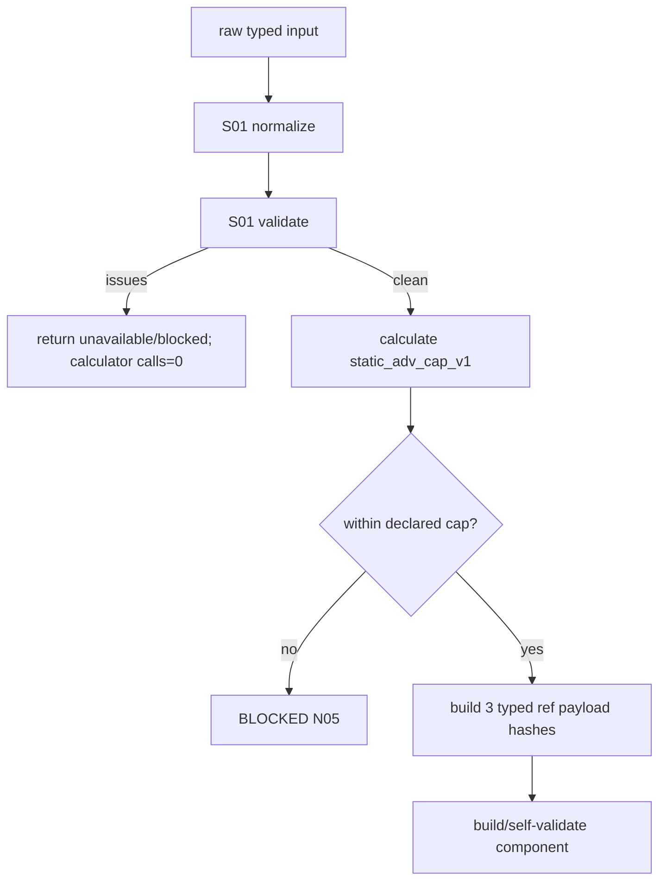

# LLD: CR169-S02 — 确定性 Static C4 Producer

## 修订记录

| 版本 | 日期 | 修订人 | 变更要点 |
|---|---|---|---|
| 1.0 | 2026-07-14 | host-orchestrator inline meta-dev | 初始 full LLD：static_adv_cap_v1 公式、Decimal/rounding、producer 编排与 3 typed refs。 |

## 0. 上游工程依据

| 来源 | 消费内容 |
|---|---|
| S01 LLD | validation result、N01..N12、header/hash domain。 |
| HLD §6.4/§7.1 | explicit static proxy、no-real claims、producer flow。 |
| FEAT-169-01 | formulas、minor-unit、test IDs。 |

## 1. 目标

将 validation-clean static input 以唯一 v1 方法确定性计算为 participation/capacity/headroom，并构造 3 个 typed present logical refs 与 `capacity_liquidity@v1` evidence。

## 2. 需求（Functional / Non-Functional）

### 2.1 Functional

- 实现 `static_adv_cap_v1`，不读取或估计 ADV。
- 唯一 producer 自行调用 S01 normalizer/validator；issue 非空时 calculator calls=0。
- present output 同时包含 3/3 C4 refs、static limitations 与 real-ready=false claims。

### 2.2 Non-Functional

- Decimal precision=28，binary float/nonfinite=0；货币结果按显式 minor unit HALF_EVEN。
- 同 input 10 runs→1 semantic/component hash；无时间、随机、环境或 I/O 依赖。

## 3. 模块拆分与职责

| 模块 | 职责 |
|---|---|
| `capacity_liquidity_calculator.py` | pure formula、Decimal context、breakdown invariants。 |
| `capacity_liquidity_evidence.py` | public producer、issues short-circuit、ref/evidence/hash/self-validation。 |
| producer tests | formula/cap/rounding/determinism/claim boundary。 |

## 4. 代码结构与文件影响范围

| 动作 | 文件 | 内容 |
|---|---|---|
| 创建 | `engine/capacity_liquidity_calculator.py` | `CapacityLiquidityBreakdownV1` 与 calculator。 |
| 修改 | `engine/capacity_liquidity_evidence.py` | `build_capacity_liquidity_evidence` 与 refs/evidence。 |
| 创建 | `tests/research/test_capacity_liquidity_producer.py` | CL-T01..T10 中 numeric/producer cases。 |
| 禁止 | canonical Gate4、CR168 adapter、strategy admission | 0 changes。 |

## 5. 数据模型与持久化设计

| Object | Fields | Constraint |
|---|---|---|
| `CapacityLiquidityBreakdownV1` | participation_ratio、raw_capacity_amount、capacity_amount、headroom、within_cap | immutable finite Decimal/bool。 |
| `CapacityLiquidityRefPayloadV1` | kind、method/version、value/basis/currency/as-of/horizon、input/component hash | canonical JSON value only。 |
| `CapacityLiquidityEvidenceV1` | type/schema、input hash、3 refs、breakdown、availability、limitations/claims、component hash | present only after self-validation。 |

refs 为 `sha256:` content-addressed logical refs；不写文件/store/registry。

## 6. API / Interface 设计

| Interface | 输入 | 输出 | 失败 |
|---|---|---|---|
| `calculate_capacity_liquidity_breakdown` | validation-clean normalized input | breakdown | invariant exception converted to blocked issue by producer |
| `build_capacity_liquidity_evidence` | raw typed input | `CapacityLiquidityBuildResult` | unavailable/blocked + issues；evidence=None |
| `capacity_liquidity_component_hash` | unsigned evidence body | sha256 | self-validation mismatch blocked |

producer 不接受 `validated=True`、arbitrary mapping 或预先计算的 participation/capacity 值覆盖公式。

## 7. 核心处理流程



## 8. 技术细节

### 8.1 精确公式与合法域

```text
adv_participation = requested_notional / synthetic_adv
raw_capacity_amount = synthetic_adv * participation_cap
capacity_amount = raw_capacity_amount.quantize(currency_minor_unit, ROUND_HALF_EVEN)
liquidity_headroom = (capacity_amount - requested_notional).quantize(currency_minor_unit, ROUND_HALF_EVEN)
within_declared_cap = adv_participation <= participation_cap
```

`synthetic_adv>0`、`requested_notional>=0`、`turnover_notional>=0`、`0<participation_cap<=1`、minor unit>0。ratio=cap 通过，ratio>cap blocked。该 cap 是 v1 conservative fixture policy，非全局市场理论。不得隐式 FX 或从 turnover 反推 requested notional。

### 8.2 三个 ref

- `adv_participation_ref`：ratio、numerator/denominator、method/version、basis。
- `capacity_dollars_ref`：quantized capacity、declared currency/minor unit；字段名不等于 USD 声明。
- `liquidity_sizing_refs`：长度固定 1 的 tuple ref，payload 含 requested、capacity、headroom、within-cap 与 limitations。

### 8.3 Claims

`real_adv_available=false`、`real_liquidity_available=false`、`capacity_ready=false`、`alpha_decay_calculator=0`；缺一则 self-validation blocked。

## 9. 安全与性能设计

| 维度 | 措施 | 值 |
|---|---|---|
| 可复算 | fixed Decimal context/domain/sorting | 10→1 |
| 安全 | no source locator/env/credential/I/O | operations=0 |
| Claim | immutable false claims + static limitation | overclaim PASS=0 |

## 10. 测试设计

| Test | Input | Expected |
|---|---|---|
| formula | adv=1,000,000；requested=50,000；cap=.10 | ratio=.05；capacity=100,000；headroom=50,000。 |
| cap edge | requested=100,000 / 100,000.01 | PASS / blocked。 |
| rounding | minor=.01，raw non-cent | HALF_EVEN golden；默认/逐项隐式 rounding=0。 |
| issue short circuit | each N01..N10 input issue | calculator calls=0。 |
| determinism | same input 10 times | one hash/ref triplet。 |

## 11. 实施步骤

| TASK-ID | 动作 | 文件 | 测试 |
|---|---|---|---|
| CR169-S02-T01 | 创建 calculator/breakdown | calculator | CL-T02..T04 |
| CR169-S02-T02 | 组合 producer/refs/evidence | evidence | CL-T01/T05/T06 |
| CR169-S02-T03 | 创建 producer tests | test | CL-T01..T10 |

## 12. 风险、难点与预研建议

| Risk | Control |
|---|---|
| proxy 被误读真实 capacity | static provenance + all real claims false；命名/文档 guard。 |
| currency field name confusion | ref payload carries declared currency；禁止从 `dollars` 名字推断 USD。 |

无 OPEN clarification；如需新 model family/alpha，独立 CR/schema v2。

## 13. 回滚与发布策略

不发布。calculator/producer 可整体回滚，C4 catalog 保持 reserved 或由 S03 回滚；失败输入保留 typed unavailable。不得以改 golden、默认参数或放宽 cap 修复测试。

## 14. DoD

- [ ] formulas/legality/rounding/3 refs/claims 精确且可测试。
- [ ] producer 与 S01 typed result 一致，issue path calculator=0。
- [ ] CP5 未批准前 source/test implementation=0。
