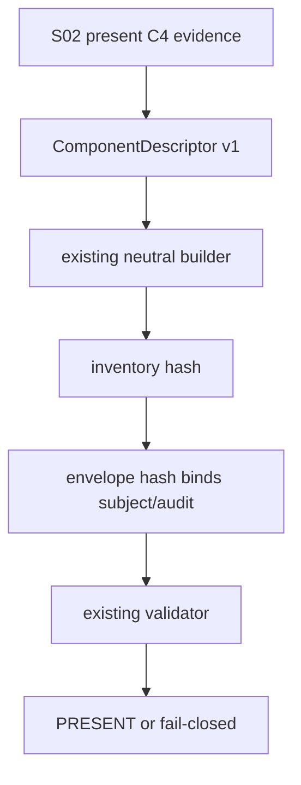

# LLD: CR169-S03 — Neutral Envelope C4 激活与多策略兼容

## 修订记录

| 版本 | 日期 | 修订人 | 变更要点 |
|---|---|---|---|
| 1.0 | 2026-07-14 | host-orchestrator inline meta-dev | 初始 full LLD：C4 descriptor activation、attachment identity、daily/ML compatibility 与既有合同回归。 |

## 0. 上游工程依据

| 来源 | 消费内容 |
|---|---|
| CR166 neutral envelope | `COMPONENT_CATALOG`、`ComponentDescriptor`、canonical inventory/envelope hash。 |
| S01/S02 | present C4 evidence、component ref/hash、attachment context。 |
| ADR-001/002 | leaf component=1、identity 只进 envelope binding。 |

## 1. 目标

把 `("capacity_liquidity", "reserved")` 演进为唯一 active `("capacity_liquidity", "v1")`，并证明 C4 attachment 不破坏现有 C1/C2/C3 组件、catalog 或 canonical serialization。

## 2. 需求（Functional / Non-Functional）

### 2.1 Functional

- active C4 descriptor=1；reserved descriptor 不再作为 active target，parallel catalog/registry=0。
- present C4 descriptor 必须有 ref/hash；unavailable 仍可由 typed availability 表达。
- daily/ML 同 computational body 可得相同 component hash，不同 subject/attachment 必得不同 envelope hash。

### 2.2 Non-Functional

- C1/C2/C3 catalog status、component hash、envelope validation regression failures=0。
- 不修改 neutral canonical JSON/hash domain，不新增 discovery/plugin/store。

## 3. 模块拆分与职责

| 模块 | 职责 |
|---|---|
| `strategy_evidence.py` | catalog slot activation only；existing envelope primitives unchanged。 |
| envelope compatibility tests | active/reserved/unknown behavior、daily/ML attachment、C1-C3 regression。 |
| C4 evidence module | 只读提供 ref/hash/context。 |

## 4. 代码结构与文件影响范围

| 动作 | 文件 | 变更 |
|---|---|---|
| 修改 | `engine/strategy_evidence.py` | catalog 新增/替换 `capacity_liquidity@v1: ACTIVE`；不改 public class/function signatures。 |
| 创建 | `tests/research/test_capacity_liquidity_envelope_compatibility.py` | catalog/attach/hash/regression。 |
| 只读 | C1/C2/C3 evidence modules | golden compatibility。 |
| 禁止 | canonical Gate4、CR168 adapter、admission package | 0 changes。 |

## 5. 数据模型与持久化设计

沿用 `ComponentDescriptor(component_type="capacity_liquidity", component_schema_version="v1", required=..., component_ref, component_hash, availability, reason_codes)`。不新增 envelope/header registry；logical provenance/authorization summary 继续进入 envelope hash。无持久化。

## 6. API / Interface 设计

| Interface | 输入 | 输出 | 调用方 |
|---|---|---|---|
| `component_catalog_status("capacity_liquidity", "v1")` | type/version | ACTIVE | envelope builder/validator |
| `build_strategy_evidence_envelope` | subject + component descriptors + audit fields | existing envelope v1 | S03 tests / future callers |
| `validate_strategy_evidence_envelope` | envelope | PRESENT/UNAVAILABLE/BLOCKED | S03/S05 |

不新增 `build_capacity_envelope` 平行入口；C4 使用已有 neutral builder。

## 7. 核心处理流程

## 8. 技术细节

- Catalog exact active entries after change include existing `walk_forward_oos@v1`、`economic_cost@v1` and new `capacity_liquidity@v1`; no version replacement or hash-domain change。
- same C4 component attached to daily/ML packages is only a method-semantic comparison fixture；cross-subject C3/C4 join still fails 13-field identity comparison。
- existing Feature docs may only add CR169 revision/traceability; any semantic rewrite to CR166/168 design stops and routes CP3/new CR。

## 9. 安全与性能设计

| Risk | Control |
|---|---|
| catalog collision | exact tuple uniqueness + unknown/reserved tests。 |
| identity collision | envelope hash binds subject/audit；component equality does not imply join。 |
| hidden registry | `COMPONENT_CATALOG` remains static in-module mapping；persistent registry writes=0。 |

## 10. 测试设计

| Test | Expected |
|---|---|
| status | C4 v1 ACTIVE=1；reserved required present false pass=0。 |
| daily/ML same body | component hashes distinct=1；envelope hashes distinct=2。 |
| identity tamper | envelope validation BLOCKED。 |
| existing C1/C2/C3 | catalog/validation/hash golden failures=0。 |
| no parallel | new envelope/registry/discovery APIs=0。 |

## 11. 实施步骤

| TASK-ID | 动作 | 文件 | 测试 |
|---|---|---|---|
| CR169-S03-T01 | 激活 C4 v1 catalog entry | strategy evidence | status test |
| CR169-S03-T02 | 创建 daily/ML attach tests | compatibility test | hash split |
| CR169-S03-T03 | 运行 C1/C2/C3 targeted regression | existing + new tests | failure=0 |

## 12. 风险、难点与预研建议

主要风险是把 component semantic equality 误作 subject equality；由 S04 header check 阻断。无 OPEN clarification。

## 13. 回滚与发布策略

若 compatibility 失败，撤回 C4 v1 active entry并保留 reserved；S01/S02 component 可保留未 attach。无 migration/store/remote release。

## 14. DoD

- [ ] active descriptor=1；parallel registry/envelope=0。
- [ ] daily/ML component/envelope hash 分域与 C1-C3 regression 可测试。
- [ ] CP5 前不执行实现。
