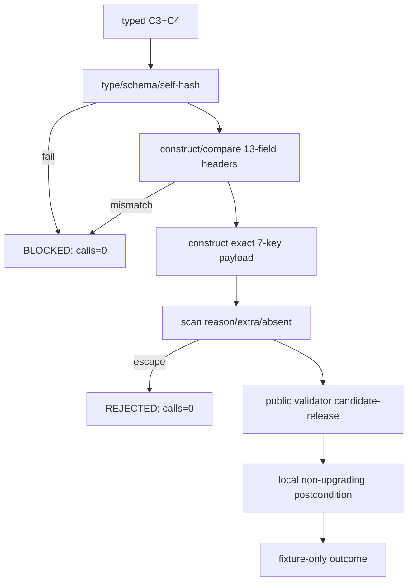

# LLD: CR169-S04 — Strict C3+C4 Gate4 Joint Fixture Adapter

## 修订记录

| 版本 | 日期 | 修订人 | 变更要点 |
|---|---|---|---|
| 1.0 | 2026-07-14 | host-orchestrator inline meta-dev | 初始 full LLD：Protocol DI、13-field precheck、exact 7-key、reason escape 与 local postcondition。 |

## 0. 上游工程依据

| 来源 | 消费内容 |
|---|---|
| HLD §7.2–7.4 | joint flow、exact payload、public callable、postcondition。 |
| S01/S02/S03 | typed/self-validated C4 evidence、attachment/header、active descriptor。 |
| CR168 | verified `economic_cost@v1` 与 C3-only adapter forbidden-write regression。 |
| canonical source fact | `validate_gate4_capacity_impact` public signature 与 Gate4 C3+C4 fields。 |

## 1. 目标

创建唯一 CR169 local adapter，在 C3+C4 全 present 的 fixture path 上证明 7-field consumer contract，并封闭 reason/extra/header/hash/claim 逃逸；不修改 canonical、CR168 或 aggregate。

## 2. 需求（Functional / Non-Functional）

### 2.1 Functional

- 只接受 typed `economic_cost@v1` + `capacity_liquidity@v1` 与各自 attachment/context。
- type/schema/self-hash、13-field exact match、7-key allowlist、reason/extra-key scan 全在 canonical 前完成。
- canonical PASS 仅转换为 bounded `gate4_fixture_contract_pass`；其它 status 不得升级。

### 2.2 Non-Functional

- precheck failure canonical calls=0；valid path=1。
- canonical/CR168 adapter/aggregate/admission source changes=0；private helper runtime imports=0。

## 3. 模块拆分与职责

| 模块 | 职责 |
|---|---|
| `capacity_liquidity_gate4_projection.py` | validator Protocol、typed outcome、correlation/payload/precheck/call/postcondition。 |
| canonical Gate4 | read-only public callable；政策 owner 不变。 |
| projection tests | real public call happy/non-PASS + DI double unexpected PASS/postcondition。 |

## 4. 代码结构与文件影响范围

| 动作 | 文件 | 内容 |
|---|---|---|
| 创建 | `engine/capacity_liquidity_gate4_projection.py` | local adapter。 |
| 创建 | `tests/research/test_capacity_liquidity_gate4_projection.py` | G4J-T01..T09 + CH cases。 |
| 禁止修改 | `engine/cross_strategy_reliability_gates.py` | canonical changes=0。 |
| 禁止修改 | `engine/economic_cost_gate4_projection.py` | CR168 absent-C4 behavior unchanged。 |
| 禁止修改 | `engine/strategy_admission_package.py` | aggregate/admission integration=0。 |

## 5. 数据模型与持久化设计

| Object | Fields | Constraint |
|---|---|---|
| `Gate4Validator` Protocol | `__call__(evidence, *, release_profile="candidate-release", operation_counts=None) -> ReliabilityGateSummary` | keyword-only public signature；DI only。 |
| `Gate4FixtureCompatibilityOutcome` | status、reason_codes、canonical_summary、payload_hash、claim booleans | immutable；non-aggregate。 |
| payload | exact 7 string keys | arbitrary caller mapping 不得透传。 |

无持久化、registry、package mutation。

## 6. API / Interface 设计

```python
class Gate4Validator(Protocol):
    def __call__(
        self,
        evidence: Mapping[str, Any],
        *,
        release_profile: str = "candidate-release",
        operation_counts: Mapping[str, Any] | None = None,
    ) -> ReliabilityGateSummary: ...

def evaluate_c3_c4_gate4_fixture_compatibility(
    *,
    economic_cost: EconomicCostEvidenceV1,
    economic_cost_attachment: EconomicCostAttachmentContext,
    capacity_liquidity: CapacityLiquidityEvidenceV1,
    capacity_liquidity_attachment: CapacityLiquidityAttachmentContext,
    correlation_context: C3C4CorrelationContextV1,
    operation_counts: Mapping[str, Any] | None = None,
    gate4_validator: Gate4Validator = validate_gate4_capacity_impact,
) -> Gate4FixtureCompatibilityOutcome: ...
```

测试 double 实现 Protocol；禁止 monkeypatch canonical module 或导入 `_has_na_reason`。

## 7. 核心处理流程



## 8. 技术细节

### 8.1 Exact payload

C3：`impact_model_family`、`impact_model_ref`、`cost_underestimation_status`、`no_real_tca_claim`；C4：`adv_participation_ref`、`capacity_dollars_ref`、`liquidity_sizing_refs`。keys count 必须 7，所有 C4 refs typed present/nonempty。

### 8.2 Denylist 语义

adapter 不接受 arbitrary caller mapping；仍对构造结果和可序列化 view 扫描 field-level `*_na_reason` / `*_n_a_reason` 与 generic `na_reason` / `n_a_reason`。presence 即拒绝，空值也拒绝；absent placeholder/第 8 key拒绝。

### 8.3 Postcondition

- canonical status PASS 且所有本地前提/claims 成立 → `gate4_fixture_contract_pass`。
- canonical BLOCKED/NEEDS_REVIEW/FAIL → 返回同等或更差 status，不补 reason 绕过。
- callable double 返回 PASS 但 payload/header/no-real/claim invariant 不成立 → `REJECTED/gate4_fixture_postcondition_violation`。
- output 固定 aggregate=false、capacity_scalable=false、real_capacity_ready=false、stage3_entry_ready=false。

## 9. 安全与性能设计

| 维度 | 控制 |
|---|---|
| False PASS | precheck + public call + local postcondition 三层；worse-state only。 |
| 私有耦合 | runtime private helper imports=0；只测公开 observable semantics。 |
| 性能 | 单次 in-memory mapping/hash/call，无 I/O/retry/global state。 |

## 10. 测试设计

| Test | Expected |
|---|---|
| valid real public callable | payload 7；calls=1；fixture PASS max=1。 |
| each header mismatch | blocked；calls=0。 |
| each C4 ref absent/non-present | N11；calls=0。 |
| reason/generic/extra injection | N12 rejected；calls=0。 |
| canonical non-PASS | no status upgrade。 |
| DI double unexpected PASS | postcondition violation；不 monkeypatch。 |
| source guard | three forbidden modules changes=0。 |

## 11. 实施步骤

| TASK-ID | 动作 | 文件 | 测试 |
|---|---|---|---|
| CR169-S04-T01 | 定义 Protocol/outcome/reasons | projection | type tests |
| CR169-S04-T02 | 实现 typed/header/payload prechecks | projection | CH/G4J negatives |
| CR169-S04-T03 | 实现 public call/postcondition | projection | PASS/non-PASS/double |
| CR169-S04-T04 | 创建 source/claim guards | tests | modifications/claims=0 |

## 12. 风险、难点与预研建议

| Risk | Control |
|---|---|
| canonical N/A permissive global semantics | no N/A reason in C4-present adapter；global fix 留 FU007a。 |
| fixture PASS 泄漏 aggregate | outcome type 无 admission/package writer；claims false。 |

无 OPEN clarification。

## 13. 回滚与发布策略

删除/停用 local adapter 即可；C4 typed component 和 CR168 adapter 不受影响。若 public callable/signature/semantics 改变，停止并回 CP3/独立 CR；不得修改 canonical 配合本 Story。

## 14. DoD

- [ ] Protocol 精确匹配 public signature，candidate-release 固定。
- [ ] 13-field、7-key、reason/extra、postcondition、forbidden source tests 全设计完毕。
- [ ] CP5 前 implementation=0。
