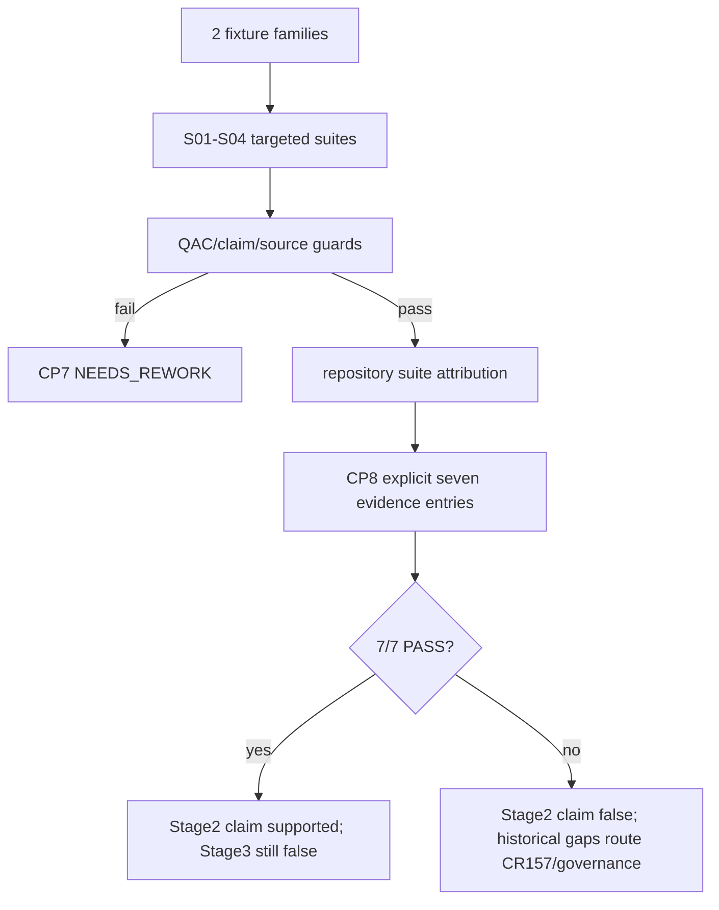

# LLD: CR169-S05 — Fixture、Claim 与 Stage2 Exit 验证

## 修订记录

| 版本 | 日期 | 修订人 | 变更要点 |
|---|---|---|---|
| 1.0 | 2026-07-14 | host-orchestrator inline meta-dev | 初始 full LLD：2 fixture、9/17/15/12 覆盖、CR155/CR168/source guards 与 7-item Stage2 exit result。 |

## 0. 上游工程依据

| 来源 | 消费内容 |
|---|---|
| CP2 product baseline | 9 REQ、17 scenarios、15 QAC、2 fixtures、12 P0。 |
| S01–S04 | contract/producer/catalog/adapter public behavior。 |
| ADR-005/006 | Stage2 7/7、Stage3 false、历史失败 routing、FU007 future-only。 |

## 1. 目标

建立纯 synthetic/static 的跨 Feature 验证面，证明 C4 foundation 满足量化合同、未越权修改相邻对象，并为 CP8 生成可审计 Stage2 7/7 contract verification 形态。

## 2. 需求（Functional / Non-Functional）

### 2.1 Functional

- fixture families=2/2：daily multifactor synthetic；daily/ML multi-strategy compatibility。
- 覆盖 REQ=9/9、scenarios=17/17、QAC=15/15、P0=12/12、10→1、joint pass=1、CR168 regression=1。
- CR155 保持 BLOCKED/paper_candidate=false；canonical/CR168 adapter/aggregate modifications=0。

### 2.2 Non-Functional

- 外部/真实/runtime/trading/remote operations=0；所有 refs opaque。
- repository suite failure 必须逐项归因；无法证明既有则 CP7 不通过。

## 3. 模块拆分与职责

| 模块 | 职责 |
|---|---|
| fixture files | 仅静态 typed input/expected output，不含 source locator/credential。 |
| CR169 QAC tests | coverage、negative、determinism、authorization/source guards。 |
| claim regression tests | CR168 absent route、CR155、Stage3/real/aggregate false。 |
| Stage2 checker | CP8 读取已授权的 repository evidence refs，生成 7-item result；不修改历史合同。 |

## 4. 代码结构与文件影响范围

| 动作 | 文件 | 内容 |
|---|---|---|
| 创建 | `tests/fixtures/capacity_liquidity/daily_multifactor_v1.json` | synthetic C4 happy/negative basis。 |
| 创建 | `tests/fixtures/capacity_liquidity/multi_strategy_compatibility_v1.json` | daily/ML body + distinct attachment。 |
| 创建 | `tests/research/test_capacity_liquidity_cr169_qac.py` | 9/17/15/12、hash/ops/source guard。 |
| 创建 | `tests/research/test_capacity_liquidity_claim_regression.py` | CR168/CR155/claims。 |
| 创建 | `scripts/check_stage2_exit_contracts.py` | CP8 7-item result builder/checker。 |
| CP8 生成 | `process/checks/STAGE2-EXIT-VERIFICATION.result.json` | machine truth；不在 CP6 预生成伪 PASS。 |

## 5. 数据模型与持久化设计

Stage2 result schema：`schema_version/check_id/cr_id/checked_at/items[7]/decision/blockers/follow_up_routes`。每 item 精确含 `contract_id`、`status(PASS|FAIL|BLOCKED)`、`evidence_refs[]`、`notes`、`route_on_fail`。总 PASS iff seven statuses all PASS。result 是 process artifact，不是 runtime store。

## 6. API / Interface 设计

| Interface | 输入 | 输出 | 失败/路由 |
|---|---|---|---|
| fixture loader | repo-local JSON | typed inputs | schema/tamper blocked |
| `build_stage2_exit_verification` | explicit 7 contract evidence entries | result dict | missing/invalid evidence BLOCKED |
| CLI `uv run --python 3.11 python scripts/check_stage2_exit_contracts.py ...` | explicit refs/output | result JSON + exit code | FAIL/BLOCKED nonzero；不修复 source |

CLI 不 fetch、不读环境凭据、不扫描外部 lake；evidence refs 必须在 repository/process route 内且显式传入。

## 7. 核心处理流程

## 8. 技术细节

### 8.1 Coverage ownership

P01/P02/N01..N10/B01..B03/G01/E01 全部映射 S01–S05；S05 只验证，不复制 production logic。canonical unexpected PASS 用 S04 public Protocol double；真实 canonical happy/non-PASS 另测。

### 8.2 Source guards

比较 Git/worktree scoped paths 或静态 owner allowlist，要求 `engine/cross_strategy_reliability_gates.py`、`engine/economic_cost_gate4_projection.py`、`engine/strategy_admission_package.py` 在 CR169 implementation diff 中 modification=0。只读检查，不 reset/restore。

### 8.3 7/7 failure routing

前 6 项任一 FAIL/BLOCKED → route=`CR-157-owner-or-new-governance-CR`；第 7 evidence index/C4 项失败 → route=`CR-169-NEEDS_REWORK`。历史缺口不阻断 C4 本地 QAC 的事实记录，但阻断 Stage2 completion claim。任何结果下 `stage3_entry_ready=false`。

## 9. 安全与性能设计

| Dimension | Control |
|---|---|
| Real data | fixture provenance + forbidden source keys；reads=0。 |
| Authorization | no credential/env/provider/NAS/lake/runtime；operation counters all 0。 |
| Independence | inline QA risk recorded；CP8 mandatory disclosure。 |
| Performance | targeted suites + one full suite；no external timeouts/retries。 |

## 10. 测试设计

| Matrix | Exact value |
|---|---:|
| requirements | 9/9 |
| scenarios | 17/17 |
| QAC | 15/15 |
| P0 classes | 12/12 |
| fixtures | 2/2 |
| determinism | 10→1 |
| joint/absent | 1/1 |
| forbidden modifications/operations/claims | 0 |
| Stage2 item shape | 7/7 entries; total PASS only 7 PASS |

## 11. 实施步骤

| TASK-ID | 动作 | 文件 | 结果 |
|---|---|---|---|
| CR169-S05-T01 | 创建 fixtures | fixture dir | 2/2 |
| CR169-S05-T02 | 创建 QAC/auth/source tests | QAC test | 9/17/15/12 |
| CR169-S05-T03 | 创建 CR168/CR155/claim regression | claim test | regressions/claims |
| CR169-S05-T04 | 创建 Stage2 checker | script | 7-item schema/routing |

## 12. 风险、难点与预研建议

| Risk | Disposition |
|---|---|
| verifier independence | non-blocking fixture risk；CP8 必须披露，未来 FU006。 |
| history 6 contracts unavailable | 不伪造 PASS；明确 FAIL/BLOCKED + governance route。 |

无 OPEN clarification；实际历史 evidence path 在 CP8 capsule 中装配，不在 LLD 猜测。

## 13. 回滚与发布策略

删除 CR169 fixture/tests/checker 即可，不影响 C1-C3/canonical/CR155 状态。Stage2 result 若 FAIL 不回滚事实，而是保留审计并启动授权后的治理 CR。无发布或远端写入。

## 14. DoD

- [ ] 2/2、9/9、17/17、15/15、12/12、10→1 与回归/claim/source guards 全可执行。
- [ ] Stage2 result 7-item schema、总决策与失败 route 精确。
- [ ] CP5 前新增 source/test/fixture/script=0（当前只完成设计文件）。
