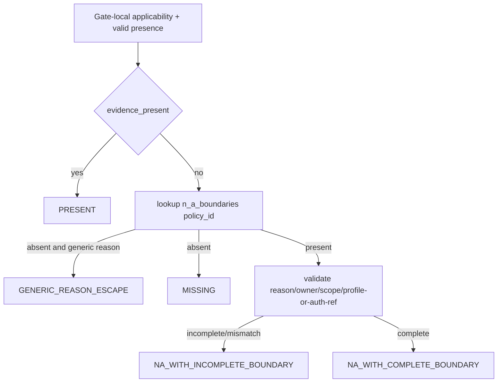

# LLD: CR170-S01 — 21-unit N/A policy inventory 与五态合同

## 修订记录

| 版本 | 日期 | 修订人 | 变更要点 |
|---|---|---|---|
| 1.0 | 2026-07-15 | host-orchestrator inline meta-dev | 初始 full LLD：21-unit exact inventory、15/5/1、five-state、caller/boundary 与 deterministic reason contract。 |

## 0. 上游工程依据

| 来源 | 路径 / ID | 被本 LLD 消费的内容 |
|---|---|---|
| HLD | `process/archive/design-cr-docs/HLD-CANONICAL-RELIABILITY-NA-SEMANTICS-ADMISSION.md` §5-7/11/16 | five-state、21-unit、15/5/1、caller 与回退。 |
| ADR | `process/archive/design-cr-docs/ARCHITECTURE-DECISION-CANONICAL-RELIABILITY-NA-SEMANTICS-ADMISSION.md` | table-driven internal policy；不改 global bool helper。 |
| Feature Matrix | `docs/design/FEATURE-DESIGN-MATRIX.md#cr170-cp4-增量canonical-reliability-na-semantics-and-admission-hardening` | FEAT-15 required-increment、full-lld、S01 owner。 |
| Feature DESIGN | `docs/features/cross-strategy-reliability-gates/DESIGN.md` v0.2 | private contract、caller boundary、失败/回滚。 |

## 1. Goal

创建 `engine/reliability_na_policy.py`，以 immutable internal typed objects 表达 21 个 policy unit、五态判定和 deterministic claim reason；该模块纯函数、无 IO、无 public export，不替代 Gate 既有 value/shape/identity 校验。

## 2. 需求（Functional / Non-Functional）

### 2.1 Functional

- exact inventory=`21/21`，Gate 分布=`6/6/1/5/3`。
- 每项都记录 evidence/reason keys、applicability key、owner、baseline path type、direction 与 complete-N/A disposition。
- classifier 输入 caller 计算的 `evidence_present/applicable/release_profile` 与显式 boundary，输出 five-state；通用 reason 永远不成为 `PRESENT`。
- `G1-P06` 的 complete N/A disposition 固定 `prohibited`。

### 2.2 Non-Functional

- module IO、global mutable state、credential/auth-system read、boundary synthesis=`0`。
- 同一 normalized input 的 decision/reason/claim ordering `10` 次 distinct result=`1`。
- public schema/signature/export break=`0`。

## 3. 模块拆分与职责

| 模块 / 文件组 | 职责 | 说明 |
|---|---|---|
| `engine/reliability_na_policy.py` | enum/dataclass、exact inventory、boundary validation、five-state classifier、reason ID | private module；不加入 `engine.__init__`。 |
| `tests/research/test_reliability_na_policy.py` | inventory、classifier、caller、安全、确定性 unit tests | 不调用真实 Gate，不做 IO。 |
| Gate consumer（下游 S02） | 先做现有 presence/value 判断，再传 `evidence_present` 给 classifier | S01 不生成 Gate status。 |

## 4. 代码结构与文件影响范围

| 动作 | 文件路径 | 变更内容 |
|---|---|---|
| 创建 | `engine/reliability_na_policy.py` | private policy/decision objects、21-unit tuple、pure classifier。 |
| 创建 | `tests/research/test_reliability_na_policy.py` | 21/21、5/5、15/5/1、caller/boundary、determinism tests。 |
| 禁止修改 | `engine/cross_strategy_reliability_gates.py` | 由 S02/S03 串行拥有。 |
| 禁止修改 | `engine/economic_cost_gate4_projection.py`、`engine/capacity_liquidity_gate4_projection.py` | adapter 只在 S04 回归。 |

## 5. 数据模型与持久化设计

```python
class NaEvidenceState(str, Enum):
    PRESENT = "PRESENT"
    MISSING = "MISSING"
    NA_WITH_COMPLETE_BOUNDARY = "NA_WITH_COMPLETE_BOUNDARY"
    NA_WITH_INCOMPLETE_BOUNDARY = "NA_WITH_INCOMPLETE_BOUNDARY"
    GENERIC_REASON_ESCAPE = "GENERIC_REASON_ESCAPE"

class HardeningDirection(str, Enum):
    STRICTER = "stricter"
    CONTROLLED_WIDENING = "controlled-widening"
    PRESERVE = "preserve"

class CompleteNaDisposition(str, Enum):
    REVIEWABLE = "reviewable"
    PROHIBITED = "prohibited"

@dataclass(frozen=True)
class NaPolicySpec:
    policy_id: str
    gate_id: str
    evidence_keys: tuple[str, ...]
    reason_keys: tuple[str, ...]
    applicability_id: str
    owner: str
    baseline_path_type: str
    hardening_direction: HardeningDirection
    complete_na_disposition: CompleteNaDisposition

@dataclass(frozen=True)
class NaBoundary:
    reason: str
    owner: str
    scope: str
    release_profile: str | None
    authorization_ref: str | None

@dataclass(frozen=True)
class NaEvidenceDecision:
    policy_id: str
    state: NaEvidenceState
    applicable: bool
    reason_id: str
    boundary_complete: bool
```

无持久化、migration、registry 或外部 schema。

### 5.1 Exact inventory

| ID | Gate | family | baseline path type | direction | disposition |
|---|---|---|---|---|---|
| G1-P01 | G1 | multiple-testing | existing-reason-escape | stricter | reviewable |
| G1-P02 | G1 | FDR/BH | existing-reason-escape | stricter | reviewable |
| G1-P03 | G1 | WRC/SPA | missing-blocked-no-na | controlled-widening | reviewable |
| G1-P04 | G1 | PBO/CSCV | missing-blocked-no-na | controlled-widening | reviewable |
| G1-P05 | G1 | DSR/Sharpe/IC | missing-blocked-no-na | controlled-widening | reviewable |
| G1-P06 | G1 | trial-count/provenance | fixed-blocked-validation | preserve | prohibited |
| G2-P01 | G2 | split | existing-reason-escape | stricter | reviewable |
| G2-P02 | G2 | walk-forward | existing-reason-escape | stricter | reviewable |
| G2-P03 | G2 | OOS | existing-reason-escape | stricter | reviewable |
| G2-P04 | G2 | purge | existing-reason-escape | stricter | reviewable |
| G2-P05 | G2 | embargo | missing-blocked-no-na | controlled-widening | reviewable |
| G2-P06 | G2 | event-safe-gap | missing-blocked-no-na | controlled-widening | reviewable |
| G3-P01 | G3 | PIT/survivorship-free | existing-reason-escape | stricter | reviewable |
| G4-P01 | G4 | impact-family/ref | existing-structured-na-pass | stricter | reviewable |
| G4-P02 | G4 | ADV participation | existing-reason-escape | stricter | reviewable |
| G4-P03 | G4 | capacity dollars | existing-reason-escape | stricter | reviewable |
| G4-P04 | G4 | liquidity sizing | existing-reason-escape | stricter | reviewable |
| G4-P05 | G4 | cost underestimation | existing-reason-escape | stricter | reviewable |
| G5-P01 | G5 | regime | structured-na-status-not-propagated | stricter | reviewable |
| G5-P02 | G5 | attribution | structured-na-status-not-propagated | stricter | reviewable |
| G5-P03 | G5 | reconciliation | structured-na-status-not-propagated | stricter | reviewable |

## 6. API / Interface 设计

```python
NA_POLICY_SPECS: tuple[NaPolicySpec, ...]
NA_POLICY_BY_ID: Mapping[str, NaPolicySpec]

def classify_na_evidence(
    *,
    policy: NaPolicySpec,
    evidence_present: bool,
    applicable: bool,
    evidence: Mapping[str, Any],
    release_profile: str,
) -> NaEvidenceDecision: ...

def build_na_reason_id(policy: NaPolicySpec, category: str) -> str: ...
```

调用方向：S02 Gate-local presence/value logic → `classify_na_evidence` → typed decision → S02 status/claim consumer。该模块不反向调用 Gate、resolver、runner 或 adapter。

## 7. 核心处理流程



precedence 固定：valid present > policy-specific boundary > generic reason > missing。invalid evidence 不得传 `evidence_present=true`，而是由 Gate 既有校验阻断。

## 8. 技术细节

- reason category 只允许 `missing/generic_reason_escape/boundary_incomplete/complete_na_requires_review/complete_na_not_permitted`。
- reason ID 格式：`<gate-lower>_<policy-lower-underscore>_<category>`，例如 `gate1_g1_p01_generic_reason_escape`。
- boundary complete：`reason/owner/scope` 三项非空、owner 精确匹配 policy owner、scope 精确包含 policy id；并且 `release_profile` 精确匹配当前 profile，或有非空 `authorization_ref`。
- 若提供 `authorization_ref`，只作 opaque string/scope 校验；禁止解析、网络读取或权限提升。
- conditional unit 不适用时仍返回 decision 并保留 inventory row；下游不得从分母删除。

## 9. 安全与性能设计

| 维度 | 设计措施 | 验证方式 |
|---|---|---|
| fail-safe | generic/incomplete/missing 不成为 PRESENT；G1-P06 complete N/A prohibited | exhaustive state tests |
| 权限 | 不读 secrets/auth system；auth ref 只作 opaque pointer | forbidden monkeypatch/IO assertions |
| 确定性 | tuple inventory、固定 category 与 ordering | 10 runs → 1 serialized result |
| 性能 | O(1) policy lookup，O(k) boundary fields；无 IO | unit benchmark 不设硬时延门，断言无外部调用 |

## 10. 测试设计

| 测试场景 | 前置条件 | 操作 | 预期结果 | 验证方式 |
|---|---|---|---|---|
| inventory exactness | load constants | count/group/unique | 21、6/6/1/5/3、duplicate=0 | pytest |
| direction/disposition | same | group | 15/5/1；20 reviewable/1 prohibited | pytest |
| five states | parameterized inputs | classify | 5/5 exact | pytest |
| complete boundary | 4/4 valid fields | classify | COMPLETE；no PASS semantics | pytest |
| incomplete/generic | remove each field / generic reason | classify | INCOMPLETE/GENERIC | pytest |
| caller/auth boundary | opaque ref and mismatches | classify | no synthesis/read/elevation | monkeypatch forbidden calls |
| deterministic output | same mapping order variants | run 10 | one ordered result | pytest |

## 11. 实施步骤

| TASK-ID | 动作 | 目标文件 | 详细描述 | 对应测试 |
|---|---|---|---|---|
| CR170-S01-T01 | 创建 | `engine/reliability_na_policy.py` | 定义 enums/dataclasses/reason categories。 | type/value tests |
| CR170-S01-T02 | 创建 | 同上 | 填写 exact 21-unit tuple/index 与 classifier。 | inventory/state tests |
| CR170-S01-T03 | 创建 | `tests/research/test_reliability_na_policy.py` | 添加 exactness/boundary/caller/determinism tests。 | all S01 tests |

## 12. 风险、难点与预研建议

### 12.1 实现灰区与取舍记录

| Clarification ID | 问题 | 选项与推荐 | 决策 / 答案 | 影响面 | 证据 | 重访条件 |
|---|---|---|---|---|---|---|
| LCQ-CR170-S01-01 | 谁写 boundary/auth ref？ | 推荐仅 fixture/test caller | 已由 CP3 冻结，无开放问题 | 安全/接口 | HLD §5.2、CP3 approval | future real caller CR |

| 风险 / 难点 | 影响 | 缓解措施 / 预研建议 |
|---|---|---|
| inventory 与 Gate 事实漂移 | 漏修或误放宽 | exact IDs+counts tests；S02 不维护第二份表。 |
| boundary 被误当授权 | 权限越界 | opaque-only、不解析、不提升；真实授权另立 CR。 |

### OPEN / Spike 跟踪

无。

## 13. 回滚与发布策略

- 发布方式：repository-local private module，随 CR-170 一起交付，不单独发布。
- 回滚触发：数量不是 21/21、方向不是 15/5/1、public export 增加、classifier 合成 boundary/auth ref。
- 回滚动作：删除新 private module/tests；由于 S01 不改 canonical/public API，回滚不影响历史 Gate 行为。

## 14. DoD（Definition of Done）

- [ ] 14 个章节完整，open items=`0`。
- [ ] exact inventory `21/21`、five-state `5/5`、direction `15/5/1`。
- [ ] caller/boundary contract 与 deterministic reason ID 可直接编码。
- [ ] 文件/接口/测试/TASK-ID 一一对应。
- [x] `confirmed=true`；CP5 已于 2026-07-15 由用户批准，允许按文件边界实施。

## 人工确认区

CP5 批量门禁已于 2026-07-15 由用户统一批准；只解锁 repository-local 实现，不授权真实数据、Stage3、runtime 或远端写入。
