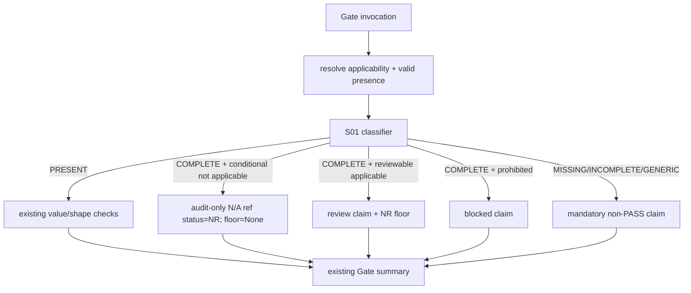

# LLD: CR170-S02 — Gate 1-5 mandatory N/A consumer 硬化

## 修订记录

| 版本 | 日期 | 修订人 | 变更要点 |
|---|---|---|---|
| 1.0 | 2026-07-15 | host-orchestrator inline meta-dev | 初始 full LLD：Gate-local consumer、status floor、15/5/1 双向回归与 Gate1 三层断言。 |
| 1.1 | 2026-07-15 | host-orchestrator inline meta-dev | CP5 评审补强：区分 applicable mandatory review ref 与 conditional not-applicable audit-only ref，冻结 ArtifactRef status 及不抬升 Gate floor 的边界。 |

## 0. 上游工程依据

| 来源 | 路径 / ID | 消费内容 |
|---|---|---|
| HLD | `process/archive/design-cr-docs/HLD-CANONICAL-RELIABILITY-NA-SEMANTICS-ADMISSION.md` §6-11 | 21 units、消费流程、Gate1 三层、non-PASS。 |
| ADR | `process/archive/design-cr-docs/ARCHITECTURE-DECISION-CANONICAL-RELIABILITY-NA-SEMANTICS-ADMISSION.md` | Gate 局部消费，不改 global bool helper。 |
| S01 LLD | `process/stories/STORY-CR170-S01-na-policy-inventory-five-state-contract-LLD.md` | classifier API、exact inventory、reason IDs。 |
| Feature TEST | `docs/features/cross-strategy-reliability-gates/TEST-PLAN.md` v0.2 | directional regression 与 caller boundary tests。 |

## 1. Goal

修改 canonical Gate 1-5，使 21 个 mandatory unit 消费 S01 typed decision：收紧 15 个 reason escape、受控放宽 5 个完整 N/A 到可审计 `NEEDS_REVIEW`、保持 G1-P06 固定阻断；public callable、Gate ID、result schema 不变。

## 2. 需求（Functional / Non-Functional）

### 2.1 Functional

- Gate1-5 覆盖 `5/5`；applicability 仍由对应 Gate 既有 profile/claim/window 逻辑决定。
- decision=`PRESENT` 后继续运行既有 shape/value/identity 校验，N/A 不覆盖 invalid evidence。
- reviewable complete N/A 生成稳定 review claim 与 `status_floor=NEEDS_REVIEW`；G1-P06 生成 blocked claim。
- MISSING/INCOMPLETE/GENERIC 对 applicable mandatory unit 生成 non-PASS claim。

### 2.2 Non-Functional

- public signature/schema/Gate IDs changes=`0`；global `_has_na_reason` semantics changes=`0`。
- adapter/aggregate/runner changes=`0`。
- claim order 按 S01 inventory 顺序稳定；同 input 10 次结果一致。

## 3. 模块拆分与职责

| 模块 / 文件组 | 职责 | 说明 |
|---|---|---|
| `engine/cross_strategy_reliability_gates.py` Gate-local integration | 计算 applicability/presence，调用 classifier，合并 claim/status floor | 不重新定义 inventory。 |
| `_consume_na_decision` private helper | 把 decision 转为 blocked/review claim 与 floor | helper 不成为 public API；不作 policy 决策。 |
| existing value validators | PRESENT 后继续数值/shape/identity 校验 | 不被 N/A 短路。 |
| existing Gate tests | 参数化 15/5/1、Gate1 3/3、Gate2-5 non-PASS | 不只断言最终 status。 |

## 4. 代码结构与文件影响范围

| 动作 | 文件路径 | 变更内容 |
|---|---|---|
| 修改 | `engine/cross_strategy_reliability_gates.py` | import S01 private contract；Gate1-5 局部 consumer 与 status floor。 |
| 修改 | `tests/research/test_cross_strategy_reliability_gates.py` | 21-unit directional regression、Gate1 masked escape 3-layer tests。 |
| 禁止修改 | `engine/economic_cost_gate4_projection.py`、`engine/capacity_liquidity_gate4_projection.py` | adapters 由 S04 回归，生产 diff=0。 |
| 禁止修改 | `engine/strategy_admission_package.py` | aggregate/CR155 不进入本 Story。 |

## 5. 数据模型与持久化设计

S02 不新增 public model。private consumption result：

```python
@dataclass(frozen=True)
class _NaConsumption:
    blocked_claims: tuple[BlockedClaim, ...]
    review_claims: tuple[BlockedClaim, ...]
    status_relevant_refs: tuple[ArtifactRef, ...]
    audit_only_refs: tuple[ArtifactRef, ...]
    status_floor: ReliabilityGateStatus | None
```

`review_claims` 仍复用现有 `BlockedClaim` schema 作为审计 claim。两类完整 N/A 必须分离：

- applicable mandatory unit：产生 `status_relevant_refs`，其 `ArtifactRef.status=NEEDS_REVIEW`，并设置 `status_floor=NEEDS_REVIEW`；
- conditional unit 明确 not-applicable：产生 `audit_only_refs`，其 `ArtifactRef.status=NEEDS_REVIEW` 只表达“该 N/A 需要保留审计边界”，但 `status_floor=None`、mandatory claim=`0`，该 ref 单独存在不得抬升 Gate summary。

Gate-local 构造不得把 `audit_only_refs` 重新送入会按 ArtifactRef status 计算 worst-state 的 `evaluate_shared_contract`；必须先由现有 Gate 逻辑和 `status_floor` 决定 status，再把 audit-only ref 附加到返回的 `ReliabilityGateSummary.artifact_refs`。这条隔离规则避免把 conditional not-applicable 审计标记误读为 Gate 级 `NEEDS_REVIEW`。无持久化/schema migration。

## 6. API / Interface 设计

公开接口全部保持当前签名；新增 private helper：

```python
def _consume_na_decision(
    decision: NaEvidenceDecision,
    *,
    policy: NaPolicySpec,
) -> _NaConsumption: ...

def _apply_status_floor(
    current: ReliabilityGateStatus,
    floor: ReliabilityGateStatus | None,
) -> ReliabilityGateStatus: ...
```

调用时机：每个 Gate 在既有 ref/value 检查前完成 applicability/presence，再对非 PRESENT decision 消费；PRESENT 继续原逻辑。后续衔接仍返回 `ReliabilityGateSummary` 给 `build_shared_gate_summary` / `resolve_admission_policy`。

## 7. 核心处理流程



失败路径：unknown policy 为开发期 invariant error；unknown profile/strategy 沿用现有 fail-closed；boundary mismatch 不降级为 generic success。

conditional not-applicable 的完整边界必须同时满足：`decision=NA_WITH_COMPLETE_BOUNDARY`、policy applicability=`false`、`complete_na_disposition=reviewable`。缺少任一条件时不得进入 audit-only 路径；MISSING/INCOMPLETE/GENERIC 仍按对应 unit 的 fail-closed 规则处理。

## 8. 技术细节

### 8.1 Directional behavior

| direction | baseline | CR-170 result | 回滚触发 |
|---|---|---|---|
| stricter 15 | missing+reason/structured N/A 可 PASS 或漏 claim | applicable 时至少 NR/BLOCKED | 任一产生 PASS |
| controlled-widening 5 | applicable missing 固定 BLOCKED | only complete boundary 可 NR；T1/T2 后续 BLOCKED | generic/incomplete 获 NR 或 Gate PASS |
| preserve G1-P06 | fixed value/provenance BLOCKED | 仍 BLOCKED | complete N/A 替代 trial counts |

### 8.2 Gate-specific integration

- Gate1：G1-P01/P02 需要 field decision + exact mandatory claim；即使 `effective_trial_count_unavailable` 已阻断，前两层仍必须可观测。G1-P03/04/05 只对完整 boundary 做 NR；G1-P06 禁止。
- Gate2：split/WF/OOS/purge 的 existing reason escape 改走 classifier；embargo/event-gap 只有 overlap applicable 且 complete boundary 才 NR。
- Gate3：generic `na_reason` 不替代 PIT/survivorship-free owner-specific boundary。
- Gate4：七个既有字段消费中的五个 policy family 统一判定；不删除 CR168/169 local guards。
- Gate5：slot N/A ArtifactRef 的 NR 状态必须进入 Gate status floor，不能 refs=NR、Gate=PASS。
- conditional not-applicable：audit-only `ArtifactRef.status=NEEDS_REVIEW` 只保留 reason/owner/scope/authorization 审计信息；`status_floor=None` 且 Gate summary status 与既有非该 unit 的判定一致。它与 Gate5 applicable mandatory slot 的 status floor 语义不得混用。

### 8.3 `_has_na_reason`

函数继续用于未纳入 21-unit 的 legacy/辅助场景；其实现与签名不变。21-unit 路径不以其 bool 返回作为 mandatory evidence 充分条件。

## 9. 安全与性能设计

| 维度 | 设计措施 | 验证方式 |
|---|---|---|
| false PASS | status floor + mandatory claim；generic/incomplete non-PASS | per-policy negative tests |
| controlled widening | only 4/4 boundary；G1-P06 prohibited | 5/5 + 1/1 tests |
| compatibility | public callable/result unchanged；adapter source forbidden | signature/source guards |
| 性能 | 每个 Gate 最多按相关 policy tuple 线性扫描（最大 6）；无 IO | unit tests + call-count assertions |

## 10. 测试设计

| 测试场景 | 前置条件 | 操作 | 预期结果 | 验证方式 |
|---|---|---|---|---|
| Gate1 masked MT/FDR | refs missing + generic reason + trial count unavailable | validate Gate1 | decisions GENERIC 2/2、claims 2/2、final non-PASS | 三层独立断言 |
| stricter group | 15 policy baseline escape inputs | validate respective Gate | PASS=0；stable reason IDs | parameterized pytest |
| widening group | 5 complete boundaries | validate | Gate NR；not PASS | parameterized pytest |
| widening invalid | same with one boundary field missing | validate | blocked/non-PASS | field removal matrix |
| conditional not-applicable complete N/A | conditional unit applicability=false + complete 4/4 boundary | validate | exactly 1 audit-only ref (`status=NEEDS_REVIEW`)；mandatory claim=0；status_floor=None；Gate status 不因该 ref 单独变化 | parameterized pytest |
| conditional not-applicable incomplete/generic | same but boundary incomplete or generic reason only | validate | 不进入 audit-only success path；non-PASS/原 Gate fail-closed 行为 | negative pytest |
| G1-P06 | complete boundary but count/provenance missing | validate | BLOCKED + not-permitted | pytest |
| Gate5 propagation | slot ArtifactRef NR | validate Gate5 | Gate NR, not PASS | pytest |
| public compatibility | inspect callable/Gate IDs/results | compare baseline | 100% compatible | signature tests |

## 11. 实施步骤

| TASK-ID | 动作 | 目标文件 | 详细描述 | 对应测试 |
|---|---|---|---|---|
| CR170-S02-T01 | 修改 | `engine/cross_strategy_reliability_gates.py` | 添加 private consumption/status-floor helpers 与 Gate1-5 calls。 | state/consumer tests |
| CR170-S02-T02 | 修改 | `tests/research/test_cross_strategy_reliability_gates.py` | 添加 exact 15/5/1 参数化与 Gate1 3-layer tests。 | all directional tests |
| CR170-S02-T03 | 修改 | 同上 | 添加 public/helper/adapter forbidden-source regression。 | compatibility tests |

## 12. 风险、难点与预研建议

### 12.1 实现灰区与取舍记录

| Clarification ID | 问题 | 选项与推荐 | 决策 / 答案 | 影响面 | 证据 | 重访条件 |
|---|---|---|---|---|---|---|
| LCQ-CR170-S02-01 | Gate-level complete N/A 是否可 PASS？ | 推荐只到 NR | CP3 已批准；无开放项 | 安全/测试 | ADR/CP3 | 独立 CR |

| 风险 / 难点 | 影响 | 缓解措施 / 预研建议 |
|---|---|---|
| 双向 blast radius | 历史 PASS 收紧、部分 BLOCKED 放宽 | 三组独立回归，不用单一“全部更严”断言。 |
| status 与 claim 脱节 | Gate5 可再现 false PASS | `_NaConsumption.status_floor` 与 claim 同源。 |

### OPEN / Spike 跟踪

无。

## 13. 回滚与发布策略

- 发布方式：与 S01/S03 同一 CR 交付，repository-local。
- 回滚触发：任一 generic/incomplete PASS、widening 穿透 T1/T2、G1-P06 放宽、public/adapter diff。
- 回滚动作：按 policy group 回退 Gate-local consumer 到历史 blocked 行为；不得回退为历史虚假 PASS。若 public compatibility 受损，停止并路由 `NEEDS_DESIGN_CLARIFICATION`。

## 14. DoD（Definition of Done）

- [ ] Gate1-5=`5/5`、policy=`21/21`、direction=`15/5/1`。
- [ ] conditional not-applicable complete N/A audit-only contract=`1/1`：ref status=NR、claim=0、floor=None、Gate status elevation=0。
- [ ] Gate1 masked escape 三层=`3/3`；escape PASS=`0`。
- [ ] public/global-helper/adapter/aggregate changes 满足 `0` 约束。
- [ ] 文件、接口、测试和 TASK-ID 完整映射；open items=`0`。
- [x] `confirmed=true`；CP5 已于 2026-07-15 由用户批准，允许按文件边界实施。

## 人工确认区

已由 `CP5-CR170-ALL-STORIES-LLD-BATCH` 于 2026-07-15 统一批准。
