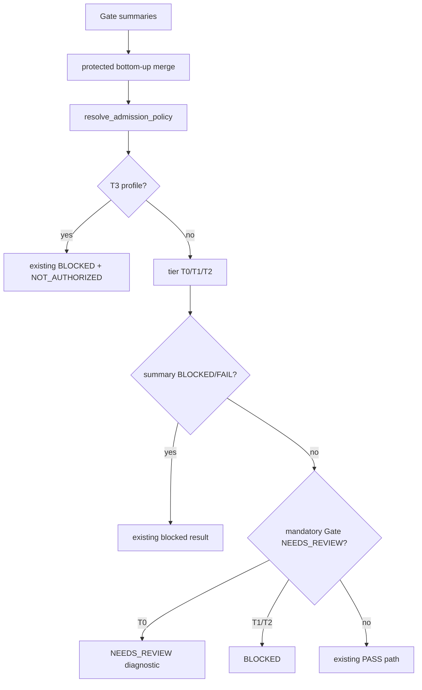

# LLD: CR170-S03 — Gate 6 protected merge 与 admission tier 硬化

## 修订记录

| 版本 | 日期 | 修订人 | 变更要点 |
|---|---|---|---|
| 1.0 | 2026-07-15 | host-orchestrator inline meta-dev | 初始 full LLD：受保护 merge、resolver T0/T1/T2 最小硬化、T3 zero-diff 与 source-rule 契约。 |
| 1.1 | 2026-07-15 | host-orchestrator inline meta-dev | CP5 评审补强：把 mandatory 精确到 applicable policy unit；resolver 只消费 S02 已形成的 Gate summary status，不把 Gate ID 本身解释为全局 mandatory。 |

## 0. 上游工程依据

| 来源 | 路径 / ID | 消费内容 |
|---|---|---|
| HLD | `process/archive/design-cr-docs/HLD-CANONICAL-RELIABILITY-NA-SEMANTICS-ADMISSION.md` §8/10/11 | merge 不变量、tier 表、T3 early-return。 |
| ADR | `process/archive/design-cr-docs/ARCHITECTURE-DECISION-CANONICAL-RELIABILITY-NA-SEMANTICS-ADMISSION.md` ADR-003 | merge 与 admission resolver 分工。 |
| S01/S02 LLD | `process/stories/STORY-CR170-S01-*-LLD.md`、`STORY-CR170-S02-*-LLD.md` | five-state 与 Gate status/claims。 |
| canonical source | `engine/cross_strategy_reliability_gates.py` | `build_shared_gate_summary`、`evaluate_shared_contract`、`resolve_admission_policy`、`_tier_and_mode`。 |

## 1. Goal

用测试锁定现有 bottom-up merge 的 `BLOCKED > FAIL > NEEDS_REVIEW > PASS` 传播并保持 production diff=0；随后只在 `resolve_admission_policy` 中补充 T0/T1/T2 mandatory Gate `NEEDS_REVIEW` 的非 PASS 处理，T3 early-return 不改。

## 2. 需求（Functional / Non-Functional）

### 2.1 Functional

- five Gate summaries 任一 `NEEDS_REVIEW` 时 protected merge 结果=`NEEDS_REVIEW`。
- T0/OPT_IN：admission result=`NEEDS_REVIEW`，wording 只允许诊断，不得包含 PASS/readiness。
- T1/DEFAULT_REQUIRED、T2/RELEASE_BLOCKING：mandatory NR → `BLOCKED`。
- T3：保持现有 `status=BLOCKED + gate_mode=NOT_AUTHORIZED` early-return。

### 2.2 Non-Functional

- merge code diff=`0`（baseline regression PASS 时）；T3 branch diff=`0`。
- new public enum/status/signature/schema=`0`。
- resolver 不改写 input summary、不调用 runner/aggregate/real data。

## 3. 模块拆分与职责

| 模块 / 文件组 | 职责 | 说明 |
|---|---|---|
| `build_shared_gate_summary` / `evaluate_shared_contract` | bottom-up worst-state | protected surface；测试先行，默认不改。 |
| `resolve_admission_policy` | profile tier/mode 与 admission result | CR-170 只补 T0/T1/T2 NR case。 |
| `_tier_and_mode` | existing profile→T0/T1/T2 mapping | 不改映射；unknown 沿用 fail-closed。 |
| `tests/research/test_reliability_admission_policy.py` | merge、tier、T3、wording/source-rule regression | 使用 public objects/callables，不复制 private merge。 |

## 4. 代码结构与文件影响范围

| 动作 | 文件路径 | 变更内容 |
|---|---|---|
| 修改 | `engine/cross_strategy_reliability_gates.py` | 仅 `resolve_admission_policy` 的 T0/T1/T2 mandatory NR 分支与稳定 source rules。 |
| 创建 | `tests/research/test_reliability_admission_policy.py` | protected merge 1/1、T0-T3 4/4、T3/unknown/public regression。 |
| 禁止修改 | 同文件的 `build_shared_gate_summary`、`evaluate_shared_contract`、T3 early-return | 回归通过时必须 zero diff。 |
| 禁止修改 | adapters、`strategy_admission_package.py`、mature runner/framework | scope boundary。 |

## 5. 数据模型与持久化设计

不新增数据模型。复用：

- `ReliabilityGateSummary.status` 表达 Gate/merge status；
- `AdmissionPolicyResult.status/gate_mode/source_rule/user_facing_wording` 表达 admission；
- `AdmissionGateMode.OPT_IN/DEFAULT_REQUIRED/RELEASE_BLOCKING/NOT_AUTHORIZED`；
- `ReliabilityGateStatus.NEEDS_REVIEW/BLOCKED`。

无持久化、migration 或 schema 变化。

## 6. API / Interface 设计

公开 `resolve_admission_policy(...) -> AdmissionPolicyResult` 签名保持不变。内部规则顺序冻结：

1. existing T3 profile early-return；
2. existing `_tier_and_mode`；
3. existing BLOCKED/FAIL checks；
4. 新增“存在 mandatory Gate `NEEDS_REVIEW`”分支：T0→NR，T1/T2→BLOCKED；
5. 只有以上均不命中才保持现有 PASS 路径。

新增 source rule IDs：

- `cr170-t0-mandatory-needs-review`
- `cr170-t1-mandatory-needs-review-blocked`
- `cr170-t2-mandatory-needs-review-blocked`

T3 source rule 保持现有值，不改名。

## 7. 核心处理流程

test double 仅在模拟异常 merge 返回时注入返回值，不复制/依赖 private merge 实现。

## 8. 技术细节

### 8.1 Mandatory NEEDS_REVIEW detection

resolver 消费现有 Gate summary 集合中 Gate1-5 的 status；它检测的是 `ReliabilityGateSummary.status == NEEDS_REVIEW`，不得把 Gate ID 本身解释为“Gate 级全部 unit 均 mandatory”，也不得通过 artifact reason 文本自行重算 evidence。`NEEDS_REVIEW` floor 由 S02 仅针对 **applicable mandatory policy unit** 设置；conditional unit 的 complete not-applicable audit-only ref 不设置 floor，因而不会仅凭 ref status 抬升 Gate summary。resolver 保持 ordered Gate ID 列表，source wording 包含 exact unresolved Gate IDs。

### 8.2 Tier truth table

| Tier | mode | mandatory NR | status | release/paper claim |
|---|---|---|---|---|
| T0 | OPT_IN | yes | NEEDS_REVIEW | false |
| T1 | DEFAULT_REQUIRED | yes | BLOCKED | false |
| T2 | RELEASE_BLOCKING | yes | BLOCKED | false |
| T3 | NOT_AUTHORIZED | any | existing BLOCKED | false |

### 8.3 Protected surfaces

- 若 merge 1/1 回归通过，任何生产 diff 都是设计偏离，必须删除。
- T3 分支位置在通用 tier 之前，当前行为已正确；只允许测试，不允许“统一代码路径”重构。
- 不新增 `NOT_AUTHORIZED` status enum；通过现有 mode 表达。

## 9. 安全与性能设计

| 维度 | 设计措施 | 验证方式 |
|---|---|---|
| admission false PASS | NR detection 先于 PASS | T0-T2 tests + source rules |
| compatibility | protected merge/T3 zero diff；public types unchanged | source diff guard/signature tests |
| authorization | T3 stays not-authorized；no runner/data calls | operation/call guards |
| 性能 | O(number of gates)，无 IO/重试/global mutation | deterministic unit tests |

## 10. 测试设计

| 测试场景 | 前置条件 | 操作 | 预期结果 | 验证方式 |
|---|---|---|---|---|
| protected merge | 1 Gate NR + 4 PASS | build summary | NR；production merge diff=0 | public regression + source diff |
| T0 | merged/individual mandatory NR | resolve exploratory | NR、OPT_IN、no PASS wording | pytest |
| T1 | same | resolve candidate | BLOCKED、DEFAULT_REQUIRED | pytest |
| T2 | same | resolve release | BLOCKED、RELEASE_BLOCKING | pytest |
| T3 | any summaries | resolve runtime profile | existing BLOCKED+NOT_AUTHORIZED；diff=0 | baseline/after comparison |
| unknown profile | unknown input | resolve | existing fail-closed | regression |
| unexpected merge PASS double | injected result only | resolve | policy does not fabricate evidence; test documents boundary | double contract test |

## 11. 实施步骤

| TASK-ID | 动作 | 目标文件 | 详细描述 | 对应测试 |
|---|---|---|---|---|
| CR170-S03-T01 | 创建 | `tests/research/test_reliability_admission_policy.py` | 先写 merge、T0-T3、unknown、wording baselines。 | all S03 tests |
| CR170-S03-T02 | 修改 | `engine/cross_strategy_reliability_gates.py` | 在 resolver PASS 前新增 T0/T1/T2 NR branch。 | tier tests |
| CR170-S03-T03 | 修改 | S03 tests | 增加 protected range/T3 zero-diff 与 public guards。 | compatibility tests |

## 12. 风险、难点与预研建议

### 12.1 实现灰区与取舍记录

| Clarification ID | 问题 | 选项与推荐 | 决策 / 答案 | 影响面 | 证据 | 重访条件 |
|---|---|---|---|---|---|---|
| LCQ-CR170-S03-01 | merge 是否需要重写？ | 推荐先回归，PASS 则零改动 | CP3 已批准 | shared module | HLD §8.1 | 只有回归失败+design delta |
| LCQ-CR170-S03-02 | T3 如何表达？ | existing BLOCKED+NOT_AUTHORIZED | CP3 已批准 | public schema | ADR-003 | runtime authorization CR |

| 风险 / 难点 | 影响 | 缓解措施 / 预研建议 |
|---|---|---|
| 同文件 owner 冲突 | S02/S03 diff 交叉 | 四 Wave 串行；S03 只在 S02 merge 后开始。 |
| wording 泄漏 readiness | T0 NR 被误读 PASS | explicit no-PASS wording/assertions。 |

### OPEN / Spike 跟踪

无。

## 13. 回滚与发布策略

- 发布方式：随 CR-170 repository-local hardening 交付。
- 回滚触发：protected merge/T3 出现生产 diff，或 T0/T1/T2 任一 mandatory NR 变 PASS。
- 回滚动作：删除 resolver 新分支会恢复旧行为，但因旧行为存在安全漏洞，正式回滚必须同时将 admission 路径整体标记 BLOCKED；不得恢复并发布 false PASS。设计失败时路由 CP3 clarification。

## 14. DoD（Definition of Done）

- [ ] protected merge `1/1` 且 production diff=`0`。
- [ ] T0-T3=`4/4`、mandatory NR admission PASS=`0`。
- [ ] T3 1/1、production diff=`0`；public break=`0`。
- [ ] S02 file merge 顺序明确；测试/接口/TASK-ID 完整；open items=`0`。
- [x] `confirmed=true`；CP5 已于 2026-07-15 由用户批准，允许按文件边界实施。

## 人工确认区

已由 `CP5-CR170-ALL-STORIES-LLD-BATCH` 于 2026-07-15 统一批准。
