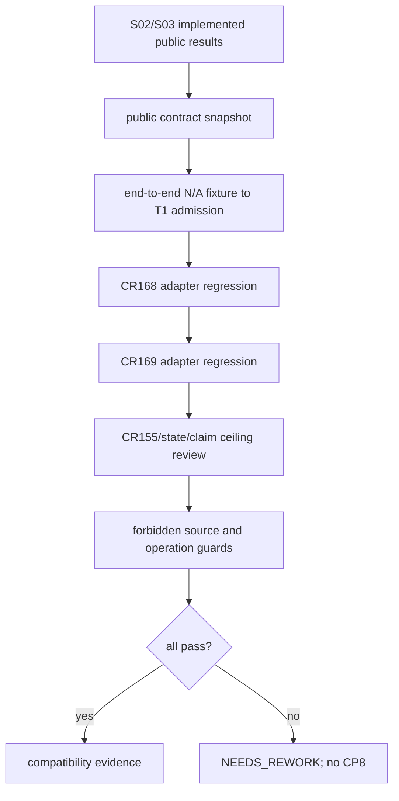

# LLD: CR170-S04 — Canonical compatibility、adapter 与 claim ceiling 回归

## 修订记录

| 版本 | 日期 | 修订人 | 变更要点 |
|---|---|---|---|
| 1.0 | 2026-07-15 | host-orchestrator inline meta-dev | 初始 full LLD：public contract、CR168/169 adapter、CR155、runner/aggregate/authorization claim 回归。 |
| 1.1 | 2026-07-15 | host-orchestrator inline meta-dev | CP5 评审补强：新增 public-callable 端到端 fixture，贯通 n_a_boundaries→classifier→Gate NR→protected merge NR→T1 BLOCKED。 |
| 1.2 | 2026-07-15 | host-orchestrator inline | CP7 治理整改：将 CR 命名测试文件改为领域名 `test_canonical_reliability_regression.py` 并登记 provenance；只调整文件 taxonomy，不改变测试语义或 CP5 批准合同。 |

## 0. 上游工程依据

| 来源 | 路径 / ID | 消费内容 |
|---|---|---|
| HLD/ADR | CR-170 companion HLD §9-15、ADR-004 | public compatibility、adapters 保留、future verifier。 |
| S02/S03 LLD | `process/stories/STORY-CR170-S02-*-LLD.md`、`STORY-CR170-S03-*-LLD.md` | Gate/admission 可观察结果。 |
| CR168 adapter | `engine/economic_cost_gate4_projection.py` | C3-only C4-unavailable containment。 |
| CR169 adapter | `engine/capacity_liquidity_gate4_projection.py` | strict C3+C4 7-key containment。 |

## 1. Goal

创建单一 CR-170 回归文件，证明 public Gate/admission contract 保持兼容、CR168/169 adapter defense-in-depth 仍有效，并使 CR155/Stage3/aggregate/real-operation claim ceiling 的任何提升数为 `0`。

## 2. 需求（Functional / Non-Functional）

### 2.1 Functional

- public callables、Gate IDs、public enums/result fields compatibility=`100%`。
- CR168 C3-only unavailable path 与 CR169 strict 7-key path regression=`2/2`。
- adapters 生产修改/guard 删除=`0/0`。
- CR155 remains BLOCKED、`paper_candidate=false`；Stage3/aggregate/current runner integration=`0`。

### 2.2 Non-Functional

- 只使用 repository-local fixture/static values；external/credential/runtime calls=`0`。
- 独立 verifier lane 不在本 CR；测试作者是 Gate maintainer，CP8 风险披露必须保留。
- tests 不依赖 private classifier/dataclass 名称，只消费 public observable outcomes，除 S01 专属 unit tests 外。

## 3. 模块拆分与职责

| 模块 / 文件组 | 职责 | 说明 |
|---|---|---|
| `tests/research/test_canonical_reliability_regression.py` | public snapshot、adapter 2/2、claim/source guards | 唯一新写入文件。 |
| canonical Gate module | read-only SUT | S04 禁止修改。 |
| CR168/CR169 adapters | read-only SUT | defense-in-depth，不删除/简化。 |
| CR155 admission artifacts/current state | read-only claim evidence | 不改变 status。 |

## 4. 代码结构与文件影响范围

| 动作 | 文件路径 | 变更内容 |
|---|---|---|
| 创建 | `tests/research/test_canonical_reliability_regression.py` | public/adapter/claim/forbidden-operation regression。 |
| 只读 | `engine/cross_strategy_reliability_gates.py` | public SUT。 |
| 只读 | `engine/economic_cost_gate4_projection.py` | CR168 adapter SUT。 |
| 只读 | `engine/capacity_liquidity_gate4_projection.py` | CR169 adapter SUT。 |
| 禁止修改 | `engine/strategy_admission_package.py`、mature runner/framework | aggregate/runner=0。 |

## 5. 数据模型与持久化设计

无新增 production model/persistence。测试内可定义 immutable expected snapshot：

```python
EXPECTED_GATE_IDS = (...existing six ids...)
EXPECTED_PUBLIC_CALLABLES = (...Gate validators..., "resolve_admission_policy")
EXPECTED_CLAIM_CEILING = {
    "stage3_started": False,
    "stage3_entry_ready": False,
    "current_stage3_runner_integrated": False,
    "aggregate_orchestration_implemented": False,
    "cr155_promoted": False,
    "real_evidence_available": False,
    "runtime_ready": False,
}
```

snapshot 只存预期字段集合/布尔 claim，不复制实现源代码。

## 6. API / Interface 设计

S04 不新增生产 API。测试通过现有 public callables 构造最小 fixture：

- `validate_gate*_...(..., release_profile=..., operation_counts=...)`
- `build_shared_gate_summary(...)`
- `resolve_admission_policy(...)`
- CR168/169 adapter public compatibility functions。

adapter test double 仅按其公开 Protocol/callable 注入；不得 monkeypatch private `_has_na_reason` 或复制 canonical logic。

## 7. 核心处理流程



任何 adapter regression 失败不得通过删除 local guard 修复；应回到 S02/S03 或 design clarification。

## 8. 技术细节

### 8.1 Public compatibility

比较 callable 名称、inspect signature 的 parameter names/kinds/defaults、Gate ID string、enum values 与 result dataclass field names。允许新增 private helper，不允许破坏 public surface。

### 8.2 Adapter regressions

- CR168：C4 refs absent 且无 N/A reason 的安全路径仍 canonical BLOCKED；reason escape 在 local precheck 被拒；canonical call-count/postcondition 保留。
- CR169：exact 7-key present payload、13-field header/allowlist/denylist/postcondition 保留；canonical hardening 不要求删除任何 guard。

### 8.3 Claim/authorization guard

测试读取 repository-local machine state/summary JSON，不读取 archive/credential/external data。断言 CR155 promotion=0、paper_candidate=false、Stage3 runner/aggregate changes=0，以及真实数据、credential、runtime、broker/trading、publish、remote-write operation count=0。

### 8.4 End-to-end fixture contract

新增一个独立 fixture 场景，只调用 public Gate validator、`build_shared_gate_summary` 与 `resolve_admission_policy`：fixture evidence 携带完整 `n_a_boundaries`，S01 classifier 判为 complete applicable N/A，S02 对相应 mandatory unit 形成 Gate `NEEDS_REVIEW`，protected merge 保持 `NEEDS_REVIEW`，S03 resolver 在 T1 / `candidate-release` 返回 `BLOCKED`。测试不得直接调用 private classifier、构造 private `_NaConsumption` 或复制 merge 逻辑；它必须证明公共链路真实贯通。

## 9. 安全与性能设计

| 维度 | 设计措施 | 验证方式 |
|---|---|---|
| defense in depth | adapters 只回归，不删 guard | source hash/diff allowlist + behavior tests |
| overclaim | exact false claim ceiling | state/summary assertions |
| verifier honesty | future consumer 显式、当前 maintainer self-verification | CP7/CP8 risk assertion |
| 性能 | 全部 local fixture/static；无网络/IO loops | operation call guards |

## 10. 测试设计

| 测试场景 | 前置条件 | 操作 | 预期结果 | 验证方式 |
|---|---|---|---|---|
| public surface | import canonical | snapshot signatures/IDs/enums/fields | 100% match | inspect/assert |
| CR168 adapter | C3 present/C4 unavailable + escape variants | invoke public adapter | expected BLOCKED/REJECTED；guard intact | existing/new tests |
| CR169 adapter | strict joint fixture | invoke public adapter | bounded fixture result；no aggregate claim | existing/new tests |
| evidence→admission end-to-end | complete applicable `n_a_boundaries` fixture + 其余 Gate PASS summaries | 调 public Gate validator→`build_shared_gate_summary`→`resolve_admission_policy(candidate-release)` | local Gate NR、merged NR、T1 BLOCKED；admission PASS=0 | one public-callable integration fixture |
| CR155 | current package/state | inspect | BLOCKED、paper_candidate=false | static assertion |
| runner/aggregate | source diff inventory | scan scoped files | modifications=0 | git diff/path allowlist |
| forbidden operations | monkeypatch forbidden entry points | run suite | calls=0 | call counters |
| verifier disclosure | CR summary/checkpoint context | inspect | current independent verifier=false/FU006 future | doc/state guard |

## 11. 实施步骤

| TASK-ID | 动作 | 目标文件 | 详细描述 | 对应测试 |
|---|---|---|---|---|
| CR170-S04-T01 | 创建 | `tests/research/test_canonical_reliability_regression.py` | 添加 public surface 与 adapter 2/2 tests。 | public/adapters |
| CR170-S04-T02 | 创建 | 同上 | 添加 CR155/state/claim ceiling/operation guards。 | claim/auth tests |
| CR170-S04-T03 | 创建 | 同上 | 添加 evidence→classifier→Gate NR→merge NR→T1 BLOCKED 的 public-callable 端到端 fixture。 | end-to-end integration |
| CR170-S04-T04 | 执行 | 既有相关 test subset | 证明 no regression 并生成 CP7 evidence index。 | regression subset |

## 12. 风险、难点与预研建议

### 12.1 实现灰区与取舍记录

| Clarification ID | 问题 | 选项与推荐 | 决策 / 答案 | 影响面 | 证据 | 重访条件 |
|---|---|---|---|---|---|---|
| LCQ-CR170-S04-01 | 是否简化 adapters？ | 推荐保持 defense-in-depth | CP3 已批准，FU009 后置 | compatibility/security | ADR-004 | 四条件+新 ADR |
| LCQ-CR170-S04-02 | independent verifier 当前是否可声明？ | 否，future FU006 | CP2/CP3 已批准 | claim | UC-58/HLD | FU006 delivered |

| 风险 / 难点 | 影响 | 缓解措施 / 预研建议 |
|---|---|---|
| source snapshot 过度脆弱 | 私有重排误报 | 只 snapshot public signature/IDs/forbidden files，不锁私有实现文本。 |
| self-verification 独立性不足 | 审计风险 | CP8 明示 READY_WITH_RISK，不声称 independent verification。 |

### OPEN / Spike 跟踪

无。

## 13. 回滚与发布策略

- 发布方式：测试/证据随 CR-170，不新增 runtime artifact。
- 回滚触发：public break、adapter 任一回归失败、guard deletion、CR155/Stage3/aggregate claim 提升、外部调用非零。
- 回滚动作：拒绝 CP7/CP8并路由对应 S02/S03 rework；不得删除测试或 guard 使其变绿。S04 自身可删除而不影响生产，但 CR-170 不得在缺兼容证据时关闭。

## 14. DoD（Definition of Done）

- [ ] public compatibility=`100%`、break=`0`。
- [ ] adapter regression=`2/2`、production modifications/guard deletion=`0/0`。
- [ ] public-callable evidence→admission 端到端 fixture=`1/1`，local Gate/merge/T1 结果分别为 NR/NR/BLOCKED，PASS=`0`。
- [ ] CR155/Stage3/aggregate/real-operation claim 提升=`0`。
- [ ] future verifier 风险可审计；文件/接口/测试/TASK-ID 完整；open items=`0`。
- [x] `confirmed=true`；CP5 已于 2026-07-15 由用户批准，允许按文件边界实现并执行本地测试。

## 人工确认区

已由 `CP5-CR170-ALL-STORIES-LLD-BATCH` 于 2026-07-15 统一批准。
