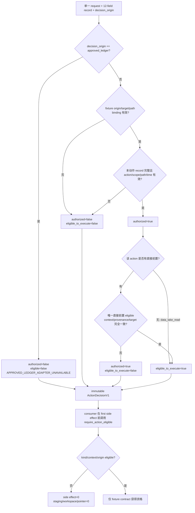

# LLD: CR172-S01 — PATH-I action authorization, execution eligibility, and claim governance

> 本 LLD 只定义 repository-local 纯值对象、纯判定函数和 fixture 验证入口。它不连接 authorization backend，不读取凭据、环境变量、真实数据或路径，不批准或执行六类真实动作。

## 修订记录

| 版本 | 日期 | 修订人 | 变更要点 |
|---|---|---|---|
| 1.0 | 2026-07-18 | meta-dev | 初始 full LLD；冻结六动作、五条执行资格边、四态、path/signal/claim ceiling。 |
| 1.1 | 2026-07-18 | meta-dev | CP5 R1 F-003 整改：保持 12-field approval record 不变；新增 `ActionDecisionOriginV1`、`ActionScopeContextV1.target_kind` 与 fixture/real first-side-effect guard；同步接口、流程、测试、风险和 DoD。 |
| 1.2 | 2026-07-18 | meta-dev | CP5 R2 F-R2-001/004 整改：current-v1 所有 `approved_ledger` 输入固定双 false并返回 `APPROVED_LEDGER_ADAPTER_UNAVAILABLE`；删除同义 provenance 第二真相；REQ-013 固定为 `contract_ready/runtime_enforcement_deferred`，runtime delivered=`0`。 |
| 1.3 | 2026-07-18 | host-orchestrator | CP5 批准前 optional 整改：authority pointer-only 刷新至 HLD/ADR v1.4，并把 F-04 DAG 缩写展开为完整 action kind；normative delta=`0`。 |

## 0. 上游设计依据（工程依据）

| 来源 | 路径 / ID | 被本 LLD 消费的内容 |
|---|---|---|
| CR / CP5 capsule / R3 handoff | `process/context/CP5-CR172-PATH-I-LLD-CONTEXT.yaml`；`process/handoffs/CR172-CP5-LLD-R3-BATCH-A-META-DEV-HANDOFF-2026-07-18.md` | runtime-high-risk-design、R3 allowed writes、六动作 `0/6`、approved-ledger current-v1 deny、REQ-013 deferred |
| HLD v1.4 | `docs/design/HLD-TRIAL-RETURN-DEPLOYMENT-CONTRACTS.md` §6、§9.2、§10.4～10.5、§11.1、§11.5～11.7 | 12-field record、current-v1 approved-ledger deny、`decision_origin`/`target_kind`、执行资格 DAG、REQ-013 deferred、SignalBatch ceiling |
| ADR v1.4 | `docs/design/ARCHITECTURE-DECISION-TRIAL-RETURN-DEPLOYMENT-CONTRACTS.md` ADR-005～009 | caller 自报 approved-ledger 不可解锁、fixture typed binding、no union、REQ-013 contract/runtime 边界、claim ceiling |
| Feature Matrix | `docs/design/FEATURE-DESIGN-MATRIX.md` CR172 PATH-I 增量 | S01 full-lld、W1 owner、S02～S04 contract dependency、CP5 强制注意项 |
| Feature DESIGN v1.2 | `docs/features/path-i-authorization-claim-governance/DESIGN.md` | I03 对象、current-v1 trusted-origin deny、六动作与五条边、REQ-013 deferred、四态/path/signal/claim 边界 |
| Feature TEST-PLAN v1.2 | `docs/features/path-i-authorization-claim-governance/TEST-PLAN.md` | approved-ledger 自报拒绝、I03-P01、N01～N05、R01、C01～C04、PATH、SIG、CLM 和 zero-operation guard |
| Feature TASKS | `docs/features/path-i-authorization-claim-governance/TASKS.md` | `CR172-S01-T01`～`T04`、S01→S02 merge 顺序、禁止范围 |
| Story | `process/stories/STORY-CR172-S01-action-authorization-eligibility-governance.md` | 目标、AC、文件 owner、dev/verification gate |

## 1. Goal

创建 `engine/path_i_governance.py` 及其单元测试，提供一个无 I/O、无隐式继承、deny-default 的 PATH-I 治理合同：12-field approval record 保持不变；派生 decision/context 机械区分 `repository_fixture|approved_ledger` 与 `repository_fixture|real_operation`，但 current-v1 对所有 `approved_ledger` 输入无条件双拒绝，caller 自报枚举/record 不能解锁；六类授权记录独立 `6/6`，执行资格严格遵循 `6 nodes / 5 edges` DAG；同时冻结 empirical-R 四态、contract-only run path、SignalBatch 八个语义槽和五项高阶 claim ceiling。

## 2. Requirements（需求；Functional / Non-Functional）

### 2.1 Functional

- F-01：`PathIActionKind` 必须且只能包含六个值：`data_lake_read`、`multi_trial_runtime_and_workspace_write`、`trial_return_generation`、`empirical_R_computation`、`nas_replica_sync`、`execution_pull_verify_materialize`。
- F-02：每次 `evaluate_action_decision` 只接受一个 action request、该动作的一份独立 record 和一个显式 `ActionDecisionOriginV1`；不得接受 record 集合，不得从其他 action 的 allow 结果推导本动作 `authorized=true`。current-v1 一旦输入 `decision_origin=approved_ledger`，无论 record/action/path/context 看似多么有效，都必须固定返回 `authorized=false`、`eligible_to_execute=false`、reason=`APPROVED_LEDGER_ADAPTER_UNAVAILABLE`；不得继续执行 record allow 判定。
- F-03：`authorized` 只表示本动作 record 在时效、撤销、scope/hash、action kind、logical path 上有效；`eligible_to_execute` 还必须满足直接前置、上下文一致性和所需 provenance。两个字段必须独立保存。
- F-04：执行资格图固定为 `data_lake_read → multi_trial_runtime_and_workspace_write → trial_return_generation → empirical_R_computation` 和 `trial_return_generation → nas_replica_sync → execution_pull_verify_materialize`，边数 `5/5`；不得跳边或引入 transitive permission union。
- F-05：runtime 自身 record 有效但同 context 的 read 缺失、deny、expired 或 revoked 时，结果必须是 `authorized=true`、`eligible_to_execute=false`；consumer 必须保持 runner/workspace/pointer=`0/0/0`。
- F-06：record/request/predecessor 的上下文至少逐字段一致：`scope_revision`、`scope_sha256`、`release_id`、`run_id`、`family_id`、`target_kind`。`repository_fixture` origin 只能绑定 `repository_fixture` target、`fixture://` URI 和 repository-owned fixture/in-memory port；fixture decision + `real_operation` 必须在 first side effect 前拒绝，accepted/side-effect=`0/0`。其他 logical path 只允许 canonical logical URI，deny 前缀优先于 allow 前缀，禁止 glob、`..`、反斜线和 credential-bearing URI。
- F-07：`EmpiricalRDispositionV1` 恰好表达 `declared_exact`、`empirical`、`typed_unavailable`、`BLOCKED` 四态之一；在 `FU-CR173-001`/compute authorization/完整 provenance 不齐时，positive effective count 和 `c1_computable` 必须为 false。
- F-08：`RunPathDecisionV1` 只允许 new semantic root contract 或 legacy read-only audit；legacy write/move/rename/rewrite/migration 必须拒绝。本 CR 对 REQ-013 的状态仅为 `contract_ready/runtime_enforcement_deferred`，现有 runner diff/default switch/runtime enforcement/runtime delivered=`0/0/0/0`。
- F-09：`SignalBatchBoundaryV1` 只保存八个语义槽的 typed facet；不生成 wire schema、mailbox、state/ack/replay、consumer 或 transport。
- F-10：`PathIClaimCeilingV1` 必须强制 `stage3_entry_ready`、`c1_computable`、`real_data_authorized`、`multi_trial_runtime_authorized`、`signal_transport_authorized` 五个字段全为 false；`path_i_design_ready` 只能作为后续 CP8 上限字段，不反推真实能力。
- F-11：`ActionAuthorizationRecordV1` 的字段集合必须精确保持 HLD v1.4 的 `12/12`；`decision_origin` 只属于 `ActionDecisionV1`，`target_kind` 只属于 `ActionScopeContextV1`，二者不得写回 approval record 或形成第 13/14 个字段。
- F-12：decision provenance 的唯一真相是 `ActionDecisionV1.decision_origin + ActionScopeContextV1.target_kind + logical URI/port binding`；同义字段、别名、helper、assertion 和第二真相 occurrence=`0`。
- F-13：future native-producer runtime-high-risk CR 必须在 launch/workspace first side effect 前消费 `RunPathDecisionV1`，验证 new default=`1`、legacy write=`0`；该前置完成前 CP8 不得声称 REQ-013 runtime delivered。

### 2.2 Non-Functional

- NFR-01（安全）：production module 只依赖 Python 标准库；文件、网络、环境变量、凭据、subprocess、provider、lake/NAS/runtime/trading API 调用数均为 `0`。
- NFR-02（确定性）：相同 request/record/predecessor/evaluated_at 必须产生字段完全相同的 immutable decision；reason code 按预定义优先级排序，不依赖 mapping/set 遍历顺序。
- NFR-03（fail-closed）：缺字段、非法时间、未知 action/reason、path/scope/context/provenance 不一致均拒绝；完整性冲突不得降级成 allow。
- NFR-04（复杂度）：单次判定时间为 `O(a+p)`，其中 `a` 是当前 record 的 allow/deny path 数、`p` 是直接前置 evidence 数；内存为 `O(a+p)`。不得扫描六类全局 ledger。
- NFR-05（可审计）：decision 保留本动作 authorization/evidence refs、上下文字段、evaluated_at 和稳定 reason codes，但不保存凭据、审批正文或真实 payload。
- NFR-06（兼容）：新增 action kind、DAG edge、Signal slot 或 claim 字段均视为 schema 变更，必须回 CP3/CP5 设计澄清；本 Story 不提供 permissive unknown-field fallback。

## 3. 模块拆分与职责

| 模块 / 文件组 | 职责 | 说明 |
|---|---|---|
| `engine/path_i_governance.py` — action schema | 定义 action、decision-origin、target-kind、scope、request、12-field record、predecessor 和 decision immutable value objects | S01 独占；不做 backend/ledger/IO |
| `engine/path_i_governance.py` — evaluator | 校验本动作 record 与 origin/target/path binding，再校验唯一直接前置、上下文和 provenance，输出 `ActionDecisionV1` | 先算 `authorized`，再算 `eligible_to_execute`；no union；fixture+real fail-closed |
| `engine/path_i_governance.py` — boundary facets | 定义 empirical disposition、run-path、SignalBatch semantic slots、claim ceiling | value contract only；无 R/signal/path IO |
| `tests/research/test_cr172_path_i_governance.py` | 覆盖六动作、五边、撤销、路径、四态、signal、claim 和静态零操作 | 只使用 deterministic fixture；不连接真实 backend |

## 4. 代码结构与文件影响范围

| 动作 | 文件路径 | 变更内容 |
|---|---|---|
| 创建 | `engine/path_i_governance.py` | 创建全部 frozen/slots value objects、枚举、reason code、`evaluate_action_decision`、consumer guard 和四类边界 validator |
| 创建 | `tests/research/test_cr172_path_i_governance.py` | 创建 unit/negative/static fixture 测试，量化六动作、五边、no-union、zero-operation 和 claim ceiling |

以下文件在本 Story 中修改数必须为 `0`：`engine/mature_multifactor_research.py`、`engine/experiment_family_lineage.py`、`engine/effective_trial_evidence.py`、`engine/effective_trial_estimator.py`、public C1/admission、Signal/NAS/runtime 模块。

## 5. 数据模型与持久化设计

所有对象使用 `@dataclass(frozen=True, slots=True)` 或 `str Enum`；本 Story无持久化、无目录、无数据库、无真实 ledger。

| 对象 / 字段 | 类型 | 约束 | 说明 |
|---|---|---|---|
| `PathIActionKind` | `str, Enum` | exactly `6/6` | action kind 是单动作判定键 |
| `ActionDecisionOriginV1` | `str, Enum` | exactly `repository_fixture`, `approved_ledger` | decision 的证据来源；不扩充 approval record；current-v1 第二值永远双 false |
| `ActionTargetKindV1` | `str, Enum` | exactly `repository_fixture`, `real_operation` | action 目标类别；由 context 持有 |
| `ActionScopeContextV1` | `schema_version, scope_revision, scope_sha256, release_id, run_id, family_id, target_kind` | 全部非空；hash=`sha256:`+64 lowercase hex；ID 使用受限字符；不可含绝对路径；`target_kind` exact `1/2` | request、record scope 与 predecessor 的 equality domain；target binding 单一真相源 |
| `ActionAuthorizationRequestV1` | `action_kind, logical_path, context` | exactly one action；logical URI 正规化后不可变 | 不允许 action list 或 wildcard request |
| `ActionAuthorizationRecordV1` | `authorization_id, action_kind, owner, scope_revision, scope_sha256, allowed_logical_paths, denied_logical_paths, valid_from, expires_at, revoked_at, approval_ref, evidence_ref` | HLD `12/12` 必填语义；aware UTC；`valid_from < expires_at`；path tuple 去重排序；deny-first | 只是不可变审批记录，不等于可执行资格；fixture record 不是真实授权 |
| `ActionPrerequisiteEvidenceV1` | `predecessor_action_kind, authorization_id, authorized, eligible_to_execute, context, provenance_kind, logical_uri, content_sha256, manifest_sha256, evidence_ref` | predecessor kind 必须等于 DAG 的直接前置；非 artifact 边的 hash 字段必须为空；artifact/receipt 边必须完整 | 只承载直接前置快照；不承载 record 合并 |
| `ActionDecisionV1` | `schema_version, action_kind, authorization_id, decision_origin, authorized, eligible_to_execute, reason_codes, scope_revision, scope_sha256, release_id, run_id, family_id, target_kind, approval_ref, evidence_ref, evaluated_at` | immutable；origin/target 必须取自显式 input/context；reason tuple 按固定优先级；deny 可保留本动作独立 approval ref | S02～S04 的唯一授权/资格消费面；不得由 consumer 改写 origin/target |
| `EmpiricalRDispositionV1` | `state, reason_codes, method_version_ref, computation_authorization_ref, positive_effective_count, c1_computable` | state exactly `1/4`；当前 positive/C1 只能 false | 不计算 R，不调用 estimator |
| `RunPathDecisionV1` | `mode, logical_root, writable, reason_codes, delivery_status` | new mode 只表达 future mapping；legacy mode 永远 `writable=false`；`delivery_status=contract_ready/runtime_enforcement_deferred` | 不解析 env、不创建目录、不切换 default |
| `SignalBatchBoundaryV1` | 八个 semantic properties | exact slots=`8/8`；第 6/7 为复合语义；无 wire encoding | 只做 value facet，不是 exchange schema |
| `PathIClaimCeilingV1` | `path_i_design_ready` + 五项高阶 bool | 五项高阶必须 false | 构造时发现 true 立即 `PathIGovernanceError` |

稳定 reason code 集：`ALLOW`、`APPROVED_LEDGER_ADAPTER_UNAVAILABLE`、`RECORD_MISSING`、`RECORD_INVALID`、`ACTION_MISMATCH`、`NOT_YET_VALID`、`EXPIRED`、`REVOKED`、`SCOPE_MISMATCH`、`PATH_INVALID`、`PATH_DENIED`、`PATH_NOT_ALLOWED`、`DECISION_ORIGIN_INVALID`、`TARGET_KIND_INVALID`、`ORIGIN_TARGET_MISMATCH`、`FIXTURE_URI_REQUIRED`、`PREDECESSOR_MISSING`、`PREDECESSOR_DENIED`、`PREDECESSOR_INELIGIBLE`、`CONTEXT_MISMATCH`、`PROVENANCE_MISSING`、`PROVENANCE_INVALID`。未知 code 不允许序列化；approved-ledger unavailable reason 在 current-v1 的优先级最高。

## 6. API / Interface 设计

| 接口 / 入口 | 输入 | 输出 | 调用方 | 说明 |
|---|---|---|---|---|
| `evaluate_action_decision(request, record, predecessor_evidence=(), *, decision_origin, evaluated_at)` | `ActionAuthorizationRequestV1`、本动作 `ActionAuthorizationRecordV1 | None`、直接前置 evidence tuple、`ActionDecisionOriginV1`、aware UTC 时间 | `ActionDecisionV1` | S02 artifact、S03 replica、S04 materializer、S05 verifier | 唯一判定 API；`approved_ledger` 在 current-v1 立即双 false，不检查/接受自报 record |
| `require_action_eligible(decision, *, expected_kind, expected_context, expected_origin=None)` | decision + consumer 期望 action/context，可选期望 origin | `None`；失败抛 `PathIEligibilityError` | 每个 action enforcement point | 逐字段比较 target；fixture consumer 必传 `expected_origin=repository_fixture`，在 first side effect 前拒绝 origin/target/path 错配 |
| `classify_empirical_r(inputs)` | source kind、sealed provenance completeness、alignment、v2/hash、compute decision、integrity flags | `EmpiricalRDispositionV1` | future PATH-C/A design、S05 fixture | 无 R 计算；缺前置 unavailable，冲突 BLOCKED |
| `decide_run_path(intent)` | 显式 new/legacy intent + logical root | `RunPathDecisionV1` | future native-producer CR、S05 contract fixture | 只返回 contract；不读取/修改默认路径，不产生 runtime enforcement/delivered claim |
| `validate_signal_batch_boundary(boundary)` | 八个 semantic slots | validated `SignalBatchBoundaryV1` | S05 fixture/future signal CR | 不输出 bytes、path、ack 或传输状态 |
| `enforce_path_i_claim_ceiling(claim)` | `PathIClaimCeilingV1` | 原 immutable claim | S05/CP8 adapter | 任一五项高阶 true 立即拒绝 |

调用约束：consumer 必须在每个 enforcement point 重新取得/构造 decision；本模块不缓存 decision，不监听 revoke，不把 fixture allow decision 提升为项目真实授权。current-v1 没有可信 issuer/envelope/adapter，所有 `approved_ledger` 无条件双 false；六类真实动作 authorized/executed=`0/6`,`0/6`。未来若引入真实 adapter，必须另走 runtime-high-risk CR、使用不可由 caller 自报的 verified envelope 或独立 entrypoint，并升级 versioned contract。

## 7. 核心处理流程



固定处理顺序：

1. 验证 request、显式 `decision_origin` 与 aware UTC `evaluated_at` 的类型；未知 origin 立即拒绝。
2. 若 origin=`approved_ledger`，不读取 record allow/path、不检查 predecessor，直接返回双 false与唯一 reason `APPROVED_LEDGER_ADAPTER_UNAVAILABLE`；caller 自构 record/enum accepted/eligible=`0/0`。
3. 对 repository fixture 判 origin/target/path：必须同时命中 `repository_fixture`、`fixture://` 和 repository-owned fixture/in-memory port；与 `real_operation` 或非 fixture URI 的组合立即双 false。
4. 只验证本动作精确 12-field record；missing/invalid/action/scope/path/time 任一失败即返回双 false；不得把 origin/target或任何第二 provenance marker 塞入 record。
5. record 有效则设 `authorized=true`；不得查询、扫描或合并其他 action record。
6. 从固定 DAG 取得直接前置；比较 scope revision/hash、release/run/family/target 与 artifact/receipt provenance。
7. 生成带原始 `decision_origin`/`target_kind` 的稳定 decision；consumer 在 first side effect 前用 guard 校验，成功只赋予 repository fixture contract 资格。
8. `decide_run_path` 只返回 contract decision；不触碰 runner/default/root。future native producer 必须另行在 launch/workspace side effect 前消费。

## 8. 技术设计细节（技术细节）

- 关键规则：current-v1 `authorized = (decision_origin == repository_fixture) AND own_record_valid`；`approved_ledger` 分支固定双 false；fixture 分支的 `eligible_to_execute = authorized AND direct_predecessor_eligible AND context_equal AND provenance_valid`。两个结果不得折叠为单一 allow bool。
- current-v1 typed binding 规则只有 `(repository_fixture, repository_fixture, fixture://, repository-owned fixture/in-memory port)` 可进入后续 record/DAG 判定；所有 `approved_ledger` 与所有 cross-pair accepted/eligible=`0/0`。不存在“看似有效的 approved logical URI”旁路。
- DAG 使用 module-level immutable mapping，键=`6/6`、非 root value=`5/5`；import-time 自检保证无重复、无环、无未知节点。不得用通用图遍历推导 transitive approval。
- path matching 只支持 scheme/authority/path segment boundary 上的 exact 或 prefix root；deny 列表先判，allow 列表后判。`*`、`?`、`..`、反斜线、userinfo/query/fragment 中的 secret-like 参数均拒绝。
- UTC 时间：只接受 tz-aware `datetime`，比较前转 UTC；边界为 `valid_from <= evaluated_at < expires_at`。`revoked_at is not None and revoked_at <= evaluated_at` 时 revoked。
- `ActionPrerequisiteEvidenceV1` 只允许固定 provenance kind：`eligibility_decision`、`sealed_trial_return`、`verified_replica_receipt`。R/sync 需要 sealed artifact，pull 需要 verified receipt。
- empirical 分类优先级：integrity conflict→`BLOCKED`；source/v2/auth/provenance 缺失→`typed_unavailable`；显式 fixture matrix→`declared_exact`；全部 empirical 前置齐备才允许 `empirical` state，但本 Story仍保持 positive count/C1=false。
- run-path 只生成 value contract：new target root可表达但不能生效；legacy 始终只读。REQ-013 runtime enforcement/default switch/runtime delivered counts=`0/0/0`。
- SignalBatch 只定义 semantic properties，不选择 nested/flattened physical representation；发现 mailbox/path/state/ack/replay/intraday 字段必须返回 deferred reason，而不是加入对象。
- 依赖选择：仅 `dataclasses`、`datetime`、`enum`、`re`、`typing`、`urllib.parse` 等标准库；不依赖 lineage、CR173、runner 或存储模块，避免依赖环。
- 兼容性：schema version 固定 `path-i-governance.v1`；unknown action/field/reason fail-closed。future schema 必须使用新版本类型或独立 CR，不在 v1 permissive ignore。
- 图示类型选择：流程图；它同时表达 own-record、direct-prerequisite 与 consumer enforcement 三段 fail-closed 分支。

## 9. 安全与性能设计

| 维度 | 设计措施 | 验证方式 |
|---|---|---|
| 权限最小化 | 单 request/精确 12-field record/单 decision；origin/target 不写回 record；无全局 allow 集合；record 独立存在但无 permission union | 六动作参数化 + record-field inventory + partial authorization 测试 |
| 凭据保护 | refs 只允许 opaque ID/hash；禁止 secret/token/password/account/order 字段和 credential-bearing URI | schema/AST/negative fixtures |
| Side-effect ceiling | production module 不导入文件、network、env、subprocess、pandas/pyarrow 或 runtime adapter | static import/source scan；monkeypatch zero-call guard |
| Fail-closed | deny-first path、固定时间边界、上下文逐字段匹配、provenance kind/hash 校验 | N01～N04、R01 和 mutation tests |
| 确定性 | frozen objects、tuple 排序、固定 reason 优先级、显式 evaluated_at | 相同输入重复 `3/3` equality/serialization fixture |
| 性能 | 只遍历当前 record path 和直接前置 tuple，不遍历全局 ledger/DAG | 规模化 fixture 断言调用数与输入长度线性；不声明 production SLA |

## 10. 测试设计

| 测试场景 | 前置条件 | 操作 | 预期结果 | 验证方式 |
|---|---|---|---|---|
| `test_action_kind_and_dag_are_exact` | module import | 枚举 action 与 DAG | nodes/edges=`6/5`，无环、无未知、无额外 edge | unit/static |
| `test_each_action_uses_only_its_own_record` | 六份相互独立 fixture record | 逐 action 调用 `evaluate_action_decision` | decisions=`6/6`；替换其他 record 不改变本动作；union=`0` | parameterized unit |
| `test_approval_record_remains_exactly_twelve_fields` | `ActionAuthorizationRecordV1` schema inventory | 枚举 dataclass fields | expected/actual=`12/12`；`decision_origin`/`target_kind` occurrence=`0/0` | contract/static |
| `test_decision_origin_and_target_kind_are_exact` | enum 与 decision/context fixtures | 枚举值并构造 | origin/target values=`2/2`；unknown accepted=`0`；decision/context 保留值=`100%` | I03-N05 contract |
| `test_approved_ledger_is_unconditionally_unavailable_in_current_v1` | 六 action × valid-looking real record/context/path；caller 自报 enum | 逐 action evaluate并调用 guard | authorized/eligible=`0/0` for `6/6`；reason only=`APPROVED_LEDGER_ADAPTER_UNAVAILABLE`；consumer callback=0 | trusted-origin negative |
| `test_fixture_decision_rejects_real_target_before_first_side_effect` | valid fixture record；fixture origin；real target 或非-fixture URI；spy callback | evaluate + `require_action_eligible` | accepted/side-effect=`0/0`；reason 包含 `ORIGIN_TARGET_MISMATCH` 或 `FIXTURE_URI_REQUIRED` | I03-N05 |
| `test_runtime_record_without_read_is_ineligible` | runtime record valid，read missing/deny/expired/revoked 四组 | 判定 runtime 并调用 guard | `authorized=true`、eligible=false；模拟 runner/workspace/pointer=`0/0/0` | I03-N02 |
| `test_all_five_prerequisite_edges_fail_closed` | 每条边各有 missing/denied/context mismatch | 判定五个非 root action | eligible=false `5/5`；不跳边 | parameterized negative |
| `test_record_time_scope_and_path_validation` | missing/invalid/future/expired/revoked/scope/hash/allow/deny fixtures | 判定单 action | 对应稳定 reason；deny-first；wildcard/credential URI accepted=`0` | I03-N01 |
| `test_mid_operation_revocation_blocks_next_commit` | 第一步 allow，下一判定 revoked | 重新判定同 action | next eligible=false；pointer commit callback=`0` | I03-R01 fixture |
| `test_require_action_eligible_rejects_wrong_kind_or_context` | allow decision + wrong expected kind/context | 调用 consumer guard | 抛 `PathIEligibilityError`；consumer callback=`0` | interface negative |
| `test_empirical_disposition_exactly_four_states` | declared/missing/complete/conflict fixtures | 调用 `classify_empirical_r` | state `4/4`，每次 exactly one；pre-v2 positive/C1=`0/0` | I03-C01～C04 |
| `test_run_path_is_contract_only_and_runtime_deferred` | new/legacy/mutation intents | `decide_run_path` + static runtime inventory | new contract accepted；legacy writable/move/rename/rewrite/migration=`0`；status=`contract_ready/runtime_enforcement_deferred`；default switch/enforcement/delivered=`0/0/0` | I03-PATH / REQ-013 |
| `test_signal_boundary_has_exact_eight_semantic_slots` | exact/missing/extra/credential/intraday fixtures | `validate_signal_batch_boundary` | exact accepted `1/1`；其他 accepted=`0`；exchange symbols=`0` | I03-SIG |
| `test_claim_ceiling_rejects_each_high_order_true` | 五个 mutation fixtures | `enforce_path_i_claim_ceiling` | 五项 true accepted=`0/5` | I03-CLM |
| `test_governance_module_has_zero_operation_surface` | source/import inventory | AST + monkeypatch | backend/network/env/credential/lake/NAS/runtime/R/signal/trading operation=`0` | static/zero-op |
| `test_decision_provenance_has_one_typed_source` | schema/helper/assertion inventory | scan S01 public/test contract | 同义 provenance field/helper/assertion=`0/0/0`；origin/target binding single truth=`1` | cross-contract static |

唯一目标命令：

```bash
PYTHONDONTWRITEBYTECODE=1 PYTEST_ADDOPTS='-p no:cacheprovider' uv run --python 3.11 pytest -q tests/research/test_cr172_path_i_governance.py
```

## 11. 实施步骤

| TASK-ID | 动作 | 目标文件 | 详细描述 | 对应测试 |
|---|---|---|---|---|
| CR172-S01-T01 | 修改 | `process/stories/STORY-CR172-S01-action-authorization-eligibility-governance-LLD.md` | R2 冻结 12-field record、decision-origin/context-target、DAG、四态/path/signal/claim、失败与测试合同 | CP5 LLD precheck |
| CR172-S01-T02 | 创建 | `engine/path_i_governance.py` | 创建六 action、origin/target enums、current-v1 approved-ledger hard deny、frozen objects、DAG/consumer/run-path guards | action/DAG/record/trusted-origin/guard tests |
| CR172-S01-T03 | 创建 | `tests/research/test_cr172_path_i_governance.py` | 创建六动作、caller自报 approved-ledger、fixture+real、五边、runtime-without-read、scope/path/time、撤销/no-union fixtures | trusted-origin、I03-P01/N01～N05/R01 |
| CR172-S01-T04 | 修改 | `tests/research/test_cr172_path_i_governance.py` | 增加 empirical/path/signal/claim/static zero-operation 验证和 targeted command evidence | I03-C01～C04、PATH、SIG、CLM |

每个 production/test 文件只有 S01 一个 primary owner。CP5 批准前只允许 T01 设计证据，不执行 T02～T04。

## 12. 风险、难点与预研建议

### 12.1 实现灰区与取舍记录

| Clarification ID | 问题 | 选项与推荐 | 决策 / 答案 | 影响面 | 证据 | 重访条件 |
|---|---|---|---|---|---|---|
| 无 | 本 LLD 未发现需要用户或上游决策的灰区 | 不适用 | clarification queue=`0`；按 HLD/ADR/Feature 已确认合同实现 | 无阻塞 | CP5 context `lld_clarification_queue.items=[]` | action/schema/DAG/signal/claim 任一变化时重开设计 |

| 风险 / 难点 | 影响 | 缓解措施 / 预研建议 |
|---|---|---|
| caller 把 `authorized` 当作可执行资格 | 可在缺前置时启动 runtime 或写 pointer | decision 同时保存两个 bool；所有 consumer 强制调用 `require_action_eligible`；测试 runtime own-auth/no-read |
| fixture allow decision 被误称真实授权 | CP6/CP7 合同测试被误解为 activation | `ActionDecisionOriginV1` + `ActionTargetKindV1` 双绑定；fixture URI/port 检查；STATE/CP8 六动作仍 `0/6`；无 approved-ledger adapter |
| caller 自报 `approved_ledger` 解锁真实 action | forged provenance 绕过 first-side-effect guard | evaluator最高优先级无条件双 false + 稳定 reason；未来 adapter必须独立 version/runtime-high-risk CR |
| generic predecessor evidence 被错误跨边复用 | 跳过 sealed artifact 或 verified receipt | 固定 DAG + provenance kind + expected predecessor + context/hash 校验 |
| Signal boundary 膨胀为 transport | 跨 Stage 3/4/5、增加 trading/execution owner | semantic facet only；wire/path/state/ack/replay/intraday 字段一律 deferred/拒绝 |
| unknown field permissive parsing | 新能力静默进入 v1 | dataclass typed construction + exact schema validator；unknown 拒绝、版本升级走设计门 |

### OPEN / Spike 跟踪

| ID | 类型（OPEN / Spike） | 问题 | 下一动作 | 责任方 |
|---|---|---|---|---|
| 无 | 无 | open items=`0`；Spike=`0` | 不适用 | 不适用 |

## 13. 回滚与发布策略

- 发布方式：CP5 批准后，S01 作为 W1 的单一 repository-local contract/test merge slice 实施；它只生成代码和 fixture 证据，不部署、不连接真实 backend。
- 回滚触发条件：action/DAG 数不为 `6/5`、出现 permission union、runtime-without-read 可执行、unknown action permissive、真实 IO/import、Signal exchange 或五项高阶 claim 任一 true。
- 额外触发：任何 current-v1 `approved_ledger` 得到 authorized/eligible=true，出现同义 provenance 第二真相，或 CP8 将 REQ-013 标记 runtime delivered。
- 回滚动作：整体回退 S01 新模块和其独占测试文件；在 S02 尚未合并前没有下游兼容负担。若 S02 已消费，按 `S02→S01` 逆 merge 顺序回退；不得通过放宽 guard 修复测试。
- 数据回滚：无新增持久化和真实 artifact，N/A。
- 授权回滚：无真实授权记录产生；撤销 fixture 不改变项目授权状态。

## 14. Definition of Done（DoD）

- [x] 0～14 节全部填写，frontmatter `lld_version=1.3`、`tier=L`、`status=confirmed`、`confirmed=true`、`open_items=0`。
- [ ] 六 action/六独立 record/六 enforcement point 与五条 DAG edge 可由接口和测试精确计算为 `6/6/6/5`。
- [ ] `ActionAuthorizationRecordV1` 字段 exact=`12/12`，`decision_origin`/`target_kind` 写入 record 的 occurrence=`0/0`。
- [ ] `ActionDecisionOriginV1`/`ActionTargetKindV1` values=`2/2`；fixture decision + real target accepted/side-effect=`0/0`，且 decision/context 全程保留 origin/target。
- [ ] current-v1 caller 自报 `approved_ledger` 的 authorized/eligible=`0/0` for `6/6` actions，稳定 reason=`APPROVED_LEDGER_ADAPTER_UNAVAILABLE`；可信 adapter symbols=`0`。
- [ ] 同义 provenance field/helper/assertion=`0/0/0`；decision provenance single truth=`decision_origin+target_kind+URI/port`。
- [ ] `authorized` 与 `eligible_to_execute` 独立；runtime-own-auth/no-read 的 runner/workspace/pointer=`0/0/0`。
- [ ] record/path/time/context/provenance 的失败行为和 reason codes 可直接编码且 fail-closed。
- [ ] empirical 四态、run-path、Signal eight-slot 和五项 claim ceiling 均有对应接口与测试。
- [ ] REQ-013=`contract_ready/runtime_enforcement_deferred`；current runner diff/default switch/runtime enforcement/runtime delivered=`0/0/0/0`；future path-enforcement owner/trigger已登记。
- [ ] action union、真实 backend、IO/network/env/credential、R/signal/trading/runtime 实现数量均为 `0`。
- [ ] 每个接口至少对应第 10 节一条测试，每个文件影响项至少对应第 11 节一个 TASK-ID。
- [ ] clarification/Open/Spike 均为 `0`；发现 action/schema/DAG 扩张时返回 `NEEDS_DESIGN_CLARIFICATION`。
- [ ] CP5 全量人工确认前不得进入 T02～T04 实现。

## 人工确认区

> **CP5 — Story 设计证据可实现性门**。本 LLD 需与其余四份 CR172 LLD、CP4 自动预检和独立 CP5 自动预检统一确认；单份 ready-for-review 不构成实现授权。

**CP5 checklist 摘要**：

| # | 检查项 | 状态 | 证据 |
|---|---|---|---|
| 1 | LLD 覆盖 Story AC | 待检查 | §2、§10、§14 |
| 2 | 与 HLD / ADR 一致 | 待检查 | §0、§5、§7、§12 |
| 3 | 文件影响范围明确 | 待检查 | §4、§11 |
| 4 | 接口契约完整 | 待检查 | §5、§6 |
| 5 | 测试与 dev_gate 可计算 | 待检查 | §10、§14 |
| 6 | clarification queue 已收敛 | 待检查 | §12.1；items=`0` |

**人工审查结果回填**：

- 结论：`pending`
- 审查人：
- 审查时间：
- 修改意见：
- 风险接受项：
