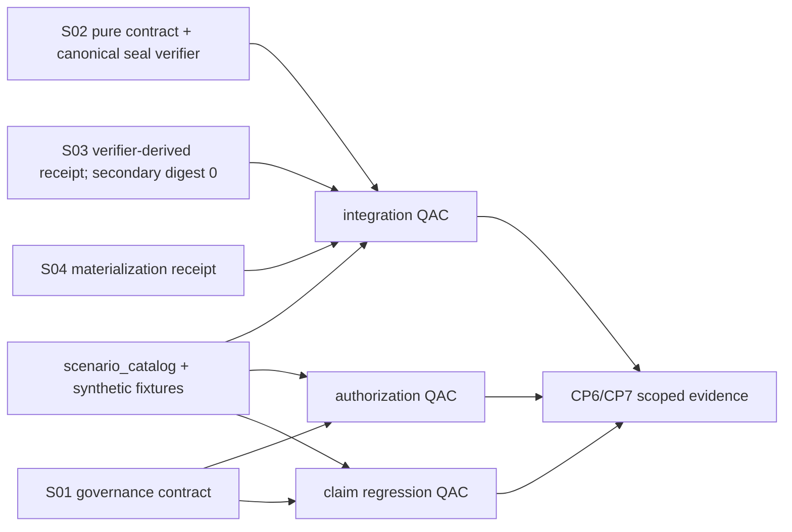
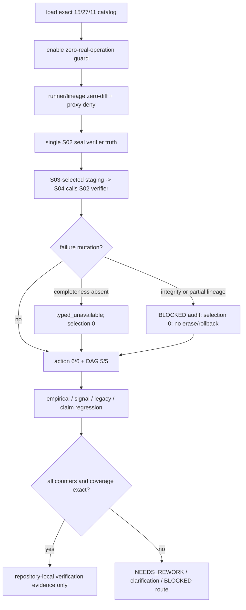

# LLD: CR172-S05 — PATH-I 集成失败、声明上限与零真实操作验证

> 本 LLD 只设计 repository-local fixture、集成测试、授权守卫与声明回归；不修改生产源码，不执行真实 lake/NAS/runtime/trial-return/R/signal/trading 操作。现已由 CP5 人工确认；实现仍受 S01～S04 CP7 串行依赖和 repository-local 授权边界约束。

## 修订记录

| 版本 | 日期 | 修订人 | 变更要点 |
|---|---|---|---|
| 1.0 | 2026-07-18 | meta-dev | 初始 CP5 S05 full LLD。 |
| 1.1 | 2026-07-18 | meta-dev | CP5 LLD review R2 安全收窄：删除既有 runner integration 假设及其源码检查/成功痕迹 oracle；改为 runner/lineage 零差异、forward-label proxy 禁入、fixture/real typed deny、唯一 seal verifier truth 和 partial-lineage BLOCKED audit 跨合同验证。 |
| 1.2 | 2026-07-18 | meta-dev | CP5 LLD review R3 最小修订：provenance 收敛为 decision origin + target kind + fixture URI/port；增加 current-v1 approved-ledger 双 false与稳定 reason、S04 staging bytes-level verifier/bypass/tamper 守卫，以及 REQ-013 contract-ready/runtime-enforcement-deferred claim guard。 |
| 1.3 | 2026-07-18 | host-orchestrator | CP5 批准前 optional 整改：authority pointer-only 刷新至 HLD/ADR v1.4，Feature I01 TEST-PLAN 指针统一至 v1.2；normative delta=`0`。 |

## 0. 上游工程依据

| 来源 | 路径 / ID | 被本 LLD 消费的内容 |
|---|---|---|
| HLD | `docs/design/HLD-TRIAL-RETURN-DEPLOYMENT-CONTRACTS.md` v1.4 | pure contract + repository fixture producer port、current-v1 approved-ledger deny、S04 selected-replica bytes-level verify、REQ-013 runtime-deferred、partial-lineage BLOCKED audit、五项 claim ceiling |
| ADR | `docs/design/ARCHITECTURE-DECISION-TRIAL-RETURN-DEPLOYMENT-CONTRACTS.md` v1.4 | approved-ledger adapter unavailable、唯一 provenance 三元组、S04 不绕过 S03 selection 且复用 S02 verifier、runtime path enforcement deferred |
| Feature Matrix | `docs/design/FEATURE-DESIGN-MATRIX.md#cr172-path-i-cp4-增量trial-return-与跨机部署合同` | S05=`full-lld`；REQ/Scenario/Outcome=`15/15`,`27/27`,`11/11`；W5 串行依赖 S01～S04 |
| CP4 / R3 DAG | `process/checks/CP4-CR172-PATH-I-STORY-DAG-PARALLEL-SAFETY.result.json` + R3 architecture correction | 5 Story/10 typed edges/5 serial Waves；新增 S02→S04 verifier-library edge；cycle/invalid ref/file conflict=`0/0/0`；六动作授权/执行=`0/6`,`0/6` |
| Feature I01 | `docs/features/trial-return-artifact-pipeline/{DESIGN,TEST-PLAN,TASKS}.md` DESIGN v1.2 / TEST-PLAN v1.2 | exact 2-column pure contract、approved-ledger双 false、fixture producer port、forward-label proxy deny、canonical seal/verifier truth=1、future path-enforcement prerequisite |
| Feature I02 | `docs/features/research-artifact-replica-materialization/{DESIGN,TEST-PLAN,TASKS}.md` DESIGN/TEST-PLAN v1.2 | S04 仅从 S03 selected replica staging port 取 sealed bundle+selection，并复用 S02 唯一 verifier 做 bytes-level 4/4；bypass/receipt-only/secondary digest=0 |
| Feature I03 | `docs/features/path-i-authorization-claim-governance/{DESIGN,TEST-PLAN,TASKS}.md` DESIGN/TEST-PLAN v1.2 | 12-field record 不变；current-v1 approved-ledger 双 false + 稳定 reason；唯一 provenance 三元组；REQ-013 contract-ready/runtime-deferred |
| Story | `process/stories/STORY-CR172-S05-path-i-integration-claim-zero-operation-verification.md` | S05 文件所有权、四个 runtime dependency、量化 AC、production read-only/forbidden 边界 |
| 场景基线 | `docs/product/SCENARIOS.yaml` 中 `SC-CR172-*` P0 增量 | 精确 27 个场景 ID、输入、失败预期与 deferred 路由；只用于映射，不把产品文档变成运行依赖 |

前置门控：S05 实现必须等待 S01～S04 的 LLD 已确认、实现证据通过并按 `S01→S02→S03→S04→S05` 合并。任一上游公开合同缺失或与本 LLD 矛盾时，S05 不自建替代合同，路由回相应 Story `NEEDS_REWORK`；只有 HLD/ADR 级合同本身矛盾时才返回 `NEEDS_DESIGN_CLARIFICATION`。

## 1. Goal

创建 1 组 deterministic repository-local fixtures 和 3 个 test-only QAC 套件，独立证明 S01～S04 的 R2 pure-contract 可以按 fail-closed 顺序衔接，并同时证明：

- REQ/Scenario/Outcome 覆盖精确为 `15/15`,`27/27`,`11/11`，未覆盖=`0/0/0`；
- `trial_portfolio_return_series@v1` canonical payload 恰好两列；现有 mature runner/lineage diff=`0/0`，production/native-hook capability=`0`；
- `forward_label_proxy@v1` 进入 trial-return、empirical-R、effective-count accepted=`0/0/0`；
- S02→S03 unique seal verifier truth=`1`：只存在一套 canonical seal bytes/digest/verifier，S03 secondary digest=`0`；
- S04 的 typed staging 数据只能来自 S03 selected replica，且每个 candidate 必须调用 S02 verifier `1` 次；bypass/receipt-only/secondary digest=`0/0/0`；
- 六类真实动作项目授权/执行均为 `0/6`,`0/6`，授权 record 不产生权限并集；
- current-v1 caller 自报 `approved_ledger` 仍 accepted/eligible=`0/0`，reason 稳定为 `APPROVED_LEDGER_ADAPTER_UNAVAILABLE`；
- repository-fixture selection→verified replica→execution local fixture cache 任一失败均不推进本层 selection；partial lineage 只产生 BLOCKED audit，不擦除、不伪回滚；
- PATH-I 的五项高阶 claim 全为 false，Signal detailed/FU-v2/public C1/legacy migration/真实 runtime 不被暗中实现或声明。
- REQ-013 仅 `contract_ready/runtime_enforcement_deferred`；runtime path enforcement/default switch/runtime-delivered claim=`0/0/0`，future path-enforcement prerequisite存在=`1`。

完成本 Story 只产生测试与 fixture 证据，不把 PATH-I、C1 或 Stage 3 提升为真实运行就绪。

## 2. 需求（Functional / Non-Functional）

### 2.1 Functional

| ID | 功能需求 | 可检验目标 |
|---|---|---:|
| FR-S05-01 | 建立精确的 coverage catalog，将 15 个 requirement、27 个 P0 scenario、11 个 outcome 映射到具体测试入口 | `15/15`,`27/27`,`11/11`；重复/未知/未覆盖=`0/0/0` |
| FR-S05-02 | 验证 ReturnDefinitionV1 pure contract、forward-label proxy 禁入和 source-scope zero-diff | canonical columns=`2/2`；silent net/gross/nav=`0`；proxy→trial-return/R/count=`0/0/0`；runner/lineage diff=`0/0` |
| FR-S05-03 | 验证 fixture source→single seal verifier→replica→cache 的成功、负向和失败恢复 | S02 seal bytes/digest/verifier truth=`1/1/1`；S03 secondary digest=`0`；五类 failure=`5/5`；selection advance=`0` |
| FR-S05-04 | 验证六份 record、六种 action、五条直接前置边和 context equality | action/record/enforcement=`6/6/6`；DAG edge=`5/5`；cycle=`0`；permission union=`0` |
| FR-S05-05 | 验证 runtime 自身 record 有效但 data-lake read 不可用时的 deny-default 路径 | runner/workspace/pointer=`0/0/0`；`eligible_to_execute=false` |
| FR-S05-05A | 验证 fixture decision 与真实 target 不能组合 | `decision_origin=repository_fixture` + `target_kind=real_operation` accepted/side-effect=`0/0` |
| FR-S05-05B | 验证 append-only partial lineage 诚实失败语义 | state=`partial_lineage_blocked_audit`；erase/fake rollback/canonical selection advance=`0/0/0`；lineage atomicity claim=0 |
| FR-S05-05C | 验证 current-v1 caller 不能自报 approved ledger 解锁 | valid-looking record + real target 仍 accepted/authorized/eligible=`0/0/0`；reason exact=`APPROVED_LEDGER_ADAPTER_UNAVAILABLE` |
| FR-S05-05D | 验证 provenance 单一来源 | 只接受 `decision_origin + target_kind + fixture URI/port`；第二 provenance field/helper/assertion=`0` |
| FR-S05-05E | 验证 S04 staging bytes-level chain | input 必须是 S03-selected `SealedTrialReturnBundleV1 + ResearchCanonicalSelectionV1`；S02 verifier call=`1`；tampered seal→seal false/cache advance 0；bypass/receipt-only/secondary digest=`0/0/0` |
| FR-S05-06 | 验证 empirical 四态、FU-CR173-001 前置和 DQ-003 降级 | pre-v2 positive effective count/public C1 positive projection/`c1_computable=true`=`0/0/0`；typed_unavailable 保留 |
| FR-S05-07 | 验证 SignalBatchBoundaryV1 精确 8 个语义 slot，并阻止详细交换/intraday 扩张 | slots=`8/8`；extra mandatory=`0`；detailed exchange/intraday module/Story/implementation=`0/0/0` |
| FR-S05-08 | 验证 legacy、GitHub data ceiling 和 CP8 claim ceiling | legacy write/move/rename/rewrite=`0/0/0/0`；Git remote write=`0`；五 claim flags true=`0/5` |
| FR-S05-09 | 验证 REQ-013 claim 分层 | contract ready=`1`；runtime path enforcement/default switch/runtime-delivered=`0/0/0`；future native-producer path-enforcement prerequisite=`1` |

### 2.2 Non-Functional

| ID | 非功能需求 | 可检验目标 |
|---|---|---:|
| NFR-S05-01 | 可重复性 | 相同 fixture 的 canonical seal bytes/digest/verifier result 连续复验 `3/3` 一致 |
| NFR-S05-02 | 隔离性 | 仅 `tmp_path` 与 repository fixture 可写；真实 host/root/path literal、network、mount、subprocess、credential/env read=`0` |
| NFR-S05-03 | 可诊断性 | 每个失败用枚举 reason/oracle 定位；模糊异常或 silent fallback=`0` |
| NFR-S05-04 | 文件所有权 | S05 production source diff=`0`；只创建 Story 授权的 4 个 test/fixture 路径；shared owner conflict=`0` |
| NFR-S05-05 | 性能边界 | fixture 每个 return series `<=50` 行；cross-contract inventory 只消费冻结 public objects 与 CP6/CP7 file-diff evidence，不扫描/执行 runner；不声明真实规模/SLA |
| NFR-S05-06 | 安全边界 | 六类真实动作 authorized/executed=`0/6`,`0/6`；signal/trading/deploy/remote write=`0` |

## 3. 模块拆分与职责

| 模块 / 文件组 | 职责 | 明确不负责 |
|---|---|---|
| `tests/fixtures/cr172_path_i/` | 保存 synthetic identity、exact schema、single-seal/staged-selected chain、forward-label proxy、partial-lineage audit、approved-ledger deny、run-path claim、mutation、coverage catalog 和 zero-operation oracle | 真实 return、主机路径、授权凭据、NAS 快照、生产 manifest |
| `test_cr172_path_i_integration.py` | ReturnDefinition、forward-label deny、runner/lineage zero-diff、single-seal verifier、S04 typed staging/bypass/tamper、replica/cache、failure/recovery 与 logical identity 验证 | 解析/执行 runner 源码、修改 runner/lineage/artifact/replica/materialization 模块 |
| `test_cr172_path_i_authorization.py` | 六 action/record/enforcement、五 action-DAG edge、decision-origin/target-kind/fixture URI-port binding、approved-ledger双 false、context mismatch、revoke、partial authorization 验证 | 连接授权 backend、信任 caller 自报、生成真实 allow record、执行任何 action |
| `test_cr172_path_i_claim_regression.py` | empirical 四态、FU-v2/public C1、REQ-013 contract/runtime split、legacy/GitHub、Signal 8-slot 和五项 claim ceiling 回归 | runtime path enforcement、default switch、Signal exchange/consumer、public C1 写入、估算器 v2、交易或部署 |
| S01～S04 production modules（只读） | 作为已通过实现证据的 SUT | S05 不回修、不新增 fallback、不改变公开合同 |

跨模块职责图：



## 4. 代码结构与文件影响范围

| 动作 | 文件路径 | 变更内容 |
|---|---|---|
| 创建 | `tests/fixtures/cr172_path_i/README.md` | 说明 fixture-only、synthetic、no-real-op 和 schema/version 规则 |
| 创建 | `tests/fixtures/cr172_path_i/scenario_catalog.json` | 精确 27 个 scenario→suite/test/REQ/outcome 映射及 15/27/11 期望集合 |
| 创建 | `tests/fixtures/cr172_path_i/sealed_chain_v1.json` | family/run/trial、两列 payload、canonical seal bytes/digest/verifier result、fixture selection/replica/cache logical mapping 的合成正例 |
| 创建 | `tests/fixtures/cr172_path_i/failure_mutations_v1.json` | forward-label proxy、fixture/real mismatch、partial-lineage audit、wrong-kind、schema drift、partial/stale/hash/release/alignment/context/revoke/signal/claim 负例 |
| 创建 | `tests/fixtures/cr172_path_i/zero_operation_oracle_v1.json` | 六动作 real authorized/executed=0、五 claim=false、deferred/legacy/public 边界计数 |
| 创建 | `tests/research/test_cr172_path_i_integration.py` | pure-contract 集成链、single-seal correlation、forward-label/partial-lineage deny、failure recovery、identity 和 zero-diff evidence 测试 |
| 创建 | `tests/research/test_cr172_path_i_authorization.py` | 六动作、DAG、partial/revoke/runtime-without-read、coverage catalog 测试 |
| 创建 | `tests/research/test_cr172_path_i_claim_regression.py` | empirical、Signal、legacy、GitHub、public C1 和 claim ceiling 回归 |

冻结的 production source `read_only/forbidden` 共 `10/10`：`engine/path_i_governance.py`、`engine/trial_return_artifact.py`、`engine/research_artifact_replica.py`、`engine/research_artifact_materialization.py`、`engine/mature_multifactor_research.py`、`engine/experiment_family_lineage.py`、`engine/effective_trial_evidence.py`、`engine/effective_trial_estimator.py`、`engine/cross_strategy_reliability_gates.py`、`engine/strategy_admission_package.py`。S05 对这些文件的修改数必须为 `0`。

## 5. 数据模型与持久化设计

本 Story 无生产数据模型或生产持久化变更。以下对象只存在于 repository-local JSON fixture/test memory：

| 对象 / 字段 | 类型 | 约束 | 说明 |
|---|---|---|---|
| `ScenarioCatalogV1.scenario_ids` | `list[str]` | 精确 27 个 `SC-CR172-*` P0 ID，排序稳定、无重复 | coverage 单一 fixture 真相源，不替代产品基线 |
| `ScenarioCatalogV1.requirement_ids` | `list[str]` | 精确 `REQ-CR172-001..015` | 聚合覆盖必须 `15/15` |
| `ScenarioCatalogV1.outcome_ids` | `list[str]` | 精确 `O01..O11` | 聚合覆盖必须 `11/11` |
| `ScenarioCaseV1` | JSON object | `scenario_id,suite,test_name,requirement_refs,outcome_refs,oracle` 六字段必填 | 一个 scenario 只绑定一个主测试；允许主测试参数化 |
| `SyntheticSealedChainV1` | JSON object | logical URI、content/manifest hash、canonical seal bytes/digest、verified result、expected release、三 host mapping；无真实 absolute path | 同一 seal truth 在 S02/S03/S04 间只有 `1` 套；S03/S04 secondary digest=0/0 |
| `SelectedReplicaStagingFixtureV1` | JSON object | `bundle: SealedTrialReturnBundleV1`、`selection: ResearchCanonicalSelectionV1`、S03 receipt ref、expected release | 只能由 S03-selected staging port 提供；S04 receipt-only/bypass=0 |
| `SyntheticReturnPayloadV1` | JSON projection | canonical columns 恰好 `timestamp,simple_return`；`return_basis=simple_net_after_cost_bps` | `net_return/gross_return/nav` 缺席；未知 basis→unavailable |
| `FailureMutationV1` | JSON object | `mutation_id,target,expected_state,reason_code,selection_delta` 必填 | completeness→typed_unavailable；integrity/partial-lineage→BLOCKED |
| `PartialLineageAuditV1` | JSON object | `state=partial_lineage_blocked_audit`，保留 append-only evidence refs | erase/fake rollback/canonical selection advance=`0/0/0`；不声明原子性 |
| `AuthorizationProvenanceFixtureV1` | JSON object | `decision_origin`、`target_kind`、`target_uri`、`port_kind` | fixture provenance 必须是 `repository_fixture/repository_fixture/fixture://*/repository-owned`；不接受第二 provenance 维度 |
| `ApprovedLedgerDenyOracleV1` | JSON object | caller 自报 approved ledger、valid-looking record、real target | accepted/authorized/eligible=`0/0/0`；reason exact=`APPROVED_LEDGER_ADAPTER_UNAVAILABLE` |
| `RunPathClaimOracleV1` | JSON object | `contract_ready=true`、future prerequisite ref | runtime enforcement/default switch/runtime-delivered=`false/false/false` |
| `ZeroOperationOracleV1` | JSON object | 六 action 的 `real_authorized=false`,`real_executed=false`；五 claim=false | fixture provenance 只由 decision origin + target kind + fixture URI/port 表达，不得计作真实授权 |

fixture JSON 使用 UTF-8、键排序、无注释、无 credential/account/order/real dataset 值；测试需要文件系统时只把合成 bundle 物化到 `tmp_path`。测试结束不保留外部目录或 artifact。

## 6. API / Interface 设计

| 接口 / 入口 | 输入 | 输出 | 调用方 | 失败模型 / 对应测试 |
|---|---|---|---|---|
| `_load_fixture(name)` | 允许清单中的 fixture 文件名 | immutable mapping/list | 三个 S05 test modules | unknown file/schema→test fail；`test_scenario_catalog_exact_coverage` |
| `assert_r2_source_scope(change_scope_evidence)` | S01～S04 CP6/CP7 file-diff/evidence inventory | runner diff、lineage diff、production/native-hook capability counts | integration QAC / verification evidence | 必须=`0/0/0`；不读取或解析 runner 源码 |
| `assert_forward_proxy_denied(proxy_fixture)` | `forward_label_proxy@v1` + trial-return/R/effective-count 三个入口 | 三入口 deny vector | integration/claim QAC | accepted 必须=`0/0/0` |
| `assert_sealed_chain_contract(bundle, selection, expected_release)` | S02 `SealedTrialReturnBundleV1`、`ResearchCanonicalSelectionV1` 与 S03/S04 receipts | S02 verifier-derived cross-contract oracle | integration QAC | seal truth≠1 或 S03 secondary digest>0→fail；partial/stale/hash/release mismatch→BLOCKED 且 selection delta=0 |
| `assert_partial_lineage_blocked(audit)` | simulated append-only partial-lineage audit fixture | typed audit verdict | integration QAC | state 必须 `partial_lineage_blocked_audit`；erase/fake rollback/canonical selection advance=0 |
| `evaluate_action_fixture(action, record, predecessor, context)` | S01 typed record/decision 与合成前置 | `authorized`,`eligible_to_execute`,reason | authorization QAC | missing/deny/expired/revoked/context mismatch→eligible=false |
| `assert_current_v1_approved_ledger_denied(decision)` | caller 自报 approved ledger + valid-looking record + real target | accepted/authorized/eligible/reason | authorization QAC | 必须=`0/0/0/APPROVED_LEDGER_ADAPTER_UNAVAILABLE`，caller enum/record 不解锁 |
| `assert_fixture_provenance(decision, context, uri, port)` | decision origin、target kind、fixture URI、repository-owned port | provenance verdict | authorization QAC | 任一不匹配 deny；第二 provenance 字段/helper/assertion count=0 |
| `assert_zero_real_operations(snapshot)` | 6-action counters、forbidden side-effect counters | pass/fail | authorization/claim QAC | 任一 authorized/executed/IO counter>0→BLOCKED |
| `assert_claim_ceiling(disposition)` | empirical/path/signal/CP8 claim fixture | 5 flags false + typed disposition | claim regression QAC | pre-v2 positive count/public C1/任一 flag true→BLOCKED |
| `assert_signal_boundary(boundary)` | S01 SignalBatchBoundaryV1 或 malformed fixture | exact 8-slot verdict/deferred route | claim regression QAC | missing/malformed/extra mandatory/secret/order→reject；detailed→deferred |
| `assert_s04_staged_bundle_verified(staged, receipt, decision)` | S03-selected sealed bundle+selection、receipt、S04 decision | S02 verifier result + cache selection oracle | integration QAC | bypass/receipt-only/secondary digest=`0/0/0`；S02 verifier call=1；tampered seal→seal=false/cache advance=0 |
| `assert_req013_claim(run_path_decision, claim)` | `RunPathDecisionV1` contract fixture + CP8 claim fixture | contract/runtime split verdict | claim regression QAC | contract ready=1；runtime enforcement/default switch/runtime-delivered=0/0/0；future prerequisite=1 |

这些 `_` helper 是测试模块私有接口，不形成新生产 API。S05 实现必须从 S01～S04 已冻结的 public contracts 构造 SUT；若上游 public symbol 名称与本表角色不同，只允许在测试 import 处适配名称，不得复制或重定义业务规则。

## 7. 核心处理流程

1. 在测试 collection 前加载 `scenario_catalog.json`，校验 ID 精确集合和 `15/27/11` 聚合覆盖。
2. 启用 zero-operation guard：真实 action counters=`0/6`，禁止 network/subprocess/mount/env credential 和仓库外固定路径；允许的写入根仅为 `tmp_path`。
3. integration QAC 消费 CP6/CP7 change-scope evidence，断言现有 mature runner/lineage diff=`0/0`、production/native-hook capability=`0`；不解析、不执行 runner 源码。
4. integration QAC 用 synthetic fixture port 验证 payload→manifest→S02 canonical seal bytes/digest→S02 verifier→S03 verifier-derived receipt/selection→S03 selected-replica staging port→S04 fixture cache 顺序；S03/S04 secondary canonicalization/digest/re-seal=`0/0/0`、`0/0/0`。
5. S04 对每个 staged sealed bundle 必须调用 S02 verifier `1` 次做 bytes-level 4/4；注入 tampered seal bytes 时 `seal=false`、cache selection advance=`0`，且 bypass-S03-selection/receipt-only-trust/secondary-digest=`0/0/0`。
6. 对 forward-label proxy、fixture/real mismatch、partial lineage、producer-port `5/5`、replica/materialization、alignment 和 interruption mutations 逐项注入；partial lineage 必须保留 BLOCKED audit 且 erase/fake rollback/canonical selection advance=`0/0/0`。
7. authorization QAC 对 6 个 action 和 5 条 action-DAG edge 参数化，分别断言 record 的 `authorized` 与依赖后的 `eligible_to_execute`；fixture provenance 只由 decision origin + target kind + fixture URI/port 构成。
8. authorization QAC 注入 caller 自报 approved ledger + valid-looking record + real target，断言 accepted/authorized/eligible=`0/0/0`、reason exact=`APPROVED_LEDGER_ADAPTER_UNAVAILABLE`。
9. claim QAC 验证 declared_exact/empirical/typed_unavailable/BLOCKED 四态，FU-CR173-001 缺失时 positive count/public C1/`c1_computable` 全为 0。
10. claim QAC 验证 REQ-013=`contract_ready/runtime_enforcement_deferred`：contract ready=1，current runtime path enforcement/default switch/runtime-delivered claim=0/0/0，future prerequisite=1。
11. claim QAC 验证 Signal exact 8-slot、legacy read-only、GitHub metadata-only 和五项 CP8 flag=false。
12. 汇总 3 套测试结果与 CP4/R3 10-edge Story-DAG evidence；任何失败按第 12 节路由，S05 不修改生产模块。



## 8. 技术细节与设计

### 8.1 Coverage oracle

`scenario_catalog.json` 必须包含以下精确 ID 集合；测试用显式常量与 fixture 双向比较，防止“fixture 自证 fixture”：

| # | Scenario | 主测试入口 | 核心 oracle |
|---:|---|---|---|
| 1 | `SC-CR172-P01` | `authorization::test_sc_cr172_p01_finite_fields_do_not_activate_actions` | five-field 5/5 仅形成候选；真实动作 0/6 |
| 2 | `SC-CR172-P02` | `claim::test_sc_cr172_p02_path_b_completion_requires_reopened_cp2` | PATH-B 不关 OI；activation 需重开 CP2 |
| 3 | `SC-CR172-N01` | `authorization::test_sc_cr172_n01_wildcard_inherited_historical_auth_rejected` | wildcard/inherited/inferred accepted=0 |
| 4 | `SC-CR172-B01` | `claim::test_sc_cr172_b01_c1_remains_typed_unavailable_without_projection` | raw alias=0；C1=false |
| 5 | `SC-CR172-F01` | `integration::test_sc_cr172_f01_fixture_port_failure_isolation_has_no_or_pass` | fixture-port failure isolated；aggregate/admission=false；真实 producer claim=0 |
| 6 | `SC-CR172-Q01` | `authorization::test_sc_cr172_q01_path_c_followups_are_explicit` | C2/C3 follow-up 独立；implicit slice=0 |
| 7 | `SC-CR172-A01` | `authorization::test_sc_cr172_a01_joint_approval_requires_matching_dual_records` | partial/hash mismatch merge=0 |
| 8 | `SC-CR172-G01` | `claim::test_sc_cr172_g01_cp8_claim_ceiling_stays_false` | 最高 contract-ready；五 flags false |
| 9 | `SC-CR172-I01` | `integration::test_sc_cr172_i01_trial_return_contract_is_fixture_only` | object/identity/9 semantic fields；runner/lineage diff=0/0；真实动作 0/6 |
| 10 | `SC-CR172-I02` | `integration::test_sc_cr172_i02_three_stage_artifact_chain_is_fail_closed` | 四组件 4/4、NAS zones 5/5、local cache only |
| 11 | `SC-CR172-N02` | `integration::test_sc_cr172_n02_wrong_source_kinds_and_forward_proxy_are_rejected` | layered/ref/scalar/proxy accepted=0；proxy→R/count=0/0；C1=false |
| 12 | `SC-CR172-N03` | `integration::test_sc_cr172_n03_invalid_replica_is_never_distributable` | partial/unversioned/hash mismatch pointer=0 |
| 13 | `SC-CR172-N04` | `claim::test_sc_cr172_n04_alignment_conflict_blocks_empirical_r` | no inferred repair；positive empirical=0 |
| 14 | `SC-CR172-N05` | `claim::test_sc_cr172_n05_github_forbidden_payloads_are_rejected_locally` | data/credential/account-order accepted=0；remote write=0 |
| 15 | `SC-CR172-B02` | `integration::test_sc_cr172_b02_identity_ignores_host_mapping` | three mappings→one logical identity；path-in-hash=0 |
| 16 | `SC-CR172-B03` | `integration::test_sc_cr172_b03_stale_replica_cannot_override_canonical` | stale materialization=0；research pointer unchanged |
| 17 | `SC-CR172-A02` | `authorization::test_sc_cr172_a02_partial_authorization_has_no_union` | only read representable；other 5 unexecuted；direct-NAS=0 |
| 18 | `SC-CR172-F02` | `integration::test_sc_cr172_f02_interruption_preserves_previous_selection` | partial non-runtime；retry revalidates；previous preserved |
| 19 | `SC-CR172-Q02` | `authorization::test_sc_cr172_q02_disposition_and_phase_guards_are_explicit` | exactly one disposition；0/6 real action；no auto-resume |
| 20 | `SC-CR172-G02` | `claim::test_sc_cr172_g02_path_is_contract_ready_runtime_deferred` | contract ready=1；runtime enforcement/default switch/runtime-delivered=0/0/0；future prerequisite=1；legacy mutation 0/0/0/0 |
| 21 | `SC-CR172-C02` | `claim::test_sc_cr172_c02_pre_v2_empirical_cannot_overclaim_c1` | positive count/C1=0；DQ-003 downgrade valid |
| 22 | `SC-CR172-S01` | `claim::test_sc_cr172_s01_signal_disposition_is_execution_local` | cross-machine transfer=0 |
| 23 | `SC-CR172-S02` | `claim::test_sc_cr172_s02_signal_boundary_has_exact_eight_slots` | slots 8/8；extra=0；detailed deferred |
| 24 | `SC-CR172-S03` | `claim::test_sc_cr172_s03_malformed_signal_boundary_is_rejected` | missing/malformed rejection=100%；consumer=0 |
| 25 | `SC-CR172-S04` | `claim::test_sc_cr172_s04_ack_replay_state_machine_remain_deferred` | idempotency/ack/replay/state implementation=0/0/0/0 |
| 26 | `SC-CR172-S05` | `claim::test_sc_cr172_s05_secret_and_order_payloads_are_rejected` | mailbox/broker/trading=0 |
| 27 | `SC-CR172-S06` | `claim::test_sc_cr172_s06_intraday_cannot_reuse_path_i_boundary` | route=DF-INTRADAY；transport implementation=0 |

额外 QAC（不增加 scenario 数）：

- `test_scenario_catalog_exact_coverage`：精确校验 `15/15`,`27/27`,`11/11` 和 unknown/duplicate/uncovered=`0`。
- `test_r2_source_scope_zero_diff_contract`：从 CP6/CP7 change-scope evidence 校验 mature runner/lineage diff=`0/0`、production/native-hook capability=`0`；不得解析 runner 源码。
- `test_return_definition_v1_exact_schema`：columns=`timestamp,simple_return`，net/gross/nav silent addition=`0`，`return_basis` 必须显式。
- `test_forward_label_proxy_is_denied_at_all_three_consumers`：proxy→trial-return/empirical-R/effective-count accepted=`0/0/0`。
- `test_s02_to_s03_uses_one_canonical_seal_verifier_truth`：S02 seal bytes/digest/verifier=`1/1/1`，S03 secondary canonicalization/digest/re-seal=`0/0/0`，receipt digest 只来自 `VerifiedTrialReturnBundleV1.original_seal_sha256`。
- `test_partial_lineage_stays_blocked_and_auditable`：state=`partial_lineage_blocked_audit`，erase/fake rollback/canonical selection advance=`0/0/0`；不得声明 lineage 原子性。
- `test_action_graph_exact_and_acyclic`：nodes/edges=`6/5`，cycle/unknown edge=`0/0`。
- `test_fixture_decision_cannot_target_real_operation`：`repository_fixture+real_operation` accepted/side-effect=`0/0`。
- `test_current_v1_approved_ledger_cannot_self_authorize`：caller 自报 approved ledger + valid-looking record/real target accepted/authorized/eligible=`0/0/0`，稳定 reason=`APPROVED_LEDGER_ADAPTER_UNAVAILABLE`。
- `test_fixture_provenance_has_one_source_of_truth`：只消费 decision origin + target kind + fixture URI/port；第二 provenance field/helper/assertion=`0`。
- `test_s04_requires_s03_selected_staged_bundle_and_s02_verifier`：S03 staging 返回 `SealedTrialReturnBundleV1 + ResearchCanonicalSelectionV1`；S02 verifier calls=`1` per candidate；bypass/receipt-only/secondary digest=`0/0/0`。
- `test_s04_tampered_seal_bytes_fail_before_cache_selection`：tampered seal bytes→`seal=false`、cache selection advance=`0`，不得用 receipt 或自算 digest 覆盖。
- `test_req013_is_contract_ready_but_runtime_deferred`：contract ready=`1`；current runtime path enforcement/default switch/runtime-delivered claim=`0/0/0`；future path-enforcement prerequisite=`1`。
- `test_zero_real_operation_oracle`：real authorized/executed=`0/6`,`0/6`，所有外部副作用 counter=0。

### 8.2 Failure oracle

| Failure class | 预期状态 | 不得发生 | 恢复 / 路由 |
|---|---|---|---|
| source/authorization/v2 缺失且无完整性冲突 | `typed_unavailable` / `eligible=false` | alias、真实 side effect、positive C1 | 补齐独立前置后重新判定 |
| `forward_label_proxy@v1` | `BLOCKED` / typed unavailable | trial-return/R/effective-count 接受 | future real producer 由独立 runtime-high-risk CR 承接 |
| wrong-kind/schema/basis/identity/hash/alignment/tamper | `BLOCKED` | repair、relabel declared_exact、selection advance | 回 S02/S03/S04 或 HLD contract review |
| fixture decision + real target | deny before first side effect | target open/write/read、真实 action 执行 | 仅 fixture target 可继续；真实路径需 approved ledger adapter（本 CR 不提供） |
| caller 自报 approved ledger | deny | accepted、authorized、eligible 或真实 side effect | 稳定 reason=`APPROVED_LEDGER_ADAPTER_UNAVAILABLE`；可信 adapter 由独立 runtime-high-risk CR 承接 |
| fixture producer-port exception | typed `BLOCKED` | fixture selection advance、真实 producer 声明 | `NEEDS_REWORK`→S02 pure contract |
| append-only partial lineage | `partial_lineage_blocked_audit` | erase、`fail()` fake rollback、canonical selection advance | 保留审计事实；独立 lineage-owner CR 处理原子批次/outbox/correction |
| replica/materialization partial/mismatch/revoke | `BLOCKED` / non-runtime staging | distribution/cache selection advance | 保留上一 selection；重新完整复验 |
| S04 staged seal bytes tampered / bypass / receipt-only trust | `BLOCKED` | cache selection、第二 digest、绕过 S03 selection | 只从 S03 staging 取 bundle+selection，并复用 S02 verifier 重新 bytes-level 4/4 |
| REQ-013 runtime-delivered 请求 | deferred | runtime enforcement、default switch、runtime-delivered claim | 保留 contract ready；future native producer 在 first side effect 前实现 path-enforcement |
| Signal detailed/intraday 请求 | deferred/BLOCKED route | mailbox/exchange/ack/replay/consumer implementation | DF-SIGNAL-BATCH / DF-INTRADAY |
| FU-v2/public C1 请求 | typed_unavailable / deferred | estimator v2、公有 C1 production call/write | `FU-CR173-001` / future projection CR |

### 8.3 Static guard 与 side-effect guard

- runner/lineage 零差异只消费 CP6/CP7 Story return、evidence index 与 scoped file-diff inventory；不得读取、解析或执行 mature runner 源码，也不得以 caller count 设计任何正向 production integration。
- S02 public surface 只允许 `SealedTrialReturnBundleV1`、`ResearchCanonicalSelectionV1`、`VerifiedTrialReturnBundleV1`、`canonical_artifact_seal_bytes`、`canonical_artifact_seal_sha256`、`verify_sealed_trial_return_bundle`；S03 不得新增 canonicalization/digest/re-seal。
- S04 数据入口只接受 S03 selected-replica staging port 返回的 sealed bundle+selection；receipt 仅作伴随审计，不得替代 bytes；S04 对每个 candidate 只调用 S02 verifier 一次，不创建 digest。
- 测试写入只允许 `tmp_path`；fixture 中的 deployment mapping 使用 `/synthetic/research`、`/synthetic/nas`、`/synthetic/execution` 逻辑占位并在测试中映射到 `tmp_path`，不得触及 `/home/hyde/data` 或真实 mount。
- S05 代码不得使用 `subprocess`、`socket`、`requests`、`rsync/scp/ssh/mount`、credential/env loader、broker/client 或 Git remote 命令。
- provenance 只从 `ActionDecisionV1.decision_origin`、`ActionScopeContextV1.target_kind`、`fixture://` URI 与 repository-owned fixture/in-memory port 得出；不得新增别名、辅助字段或平行断言真相。
- public C1/estimator/Signal detailed/legacy migration 的“未实现”通过明确路径/symbol allow-deny inventory 验证；不得用仓库全局关键词扫描误伤其他 CR 的合法历史模块。

### 8.4 兼容性与依赖处理

- S05 只消费 S01～S04 已确认 public contracts；测试 helper 不复制生产规则。
- existing runner/lineage 行为通过 change-scope zero-diff=`0/0` 保持不变；本 CR 没有 optional production adapter、默认路径切换或 native source capability。
- REQ-013 的 `RunPathDecisionV1` 只是 contract-ready；current runner 不消费它，runtime path enforcement/default switch/runtime-delivered claim 均为 0。future native-producer CR 必须在 launch/workspace first side effect 前消费该 decision，构成 prerequisite=`1`。
- CP4 Story-DAG cycle/ref/file-owner 由 `CP4-...result.json` 作为治理证据；S05 pytest 只验证 action DAG，CP7 汇总时二者并列引用，禁止用测试重新写 CP4 真相源。
- 图示类型选择：跨 4 个上游模块和多失败路径，采用流程图；无需新增异步状态机或部署图。

## 9. 安全与性能设计

| 维度 | 设计措施 | 验证方式 |
|---|---|---|
| 授权安全 | provenance 只取 decision origin + target kind + fixture URI/port；current-v1 approved ledger 无条件双 false；真实授权/执行 counter 全 false；六 record 无 union | authorization parameterized tests + zero-operation oracle |
| 数据安全 | synthetic-only；禁止真实 return/dataset/credential/account/order；GitHub ceiling 本地拒绝 | fixture schema check + forbidden payload tests |
| 路径隔离 | 只允许 repository fixture read 和 `tmp_path` write；禁止真实 lake/NAS/execution root | pytest tmp_path guard + fixed-root allowlist |
| 副作用隔离 | 不调用 network/subprocess/mount/provider/broker/Git remote；不创建仓库外目录 | import/source-boundary guard + injected fail-fast side-effect ports |
| 完整性 | S02 canonical seal bytes/digest/verifier 是唯一真相；S03 receipt 只消费 verified result；failure selection=0 | cross-contract correlation + mutation matrix + previous-selection snapshot |
| 确定性 | JSON key/order、scenario ID、hash/oracle 固定，3 次复验一致 | repeated in-test assertions `3/3` |
| 性能 | 小型 fixture、参数化复用；不解析/执行 runner 源码 | fixture row count<=50；targeted suite 监控，不声明 production SLA |

## 10. 测试设计

| 测试场景 | 前置条件 | 操作 | 预期结果 | 验证方式 |
|---|---|---|---|---|
| Coverage exactness | catalog fixture 可读 | 比较 explicit expected sets、case refs、聚合集合 | 15/27/11 exact；duplicate/unknown/uncovered=0 | authorization suite |
| ReturnDefinitionV1 | S02 pure public contract 已合并 | 正例+extra/missing/alias/basis mutation | columns=2/2；extra fields accepted=0；unknown basis unavailable | integration suite |
| Source scope zero-diff | S01～S04 CP6/CP7 evidence available | 校验 scoped file-diff/change inventory | mature runner/lineage diff=0/0；production/native-hook capability=0；runner source inspection=0 | integration + verification evidence |
| Forward-label deny | `forward_label_proxy@v1` fixture | 分别送入 trial-return/R/effective-count boundary | accepted=0/0/0 | integration + claim suites |
| Fixture/real binding | S01 decision/context contracts | 组合 repository_fixture decision 与 real_operation target | accepted/side-effect=0/0 | authorization suite |
| Approved-ledger self-assert | caller 自报 approved ledger + valid-looking record/real target | 评估 current-v1 decision | accepted/authorized/eligible=0/0/0；reason exact=`APPROVED_LEDGER_ADAPTER_UNAVAILABLE` | authorization suite |
| Provenance single truth | fixture decision/context/URI/port | 校验唯一 provenance 四元组并扫描辅助定义 | valid tuple accepted；parallel field/helper/assertion=0 | authorization + static suite |
| Single seal truth | S02/S03 public contracts | 复算 S02 canonical bytes/digest/verifier，检查 S03 receipt 来源 | truth=1；S03 secondary canonicalization/digest/re-seal=0/0/0 | integration suite |
| S04 staged bytes verify | S03 selected bundle+selection + receipt | 每 candidate 调用 S02 verifier，注入 tampered seal、bypass、receipt-only | verifier call=1；tamper seal=false/cache advance=0；bypass/receipt-only/secondary digest=0/0/0 | integration suite |
| Pure-port failures | S01/S02 contracts | wrong-kind、origin-target mismatch、partial、seal mismatch、fixture-port exception 5 类注入 | fixture selection advance=0 for 5/5 | integration suite |
| Partial-lineage audit | simulated append-only partial success | 生成 audit verdict 并检查 forbidden transitions | state=BLOCKED audit；erase/fake rollback/canonical selection advance=0/0/0 | integration suite |
| Three-stage fixture chain | S02-S04 synthetic public objects | 正常 seal→verified replica→fixture cache，再注入 stale/mismatch/interruption | 正例 receipt 完整；负例 selection=0；previous=100% | integration suite |
| Logical identity | 3 个 host mapping | 对同一 logical URI/hash 复算 identity | distinct identity=1；absolute-path hash occurrence=0 | integration suite |
| Action records/DAG | S01 contract | 6 action × valid/missing/deny/expired/revoked/context mismatch | records=6/6；edges=5/5；no union；reason 可枚举 | authorization suite |
| Runtime without read | runtime fixture record allow，read deny/missing/expired | 评估 runtime eligibility | eligible=false；runner/workspace/pointer=0/0/0 | authorization suite |
| Empirical four-state | S01 disposition + S02 sealed refs | declared/absent/pre-v2/conflict fixtures | four states exact；pre-v2 positive count/C1=0 | claim suite |
| Signal boundary | S01 boundary contract | exact/missing/malformed/extra/secret/order/intraday fixtures | exact 8/8；invalid reject；detailed/intraday implementation=0 | claim suite |
| Legacy/GitHub | run-path/data-ceiling fixtures | new/legacy resolution与 forbidden payload | legacy mutation=0/0/0/0；remote write/leak=0 | claim suite |
| REQ-013 claim split | `RunPathDecisionV1` contract fixture + CP8 claim | 校验 contract 与 runtime 状态 | contract ready=1；runtime enforcement/default switch/runtime-delivered=0/0/0；future prerequisite=1 | claim suite |
| CP8 claim ceiling | ZeroOperationOracleV1 | 尝试把 5 flags 置 true | true=0/5；最高只到 repository-local contract/fixture ready | claim suite |
| Zero real operations | 三套 suite | 汇总 counters 与外部 side-effect trap | authorized/executed=0/6,0/6；signal/trading/deploy=0 | all suites + CP7 evidence |

CP6 目标命令（仅 CP5 批准后）：

```bash
PYTHONDONTWRITEBYTECODE=1 PYTEST_ADDOPTS='-p no:cacheprovider' uv run --python 3.11 pytest -q \
  tests/research/test_cr172_path_i_integration.py \
  tests/research/test_cr172_path_i_authorization.py \
  tests/research/test_cr172_path_i_claim_regression.py
```

该命令只运行 repository-local fixture/test，不要求真实研究机数据目录、NAS mount、执行机或 credential。

## 11. 实施步骤

| TASK-ID | 动作 | 目标文件 | 详细描述 | 对应测试 |
|---|---|---|---|---|
| CR172-S05-T01 | 创建 | 本 LLD | 冻结 27-scenario trace、failure oracle、zero-operation 守卫与失败路由 | CP5 `lld-check` |
| CR172-S05-T02-A | 创建 | `tests/fixtures/cr172_path_i/README.md` | 明示 synthetic-only、允许/禁止值和无真实授权语义 | fixture schema check |
| CR172-S05-T02-B | 创建 | `tests/fixtures/cr172_path_i/scenario_catalog.json` | 固化 15/27/11 exact sets 与 27 行主测试映射 | `test_scenario_catalog_exact_coverage` |
| CR172-S05-T02-C | 创建 | `tests/fixtures/cr172_path_i/sealed_chain_v1.json` | 固化两列 return、logical identity、S02 canonical seal/verifier、S03 selected staging bundle+selection、S04 bytes-level receipt 正例 | single-seal/staged-verifier/identity tests |
| CR172-S05-T02-D | 创建 | `tests/fixtures/cr172_path_i/failure_mutations_v1.json` | 固化 forward-label、fixture/real、approved-ledger self-assert、tampered seal/bypass/receipt-only/secondary-digest、partial-lineage、auth/path/signal/claim mutations | parameterized negative/recovery tests |
| CR172-S05-T02-E | 创建 | `tests/fixtures/cr172_path_i/zero_operation_oracle_v1.json` | 固化六动作、五 claim、legacy/deferred/public 边界计数 | zero-op/claim tests |
| CR172-S05-T03-A | 创建 | `tests/research/test_cr172_path_i_integration.py` | 实现 ReturnDefinition、zero-diff、forward-label deny、single-seal、S04 staged verifier/tamper/bypass、partial-lineage audit、fixture 链、identity/recovery 测试；不得解析 runner 源码 | integration suite |
| CR172-S05-T03-B | 创建 | `tests/research/test_cr172_path_i_authorization.py` | 实现 coverage、6 records/5 edges、provenance 四元组、approved-ledger 双 false/reason、context/revoke/partial/runtime-without-read 测试 | authorization suite |
| CR172-S05-T03-C | 创建 | `tests/research/test_cr172_path_i_claim_regression.py` | 实现 empirical/FU/public C1、REQ-013 runtime-deferred、Signal、legacy/GitHub、五 claim 回归 | claim suite |
| CR172-S05-T04 | 执行 | 三个 S05 test modules | 运行 targeted pytest；汇总测试与 CP4 DAG/owner evidence；不得修改 production source | 全部 S05 tests |

merge gate：CR172-S05-T02/T03/T04 只有在 S01～S04 implementation evidence 均 PASS 后才能执行。上游 defect 先回相应 Story，S05 不在同一提交中修改 production module。

## 12. 风险、难点与预研建议

### 12.1 实现灰区与取舍记录

| Clarification ID | 问题 | 选项与推荐 | 决策 / 答案 | 影响面 | 证据 | 重访条件 |
|---|---|---|---|---|---|---|
| LCQ-CR172-S05-01 | S01～S04 public symbol 名称在并行 LLD 中尚未由 S05读取 | 推荐：实现时只在测试 import 处消费其确认合同，不复制规则；备选：若合同缺失则回上游 NEEDS_REWORK | 已收敛为 dependency gate，不阻断 S05 LLD，`blocks_lld=false` | 接口 / 测试 / 跨 Story 契约 | Story 四个 runtime dependency + capsule file-owner rule | 任一上游 implementation evidence 缺失或公开合同语义与 HLD 冲突 |
| LCQ-CR172-S05-02 | CP4 Story DAG 与 S01 action DAG 是否都由 pytest 重算 | 推荐：pytest 只重算 action DAG；CP4 machine result 保留 Story DAG 真相源，CP7并列引用 | 已收敛；禁止复制/改写 CP4 result | 测试 / 审计 | CP4 result + Feature Matrix | Story DAG schema 或 action DAG edge 变化 |

当前 clarification queue：active=`0`，blocking=`0`；无需用户问题。

| 风险 / 难点 | 影响 | 缓解措施 / 预研建议 |
|---|---|---|
| S05 以 fixture allow 或 caller 自报 approved ledger 冒充真实授权 | 违反 `0/6` claim ceiling | provenance 仅取 decision origin + target kind + fixture URI/port；approved-ledger current-v1 固定双 false与稳定 reason；真实 counters 全 false |
| 静态关键词扫描误伤其他历史 signal/legacy 模块 | 产生 false positive | 只扫描 CR172 冻结 module/path/symbol inventory，不做仓库全局关键词断言 |
| S05 为修测试方便复制 S01～S04 业务规则 | 形成双真相 | 只 import public contracts；上游缺陷路由回 Story，不在测试 helper 重定义 |
| zero-diff 只看最终文件会遗漏中间越权修改 | 审计证据不完整 | 同时消费 Story return、evidence index 与 scoped diff inventory；任一 runner/lineage unexpected write 即 BLOCKED |
| S03 自算第二套 seal digest | seal 真相分叉 | S03 receipt 的 `original_seal_sha256` 只接受 S02 `VerifiedTrialReturnBundleV1`；secondary canonicalization/digest/re-seal=0/0/0 |
| S04 信任 receipt 或绕过 S03 selection | tampered bytes 进入 cache | staging 必须返回 sealed bundle+selection；每 candidate 调 S02 verifier 一次；bypass/receipt-only/secondary digest=0/0/0 |
| REQ-013 contract 被误报为 runtime delivered | default switch 或 path enforcement 越权 | 明示 contract_ready/runtime_enforcement_deferred；三个 current runtime claim 全 0，future prerequisite=1 |
| partial lineage 被伪装成成功回滚 | append-only 审计事实丢失 | 固定 `partial_lineage_blocked_audit`；erase/fake rollback/selection advance=0/0/0；不声明原子性 |
| `typed_unavailable` 吞掉完整性冲突 | tamper 被误降级 | mutation fixture 分开 completeness 与 integrity；后者必须 BLOCKED |
| Signal 8-slot 被展开为 transport schema | 跨 Stage 4/5 scope inflation | 只校验语义 slots；path/state/ack/replay/consumer/intraday symbol counts=0 |
| 真实路径/数据被误放入 fixture | 数据泄漏或越权 | synthetic 值 allowlist、real root denylist、GitHub payload ceiling 与 code review 双守卫 |

### OPEN / Spike 跟踪

无 OPEN；无 Spike；`NEEDS_DESIGN_CLARIFICATION=false`。

若未来测试必须访问真实设备/数据、实现详细 Signal 状态机、实现 `FU-CR173-001`、写 public C1 或扩大 claim，当前 LLD 立即失效并返回 `NEEDS_DESIGN_CLARIFICATION` / 独立 CR，不得在 S05 内追加。

## 13. 回滚与发布策略

- 发布方式：CP5 批准后以单一 test-only slice 创建 1 个 fixture 目录和 3 个 test modules；不改变 production runtime、默认路径或部署配置。
- 合并顺序：`S01→S02→S03→S04→S05`；S05 只在四个上游实现/验证入口可用后合并。
- 回滚触发条件：S05 测试误触真实路径/副作用、复制生产规则、产生 false-positive global scan、与确认的 HLD/ADR/上游合同不一致，或任一 forbidden counter>0。
- 回滚动作：撤销 S05 自有 fixture/test slice；不修改或回滚 S01～S04 production 文件，不删除 immutable evidence，不操作真实 lake/NAS/cache。
- 缺陷路由：实现 defect→对应 S01～S04 `NEEDS_REWORK`；架构合同矛盾→`NEEDS_DESIGN_CLARIFICATION`；真实动作/权限并集/overclaim→`BLOCKED`。
- CP8 上限：即使全部测试 PASS，也只允许声明 PATH-I repository-local fixture contract ready；不自动恢复 PATH-C/A。

## 14. Definition of Done（DoD）

- [x] 0～14 节全部填写，frontmatter `lld_version=1.3`、`status=confirmed`、`confirmed=true`、`open_items=0`。
- [ ] 上游 HLD/ADR v1.4、Feature I01 DESIGN v1.2/TEST-PLAN v1.2、I02/I03 DESIGN+TEST-PLAN v1.2、Story 与 CP4/R3 10-edge DAG 映射完整。
- [ ] 文件影响严格限于 `tests/fixtures/cr172_path_i/` 和 3 个 S05 test modules；production source diff=`0`。
- [ ] Requirement/Scenario/Outcome 精确覆盖=`15/15`,`27/27`,`11/11`，unknown/duplicate/uncovered=`0/0/0`。
- [ ] ReturnDefinitionV1 canonical columns=`2/2`，silent net/gross/nav=`0`，return basis 显式。
- [ ] mature runner/lineage diff=`0/0`，production/native-hook capability=`0`；runner source inspection/positive integration oracle=`0/0`。
- [ ] `forward_label_proxy@v1` 进入 trial-return/empirical-R/effective-count accepted=`0/0/0`。
- [ ] S02 canonical seal bytes/digest/verifier truth=`1/1/1`；S03 secondary canonicalization/digest/re-seal=`0/0/0`；receipt digest 只来自 verified result。
- [ ] S04 只消费 S03-selected sealed bundle+selection；S02 verifier call=`1` per staging candidate；tampered seal→seal false/cache advance 0；bypass/receipt-only/secondary digest=`0/0/0`。
- [ ] pure fixture binding/failure/test-merge-rollback=`2/2`,`5/5`,`3/3`；fixture+real accepted/side-effect=`0/0`。
- [ ] fixture provenance 只取 decision origin + target kind + fixture URI/port；parallel provenance field/helper/assertion=`0`。
- [ ] current-v1 caller 自报 approved ledger + valid-looking record/real target accepted/authorized/eligible=`0/0/0`，reason exact=`APPROVED_LEDGER_ADAPTER_UNAVAILABLE`。
- [ ] append-only partial lineage state=`partial_lineage_blocked_audit`；erase/fake rollback/canonical selection advance=`0/0/0`；lineage atomicity claim=0。
- [ ] action/record/enforcement=`6/6/6`，DAG edges=`5/5`，permission union=`0`；runtime-without-read runner/workspace/pointer=`0/0/0`。
- [ ] fixture selection→verified replica→cache 的 partial/stale/hash/release/alignment/revoke failure selection advance=`0`，上一 selection 保留=`100%`。
- [ ] 六类真实动作 authorized/executed=`0/6`,`0/6`；repository-local fixture 不能计作真实授权或运行。
- [ ] Signal slots=`8/8`；detailed/intraday module/Story/implementation=`0/0/0`；mailbox/broker/trading actions=0。
- [ ] `FU-CR173-001` 缺失时 positive effective count/public C1 projection/`c1_computable=true`=`0/0/0`，typed_unavailable 降级保留。
- [ ] legacy write/move/rename/rewrite=`0/0/0/0`；public C1 production diff/call=`0/0`；Git remote write=`0`。
- [ ] REQ-013=`contract_ready/runtime_enforcement_deferred`；contract ready=`1`，runtime path enforcement/default switch/runtime-delivered claim=`0/0/0`，future path-enforcement prerequisite=`1`。
- [ ] 五项 claim flags `stage3_entry_ready/c1_computable/real_data_authorized/multi_trial_runtime_authorized/signal_transport_authorized` true=`0/5`。
- [ ] clarification active/blocking=`0/0`，OPEN/Spike=`0/0`；CP5 未批准前不实现任何 fixture/test。

## 人工确认区

> **CP5 — Story 设计证据可实现性门**
>
> 本 LLD 必须与其余 4 份 CR172 full LLD、CP4 自动预检和 CP5 独立复核统一确认。批准只解锁 repository-local code/test/fixture 实现，不授权真实数据、NAS、runtime、信号、交易、部署或 Git remote write。

**CP5 checklist 摘要**：

| # | 检查项 | 状态 | 证据 |
|---:|---|---|---|
| 1 | LLD 覆盖 AC | 待检查 | §2、§8.1、§10、§14 |
| 2 | 与 HLD / ADR 一致 | 待检查 | §0、§7～§9、§12 |
| 3 | 文件影响范围明确 | 待检查 | §4、§11 |
| 4 | 接口契约完整 | 待检查 | §5、§6 |
| 5 | 测试与 dev_gate 可计算 | 待检查 | §8、§10、§14 |
| 6 | clarification queue 已收敛 | 待检查 | §12.1；active/blocking=`0/0` |

**人工确认回复**：

```text
approve
修改: <具体修改点>
reject
```

**人工审查结果回填**：

- 结论：
- 审查人：
- 审查时间：
- 修改意见：
- 风险接受项：
