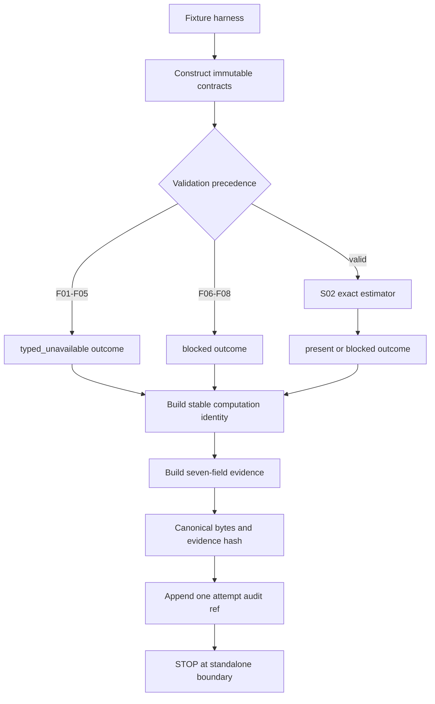

# LLD: CR173-S01 — Effective-trial input, evidence, and canonicalization contracts

## 修订记录

| 版本 | 日期 | 修订人 | 变更要点 |
|---|---|---|---|
| 1.0 | 2026-07-16 | meta-dev | 首版 full LLD；冻结四类 immutable contract、七字段 7/7、八类 failure、canonical numeric/bytes/hash、稳定 computation identity 与 append-only attempt audit 分层。 |
| 1.1 | 2026-07-16 | meta-dev | 补齐 checker 所需的 `工程依据`、`技术细节`、`DoD` 显式语义标记，不改变设计合同。 |
| 1.2 | 2026-07-16 | meta-dev | 同步 CP5 Round-1 权威基线：冻结 `EffectiveTrialAttemptBasisV1` 七项 schema、外置 `ComputationAttemptAudit` owner/linkage 与 persistence/retention=N/A、F03/F04 唯一边界、A/B recovery、T01-T04 和 public 双 lane 六计数。 |
| 1.3 | 2026-07-17 | meta-dev | CP5 pointer-only refresh：将 §0 权威指针刷新为 HLD/Domain/ADR v1.2 与 Feature DESIGN/TEST-PLAN/TASKS v0.3；normative contract delta=`0`。 |

> 本文已由用户在 CP5 批准并成为实现合同，当前 `confirmed=true`；授权仍仅限 T01-T04 的 repository-local 实现与本地验证。

## 0. 上游设计依据

### 工程依据

| 来源 | 路径 / ID | 被本 LLD 消费的内容 |
|---|---|---|
| HLD v1.2 | `docs/design/HLD-EFFECTIVE-TRIAL-OFFLINE-METHODOLOGY.md` §4-5/9-10 | attempt-basis 七项、stable computation ref、外置 audit、F03/F04、public 双 lane |
| Domain Map v1.2 | `docs/design/DOMAIN-MAP-EFFECTIVE-TRIAL-OFFLINE-METHODOLOGY.md` §领域对象/输入合同/Canonical attempt basis | 第七字段、audit owner/linkage/lifecycle、persistence/retention=N/A |
| ADR v1.2 | `docs/design/ARCHITECTURE-DECISION-EFFECTIVE-TRIAL-OFFLINE-METHODOLOGY.md` ADR-001..005 | 方法/输入 owner、stable identity/audit、F03/F04、public 计数分层 |
| Feature Matrix | `docs/design/FEATURE-DESIGN-MATRIX.md#cr173-cp4-增量effective-trial-offline-estimator` | `full-lld` 判定、3 Story / 3 Wave / 12 Task |
| Feature DESIGN v0.3 | `docs/features/effective-trial-offline-estimator/DESIGN.md` §2-6/9-12 | estimator-only 边界、attempt basis/audit、reason enum、hash domain |
| Feature TEST-PLAN v0.3 | `docs/features/effective-trial-offline-estimator/TEST-PLAN.md` §2/4/5/7 | 7/7、F01-F08 basis、1 computation/hash+3 audits、public 双 lane |
| Feature TASKS v0.3 | `docs/features/effective-trial-offline-estimator/TASKS.md` Wave 1 | T01-T04 的 object/basis/ref/recovery 映射 |
| CP5 Round-1 findings | `process/checks/CP5-CR173-LLD-REVIEW-FINDINGS.md` F-001..003 | required finding 的精确关闭合同 |
| Story | `process/stories/STORY-CR173-S01-contract-evidence-canonicalization.md` | AC、文件所有权、依赖和禁止路径 |
| CP4 | `process/checks/CP4-CR173-STORY-DAG-PARALLEL-SAFETY.result.json` | CP4 PASS；primary owner 唯一；实现仍锁定 |

输入一致性结论：权威基线 freshness 为 HLD/Domain/ADR=`1.2/1.2/1.2`、Feature DESIGN/TEST-PLAN/TASKS=`0.3/0.3/0.3`。Feature=1、Story=3、Wave=3、Task=12；本 Story=Wave 1、Task=4；public projection Feature/Story/Task=`0/0/0`。

## 1. Goal

在不触碰既有 public C1 合同的前提下，创建 S01 独占的 repository-local immutable 合同与 canonicalization 边界，使 S02/S03 对相同安全输入获得唯一七字段 evidence bytes/hash，并使 8/8 failure 都 fail-closed、保留可追加审计证据且绝不回退为 `raw_trial_count`。

量化完成效果：

- 四类核心 contract 定义 `4/4`，七个 evidence 顶层键始终 `7/7`。
- 非 `present` 的 count=null 覆盖 `8/8` failure reason，computation identity ref 非空 `8/8`。
- canonical numeric token、canonical bytes、method hash 和 evidence hash 对等价内容均只有 `1` 种表示。
- raw alias、strategy identity、binary float 均为 `0`。
- 同一 `EffectiveTrialAttemptBasisV1` + outcome 的 3/3 repeat 为 `1 computation ref + 1 evidence hash + 3 attempt audit refs`。
- public 分层计数为：CR173 新代码 dependency edge/call/production diff/write=`0/0/0/0`；CP7 read-only inventory=`12/12`、existing expected edits=`0`。

## 2. Requirements（Functional / Non-Functional）

### 2.1 Functional

| ID | 需求 | 可计算验收 |
|---|---|---|
| S01-FR-01 | 定义 `SealedTrialIdentity`、`DependencyMatrixEnvelope`、`EffectiveTrialMethodSpec`、`EffectiveTrialEvidence` immutable values | 对象 `4/4`；可变字段 `0` |
| S01-FR-02 | 七字段 schema 与 `present/typed_unavailable/blocked` 状态规则 | 顶层键 `7/7`；合法 state `3/3` |
| S01-FR-03 | 冻结 `ok` 加 8 个非 ok reason 与唯一 failure precedence | reason `9/9`；枚举失败 `8/8` |
| S01-FR-04 | canonical decimal grammar、exact rational parser、一次 half-even renderer | float/Decimal→float/exponent/负零入口 `0` |
| S01-FR-05 | versioned canonical JSON bytes、method hash、evidence hash | 同对象 byte/hash 表示 `1/1` |
| S01-FR-06 | 冻结 `EffectiveTrialAttemptBasisV1` 七项 canonical schema 与 F01-F08 basis oracle | 七项 `7/7`；run/case/ordinal/time/worker/random/audit ref 进入 basis 的接受数 `0` |
| S01-FR-07 | stable computation identity 与外置 append-only audit 分层，恢复不覆盖旧 attempt | 3/3=`1 computation ref + 1 evidence hash + 3 audits`；recovery A/B parent/supersedes `1/1` |
| S01-FR-08 | public 边界双 lane | new-code dependency edge/call/diff/write=`0/0/0/0`；read-only regressions=`12/12`；expected edits=`0` |

### 2.2 Non-Functional

| ID | 目标 | 指标 |
|---|---|---|
| S01-NFR-01 确定性 | 输入、spec、outcome 相同则 canonical identity/bytes/hash 相同 | 3/3 repeat 仅 1 组 identity/bytes/hash |
| S01-NFR-02 可追溯性 | evidence 可定位 input、method、computation；attempt 另有追加审计 | present refs `3/3` 非空；orphan 接受数 `0` |
| S01-NFR-03 安全 | 不读取 secret/real data，不推断 strategy，不写 public | credential/real/provider/runtime/strategy/public write=`0/0/0/0/0/0` |
| S01-NFR-04 兼容性 | CR173 新代码不形成 public 集成；既有回归只读 | new-code edge/call/diff/write=`0/0/0/0`；inventory/expected edits=`12/12/0` |
| S01-NFR-05 复杂度 | canonical serialization 对字段数和 payload 字节线性 | 时间 `O(payload_bytes)`；额外内存 `O(payload_bytes)` |

## 3. 模块拆分与职责

| 模块 / 文件组 | 职责 | 明确不负责 |
|---|---|---|
| `engine/effective_trial_evidence.py::contracts` | 四类 immutable values、nested status、construction invariants | 估计 matrix、计算 estimator、I/O、public projection |
| `engine/effective_trial_evidence.py::numeric` | canonical decimal 校验、exact coefficient/scale/Fraction 转换、half-even token renderer | binary float、容差比较、统计精度推断 |
| `engine/effective_trial_evidence.py::identity` | `EffectiveTrialAttemptBasisV1`、method/spec hash、stable computation identity | 把 run/case/ordinal/time/worker/random/audit ref 放入 basis |
| `engine/effective_trial_evidence.py::serialization` | 受限类型的排序键 UTF-8 canonical JSON bytes/evidence hash | 通用 JSON encoder、float/Decimal 隐式编码 |
| `engine/effective_trial_evidence.py::audit` | 定义 immutable `ComputationAttemptAudit` schema/ref generator；schema owner=methodology owner，当前 lifecycle/write owner=S03 harness | 把 audit ref 加成第八字段/hash、覆盖旧 audit、创建 production store |
| `tests/research/test_effective_trial_evidence_contracts.py` | contract/schema/reason/numeric/hash/recovery 单元设计入口 | S02 数值算法、S03 fixture/public regression |

调用链固定为 `fixture harness → contract constructor → S02 validator/estimator → evidence builder → canonical serializer → standalone evidence → S03 external audit`；到外置 repository-local audit 后停止。public 新代码同步修改面固定为 0；12/12 existing regressions 是独立只读 lane。

## 4. 代码结构与文件影响范围

| 动作 | 文件路径 | 变更内容 | Owner |
|---|---|---|---|
| 创建 | `engine/effective_trial_evidence.py` | 四类 contract、status/reason、numeric token、identity、serializer、attempt audit | S01 独占 |
| 创建 | `tests/research/test_effective_trial_evidence_contracts.py` | T01-T04 对应的 contract/canonical/recovery 单元测试 | S01 独占 |

Story frontmatter 所列 8 个 public production 路径均 forbidden。S01 的可机械验证边界是 `cr173_new_code_public_dependency_edges=0`、`cr173_new_code_public_calls=0`、`public_production_diff=0`、`public_writes=0`；S02/S03 primary 文件修改数为 0。CP7 另行运行 12/12 read-only inventory，不能与新代码 counter 混算。

## 5. 数据模型与持久化设计

### 5.1 Immutable 输入与方法对象

| 对象 / 字段 | 类型 | 约束 | 失败分类 |
|---|---|---|---|
| `SealedTrialIdentity.sealed_family_ref` | non-empty str | repository fixture ref；不得含 strategy identity | missing→`missing_sealed_identity` |
| `sealed_family_hash` | versioned sha256 ref | 与 sealed identity canonical bytes 一致 | mismatch→`identity_or_input_integrity_mismatch` |
| `raw_trial_count` | int | `n≥1`；仅作维度/上界 provenance，不得作为结果 fallback | missing/invalid→unavailable；与 IDs 矛盾→blocked |
| `ordered_trial_ids` | tuple[str,...] | 非空、唯一、canonical 顺序、长度=n | duplicate/count/order mismatch→blocked |
| `DependencyMatrixEnvelope.schema_version` | str | v1 固定 schema | missing→`missing_dependency_matrix`；unsupported→F03 |
| `ordered_trial_ids` | tuple[str,...] | 与 sealed identity 1:1 | mismatch→F06 |
| `matrix_tokens` | tuple[tuple[str,...],...] | 仅保存 token；S02 负责 domain/PSD | missing→F02；grammar unsupported→F03 |
| `input_hash` | versioned sha256 ref | 覆盖 labels、tokens、source/schema | mismatch→F06 |
| `input_lineage_ref` | non-empty str | 与当前 validation binding 一致 | orphan/mismatch→F06 或 F08 |
| `source_mode` | enum | v1 仅 `declared_exact` | other→F03 |
| `EffectiveTrialMethodSpec.method_id` | str | 固定 `spectral_participation_ratio` | missing→F05；other→F07 |
| `method_version` | str | 批准的 v1 值 | missing→F05；mismatch→F07 |
| `method_hash` | versioned sha256 ref | 等于 canonical spec descriptor hash | missing→F05；mismatch→F07 |
| `canonical_spec_descriptor` | immutable mapping | 覆盖 formula/grammar/PSD/range/rounding/renderer/schema/reason | mismatch→F07 |

### 5.2 七字段 evidence

| 顶层字段 | present | typed_unavailable / blocked |
|---|---|---|
| `effective_trial_count` | `CanonicalNumberToken`，且 `1≤x≤n` | 必须 `null` |
| `effective_trial_count_status` | `{state:"present",reason_code:"ok"}` | 对应 state/reason |
| `effective_trial_method` | 已验证 method ID | 仅在完整验证后保留，否则 `null` |
| `effective_trial_method_version` | 已验证 version | 仅在完整验证后保留，否则 `null` |
| `effective_trial_method_hash` | 已验证 spec hash | 仅在完整验证后保留；mismatch 时不得伪造 |
| `effective_trial_input_lineage_ref` | validation-bound ref | 可验证片段可保留；missing/orphan 时 `null` |
| `effective_trial_computation_ref` | stable content-addressed computation identity | 始终非空，包括 8/8 failure |

顶层字段不得增加、删除或使用 alias；`raw_trial_count` 不出现在 evidence 顶层。status 的 `state/reason_code` 是一个嵌套字段，不构成第八个顶层键。

### 5.3 `EffectiveTrialAttemptBasisV1` canonical schema

所有七个键始终存在；缺失组件用显式 absent/null marker，不得省略键：

| # | 字段 | Canonical 内容 | F01-F08 与禁止项 |
|---:|---|---|---|
| 1 | `basis_schema` | 固定 `quant-lab.effective-trial-attempt-basis.v1` | 未知 schema→F03 |
| 2 | `validation_stage` | `construction|token_parse|method|integrity|matrix_domain|evidence` | F03 发生于 parser 前；F04 只在 matrix_domain |
| 3 | `presence_bitmap` | identity/envelope/method 三个布尔位 | F01/F02/F05 用 absent marker |
| 4 | `component_snapshot_digests` | identity、dependency raw-token tree、method、attempted-evidence 的 restricted canonical UTF-8 digest/absent marker | F03 digest 保留非法字符串 token tree；F04 digest 只来自 finite exact-rational matrix |
| 5 | `validated_refs` | input lineage ref、approved method hash 或 null marker | 只保留已验证片段；禁止合成 |
| 6 | `primary_failure_id` | `none|F01..F08` | 与固定 precedence 唯一一致 |
| 7 | `outcome` | state、reason code、canonical count token/null | 与七字段 evidence 一致 |

basis 禁止包含 `verification_run_ref`、`synthetic_case_id`、repeat/attempt ordinal、时钟、worker、随机数或 `attempt_audit_ref`。接受数必须为 0。

`effective_trial_computation_ref = sha256("quant-lab.effective-trial-computation.v1" || canonical(EffectiveTrialAttemptBasisV1))`。同 basis/outcome 的 computation ref 唯一且进入第七字段；canonical evidence hash 由七字段 bytes 重算。method hash 必须覆盖 basis schema、F03/F04 mapping/precedence 和 stable derivation。

### 5.4 外置 `ComputationAttemptAudit`

| 字段 | 类型 / 规则 |
|---|---|
| `attempt_audit_ref` | audit-domain v1 对下列链接字段内容寻址 |
| `verification_run_ref` / `synthetic_case_id` / `attempt_ordinal` | S03 repository-local harness 显式提供；同 run/case ordinal 不得复用 |
| `effective_trial_computation_ref` / `canonical_evidence_hash` | 必须分别链接第七字段 stable identity 与可重算 evidence hash |
| `state` / `reason_code` | 与 evidence 完全一致；F01-F08 均有 audit |
| `parent_attempt_audit_ref` / `supersedes_attempt_audit_ref` | recovery B 指向 A；A 保留 |
| `diagnostic_codes` | 仅安全枚举；不得复制 raw payload、真实数据或 secret |

identity 公式为 `sha256(audit-domain-v1 + run + case + ordinal + computation ref + evidence hash + parent/supersedes markers)`。schema owner=`methodology owner`；当前 lifecycle/write owner=`S03 repository-local verification harness`。audit 不进入七字段、method hash或evidence hash。

当前 persistence=`N/A`、retention=`N/A`：只允许 immutable/in-memory repository-local append-only collection 模拟与断言，不创建 production store/catalog/pointer/writer。未来持久化必须独立 CR。

### 5.5 Repeat 与 recovery identity

- 同一未修正 basis/outcome 的 3/3 repeat：`1 computation ref + 1 evidence hash + 3 attempt audit refs`。
- failure A：保留 stable computation ref A、evidence hash A、audit A。
- 修正 input 或 method version 后 basis 改变，生成 computation ref B、evidence hash B、audit B；B 的 parent/supersedes 指向 A。
- A/B 覆盖、删除或 ref 重用的接受数为 0；未修正输入重复执行只新增 audit，不改变 computation/evidence identity。

持久化变更：无。S01 只定义 pure immutable contracts、canonical bytes 与 audit schema/ref generator，不执行生产写入。

## 6. API / Interface 设计

| 接口 / 入口 | 调用方向与时机 | 输入 | 输出 | 失败 / 降级 | 后续衔接 / 调用方同步 |
|---|---|---|---|---|---|
| `validate_canonical_decimal_token` | constructor/S02 → numeric；解析前 | str、max_scale=12 | `CanonicalDecimal(coefficient,scale)` | 任一 non-canonical token（含 NaN/Inf）→F03；不得进入 matrix validator | S02 exact rational；new-code public edge/call=0/0 |
| `render_half_even_number_token` | S02/evidence builder → numeric；evidence 边界且仅 1 次 | exact Fraction、max_scale=12 | `CanonicalNumberToken` | invariant/renderer contradiction→F08 blocked；不 clamp | evidence builder；new-code public edge/call=0/0 |
| `validate_contract_bundle` | fixture harness/S02 → contracts；estimator 前 | identity、envelope、spec | validated bundle 或 typed failure | 固定 precedence；不得默认 method/raw | valid→S02；failure→builder；new-code public edge/call=0/0 |
| `build_attempt_basis_v1` | validator/evidence builder → identity；每个 outcome | 七项完整字段 | canonical `EffectiveTrialAttemptBasisV1` | 缺键、stage/reason/digest 冲突→F08 | stable ref；run/case/ordinal/audit 输入禁止 |
| `build_computation_identity` | evidence builder → identity；每个 outcome | canonical `EffectiveTrialAttemptBasisV1` | stable content-addressed ref | basis 不可 canonicalize→F08 blocked | 写入第七字段；new-code public edge/call=0/0 |
| `build_effective_trial_evidence` | validator/S02 → builder；每个 canonical outcome | validated refs、outcome、stable computation ref | immutable 七字段 evidence | null/ref/invariant 违例→F08 blocked | canonical serializer；不得接收 audit ref |
| `canonical_evidence_bytes/hash` | builder/verifier → serializer；构造后 | 七字段 evidence | 唯一 UTF-8 bytes + domain hash | float/Decimal/未知类型/缺键→F08 | S03 repeat oracle；new-code public edge/call=0/0 |
| `build_attempt_audit` | S03 harness → audit；每次 verification execution 后 | run/case/ordinal、stable ref、evidence hash、state/reason、parent/supersedes | immutable外置 audit | ref 重用/覆盖/链接不一致→F08 | in-memory append-only collection；不改变 evidence hash |

所有接口均为 repository-local pure Python；网络、环境变量、credential、provider、lake/NAS、runtime/trading、publish/deploy、Git remote 调用均为 0。任何需要 public C1 adapter 的新代码调用都以 scope violation 拒绝，不提供降级 adapter。§8.5 单独定义 read-only regression lane。

## 7. 核心处理流程

逐步流程：

1. constructor 只接受显式参数，先建立 presence bitmap；不读取目录、环境、真实 lineage 或 strategy。
2. 按 F01→F08 固定 precedence 校验；non-canonical token（含 NaN/Inf）在 parser 前唯一 F03，只有全部 token 解析为有限 exact rational 才允许进入 F04 matrix-domain。
3. 把 S02 的 exact outcome 映射为 `present` 或 F04/F08；任何非 present count 强制为 null。
4. 构造七项完整 `EffectiveTrialAttemptBasisV1`，再计算 stable computation identity；basis 不得使用 run/case/ordinal、时钟、worker、随机数或 audit ref。
5. 构造七字段 immutable evidence，并再次执行字段数、null/ref、state/reason consistency 校验。
6. serializer 对受限类型递归编码，排序键、无空白、UTF-8，numeric token 原样嵌入；计算 domain-separated evidence hash。
7. S03 harness 用明确 run/case/ordinal、computation ref、evidence hash、parent/supersedes 创建外置 append-only audit；audit ref 不进入 evidence bytes。
8. 返回 standalone evidence/audit pair 并停止；CR173 新代码 public edge/call/diff/write 保持 `0/0/0/0`。12/12 existing regression 仅在 CP7 read-only lane 执行。

恢复流程：失败 attempt A 保留；输入修正或 method version 更新后创建 attempt B。A/B audit refs 不同，若 outcome 内容不同则 computation identity/hash 也不同；禁止原地覆盖 A。

## 8. 技术设计细节（技术细节）

### 8.1 Failure precedence 与 reason enum

| 顺序 | Failure ID / reason | state | 触发 |
|---:|---|---|---|
| 1 | F01 `missing_sealed_identity` | typed_unavailable | identity 必填片段缺失 |
| 2 | F02 `missing_dependency_matrix` | typed_unavailable | matrix/envelope 必填片段缺失 |
| 3 | F03 `unsupported_dependency_representation` | typed_unavailable | representation/source/schema 或任一 non-canonical string token；包括 NaN/Inf/exponent/负零，发生在 exact parser 前 |
| 4 | F05 `missing_method_spec` | typed_unavailable | method ID/version/hash/spec 缺失 |
| 5 | F06 `identity_or_input_integrity_mismatch` | blocked | count/labels/input hash/lineage 矛盾或 tamper |
| 6 | F07 `method_spec_mismatch` | blocked | method/spec/version/hash 与批准 v1 不一致 |
| 7 | F04 `invalid_dependency_matrix_domain` | typed_unavailable | 所有 token 已解析为有限 exact rational 后，shape/symmetry/diag/range/PSD domain 非法 |
| 8 | F08 `evidence_integrity_mismatch` | blocked | orphan/forged ref、canonical bytes/hash/null/invariant 矛盾 |

同一输入命中多个问题时只返回上述最高优先级 reason，并在 attempt audit 的内部 diagnostics 列出其余安全摘要；diagnostics 不进入七字段，不改变 canonical evidence identity。F03/F04 以“全部 raw token 成功解析为 finite exact rational”为不可跨越边界：NaN/Inf 等 F03 输入调用 F04 validator 的次数必须为 0。

### 8.2 Canonical decimal 与 half-even

- grammar：`0`，或无前导零的非零整数，或带 1..12 位小数且末位非零的普通十进制；负号仅允许非零值。
- 禁止 exponent、`NaN`、`Inf`、`-0`、`.5`、`01`、`1.0`、尾零及超过 12 位小数。
- parser 直接生成整数 coefficient 与 scale，再约分为 exact Fraction；任何函数签名不得接受 float。
- output 先对 `q*10^12` 做整数商余数比较；余数小于/大于/等于一半分别向下/向上/向偶数舍入。只执行 1 次。
- renderer 从整数与 scale 输出 token，并剥离非必要尾零；整数输出 `1` 而非 `1.0`。渲染后由 S02 执行第二次 `[1,n]` 检查。

### 8.3 Canonical bytes/hash

1. serializer 仅接受 null、bool、int、str、tuple/list、string-key mapping 与 `CanonicalNumberToken`；float/Decimal/bytes/未知对象全部拒绝。
2. mapping key 按 Unicode code point 递增；字符串使用确定性 JSON escaping；分隔符无空白；最终 UTF-8。
3. `CanonicalNumberToken` 经过语法与范围验证后原样写入，不能交给通用 float encoder。
4. hash 使用长度前缀的 `domain || payload` 结构，避免字符串拼接歧义。evidence domain 固定为 `quant-lab.effective-trial-evidence.spectral-participation-ratio.v1`。
5. method hash 覆盖 formula、input grammar、F03/F04 mapping/precedence、exact PSD 规则、范围、精度、rounding、renderer、七字段 schema、reason enum、`EffectiveTrialAttemptBasisV1` schema、stable computation-ref derivation与serialization；外置 audit schema/domain 单独版本化且不进入 method/evidence hash。

### 8.4 兼容性与偏离

- 不复用 current public 4-field alias，不把 `effective_ref` 兼容映射成两个 provenance refs。
- 不把 decimal count 强制转 int，不新增临时 adapter，不修改 public expected。
- S01 与上游偏离记录：无。若实现需要第八个 evidence 顶层字段、float、随机 computation ref 或 public write，立即 `NEEDS_DESIGN_CLARIFICATION`。
- 图示类型：流程图；跨 contract、validator、estimator、builder、serializer、audit 六个职责且含三类异常路径。

### 8.5 Public counter 双 lane

| Lane | Counter | 目标 | 采集边界 |
|---|---|---:|---|
| CR173 new-code integration | `cr173_new_code_public_dependency_edges` | 0 | 仅扫描 CR173 新增 source/test 对 8 个 public production module 的 dependency edge |
| CR173 new-code integration | `cr173_new_code_public_calls` | 0 | 仅统计 CR173 新代码发起的 public type/adapter/gate 调用 |
| CR173 new-code integration | `public_production_diff` | 0 | 8 个 production path 的 CR173 diff |
| CR173 new-code integration | `public_writes` | 0 | public artifact/store/type 写操作 |
| CP7 read-only verification | `cp7_read_only_public_regression_inventory` | 12/12 | 权威 existing regression/authorization path 只读运行；其既有 public 调用不计入 new-code counter |
| CP7 read-only verification | `existing_expected_edits` | 0 | existing tests/fixtures expected 修改数 |

任一 new-code edge/call、production diff/write 或 expected relaxation 均 fail-closed。不得以“不运行 12/12”伪造 new-code counter 为 0。

## 9. 安全与性能设计

| 维度 | 设计措施 | 验证方式 |
|---|---|---|
| 输入安全 | 只接受显式 immutable fixture values；无 path/provider/env/credential reader | forbidden import/call static scan；计数 0 |
| 完整性 | domain-separated hash、presence bitmap、字段/状态/ref consistency | mutation/orphan/forged tests `100%` 拒绝 |
| 最小权限 | pure functions，无 I/O、store、catalog、network、runtime | operation class counters 全部 0 |
| Public 隔离 | 新代码与只读回归分 lane | edge/call/diff/write=`0/0/0/0`；inventory/expected edits=`12/12/0` |
| 时间复杂度 | contract/hash 与 payload 大小线性；不复制真实数据 | serializer `O(payload_bytes)` |
| 空间复杂度 | 构造一次 canonical bytes；无历史 store | `O(payload_bytes)`；append-only persistence N/A |

拒绝超限 payload 的具体仓库通用上限若未来需要，作为独立非功能设计输入重访；本 fixture-only v1 不自行发明生产限额。

## 10. 测试设计

| 测试 ID / 场景 | 前置条件 | 操作 | 预期结果 | 对应接口 |
|---|---|---|---|---|
| S01-T-01 四类 immutable contract | synthetic values | 构造后尝试字段 mutation | 4/4 构造成功；mutation 接受 0 | constructors |
| S01-T-02 七字段 present | validated identity/method/outcome | build + serialize | 顶层键 7/7；count/ref 规则 7/7 | builder/serializer |
| S01-T-03 缺字段参数化 | 每次删除 1 个顶层键 | validate/serialize | 7/7 case present 数 0；F08 blocked | serializer |
| S01-T-04 F01-F08 basis | F01..F08 inputs | build 七项 basis + evidence | 七项 `7/7` 逐字段 oracle；count=null、stable ref非空；run/case/ordinal/audit进入basis=0 | basis/validation/builder |
| S01-T-05 canonical grammar / F03 | 正向 5 token + NaN/Inf/exponent/-0/.5/01/1.0/>12/trailing zero | parse | 正向 exact；负向 `100%` F03；F04 validator calls=0 | decimal parser |
| S01-T-06 half-even/render | integer、16/7、上下 tie | render 1 次 | token 与 oracle 完全相等；float bridge=0 | number renderer |
| S01-T-07 key/UTF-8/hash | 同值不同构造顺序 | serialize/hash 3 次 | bytes/hash `1/1` 唯一 | serializer/hash |
| S01-T-08 stable vs audit | 同 basis/outcome 3 次 | build evidence + 3 audits | `1 computation ref + 1 evidence hash + 3 audit refs` | identity/audit |
| S01-T-09 recovery A/B | failure A 后修正 input/method 为 B | 创建 B 并链接 parent/supersedes | A computation/evidence/audit保留；B 三 ref 全新；覆盖=0 | audit/builder |
| S01-T-10 public 双 lane | CR173 changed/import/call manifest + 权威12-set | scoped scan/read-only inventory assertion | edge/call/diff/write=`0/0/0/0`；inventory/expected edits=`12/12/0` | all |

每个 §6 接口至少由上述 1 个测试覆盖；接口覆盖 `8/8`。测试仅为设计，CP5 前不创建或运行。

## 11. 实施步骤

| TASK-ID | 动作 | 目标文件 | 详细描述 | 对应测试 |
|---|---|---|---|---|
| CR173-F01-T01 | 创建 | `engine/effective_trial_evidence.py` | 定义四类核心 contract + 外置 `ComputationAttemptAudit`；schema/lifecycle owner 显式，persistence/retention=N/A | S01-T-01/02/03 |
| CR173-F01-T02 | 创建 | `engine/effective_trial_evidence.py` | 冻结 `EffectiveTrialAttemptBasisV1` 七项、F01-F08 precedence、F03 token-parse/F04 finite-domain 唯一映射 | S01-T-04/05 |
| CR173-F01-T03 | 创建 | `engine/effective_trial_evidence.py` | 实现 stable computation ref、canonical bytes/evidence hash、独立 audit-ref generator；audit不进入method/evidence hash | S01-T-06/07/08 |
| CR173-F01-T04 | 创建 | `tests/research/test_effective_trial_evidence_contracts.py` | 落地 7/7、F01-F08 basis、3/3=1 computation/hash+3 audits、A/B recovery parent/supersedes、public双lane | S01-T-01..10 |

文件影响 `2/2` 均被 TASK 覆盖；TASK `4/4` 均至少覆盖一个文件与一个测试入口。执行顺序固定 T01→T02→T03→T04；只有 CP5 全量批准且 `design_evidence_confirmed=true` 后才可开始。

## 12. 风险、难点与预研建议

### 12.1 实现灰区与取舍记录

| Clarification ID | 问题 | 选项与推荐 | 决策 / 答案 | 影响面 | 证据 | 重访条件 |
|---|---|---|---|---|---|---|
| LCQ-CR173-S01-01 | repeat hash 唯一与 append-only attempt ref 是否冲突 | 推荐：stable computation identity + 外置 attempt audit 两层；备选：attempt ref 进入 evidence（破坏重复 hash） | RESOLVED：权威 HLD/Domain/ADR v1.2 与 Feature 0.3 已采用推荐；不阻塞 | schema/hash/recovery/S03 oracle | HLD §5.3、Domain Map §Canonical attempt basis、ADR-003/005 | 独立 CR 修改七字段或 audit persistence |
| LCQ-CR173-S01-02 | non-present 是否保留 method/input metadata | 推荐：仅保留已完整验证片段；备选：全部 null（审计弱）；禁止：合成默认值 | 采用推荐；按 reason 确定保留，computation ref始终非空 | failure mapping/audit | ADR-003/005、Feature DESIGN §5.2 | reason enum 或 privacy/authz 边界变化 |

阻塞 clarification=`0`；无需写 QUESTION-LEDGER。上表均由已批准证据直接收敛，没有待用户决策项。

| 风险 / 难点 | 影响 | 缓解措施 / 预研建议 |
|---|---|---|
| R-CR173-RAW-EFFECTIVE-ALIAS | 数值相等被误作 raw provenance | schema 不含 raw alias；method/input/computation refs 3/3；negative test |
| canonical serializer 出现双表示 | hash 漂移、3/3 失败 | 受限类型、raw numeric token、排序键、domain/version；byte oracle |
| identity/hash 循环依赖 | 无法稳定生成 ref | computation identity 只依赖 attempt basis/method/outcome，不依赖 evidence hash；hash 后置 |
| append-only 被误写成覆盖 | 审计链丢失 | audit object 独立、ref uniqueness、A/B parent/supersedes；persistence/retention=N/A |
| public 4→7 字段被偷渡 | 跨 owner/contract 破坏 | 双 lane 六计数、future CR only |

### 12.2 Gotchas

- `n_eff=n` 是合法 estimator 输出，但没有 method/input/computation provenance 时仍不得视为 effective evidence。
- `effective_trial_computation_ref` 是 stable canonical computation identity；每次执行的 append-only `attempt_audit_ref` 是外置审计引用，不能互换。
- `typed_unavailable` 表示缺失/unsupported/domain invalid；`blocked` 表示矛盾/tamper/forged。只断言 count=null 不足以验证分类。
- 12 位小数是 serialization contract，不是对真实统计估计精度的声明。
- 通用 `json.dumps` 若接收 float/Decimal 或自行格式化 numeric token，会破坏唯一 bytes；必须使用受限 serializer。
- 本 LLD 中出现未来文件路径不表示已创建实现；CP5 前实现数必须保持 0。

### OPEN / Spike 跟踪

| ID | 类型 | 问题 | 状态 | 下一动作 | 责任方 |
|---|---|---|---|---|---|
| N/A | 无 | 当前 LLD open item 数为 0；audit persistence/retention 已明确 N/A，future persistence 与 empirical/tolerance 均属于独立 CR 触发条件 | RESOLVED/OUT-OF-SCOPE | 无当前动作 | methodology owner / Host |

## 13. 回滚与发布策略

- 发布方式：本 Story 仅作为 estimator-only Wave 1 新模块与单元测试随 CR173 发布；不做 public projection、migration、runtime activation。CP8 claim 上限为 `offline_method_ready`，本 Story 单独不形成该 claim。
- 前置条件：CP5 全量设计证据批准、`design_evidence_confirmed=true`、文件 owner 无冲突；否则发布操作数 0。
- 回滚触发：任一 7/7 schema、8/8 failure、canonical bytes/hash、raw/public zero guard 不满足，或出现 float/随机 identity/覆盖旧 attempt。
- 回滚动作：删除/禁用仅由 S01 新增的两个文件与 import；standalone evidence 回到 typed unavailable。既有 public C1 文件、schema、Gate1 blocker、DSR/admission 行为无需迁移且保持 byte/semantic-equivalent。
- 数据回滚：persistence/retention=`N/A/N/A`，无 migration、store/catalog/pointer/writer；当前 audit 仅 immutable/in-memory verification collection。

## 14. Definition of Done（DoD）

- [ ] 0-14 全部章节与修订记录、Gotchas、OPEN 状态已填写。
- [ ] 四类 immutable contract `4/4`、七字段 `7/7`、state `3/3`、failure `8/8` 可由测试直接计算。
- [ ] present/null/ref 规则覆盖 `9/9` outcomes（ok + 8 failure）。
- [ ] `EffectiveTrialAttemptBasisV1` 七项 `7/7`，F01-F08 逐项 oracle 完整；run/case/ordinal/time/worker/random/audit ref 进入 basis=`0`。
- [ ] canonical decimal/half-even/bytes/hash 无 float/tolerance/default/alternate token 路径，禁止路径计数 `0`。
- [ ] F03/F04 唯一：NaN/Inf 等 non-canonical token→F03，F04 只接 finite exact rational matrix；F03→F04 调用数=`0`。
- [ ] stable computation identity/evidence hash 与外置 audit 已分层，3/3=`1 computation ref + 1 evidence hash + 3 audits`；A/B parent/supersedes `1/1`。
- [ ] `ComputationAttemptAudit` schema owner、current lifecycle/write owner、linkage 完整；persistence/retention=`N/A/N/A`。
- [ ] §6 接口 `8/8` 在 §10 各有至少 1 条测试；文件 `2/2`、TASK `4/4` 映射完整。
- [ ] Feature/Story/Wave/Task 保持 `1/3/3/12`；public projection Feature/Story/Task=`0/0/0`。
- [ ] public 双 lane：new-code edge/call/diff/write=`0/0/0/0`；read-only inventory/expected edits=`12/12/0`。
- [ ] clarification blocking=`0`；open_items=`0`。
- [x] `confirmed=true`、Story `design_evidence_confirmed=true`；CP5 前实现、测试、fixture、runtime、远程写操作数均为 `0`。

## 人工确认区

> CP5 由 Host Orchestrator 收齐 S01-S03 三份 full LLD 和自动预检后统一发起。本文件不得自行发起门禁。

| # | 检查项 | 状态 | 证据 |
|---:|---|---|---|
| 1 | LLD 覆盖 Story AC | approved | §2/10/14 |
| 2 | 与 HLD / ADR 一致 | approved | §0/8/12 |
| 3 | 文件影响与 TASK 明确 | approved | §4/11 |
| 4 | 接口契约完整 | approved | §6 |
| 5 | 测试与 dev_gate 可计算 | approved | §10/14 |
| 6 | clarification queue 收敛 | approved；blocking=0 | §12.1 |

**人工审查结果回填（Host 管理）**

- 结论：待 CP5
- 审查人：
- 审查时间：
- 修改意见：
- 风险接受项：
