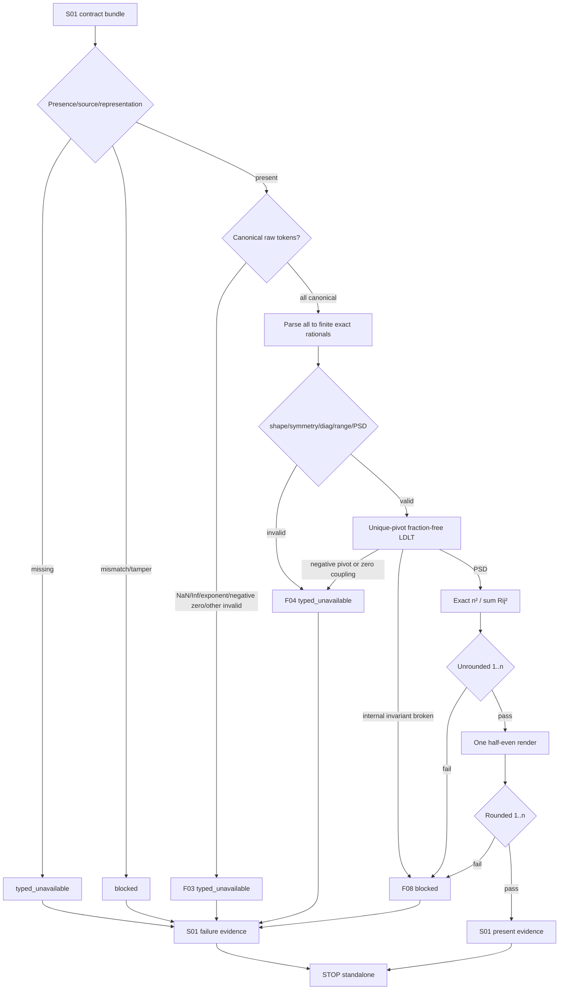

# LLD: CR173-S02 — Exact-rational spectral participation-ratio estimator

## 修订记录

| 版本 | 日期 | 修订人 | 变更要点 |
|---|---|---|---|
| 1.0 | 2026-07-16 | meta-dev | 首版 full LLD；冻结 validation precedence、唯一 symmetric-pivot comparator、fraction-free exact `LDLᵀ`、zero-pivot residual coupling、精确公式、双 invariant 与一次 half-even。 |
| 1.1 | 2026-07-16 | meta-dev | 修正 §8.4/§10 PSD negative oracle：两个失败矩阵先满足 shape/symmetry/unit-diagonal/range，再分别到达 negative pivot 与 zero-pivot residual-coupling 分支。 |
| 1.2 | 2026-07-16 | meta-dev | 同步 CP5 Round-1 权威基线：NaN/Inf 等 non-canonical token 唯一 F03、F04 仅 finite exact-rational matrix domain；T05/T08 与 public 新代码/12回归双 lane 六计数同步。 |
| 1.3 | 2026-07-17 | meta-dev | CP5 pointer-only refresh：将 §0 权威指针刷新为 HLD/Domain/ADR v1.2 与 Feature DESIGN/TEST-PLAN/TASKS v0.3；normative contract delta=`0`。 |

> 本文已由用户在 CP5 批准并成为实现合同，当前 `confirmed=true`；T05-T08 仍须等待 S01 依赖满足后方可执行。

## 0. 上游设计依据

### 工程依据

| 来源 | 路径 / ID | 被本 LLD 消费的内容 |
|---|---|---|
| HLD v1.2 | `docs/design/HLD-EFFECTIVE-TRIAL-OFFLINE-METHODOLOGY.md` §3-5/9-12 | participation ratio、F03/F04 parser-domain 边界、exact numeric、public 双 lane |
| Domain Map v1.2 | `docs/design/DOMAIN-MAP-EFFECTIVE-TRIAL-OFFLINE-METHODOLOGY.md` §输入合同/业务规则 | raw token 与 parsed matrix 两层输入合同 |
| ADR v1.2 | `docs/design/ARCHITECTURE-DECISION-EFFECTIVE-TRIAL-OFFLINE-METHODOLOGY.md` ADR-001..005 | method/input owner、PSD/rounding、F03/F04、public 计数分层 |
| Feature Matrix | `docs/design/FEATURE-DESIGN-MATRIX.md#cr173-cp4-增量effective-trial-offline-estimator` | full-lld policy、S01→S02→S03 顺序 |
| Feature DESIGN v0.3 | `docs/features/effective-trial-offline-estimator/DESIGN.md` §4-6/9-12 | validator/estimator、F03/F04、LDLᵀ、formula、风险 |
| Feature TEST-PLAN v0.3 | `docs/features/effective-trial-offline-estimator/TEST-PLAN.md` §2-5/7-10 | NaN/Inf F03、finite F04、4 类 PSD oracle、public 双 lane |
| Feature TASKS v0.3 | `docs/features/effective-trial-offline-estimator/TASKS.md` Wave 2 | T05-T08 的 parser/domain/algorithm/test 映射 |
| CP5 Round-1 findings | `process/checks/CP5-CR173-LLD-REVIEW-FINDINGS.md` F-002/F-003 | required finding 的精确关闭合同 |
| S01 LLD | `process/stories/STORY-CR173-S01-contract-evidence-canonicalization-LLD.md` | immutable contracts、exact token/parser、reason precedence、evidence builder |
| Story | `process/stories/STORY-CR173-S02-exact-spectral-estimator.md` | AC、文件所有权、S01 contract 依赖 |
| CP4 | `process/checks/CP4-CR173-STORY-DAG-PARALLEL-SAFETY.result.json` | CP4 PASS；Wave 2 串行、同 Wave 冲突 0 |

输入一致性结论：权威基线 freshness=`HLD/Domain/ADR 1.2 + Feature 0.3`。S02 只读 S01 contracts，实施必须等待 S01 frozen/merged。Feature/Story/Wave/Task=`1/3/3/12`；S02 Task=`4`。

## 1. Goal

创建只消费 S01 validated contracts 的 repository-local pure estimator：以唯一、无 tolerance、无 binary float 的 exact-rational 流程验证 declared-exact correlation matrix，使用 deterministic symmetric-pivot fraction-free `LDLᵀ` 判定 PSD，并计算 `n²/ΣRᵢⱼ²`，在 evidence 边界一次 half-even 后生成 non-alias outcome。

量化完成效果：

- identity/positive-correlation/fully-correlated/singleton analytic oracle `4/4`。
- positive definite/singular PSD/negative pivot/zero-pivot residual coupling algorithm oracle `4/4`。
- 未舍入和舍入后 `[1,n]` invariant `2/2`；half-even 执行次数=`1`。
- float/tolerance/clamp/eigen solver/implicit conversion 路径=`0/0/0/0/0`。
- NaN/Inf/exponent/负零等 non-canonical token→F03 `100%`；F03 输入进入 F04 validator=`0`；F04 input 为 finite exact rational `100%`。
- 相同 normalized input/method 的 result/computation identity/evidence hash=`1/1/1`。
- public 双 lane：new-code dependency edge/call/diff/write=`0/0/0/0`；read-only inventory/expected edits=`12/12/0`。

## 2. Requirements（Functional / Non-Functional）

### 2.1 Functional

| ID | 需求 | 可计算验收 |
|---|---|---|
| S02-FR-01 | 先验证 representation/source/raw token grammar，再验证 finite exact-rational matrix domain | F03/F04 stage `2/2` 唯一；双重映射 `0` |
| S02-FR-02 | S01 canonical decimal token 解析为 exact rational | 正向 token exact；NaN/Inf等F03；F04 calls=0；float bridge=0 |
| S02-FR-03 | 使用唯一 symmetric pivot comparator | 任一 residual state 仅 1 个 pivot/结论 |
| S02-FR-04 | 使用 fraction-free exact `LDLᵀ` 验证 PSD | 4 类 PSD branch oracle `4/4` |
| S02-FR-05 | zero pivot residual coupling fail-closed | coupling 非零接受为 PSD 的 case `0` |
| S02-FR-06 | exact 计算 `q=n²/ΣRij²` | analytic oracle `4/4` exact |
| S02-FR-07 | 未舍入/舍入后双 invariant + 一次 half-even | checks `2/2`；round `1`；clamp `0` |
| S02-FR-08 | outcome 交给 S01 builder并停止于 standalone；public 双 lane | new-code edge/call/diff/write=`0/0/0/0`；inventory/expected edits=`12/12/0` |

### 2.2 Non-Functional

| ID | 目标 | 指标 |
|---|---|---|
| S02-NFR-01 确定性 | comparator、消元、sum、rounding 不依赖迭代顺序/平台 float | 3/3 repeat 仅 1 result/hash |
| S02-NFR-02 正确性 | 对 exact PSD correlation matrix 严格 `1≤q≤n` | exact proof + 双 runtime invariant `2/2` |
| S02-NFR-03 Fail-closed | unsupported/domain invalid 不调用 result builder 的 present 路径 | 8/8 failure present=0 |
| S02-NFR-04 性能 | validation 主成本 cubic，formula quadratic | time `O(n³)`；space `O(n²)` |
| S02-NFR-05 最小权限 | pure CPU/memory；无 I/O、provider、runtime、public consumer | forbidden operation counters 全 0 |

## 3. 模块拆分与职责

| 模块 / 文件组 | 职责 | 明确不负责 |
|---|---|---|
| `engine/effective_trial_estimator.py::normalization` | 组合 S01 parser；raw token/representation/source 在 parser 前判 F03；只把 finite exact rationals 交给 matrix-domain F04 | 估计 matrix、修复/接受 NaN/Inf、默认 method |
| `engine/effective_trial_estimator.py::exact_psd` | 正整数缩放、唯一 comparator、fraction-free symmetric `LDLᵀ`、PSD proof | tolerance、浮点 eigen/cholesky、随机 pivot |
| `engine/effective_trial_estimator.py::participation_ratio` | exact square sum、`n²/sum`、第一 invariant | alpha/FWER/DSR/tail calibration |
| `engine/effective_trial_estimator.py::output` | 调用 S01 一次 half-even renderer、第二 invariant、返回 outcome | 构造 public projection、持久化 evidence |
| `tests/research/test_effective_trial_estimator.py` | parser/domain/pivot/PSD/formula/rounding/determinism 单元入口 | S01 contract mutation、S03 public regression |

调用方向固定为 `fixture harness → S01 raw-token contract/F03 → finite exact-rational normalization → matrix-domain/F04 → exact PSD → formula → S01 renderer/builder`。失败在所属阶段立即返回；F03 不得进入 F04，S02 新代码不得调用 public consumer。

## 4. 代码结构与文件影响范围

| 动作 | 文件路径 | 变更内容 | Owner |
|---|---|---|---|
| 创建 | `engine/effective_trial_estimator.py` | normalization、exact PSD、participation ratio、output invariant | S02 独占 |
| 创建 | `tests/research/test_effective_trial_estimator.py` | T05-T08 数值/算法/失败/确定性单元测试 | S02 独占 |

只读 `engine/effective_trial_evidence.py`；若 S01 接口不足，回 S01/设计澄清，S02 不得修改。S02 必须满足 `cr173_new_code_public_dependency_edges=0`、`cr173_new_code_public_calls=0`、`public_production_diff=0`、`public_writes=0`；S03 fixture/test 文件修改数=0。

## 5. 数据模型与持久化设计

| 对象 / 字段 | 类型 | 约束 | 说明 |
|---|---|---|---|
| `NormalizedDependencyInput.n` | int | `n≥1`，等于 IDs 和 matrix 维度 | 从 validated S01 identity 得到 |
| `ordered_trial_ids` | tuple[str,...] | 唯一、canonical、与 envelope 1:1 | 决定初始 row/column 与 tie-break |
| `raw_matrix_tokens` | tuple[tuple[str,...],...] | parser 前输入；任一 NaN/Inf/exponent/负零/非canonical string 唯一 F03 | 不得送入 matrix-domain validator |
| `matrix` | tuple[tuple[Fraction,...],...] | 所有 token 已解析为 finite exact rationals；再检查 n×n、symmetric、diag=1、range [-1,1]、PSD | F04 唯一入口；不允许 float/Decimal/nonfinite |
| `input_hash` / `lineage_ref` | validated refs | 与 normalized bytes 绑定 | 只传给 S01 outcome/builder |
| `method_spec` | validated S01 value | ID/version/hash 全部匹配批准 v1 | 不允许默认 spec |
| `ExactPSDProof.rank` | int | `1≤rank≤n` 对 correlation matrix | 单元测试诊断，不进入七字段 |
| `pivot_trace` | tuple[PivotStep,...] | 每步 label/pivot/sign/zero-block；确定性 | 测试/审计摘要，不影响 result identity |
| `ExactEstimatorResult.q` | Fraction | 未舍入且必须 `1≤q≤n` | 内部值，不直接 JSON 编码 |
| `count_token` | S01 `CanonicalNumberToken` | 最多12位、half-even一次、二次 invariant | 仅 present outcome 非空 |

无新增持久化设计、数据库、catalog、store、pointer 或 I/O。所有对象是单次 pure computation 的 immutable values；append-only attempt audit 由 S01 contract 定义、S03 harness 验证。

## 6. API / Interface 设计

| 接口 / 入口 | 调用方向与时机 | 输入 | 输出 | 失败 / 降级 | 后续衔接 / 同步面 |
|---|---|---|---|---|---|
| `validate_raw_token_contract` | fixture/S01 bundle → S02；matrix domain 前 | representation/source/raw string token tree | canonical tokens 或 F03 | NaN/Inf/exponent/负零等 `100%` F03；不得隐式 conversion | parser；new-code public edge/call=0/0 |
| `normalize_dependency_input` | token contract pass → S02 | identity/envelope/spec + canonical tokens | finite exact-rational `NormalizedDependencyInput` 或 F01/F02/F05/F06/F07 | 不估计/修复；nonfinite object不被允许 | matrix domain；new-code public edge/call=0/0 |
| `validate_exact_matrix_domain` | normalizer → domain；全部 token parse success 后 | finite exact-rational matrix、ordered IDs | domain-valid matrix或F04 | shape/symmetry/diag/range/PSD失败→F04；grammar输入接受数0 | formula；new-code public edge/call=0/0 |
| `select_symmetric_pivot` | PSD loop 内；每一步 | residual diagonal、canonical labels | 唯一 index 或 zero-block | 不使用 tolerance；内部不一致→F08 | exact elimination |
| `fraction_free_ldlt_step` | PSD loop 内；pivot>0 | integer residual、pivot、previous pivot | 下一 symmetric integer residual | 非整除/非对称→F08 blocked | next pivot |
| `estimate_participation_ratio_exact` | PSD pass → formula | exact matrix、n | exact `q` | denominator≤0 或 first invariant fail→F08 blocked；不 clamp | quantizer |
| `quantize_and_validate_count` | formula → S01 renderer；evidence 边界 | q、n、max_scale=12 | canonical count token | round 1 次；second invariant fail→F08 blocked | S01 builder |
| `estimate_effective_trial` | fixture harness → facade；完整 attempt | S01 contract bundle | present/unavailable/blocked outcome | 固定 precedence；无 raw fallback | S01 basis/identity/builder；new-code public edge/call=0/0 |

调用方同步修改范围：S01 暴露 contract/parser/renderer/builder；S03 只调用 facade。S02 对 S01 primary 只读。public 分层见 §8.7；若接口需要 public type 或真实 matrix producer，立即停止并转 future CR。

## 7. 核心处理流程



固定 validation precedence：

1. F01 sealed identity missing。
2. F02 dependency matrix/envelope missing。
3. F03 representation/source 或任一 non-canonical string token unsupported；包括 NaN/Inf/exponent/负零，parser 前结束，F04 calls=0。
4. F05 method spec missing。
5. F06 count/labels/input hash/lineage contradiction。
6. F07 method ID/version/hash/spec mismatch。
7. F04 仅对全部 token 已解析为有限 exact rational 后的 shape/symmetry/diag/range/PSD domain invalid。
8. F08 estimator/evidence internal invariant、canonical hash 或 ref contradiction。

任一步失败都不继续到后续 estimator 阶段；diagnostics 可记录多个安全摘要，但七字段只使用最高优先级 reason。

## 8. 技术设计细节（技术细节）

### 8.1 Exact normalization

1. 在 S01 parser 前校验 representation/source/raw token grammar；任一 NaN/Inf/exponent/负零/前导或尾零/超过12位等 non-canonical string 立即 F03，不进入后续步骤。
2. 对通过 grammar 的全部 token 直接转换为 reduced Fraction；接受 float、Decimal、nonfinite object 的数量为 0。
3. 只有得到全量 finite exact-rational matrix 后，才校验 n×n、每行长度=n、labels 与 ordered trial IDs 完全相等。
4. 用 exact equality 校验 `Rij=Rji`、`Rii=1`、`-1≤Rij≤1`，再执行 PSD；上述 domain failure 唯一 F04，不存在 epsilon/tolerance。
5. 取全部 Fraction 分母的最小公倍数 `Q>0`，构造整数对称矩阵 `A=Q·R`。正比例缩放保持 PSD，避免 binary float。

### 8.2 唯一 symmetric-pivot comparator

对当前 fraction-free residual `M` 的剩余 canonical labels，候选集为 `C={i | Mii≠0}`。比较规则按以下优先级严格全序：

1. 非零优先：只在 C 中选择；C 为空进入 zero-block 规则。
2. `|Mii|` 较大者优先，使用 exact integer comparison。
3. 绝对值相同则 signed `Mii` 较大者优先，因此 `+a` 优先于 `-a`。
4. 仍相同则 canonical trial ID 字典序较小者优先；trial ID 唯一，因此 pivot 唯一。

等价伪代码：

```text
select_pivot(M, labels, remaining):
    candidates = [i for i in remaining if M[i,i] != 0]
    if candidates is empty:
        if any(M[i,j] != 0 for i<j in remaining):
            return ZERO_PIVOT_WITH_RESIDUAL_COUPLING
        return ZERO_BLOCK_PSD_COMPLETE
    sort candidates by:
        descending abs(M[i,i]),
        descending M[i,i],
        ascending labels[i]
    return candidates[0]
```

任何 current residual negative diagonal 最终都会成为选中 pivot；一旦选中 `p<0` 立即 F04。PSD residual 不可能有负 diagonal；因此提前/延后发现不改变结论。

### 8.3 Fraction-free exact `LDLᵀ`

初始 `M=A`、`previous_pivot=1`。每轮对选中 index 做相同 row/column symmetric permutation，然后：

```text
fraction_free_ldlt(M, labels):
    previous_pivot = 1
    remaining = canonical indices
    while remaining is not empty:
        pivot_index = select_pivot(M, labels, remaining)
        if pivot_index == ZERO_BLOCK_PSD_COMPLETE:
            return PSD(rank = processed_positive_pivots)
        if pivot_index == ZERO_PIVOT_WITH_RESIDUAL_COUPLING:
            return NOT_PSD(reason = invalid_dependency_matrix_domain)

        symmetric_swap(pivot_index, first_remaining)
        p = M[k,k]
        if p < 0:
            return NOT_PSD(reason = invalid_dependency_matrix_domain)
        assert p > 0

        for i,j in remaining_after_k with i <= j:
            numerator = p*M[i,j] - M[i,k]*M[j,k]
            if numerator % previous_pivot != 0:
                return BLOCKED(reason = evidence_integrity_mismatch)
            next[i,j] = next[j,i] = numerator / previous_pivot

        previous_pivot = p
        remove k
    return PSD(rank = processed_positive_pivots)
```

说明：

- positive pivot 的 symmetric Schur congruence 保持 inertia；负 diagonal 或 zero diagonal with nonzero residual coupling 均证明非 PSD。
- zero residual row/column 不参与除法；当所有剩余 diagonal=0 时，任一非零 coupling 都使对应 2×2 principal block 具有正负 eigenvalues。
- Bareiss-style previous-pivot exact division 是 fraction-free invariant；非整除表示实现/contract 自相矛盾，分类为 F08 blocked，不得改用 Fraction/float 偷渡。
- 每一步保留 symmetric integer residual；不求 eigenvalues，不调用第三方数值库。

### 8.4 四类算法 oracle

| Oracle | Matrix / labels | 预期 pivot/branch | 预期结论 |
|---|---|---|---|
| O-PSD-01 positive definite | `[[1,0.5],[0.5,1]]` / a,b | 初始 tie→a；下一 residual positive `3/4` 等价量 | PSD，rank=2 |
| O-PSD-02 singular PSD | 3×3 all-ones / a,b,c | 初始 tie→a；剩余 zero block/coupling=0 | PSD，rank=1 |
| O-PSD-03 indefinite negative pivot | 3×3 equicorrelation `ρ=-0.9` / a,b,c | shape/symmetry/diag/range 均通过；首个正 pivot 后 residual 最终出现 negative pivot | F04 NOT_PSD |
| O-PSD-04 zero-pivot residual coupling | `[[1,1,1],[1,1,-1],[1,-1,1]]` / a,b,c | shape/symmetry/diag/range 均通过；首个正 pivot 后剩余 residual diag=0 且 coupling非零 | F04 NOT_PSD |

O-PSD-03/04 必须先断言基础 domain checks `4/4`（shape、symmetry、unit diagonal、range）通过，证明测试真正到达 exact PSD 分支。另加 permutation oracle：同一 matrix 按其 labels 同步重排后先 canonicalize 回 ordered IDs，pivot trace/result/hash 与基线相同 `1/1/1`。

### 8.5 Formula、双 invariant 与一次 half-even

```text
sum_sq = sum(R[i,j] * R[i,j] for all ordered i,j)  # exact Fraction
if sum_sq <= 0: BLOCKED F08
q = Fraction(n*n, 1) / sum_sq
if not (1 <= q <= n): BLOCKED F08                 # invariant 1
token = S01.render_half_even_number_token(q, 12)  # exactly once
q_rendered = S01.parse(token)
if not (1 <= q_rendered <= n): BLOCKED F08        # invariant 2
return PRESENT(token)
```

四个 analytic oracle：

- `I₄`: sum=4，q=4，token `4`。
- n=4、equicorrelation ρ=0.5：sum=7，q=16/7，token `2.285714285714`。
- 4×4 all-ones：sum=16，q=1，token `1`。
- singleton `[[1]]`: sum=1，q=1，token `1`。

任一 invariant fail 都是内部/证据矛盾 F08 blocked；禁止 clamp 为 1 或 n。二阶 effective dimension claim 不扩张为 FWER、DSR、tail 或 admission。

### 8.6 兼容性与偏离

- 不估计 correlation matrix，不接受 empirical/real source，不读取 returns/manifest/directory。
- 不接受 tolerance PSD、float eigen solver、随机 pivot、alternate formula、二次 rounding。
- 不修改 S01 contract；若 Bareiss exact-division 或 S01 renderer 合同需变更，返回设计层，不在 S02 局部兼容。
- 图示类型：流程图；验证、四类 failure branch、算法与输出边界跨 5 个阶段。

### 8.7 Public counter 双 lane

| Lane | Counter | 目标 | S02 责任 |
|---|---|---:|---|
| CR173 new-code integration | `cr173_new_code_public_dependency_edges` | 0 | estimator/source/test 不 import 8 个 public production module |
| CR173 new-code integration | `cr173_new_code_public_calls` | 0 | estimator/source/test 不调用 current public type/adapter/gate |
| CR173 new-code integration | `public_production_diff` | 0 | 8 个 production path 无 CR173 diff |
| CR173 new-code integration | `public_writes` | 0 | 无 public artifact/store/type write |
| CP7 read-only verification | `cp7_read_only_public_regression_inventory` | 12/12 | 由 S03/CP7 执行；既有 public 调用不计入 S02 new-code counter |
| CP7 read-only verification | `existing_expected_edits` | 0 | S02 不修改 existing expected |

任一 new-code edge/call、production diff/write 或 expected relaxation均 fail-closed；不得跳过 12/12 回归来维持零计数。

## 9. 安全与性能设计

| 维度 | 设计措施 | 验证方式 |
|---|---|---|
| 数值安全 | exact token→Fraction→integer residual；无 float/tolerance/clamp | type/static scan + negative tests，计数 `0/0/0` |
| 完整性 | labels/hash/method 先校验；F06/F07 优先于 domain present | mismatch fixtures present=0 |
| 最小权限 | pure CPU/memory，无 I/O/secret/provider/runtime | forbidden imports/operations 全 0 |
| Public 隔离 | facade 只返回 S01 standalone outcome；双 lane 分离 | edge/call/diff/write=`0/0/0/0`；inventory/expected edits=`12/12/0` |
| 时间 | normalization/formula `O(n²)`，fraction-free elimination `O(n³)` | 单元级 operation bounds；不声明生产 SLA |
| 空间 | matrix/residual/pivot trace `O(n²)` | 无持久化、无 unbounded history |

整数位宽随 exact 消元增长；v1 fixture 规模由 repository fixtures 控制。若未来引入生产规模或资源 SLA，必须在 activation CR 定义 n 上限/benchmark，不在本 offline LLD 伪造阈值。

## 10. 测试设计

| 测试 ID / 场景 | 前置条件 | 操作 | 预期结果 | 对应接口 |
|---|---|---|---|---|
| S02-T-01 grammar / F03 | canonical positives + NaN/Inf/exponent/-0/.5/01/1.0/>12/trailing zero | raw-token validate | 正向 exact；负向 `100%` F03；F04 calls=0；float bridge=0 | raw token contract |
| S02-T-02 finite matrix / F04 | 全 token parse 为 finite exact rational 的 shape/symmetry/diag/range/PSD variants | 参数化 domain 校验 | domain failure `100%` F04；noncanonical input接受=0；label/hash mismatch F06 | normalize/domain |
| S02-T-03 pivot total order | magnitude/sign/label tie cases | select pivot | 每个 case 仅 1 index；platform/order drift=0 | select pivot |
| S02-T-04 positive definite | O-PSD-01 | exact LDLT | PSD rank=2 | PSD/step |
| S02-T-05 singular PSD | O-PSD-02 | exact LDLT | zero block pass，rank=1 | PSD/step |
| S02-T-06 negative pivot | O-PSD-03；基础 domain 4/4 通过 | exact LDLT | 到达 negative-pivot branch；F04；present=0 | PSD/step |
| S02-T-07 zero residual coupling | O-PSD-04；基础 domain 4/4 通过 | exact LDLT | 到达 zero-coupling branch；F04；tolerance/clamp=0 | PSD |
| S02-T-08 analytic formula | I4/ρ=.5/all-ones/singleton | exact estimator | `4/4` oracle exact | formula/facade |
| S02-T-09 double invariant injection | controlled internal contradiction | formula/output | check `2/2`；任一 fail→F08；clamp=0 | formula/quantize |
| S02-T-10 half-even ties | exact below/above/equal tie | quantize | renderer 调用=1；expected token exact | quantize |
| S02-T-11 repeat/permutation | normalized same input 3次 + label-synced reorder | facade | result/computation/hash `1/1/1` | facade |
| S02-T-12 authorization/claim/public lane | changed/import/call manifest + 权威12-set | scoped static/read-only assertions | new-code edge/call/diff/write=`0/0/0/0`；inventory/expected edits=`12/12/0`；overclaim=0 | all |

§6 接口 `8/8` 各有至少 1 条测试；4 类 algorithm oracle `4/4`、4 类 analytic oracle `4/4`。测试仅为设计，CP5 前不创建或运行。

## 11. 实施步骤

| TASK-ID | 动作 | 目标文件 | 详细描述 | 对应测试 |
|---|---|---|---|---|
| CR173-F01-T05 | 创建 | `engine/effective_trial_estimator.py` | non-canonical token（含 NaN/Inf）parser 前唯一 F03；仅 finite exact rationals 进入 shape/symmetry/diag/range/PSD F04 | S02-T-01/02 |
| CR173-F01-T06 | 创建 | `engine/effective_trial_estimator.py` | 实现唯一 comparator、正整数缩放、fraction-free exact `LDLᵀ` 与 zero coupling | S02-T-03..07 |
| CR173-F01-T07 | 创建 | `engine/effective_trial_estimator.py` | 实现 exact formula、双 invariant、调用 S01 half-even 1 次、返回 outcome | S02-T-08/09/10 |
| CR173-F01-T08 | 创建 | `tests/research/test_effective_trial_estimator.py` | 落地 F03/F04 不可重叠、4+4 oracle、repeat/permutation 与 public双lane/claim tests | S02-T-01..12 |

文件 `2/2` 均被 TASK 覆盖；TASK `4/4` 均有测试。执行顺序固定 T05→T06→T07→T08；实施入口还需 CP5 approved、S01 contract frozen/merged、file-conflict-free。

## 12. 风险、难点与预研建议

### 12.1 实现灰区与取舍记录

| Clarification ID | 问题 | 选项与推荐 | 决策 / 答案 | 影响面 | 证据 | 重访条件 |
|---|---|---|---|---|---|---|
| LCQ-CR173-S02-01 | pivot comparator 如何在正/负/零/tie 下唯一 | 推荐：nonzero→abs desc→signed desc→label asc；备选：固定无 pivot（稳定性差）；禁止 tolerance/随机 | 采用推荐；总序可证明；不阻塞 | algorithm/tests/hash | HLD §4.2、Feature DESIGN §6.2、TEST-PLAN §5、handoff | method version 或 PSD algorithm 变化 |
| LCQ-CR173-S02-02 | singular PSD 的 zero pivot 如何处理 | 推荐：全 zero residual block pass；任一 residual coupling nonzero fail；备选：浮点容差（禁止） | 采用推荐；exact branch唯一；不阻塞 | failure/oracle | ADR-002、HLD §4.2、O-PSD-02/04 | empirical/tolerance 输入被授权 |
| LCQ-CR173-S02-03 | fraction-free invariant 非整除如何分类 | 推荐：F08 blocked；备选：静默转 Fraction（掩盖实现差异） | 采用推荐；不阻塞 | internal integrity/recovery | S01 F08、Bareiss invariant | algorithm contract 切换 |

阻塞 clarification=`0`；无需写 QUESTION-LEDGER。唯一 comparator、singular PSD 行为和 4 类 oracle 已在本 LLD 冻结，因此不触发 handoff 的 `NEEDS_DESIGN_CLARIFICATION` 停线条件。

| 风险 / 难点 | 影响 | 缓解措施 / 预研建议 |
|---|---|---|
| R-CR173-METHOD-NONDETERMINISM | repeat hash 漂移 | total-order comparator、exact arithmetic、canonical order、3/3 oracle |
| fraction-free integer 增长 | fixture 执行成本上升 | v1 fixture-only、O(n³)/O(n²) 明示；future activation 再定规模 |
| zero pivot 被 tolerance 接受 | indefinite matrix 伪装 PSD | exact zero、residual coupling oracle、tolerance imports=0 |
| double invariant 被 clamp 掩盖 | forged present | 两次 exact check，任一失败 F08 blocked，clamp=0 |
| second-order estimand overclaim | 错误 FWER/DSR/admission claim | method 名/limitation/static wording guard；风险 residual accepted |

### 12.2 Gotchas

- comparator 的 label tie-break 使用 matrix 已 canonicalize 后的 ordered trial IDs；不能使用 Python insertion order、hash order 或原始 fixture 顺序。
- 选到 negative pivot 才 fail 并不遗漏更小的 negative diagonal；positive Schur elimination 保持 inertia，后续仍会精确暴露。
- zero diagonal + nonzero off-diagonal coupling 不是“数值接近 0”，而是 exact indefinite 证据；禁止 tolerance。
- formula 直接平方和，不需要 eigenvalue 排序；PSD validator 仍是有效域门槛，不能因公式可计算就跳过。
- half-even 恰好一次发生在 evidence 边界；测试内部若再次量化会掩盖实现错误。
- 输出等于 raw count n 仍必须携带独立 method/input/computation provenance，不构成 alias。

### OPEN / Spike 跟踪

| ID | 类型 | 问题 | 状态 | 下一动作 | 责任方 |
|---|---|---|---|---|---|
| N/A | 无 | 当前 LLD open item 数为 0；future empirical/tolerance 与 alpha/tail/FWER 均为独立 CR/Spike 触发条件 | RESOLVED/OUT-OF-SCOPE | 无当前动作 | methodology owner / Host |

## 13. 回滚与发布策略

- 发布方式：Wave 2 仅新增 pure estimator 与 unit tests；依赖 S01 contract，输出到 S01 standalone builder；不接 public C1。
- 前置条件：CP5 approved、S01 contract frozen/merged、`design_evidence_confirmed=true`。任一未满足时实现/发布数 0。
- 回滚触发：4/4 PSD oracle、4/4 analytic oracle、2/2 invariant、once-only half-even、3/3 repeat 或 zero authorization 任一失败。
- 回滚动作：删除/禁用 S02 两个新文件/import，使 S01 继续返回 typed unavailable；S01 audit/failed attempts append-only 保留。public C1、Gate1、DSR、admission 行为不变且无 migration。
- 禁止降级：不得回滚为 float/tolerance/eigen solver/raw count；无法满足 exact contract 时整体保持 unavailable。

## 14. Definition of Done（DoD）

- [ ] 0-14 章节、修订记录、技术细节、Gotchas、OPEN 状态完整。
- [ ] validation precedence F01/F02/F03/F05/F06/F07/F04/F08 唯一，8/8 failure present=0。
- [ ] NaN/Inf/exponent/负零等 non-canonical token→F03 `100%`，F03 输入进入 F04 validator=`0`；F04 input 为 finite exact rational `100%`。
- [ ] pivot comparator 为 exact total order；4 类 PSD oracle `4/4` 可直接实现；O-PSD-03/04 的基础 domain `4/4` 先通过且目标分支可达。
- [ ] fraction-free `LDLᵀ` 伪代码覆盖 positive/negative/zero/非整除分支。
- [ ] analytic oracle `4/4`，公式 `n²/ΣRij²` 唯一，无 alternative method。
- [ ] 未舍入/舍入后 invariant `2/2`；half-even=`1`；float/tolerance/clamp/eigen solver=`0/0/0/0`。
- [ ] §6 接口 `8/8` 在 §10 各有测试；文件 `2/2`、TASK `4/4` 映射完整。
- [ ] Feature/Story/Wave/Task=`1/3/3/12`；public projection Feature/Story/Task=`0/0/0`。
- [ ] public 双 lane：new-code edge/call/diff/write=`0/0/0/0`；read-only inventory/expected edits=`12/12/0`。
- [ ] clarification blocking=`0`、open_items=`0`；S02 pivot/singular PSD 停线条件已满足。
- [x] `confirmed=true`、Story `design_evidence_confirmed=true`；CP5 前实现、测试、fixture、runtime、远程写均为 `0`。

## 人工确认区

> CP5 由 Host Orchestrator 收齐 S01-S03 三份 full LLD 和自动预检后统一发起。本文件不得自行发起门禁。

| # | 检查项 | 状态 | 证据 |
|---:|---|---|---|
| 1 | LLD 覆盖 Story AC | approved | §2/10/14 |
| 2 | 与 HLD / ADR 一致 | approved | §0/8/12 |
| 3 | 文件影响与 TASK 明确 | approved | §4/11 |
| 4 | 接口/算法契约完整 | approved | §6/8 |
| 5 | 测试与 dev_gate 可计算 | approved | §10/14 |
| 6 | clarification queue 收敛 | approved；blocking=0 | §12.1 |

**人工审查结果回填（Host 管理）**

- 结论：待 CP5
- 审查人：
- 审查时间：
- 修改意见：
- 风险接受项：
