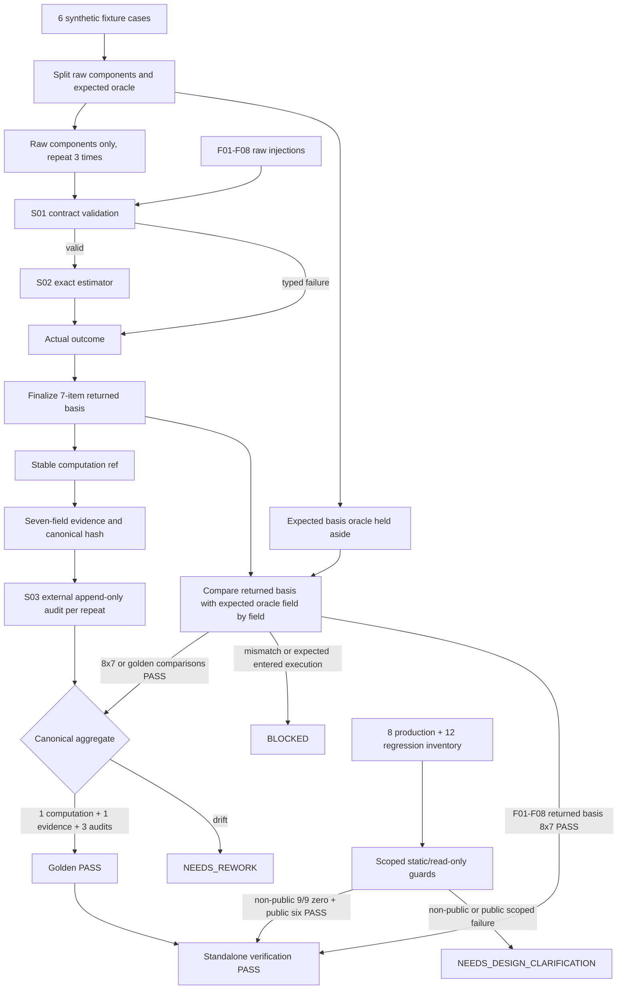

# LLD: CR173-S03 — Golden-vector, failure-recovery, and public-boundary verification

## 修订记录

| 版本 | 日期 | 修订人 | 变更要点 |
|---|---|---|---|
| 1.0 | 2026-07-16 | meta-dev | 首版 full LLD；冻结 6 类 golden×3/3、8/8 failure、7-field mutation/orphan、stable result identity 与 append-only attempt audit、8+12 public inventory、zero-operation/diff/call/overclaim guard。 |
| 1.1 | 2026-07-16 | meta-dev | 按最小读取授权补齐 §0/§8.4 Dependency Map 精确 12/12 regression/authorization 路径；记录 read expansion event，不扩展其他章节。 |
| 1.2 | 2026-07-16 | meta-dev | 同步 CP5 Round-1 权威基线：补齐 `EffectiveTrialAttemptBasisV1` 七项 F01-F08 oracle、外置 audit owner/linkage/N/A lifecycle、NaN/Inf→F03、A/B recovery、T09-T12 与 public 双 lane 六计数。 |
| 1.3 | 2026-07-16 | meta-dev | 关闭 CP5 Round-2 required findings：`presence_bitmap` 严格收敛为 identity/envelope/method 三位；actual outcome 后置 finalize basis，expected oracle 仅事后逐字段比较；非 public forbidden inventory 冻结为独立 9/9，public 六指标继续分 lane。 |
| 1.4 | 2026-07-17 | meta-dev | CP5 pointer-only refresh：将 §0 权威指针刷新为 HLD/Domain/ADR v1.2 与 Feature DESIGN/TEST-PLAN/TASKS v0.3；normative contract delta=`0`。 |

> 本文已由用户在 CP5 批准并成为实现合同，当前 `confirmed=true`；T09-T12 仍须等待 S01/S02 依赖满足后方可执行。

## 0. 上游设计依据

### 工程依据

| 来源 | 路径 / ID | 被本 LLD 消费的内容 |
|---|---|---|
| HLD v1.2 | `docs/design/HLD-EFFECTIVE-TRIAL-OFFLINE-METHODOLOGY.md` §5/7-12/14-16 | attempt basis、audit owner/lifecycle、6×3、F03/F04、public 双 lane |
| Domain Map v1.2 | `docs/design/DOMAIN-MAP-EFFECTIVE-TRIAL-OFFLINE-METHODOLOGY.md` §Canonical attempt basis/状态机/业务规则 | 七项 basis、外置 audit schema/linkage、persistence/retention=N/A |
| ADR v1.2 | `docs/design/ARCHITECTURE-DECISION-EFFECTIVE-TRIAL-OFFLINE-METHODOLOGY.md` ADR-003..005 | stable identity/audit、F03/F04、public 分层、A/B recovery |
| Feature Matrix | `docs/design/FEATURE-DESIGN-MATRIX.md#cr173-cp4-增量effective-trial-offline-estimator` | full-lld policy、S03 verification ownership |
| Feature DESIGN v0.3 | `docs/features/effective-trial-offline-estimator/DESIGN.md` §2-5/7-12 | estimator-only、basis/audit、reason、Story/rollback |
| Feature TEST-PLAN v0.3 | `docs/features/effective-trial-offline-estimator/TEST-PLAN.md` §2-10 | 1 computation/hash+3 audits、F01-F08 basis、F03/F04、public 双 lane |
| Feature TASKS v0.3 | `docs/features/effective-trial-offline-estimator/TASKS.md` Wave 3 | T09-T12 的 fixture/QAC/new-code/read-only 映射 |
| CP5 Round-1 findings | `process/checks/CP5-CR173-LLD-REVIEW-FINDINGS.md` F-001..003 | Round-1 required finding 的关闭合同 |
| CP5 Round-2 findings | `process/checks/CP5-CR173-LLD-REVIEW-R2-FINDINGS.md` F-CR173-CP5-R2-001/002 | 三位 bitmap、actual-outcome 后置 basis、expected-oracle 隔离、non-public 9/9 |
| S01 LLD | `process/stories/STORY-CR173-S01-contract-evidence-canonicalization-LLD.md` | 七字段、reason precedence、canonical identity/hash、attempt audit |
| S02 LLD | `process/stories/STORY-CR173-S02-exact-spectral-estimator-LLD.md` | exact validator/estimator、4+4 oracle、双 invariant |
| Story | `process/stories/STORY-CR173-S03-golden-failure-boundary-verification.md` | 6+8+7+8+12 inventory、file owner、failure route；Round-2 计数歧义按权威 finding 在本 LLD 收敛为 non-public 9/9 + public 六指标 |
| Dependency Map | `docs/design/DEPENDENCY-MAP-EFFECTIVE-TRIAL-OFFLINE-METHODOLOGY.md` §Public C1 contract touch classification | 精确 8 个 production + 12 个 regression/authorization 路径与 current contract 语义 |
| CP4 | `process/checks/CP4-CR173-STORY-DAG-PARALLEL-SAFETY.result.json` | CP4 PASS；S03 在 S01/S02 implementation evidence 后执行 |

Dependency Map 是 8+12 inventory 的单一真相源。本次只按 Host 最小扩展授权读取 public inventory 章节，read expansion event=`RE-20260716T080348Z0000-f1dda4a4`；未展开其他章节。实现/CP7 必须消费下列精确 12/12 路径，missing/duplicate/extra 或 existing expected 需要修改均停线。

输入一致性结论：权威基线 freshness=`HLD/Domain/ADR 1.2 + Feature 0.3`。Feature/Story/Wave/Task=`1/3/3/12`；S03 Task=`4`；public projection Feature/Story/Task=`0/0/0`；S01/S02 是正常 runtime 前置。

## 1. Goal

创建 fixture-only、repository-local 的验证资产设计：以 6 类 declared-exact synthetic golden vectors 各重复 3 次，只把 case/raw components 送入 S01/S02，在获得 actual outcome 后 finalize `EffectiveTrialAttemptBasisV1`，再生成 stable computation ref、七字段 evidence/hash 与外置 audit；expected basis oracle 始终旁路保存，只在返回后逐字段比较。覆盖 8 类 fail-closed、七字段 mutation/orphan、A/B recovery、non-public 9/9 forbidden inventory，并用 public 双 lane证明 CR173 新代码没有集成 public C1，而 12/12 existing regressions 仍可只读验证 current 语义不恶化。

量化完成效果：

- golden class/repeat=`6/6 × 3/3`；每组=`1 computation ref + 1 evidence hash + 3 attempt audit refs`。
- basis 七项=`7/7`；run/case/ordinal/time/worker/random/audit ref 进入 basis=`0`；audit linkage `3/3`。
- failure class=`8/8`，present/available/PASS=`0/0/0`；七字段 mutation=`7/7` 拒绝；orphan 接受数=`0`。
- public new-code dependency edge/call/production diff/write=`0/0/0/0`；CP7 read-only inventory/expected edits=`12/12/0`。
- standalone=`1/1`；projection/write/competing-gate/overclaim/CR172-auto-resume=`0/0/0/0/0`。
- 非 public forbidden operation class=`9/9` 且各 counter=0；public 六指标独立采集，重复计数=`0`。

## 2. Requirements（Functional / Non-Functional）

### 2.1 Functional

| ID | 需求 | 可计算验收 |
|---|---|---|
| S03-FR-01 | 定义 versioned fixture schema 与 6 类 golden | schema required keys 100%；classes `6/6` |
| S03-FR-02 | 每类以相同 case/raw components 执行 3 次，actual outcome 后置 finalize basis | 每组 `1 computation ref + 1 evidence hash + 3 audits`；expected oracle 进入 facade=`0` |
| S03-FR-03 | 逐项验证 basis 七项、三位 bitmap、外置 audit owner/linkage 与 N/A lifecycle | basis `7/7`；bitmap bits=`3/3`；attempted-evidence presence bit=`0`；audit linkage=`100%`；persistence/retention=`N/A/N/A` |
| S03-FR-04 | 覆盖 F01-F08 returned basis 与 expected oracle 逐字段比较及固定 state/reason | failure `8/8`；basis field comparison=`8×7/8×7`；present/available/PASS `0`；NaN/Inf→F03 |
| S03-FR-05 | 覆盖七字段 delete/mutate/orphan/forged | delete cases `7/7` 拒绝；orphan/forged 接受 `0` |
| S03-FR-06 | 验证 recovery A/B parent/supersedes | A 三 ref保留；B 三 ref全新且链接 A；覆盖=`0` |
| S03-FR-07 | 验证 public 双 lane | new-code edge/call/diff/write=`0/0/0/0`；inventory/expected edits=`12/12/0` |
| S03-FR-08 | 验证 authorization/claim ceiling | non-public operation classes=`9/9` 且各为0；public六指标独立；projection/overclaim/CR172 resume=0 |

### 2.2 Non-Functional

| ID | 目标 | 指标 |
|---|---|---|
| S03-NFR-01 确定性 | repeat 不受执行次序、attempt ordinal、平台 float 影响 | 每组 3/3 仅 1 canonical result/hash |
| S03-NFR-02 可审计 | 每个 repeat 与 recovery 都有独立 append-only audit ref | attempt ref uniqueness `100%`；旧记录覆盖 `0` |
| S03-NFR-03 安全 | 只用 synthetic fixture；不读 secret/real/provider，不执行 strategy/runtime | non-public forbidden counters `9/9=0`；public 六指标不重复计入 |
| S03-NFR-04 兼容性 | current public effective-trial 继续 unavailable，worst-state 不改善 | 12/12 semantics PASS；public positive truth `0` |
| S03-NFR-05 范围 | 测试资产不成为 production adapter；existing regressions 只读 | new-code edge/call/diff/write=`0/0/0/0`；inventory/expected edits=`12/12/0` |

## 3. 模块拆分与职责

| 模块 / 文件组 | 职责 | 明确不负责 |
|---|---|---|
| `tests/fixtures/effective_trial/golden_vectors_v1.json` | 6 类 synthetic declared-exact input/expected oracle | 真实/empirical data、strategy identity、runtime ref |
| `tests/research/test_effective_trial_cr173_qac.py::golden` | 6×3 raw-only execution、actual outcome 后置 basis、stable computation/evidence hash、external audit linkage、expected oracle 事后比较 | 把 expected state/basis 传入 facade、public projection、重新实现 estimator |
| `test_effective_trial_cr173_qac.py::failure` | F01-F08 returned basis vs expected oracle 逐字段比较、7-field mutation/orphan/forged、recovery A/B | 用 expected outcome 构造被验证对象、放宽 reason/null/ref 或覆盖旧 audit 规则 |
| `test_effective_trial_authorization.py::static_boundary` | forbidden imports/calls/paths/claims、non-public 9/9 zero-operation counters、CR173 new-code 四计数 | 创建临时 adapter、形成 public dependency/call/write、把 public counter重复为第十类 |
| `test_effective_trial_authorization.py::public_inventory` | 8 production changed-path guard + 12/12 read-only regression inventory binding | 修改既有 expected、把 existing public calls 计入 new-code lane、改善 Gate1/admission |
| CP7 read-only regression runner | 选择权威 12/12 入口执行 current-unavailable/worst-state assertions | 把 regression PASS 解释为 C1 computable |

调用链 1：`golden fixture → QAC harness → S01 contracts → S02 estimator → S01 evidence/audit → assertions`。

调用链 2：`authorization harness → read-only changed-path/import/call/claim inventories → zero assertions → STOP`。

调用链 3：`CP7 runner → Dependency Map authoritative 12 paths → existing regressions read-only → semantics non-regression`。

## 4. 代码结构与文件影响范围

| 动作 | 文件路径 | 变更内容 | Owner |
|---|---|---|---|
| 创建 | `tests/fixtures/effective_trial/golden_vectors_v1.json` | 6 类 versioned synthetic fixture 与 expected oracle | S03 独占 |
| 创建 | `tests/research/test_effective_trial_cr173_qac.py` | 6×3 raw-only execution、actual outcome→basis→ref→evidence/hash→audit、F01-F08 returned-vs-expected basis、7-field mutation/orphan、recovery A/B、claim assertions | S03 独占 |
| 创建 | `tests/research/test_effective_trial_authorization.py` | imports/operations、non-public 9/9、CR173 new-code 四计数、12/12 read-only inventory、existing expected edit、overclaim static guard | S03 独占 |

S01/S02 source 与 8 个 public production paths 全部 read-only/forbidden，S03 修改数=`0`。权威 12 个既有 regression/authorization 文件只读，`existing_expected_edits=0`。existing regression 中合法的 current public type/adapter/gate 调用只属于 CP7 read-only verification lane，不计入 `cr173_new_code_public_calls`。不得创建任何 production source、adapter 或 migration 文件。

## 5. 数据模型与持久化设计

### 5.1 Fixture schema v1

| 字段 | 类型 | 约束 | 数量/说明 |
|---|---|---|---|
| `case_id` | str | `GV-ET-01`..`GV-ET-06` 唯一 | 6/6 |
| `schema_version` | str | fixture schema v1 | 每 case 必填 |
| `ordered_trial_ids` | list[str] | synthetic、唯一、canonical、长度=n | strategy/real identity=0 |
| `matrix_tokens` | list[list[str]] | declared exact token；失败 case 可携带明确 invalid string | 不使用 JSON number/float |
| `source_mode` | str | `declared_exact`；F03 注入 case 除外 | real/empirical=0 |
| `sealed_identity` | object | synthetic family ref/hash、raw count、IDs | 无 strategy/run/producer ref |
| `input_lineage_ref` / `input_hash` | str/null | 与 case 预期一致或明确 mismatch injection | 不引用真实 lineage |
| `method_id/version/hash` | str/null | approved v1 或 F05/F07 injection | 默认 method=0 |
| `expected_basis_oracle` | object | test-only 七项 expected basis；`presence_bitmap` 仅 identity/envelope/method 三位；attempted evidence 只在 snapshot digests | 每 case 必填；facade input count=0 |
| `expected_state/reason/count_token` | str/str/str-or-null | `expected_basis_oracle.outcome` 的便捷 assertion view，不参与 actual outcome 构造 | 每 case 必填；facade input count=0 |
| `repeat_count` | int | 固定 3 | 6/6 cases |

fixture 顶层还包含 `fixture_schema_version`、`canonical_domain` 和 cases array；不得携带 credential、path-to-real-data、strategy ID/name、runtime account 或 producer endpoint。loader 必须把每个 case 分割为 `raw_components` 与 `expected_basis_oracle` 两个不可混用的 view：只有 raw components 进入 S01/S02；expected oracle 始终由 assertion lane 持有，在 returned basis 完成后才逐字段比较。

### 5.2 六类 golden

| ID | 类别 / 输入 | 预期 outcome | 3/3 canonical 断言 | 3/3 audit 断言 |
|---|---|---|---|---|
| GV-ET-01 | n=4，`R=I₄` | present/`ok`/`4` | result/computation/evidence hash `1/1/1` | attempt refs `3/3` |
| GV-ET-02 | n=4，equicorrelation `ρ=0.5` | present/`ok`/`2.285714285714` | exact 16/7；identity/hash `1/1` | `3/3` |
| GV-ET-03 | n=4，all-ones | present/`ok`/`1` | singular PSD trace稳定；identity/hash `1/1` | `3/3` |
| GV-ET-04 | n=1，`[[1]]` | present/`ok`/`1` | 上下界同时通过；identity/hash `1/1` | `3/3` |
| GV-ET-05 | n=2，non-canonical string token（含 `NaN`/`Inf`） | typed_unavailable/F03/null | parser 前拒绝；F04/estimator calls=0；failure identity/hash `1/1` | `3/3` |
| GV-ET-06 | valid matrix，labels/input/method hash mismatch | blocked/F06或F07按固定 fixture/null | available/PASS=0；reason/identity/hash `1/1/1` | `3/3` |

GV-ET-06 必须拆成单一确定 injection，不能同时制造 F06/F07 后再由测试猜 precedence；主 golden 固定 F06，F07 在独立 failure 参数化表覆盖。

### 5.3 `EffectiveTrialAttemptBasisV1` canonical schema

`EffectiveTrialAttemptBasisV1` 是 `effective_trial_computation_ref` 的唯一 canonical basis。以下七个键始终存在；缺失组件用显式 absent/null marker 表达，禁止通过省略键表达：

| 字段 | canonical 内容 | F01-F08 oracle |
|---|---|---|
| `basis_schema` | 固定 `quant-lab.effective-trial-attempt-basis.v1` | 未知版本按 F03 处理 |
| `validation_stage` | `construction\|token_parse\|method\|integrity\|matrix_domain\|evidence` | 固定失败层，防止 F03/F04 混用 |
| `presence_bitmap` | identity/envelope/method 三个布尔位，顺序固定 | F01/F02/F05 用对应 false/absent marker；禁止 evidence 第四位 |
| `component_snapshot_digests` | identity、dependency raw-token tree、method、attempted-evidence 的 restricted canonical digest/absent marker | attempted evidence 仅在此作为第四个 snapshot digest；不得投影为 presence bit；F03 保存非法 raw string token tree 的安全 digest；F06/F07/F08 保存冲突/attempted digest |
| `validated_refs` | validation-bound input lineage ref、approved method hash 或 null marker | F04/F06/F07/F08 仅链接已验证片段 |
| `primary_failure_id` | `none\|F01..F08` | 与 precedence 唯一结果一致；F03 在解析前、F04 在有限 exact rational 解析后 |
| `outcome` | state、reason code、canonical count token/null | 进入 stable computation identity 的结果部分 |

稳定引用的唯一推导为：

`effective_trial_computation_ref = sha256("quant-lab.effective-trial-computation.v1" || canonical(EffectiveTrialAttemptBasisV1))`。

basis 禁止包含 `verification_run_ref`、case ID、repeat/attempt ordinal、时钟、worker、随机数或 `attempt_audit_ref`。F01-F08 均必须生成完整 basis；同一 basis/outcome 只能得到 1 个 stable computation ref。

生成时序严格固定为：`case/raw components → S01 contract validation → valid 时进入 S02 estimator → actual outcome → finalize 七项 basis → stable computation ref → 七字段 evidence/canonical hash → external audit`。`primary_failure_id` 和 `outcome` 必须来自 S01/S02 的 actual returned result，未得到 actual outcome 前不得 finalize basis。

`expected_basis_oracle` 是测试侧只读 expected value，不是 S01/S02 facade、validator、estimator、basis finalizer 或 evidence builder 的输入。harness 只在 returned basis 已形成后，按七个字段逐一比较 actual 与 expected；expected value 生成或影响被验证对象的接受数必须为 0。

### 5.4 外置 `ComputationAttemptAudit`

`ComputationAttemptAudit` 不是第八个 evidence 字段，也不进入 method/evidence hash。schema owner=`methodology owner`；当前 lifecycle/write owner=`S03 repository-local verification harness`。字段固定为：

- `attempt_audit_ref`
- `verification_run_ref`
- `synthetic_case_id`
- `attempt_ordinal`
- `effective_trial_computation_ref`
- `canonical_evidence_hash`
- `state`
- `reason_code`
- `parent_attempt_audit_ref`
- `supersedes_attempt_audit_ref`
- `diagnostic_codes`（仅安全 code，不含 sensitive/raw payload）

`attempt_audit_ref` 由 audit domain、run/case/ordinal、stable computation ref、evidence hash 与 parent/supersedes markers 内容寻址；同一 run/case 内不得复用。当前 persistence=`N/A`、retention=`N/A`：仅由 immutable/in-memory repository-local verification collection 模拟和断言，不创建 production audit store、catalog、pointer 或 writer。

### 5.5 Repeat 与 recovery A/B

每个 case 的 3 次相同 raw components 执行，各自独立产生 actual outcome 并后置 finalize returned basis；三份 returned basis 逐字段相同后，必须得到 `1 computation ref + 1 evidence hash + 3 attempt audit refs`。三个 audit 均链接同一 computation ref/evidence hash，ordinal 只进入 audit。

recovery A/B 固定为：failure A 的 basis、stable computation ref、evidence hash 与 audit A 全部保留；修正 input 或 method version 后生成新 basis、computation ref、evidence hash 与 audit B，B 的 `parent_attempt_audit_ref` / `supersedes_attempt_audit_ref` 指向 A。原地覆盖 A=`0`；相同未修正输入只允许新增 audit，不得改变 computation ref/evidence hash。

## 6. API / Interface 设计

| 接口 / 入口 | 调用方向与时机 | 输入 | 输出 | 失败 / 降级 | 后续衔接 / 同步面 |
|---|---|---|---|---|---|
| `load_golden_vector_fixture` | pytest fixture → JSON；测试开始 | repository-local fixture path | schema-validated `(raw_components, expected_basis_oracle)` ×6 | case/schema/count 不符或两个 view 混用→test collection FAIL | 仅 raw view进入 execution；expected view留在 assertion lane |
| `execute_case_repeat` | QAC → S01/S02 facade；每 case 3 次 | `raw_components`；repeat ordinal仅供 audit builder | actual outcome→returned basis→computation ref→evidence/hash→external audit | expected oracle 出现在 facade/finalizer 输入或不按 actual outcome 后置→BLOCKED | aggregate oracle；不调用 public adapter |
| `assert_canonical_repeat` | QAC → assertions；3 attempts 全部返回后 | 3 returned basis/evidence/audit triples + 独立 expected oracle | 七项逐字段 comparison PASS；computation/evidence `1/1`、audit `3/3` | 任一 returned field 漂移或 expected 曾进入 execution→NEEDS_REWORK/BLOCKED | recovery/boundary；不写 public surface |
| `assert_failure_matrix` | QAC → S01/S02；F01-F08 raw injections | returned basis + 独立 expected oracle | F01-F08 `8×7/8×7` 逐字段 verdict + state/reason/null/ref | 任一字段不符、positive truth 或 F03/F04 混用→NEEDS_REWORK/BLOCKED | CP7 evidence；expected oracle进入 facade=0 |
| `assert_seven_field_integrity` | QAC → S01 serializer；evidence 构造后 | 7 delete cases + mutate/orphan/forged | 全拒绝、F08 | accepted positive truth→BLOCKED | CP7 evidence；不写 public surface |
| `assert_append_only_recovery` | QAC → S01 audit；failure 修正后 | A、corrected B | A retained；B new basis/ref/hash/audit；parent/supersedes→A | overwrite/reuse/unlinked B→BLOCKED | CP7 evidence；persistence/retention=N/A |
| `assert_authorization_boundary` | auth test → AST/path/claim inventory；实现后 | S01/S02/S03 changed files、non-public 9-class set、public scoped sets | non-public `9/9=0` + public 六指标 | 任一 non-public/new-code public counter 非零、inventory≠12/12 或 expected edit非零→BLOCKED/CLARIFICATION | 两类计数独立；禁止把 public 指标重复为第十类 |
| `assert_public_inventory_unchanged` | auth/CP7 → changed paths + 12 read-only entries | authoritative 8+12 sets | `12/12` + existing expected edits=0 + semantics verdict | path count≠8/12、expected需改→DESIGN_CLARIFICATION | existing public calls仅归 read-only lane；future CR only |

接口均为测试/验证入口，不新增 production API。read-only regression 失败不降级为修改 expected；public incompatibility 只允许 future projection CR。

## 7. 核心处理流程

逐步流程：

1. 先校验 fixture 顶层 schema、case IDs `6/6`、repeat_count=`3`、strategy/real fields=`0`，并把每个 case 分割为 raw-components view 和 test-only expected-basis view。
2. 每次 repeat 只把 raw components 交给 S01 validation；valid 时才进入 S02 estimator。S01/S02 返回 actual state、reason、count 与已验证片段后，才 finalize 七项 `EffectiveTrialAttemptBasisV1`；禁止把 expected outcome/basis 作为 facade 或 finalizer 输入。
3. 对 finalized returned basis 依序生成 stable computation ref、七字段 evidence、canonical evidence hash，再由 S03 使用 repeat ordinal 生成 external audit。顺序逆转、expected oracle 进入 execution 或 outcome 预灌的接受数均为 0。
4. 在 returned basis 完成后才读取 expected oracle：golden 和 F01-F08 均逐字段比较七项；F01-F08 comparison=`8×7/8×7`，三位 bitmap 精确为 identity/envelope/method，attempted evidence 只比较 snapshot digest、不比较第四 presence bit。
5. 聚合 stable computation ref 与 canonical evidence hash，断言每组 `1/1`；独立断言 audit refs `3/3` 且 linkage=`3/3`。NaN/Inf 等 non-canonical token 在 parser 前归 F03，F04/estimator calls=0。
6. 对一个合法 evidence 分别删除 7 个顶层键，并注入字段 mutation、orphan lineage/computation ref、forged hash/invariant；接受为 present 数=0。
7. 运行 failure A→corrected B recovery；A 的 basis/computation/evidence/audit 保留，B 生成新 basis/computation/evidence/audit 并以 parent/supersedes 链接 A。
8. 运行 authorization static guard：九类 non-public operation counters 各为 0；另行计算 CR173 new-code 四个 zero counters，不把 public 指标重复计入 non-public inventory。
9. 对 8 个 production path 断言 `public_production_diff=0` 与 `public_writes=0`；对权威 12 个 existing paths read-only 执行 current-unavailable/worst-state regression，`cp7_read_only_public_regression_inventory=12/12`、`existing_expected_edits=0`。existing public calls 不计入 new-code lane。
10. 任何 regression 只有修改 expected 才能通过时返回 NEEDS_DESIGN_CLARIFICATION；不得创建 adapter。全部通过后仍只得出 standalone offline evidence，不得声明 C1 computable。

## 8. 技术设计细节（技术细节）

### 8.1 八类 failure matrix

| ID | Injection | Expected state / reason | 必须保留 | 禁止结果 |
|---|---|---|---|---|
| F01 | sealed identity 缺失 | typed_unavailable / `missing_sealed_identity` | computation ref | present/raw fallback |
| F02 | matrix/metadata 缺失 | typed_unavailable / `missing_dependency_matrix` | validated safe fragments + computation ref | estimator call |
| F03 | source/representation/numeric grammar unsupported；含 `NaN`/`Inf`、exponent、negative zero 等 non-canonical token | typed_unavailable / `unsupported_dependency_representation` | raw token tree restricted digest + computation ref | implicit conversion、进入 F04/estimator |
| F04 | token 已成功解析为有限 exact rational 后，shape/symmetry/diag/range/PSD invalid | typed_unavailable / `invalid_dependency_matrix_domain` | input/method refs if fully validated | tolerance/clamp、接收 non-canonical/nonfinite token |
| F05 | method spec 缺失 | typed_unavailable / `missing_method_spec` | input ref if validated | default method |
| F06 | labels/count/input hash/lineage mismatch | blocked / `identity_or_input_integrity_mismatch` | auditable attempted refs | forged present |
| F07 | method version/hash/spec mismatch | blocked / `method_spec_mismatch` | attempted method ref/hash in audit | auto upgrade/downgrade |
| F08 | orphan ref/canonical hash/null/invariant mismatch | blocked / `evidence_integrity_mismatch` | old evidence/audit | overwrite old attempt |

每类先由 raw injection 获得 actual outcome 和 returned basis，再与独立 expected oracle 逐字段比较；expected oracle 进入 validation/estimator/finalizer 的次数为 0。断言 returned basis 七项和 evidence 七个顶层键存在、count=null、computation identity非空。F01-F05 不合成缺失 metadata；F06-F08 保留足以审计矛盾的安全 ref，但不能把 tamper 降级为普通 unavailable。F03 case 的 F04/estimator call count=`0/0`；F04 case 必须证明 parser 已产出 finite exact-rational matrix。

### 8.2 F01-F08 returned-basis 与 expected oracle

以下表只定义 test-side expected oracle。执行时必须先从 raw injection 获得 actual outcome 并 finalize returned basis，再比较七项；表内任何 expected 值进入 facade/finalizer 的次数必须为 0。

| Failure | Expected `validation_stage` | Expected `presence_bitmap`（identity/envelope/method） | Expected snapshot / refs 要点 | Expected `primary_failure_id` / `outcome` |
|---|---|---|---|---|
| F01 | `construction` | `[false,true,true]` | identity digest=absent；不合成 identity ref | F01 + typed_unavailable/reason/null |
| F02 | `construction` | `[true,false,true]` | envelope/raw-token digest=absent；已验证 identity fragment 可保留 | F02 + typed_unavailable/reason/null |
| F03 | `token_parse` | `[true,true,true]` | raw non-canonical string token tree restricted digest；只保留解析前已验证 ref | F03 + typed_unavailable/reason/null |
| F04 | `matrix_domain` | `[true,true,true]` | finite exact-rational matrix digest；input lineage/method hash仅在已验证时保留 | F04 + typed_unavailable/reason/null |
| F05 | `method` | `[true,true,false]` | method digest=absent；已验证 input ref可保留，method ref/hash不合成 | F05 + typed_unavailable/reason/null |
| F06 | `integrity` | `[true,true,true]` | identity/input/lineage 冲突 digests；只链接验证成功的非冲突片段 | F06 + blocked/reason/null |
| F07 | `method` | `[true,true,true]` | method ID/version/hash/spec 冲突 digests；attempted/approved marker分离 | F07 + blocked/reason/null |
| F08 | `evidence` | `[true,true,true]` | attempted-evidence 仅进入第四个 snapshot digest；不新增 presence bit；旧安全 ref保留 | F08 + blocked/reason/null |

每个 returned basis 还必须逐字段比较 `basis_schema`、`validation_stage`、三位 `presence_bitmap`、`component_snapshot_digests`、`validated_refs`、`primary_failure_id` 和 actual `outcome`。F01-F08 comparison=`8×7/8×7`，unknown/omitted key、第四 presence bit、expected-driven output 接受数均为 0。

### 8.3 七字段 mutation/orphan

| Case | 数量 | 预期 |
|---|---:|---|
| 逐一删除顶层字段 | 7 | `7/7` serializer/builder 拒绝，present=0 |
| count/status 不一致 | 3 states | F08 blocked |
| method ID/version/hash 局部缺失或 mismatch | 3 refs | F05/F07，按 precedence |
| lineage orphan/mismatch | 2 | F06/F08，按 injection |
| computation ref 空/orphan | 2 | F08 blocked |
| canonical bytes/hash mutation | ≥2 | F08 blocked |

mutation 测试不得绕过正常 constructor 来生产被系统接受的 invalid object；可以在 serializer negative fixture 边界使用明确 unsafe test helper，helper 只能位于 test module。

### 8.4 Public production inventory 8/8

以下路径是 CR173 new-code integration lane 的 forbidden production inventory：

1. `engine/experiment_family_lineage.py`
2. `engine/experiment_family_lineage_store.py`
3. `engine/strategy_admission_statistical_gate.py`
4. `engine/statistical_evidence.py`
5. `engine/multiple_testing_evidence.py`
6. `engine/overfit_evidence.py`
7. `engine/cross_strategy_reliability_gates.py`
8. `engine/strategy_admission_package.py`

static test 不为证明拒绝而导入/调用这些 production 模块；changed-path/diff 由验证 harness 以只读清单输入，测试只断言交集为空。机械结果必须是 `cr173_new_code_public_dependency_edges=0`、`cr173_new_code_public_calls=0`、`public_production_diff=0`、`public_writes=0`。

### 8.5 Existing regression/authorization inventory 12/12

以下精确路径全部 read-only；每条只运行 current expected，修改 expected、fixture 或生产代码来放行的数量必须为 0：

| # | 精确测试路径 | 必须保持的 current contract 语义 |
|---:|---|---|
| 1 | `tests/research/test_experiment_family_lineage_contracts.py` | int/legacy aliases、C1 RAW_INPUT_READY、effective claim forbidden |
| 2 | `tests/research/test_trial_lineage_integrity.py` | 10 次 determinism、effective unavailable |
| 3 | `tests/research/test_trial_lineage_authorization.py` | project/attach authorization 边界 |
| 4 | `tests/research/test_trial_lineage_admission_projection.py` | 三 consumer 同一 projection、forged serialized input blocked |
| 5 | `tests/research/test_trial_lineage_legacy_admission_regression.py` | CR155 legacy package 保持 blocked |
| 6 | `tests/research/test_cross_strategy_reliability_gates.py` | Gate1 trial slot、forced effective blocker、approximation review |
| 7 | `tests/research/test_statistical_evidence_projection.py` | 三 adapter 映射、无新 gate、worst-state |
| 8 | `tests/research/test_statistical_evidence_contracts.py` | summary hash 与 effective unavailable |
| 9 | `tests/research/test_statistical_evidence_qac.py` | 三 consumer IDs、negative fail-closed |
| 10 | `tests/research/test_statistical_evidence_cr155_regression.py` | passing summary 不能改善 lineage-blocked CR155 |
| 11 | `tests/research/test_overfit_evidence.py` | DSR raw input/non-alias |
| 12 | `tests/research/test_statistical_evidence_authorization.py` | pure calculator/forbidden dependency boundary |

`cp7_read_only_public_regression_inventory=12/12`、`existing_expected_edits=0`。selected run 中 existing public type/adapter/gate 调用只属于 read-only verification lane，不计入 `cr173_new_code_public_calls`。CP7 若任一路径缺失、重复、改名未回设计，或只有修改 expected 才能通过，结论为 NEEDS_DESIGN_CLARIFICATION；不得由 S03 猜测替换路径、放宽 assertion 或修改 public contract。

### 8.6 Non-public 9/9 zero-operation 与 claim ceiling

下表是 non-public operation-class inventory 的唯一真相源，基数固定为 `9/9`：

| ID | Non-public operation class | Counter 目标 |
|---|---|---:|
| NP-01 | credential/env/account read | 0 |
| NP-02 | real data read | 0 |
| NP-03 | lake/NAS read or write | 0 |
| NP-04 | provider/network fetch | 0 |
| NP-05 | catalog/store/current-pointer write | 0 |
| NP-06 | strategy runtime/external framework/simulation | 0 |
| NP-07 | QMT/broker/trading | 0 |
| NP-08 | publish/deploy | 0 |
| NP-09 | Git remote write | 0 |

non-public inventory count=`9/9`，missing/duplicate/extra=`0/0/0`，各 counter 均为 0。§8.7 的 public 四个 new-code counters、一个 12/12 inventory 与一个 expected-edit counter 是独立六指标，不属于 NP-01..09，不得充当“第十类”或重复聚合。

claim assertions：

- 允许：`standalone offline spectral effective dimensionality`、`fixture-only`、`typed evidence`。
- 禁止正向：public C1 populated/computable、Gate1 PASS/blocker removed、DSR/FWER/tail calibrated、admission ready、Stage 3 ready、CR172 resumed/closed。
- 最高后续 CP8 claim 为 `offline_method_ready`；S03 单独 PASS 不产生 CP8 结论。

### 8.7 Public 双 lane 六计数合同

| Lane | Counter | 目标 | 采集边界 / 解释 |
|---|---|---:|---|
| CR173 new-code integration | `cr173_new_code_public_dependency_edges` | 0 | 只扫描 CR173 新 source/test asset 到 8 个 production paths 的静态 dependency edge |
| CR173 new-code integration | `cr173_new_code_public_calls` | 0 | 只统计 CR173 新代码形成的 public type/adapter/gate 调用 |
| CR173 new-code integration | `public_production_diff` | 0 | 8/8 production paths 的 CR173 diff 交集 |
| CR173 new-code integration | `public_writes` | 0 | CR173 对 public contract/store/catalog/pointer 的写入 |
| CP7 read-only verification | `cp7_read_only_public_regression_inventory` | 12/12 | 权威 existing regression/authorization paths 精确执行清单；其合法 public calls 不计入 new-code counter |
| CP7 read-only verification | `existing_expected_edits` | 0 | 任何 expected relaxation 都停线并路由 DESIGN_CLARIFICATION |

两条 lane 独立采集、独立报告，禁止汇总为含糊的全局 public-call counter。任一 new dependency edge/call/diff/write 或 expected edit 都 fail-closed。

### 8.8 兼容性与偏离

- 不创建 public adapter、migration、versioned public type 或 competing gate。
- 不修改 12 个 existing expected 以放行，不把 regression PASS 解释为 positive availability。
- 不执行真实数据/runtime/public call 来“增强”验证；static/read-only negative evidence 已足够覆盖本 CR。
- 图示类型：流程图；跨 fixture、S01、S02、audit、public inventory 与多类失败路由。

## 9. 安全与性能设计

| 维度 | 设计措施 | 验证方式 |
|---|---|---|
| Fixture 隔离 | JSON 只含 synthetic IDs/declared exact tokens；schema deny strategy/real fields | schema negative + field inventory，计数 0 |
| 权限最小化 | 不读取 secret/provider/lake，不执行 strategy/runtime/remote | non-public inventory `9/9`，NP-01..09 各为0；public 六指标独立 |
| Public 隔离 | 8 production paths forbidden；12 regressions read-only；双 lane 六计数 | new-code edge/call/diff/write `0/0/0/0`；inventory/expected edits `12/12/0` |
| 完整性 | 七项 canonical basis、stable computation/evidence hash 与 external audit 分层；mutation/orphan fail-closed | 6×3 + F01-F08 basis + 7-field + recovery A/B tests |
| 时间 | golden/failure cases 固定；主要成本由 S02 `O(n³)` | case 数 6×3 + parameterized failures |
| 空间 | fixture 和 evidence/audit collection repository-local | `O(case_count·n²)`；无持久化 |

## 10. 测试设计

| 测试 ID / 场景 | 前置条件 | 操作 | 预期结果 | 对应接口 |
|---|---|---|---|---|
| S03-T-01 fixture schema / view isolation | fixture file | load、split raw vs expected | cases 6/6、repeat=3、strategy/real fields=0；expected oracle进入 facade/finalizer=0 | load fixture |
| S03-T-02 GV-01..04 actual pipeline | S01/S02 pass | raw-only each ×3；actual outcome后 finalize | returned basis七项逐字段PASS；computation/evidence `1/1`；audit refs/linkage `3/3` | execute/assert repeat |
| S03-T-03 GV-05/06 | invalid/mismatch fixtures | each ×3 | NaN/Inf→F03；F04/estimator calls=0；state/reason/null exact；available/PASS=0 | execute/assert repeat |
| S03-T-04 F01-F08 returned basis | raw parameterized injection + held-aside oracle | run facade→actual outcome→finalize；事后比较 | `8/8` fail-closed；七项逐字段=`8×7/8×7`；bitmap三位；attempted-evidence presence bit=0 | failure matrix |
| S03-T-05 7-field delete | valid evidence | delete each field | 7/7 rejected；present=0 | seven-field integrity |
| S03-T-06 mutate/orphan/forged | negative evidence variants | validate/serialize | F05/F06/F07/F08 exact；accepted forged=0 | seven-field integrity |
| S03-T-07 append-only recovery A/B | failed A + corrected B | create B | A basis/ref/hash/audit retained；B 全新并以 parent/supersedes 链接 A；覆盖=0 | recovery |
| S03-T-08 authorization imports/ops | CR173 new files | AST/path/call scan | NP-01..09 inventory=`9/9` 且各为0；public 六指标另行采集、不重复 | authorization boundary |
| S03-T-09 public production inventory | changed-path/write manifest | intersect 8-set | inventory 8/8；`public_production_diff/public_writes=0/0` | public inventory |
| S03-T-10 existing regression inventory | authoritative 12-set | read-only selected run | `cp7_read_only_public_regression_inventory=12/12`；semantics unchanged；`existing_expected_edits=0` | public inventory |
| S03-T-11 claim ceiling | source/test/report wording inputs | deny/allow scan | standalone=1；projection/gate/DSR/admission/CR172 overclaim=0 | authorization boundary |
| S03-T-12 rollback equivalence | estimator-only files disabled | compare public assertions | public schema/unavailable/blocker/worst-state byte/semantic equivalent | public inventory |

§6 接口 `8/8` 各有测试；6 golden classes、8 failures、returned-basis comparison `8×7`、7 evidence fields、8+12 public inventory、non-public operation classes `9/9` 与 public 六指标全部可直接计算。测试仅为设计，CP5 前不创建或运行。

## 11. 实施步骤

| TASK-ID | 动作 | 目标文件 | 详细描述 | 对应测试 |
|---|---|---|---|---|
| CR173-F01-T09 | 创建 | `tests/fixtures/effective_trial/golden_vectors_v1.json` | 六类 vectors `6/6`；raw components 与 expected basis oracle 分离；GV05=`NaN`/non-canonical token 固定 F03，独立 finite-exact F04 oracle；真实/strategy字段=0 | S03-T-01/02/03 |
| CR173-F01-T10 | 创建 | `tests/research/test_effective_trial_cr173_qac.py` | raw-only→actual outcome→finalize basis→stable ref→evidence/hash→audit；每类 `3/3=1+1+3`；F01-F08 returned basis逐字段 `8×7`、recovery parent/supersedes；available=0 | S03-T-02..07 |
| CR173-F01-T11 | 创建 | `tests/research/test_effective_trial_authorization.py` | non-public NP-01..09=`9/9=0`；`cr173_new_code_public_dependency_edges/calls/public_production_diff/public_writes=0/0/0/0`；两类计数不重复 | S03-T-08/09/12 |
| CR173-F01-T12 | 创建 | `tests/research/test_effective_trial_cr173_qac.py` | standalone=`1/1`；`cp7_read_only_public_regression_inventory=12/12`、`existing_expected_edits=0`；overclaim/CR172 auto-resume=0 | S03-T-10/11 |

文件 `3/3` 均被 TASK 覆盖；TASK `4/4` 均有测试。执行顺序 T09→T10→T11→T12；还必须满足 CP5 approved、S01/S02 implementation evidence passed、fixture-only authorization valid。

## 12. 风险、难点与预研建议

### 12.1 实现灰区与取舍记录

| Clarification ID | 问题 | 选项与推荐 | 决策 / 答案 | 影响面 | 证据 | 重访条件 |
|---|---|---|---|---|---|---|
| LCQ-CR173-S03-01 | 3/3 hash 唯一与每次 attempt ref 新增是否矛盾 | 推荐：stable canonical identity/hash 1/1，外置 audit refs 3/3；备选：attempt ref入 evidence（破坏 determinism） | **RESOLVED 2026-07-17**：权威基线 HLD/Domain/ADR v1.2 与 Feature v0.3 采用推荐；不阻塞 | fixture/assertion/recovery | HLD §5.3、Domain Map OBJ-ET-07、Feature DESIGN §5.3 | 权威 schema 或 persistence owner变化 |
| LCQ-CR173-S03-02 | public boundary test 是否创建 adapter 验证拒绝 | 推荐：changed-path/import/call negative guard；备选：临时 adapter（禁止） | 采用推荐；不阻塞 | files/authz/scope | ADR-004、Feature TEST-PLAN §7/10 | future projection CR 获批 |
| LCQ-CR173-S03-03 | 12 regression exact paths 如何避免上下文臆造 | 推荐：Host 最小扩展读取 Dependency Map public inventory；备选：LLD 猜路径（禁止） | 已按 `RE-20260716T080348Z0000-f1dda4a4` 读取并冻结精确 12/12；不阻塞 | regression/context | Dependency Map §public inventory、capsule-first policy | authoritative set 改名/不为12或语义冲突 |

阻塞 clarification=`0`；无需写 QUESTION-LEDGER。LCQ-03 是 context binding，不需要用户决策；若实现 context 解析结果冲突，届时由 Host 以 `field_conflict/schema_validation_failed` 扩展读取并停线。

| 风险 / 难点 | 影响 | 缓解措施 / 预研建议 |
|---|---|---|
| R-CR173-CONSUMER-OVERCLAIM | regression PASS 被误称 C1 可用 | claim allow/deny 表、public positive assertions=0 |
| R-CR173-SELF-PROVING-ORACLE | expected outcome/basis 被预灌给 facade，形成自证对象 | loader 强制 raw/expected 分 view；execution API 仅接收 raw；returned basis 完成后才 `8×7` compare |
| R-CR173-SCOPE-ESCAPE | 测试读取真实数据/执行 runtime | fixture schema deny + non-public NP-01..09 `9/9` counters |
| attempt ordinal 污染 hash | 3/3 determinism 失败 | ordinal 仅进入 audit ref，不进 normalized input/evidence |
| existing expected 被放宽 | 掩盖 public contract 不兼容 | read-only inventory；需要修改即 DESIGN_CLARIFICATION |
| 12-path inventory 漂移 | 回归漏测 | authoritative count/duplicate/extra guard；不是12即 BLOCKED |
| future public migration | estimator-ready 被误当 integration-ready | future CR only；8+12 inventory 保留为迁移输入 |

### 12.2 Gotchas

- 3 次 repeat 需要 3 个 audit ref，但只能有 1 个 canonical result/computation identity/evidence hash；把 attempt ordinal 写入 evidence 是错误。
- expected basis oracle 只能在 assertion lane 事后消费；把 expected failure ID/outcome 输入 facade 或 basis finalizer 会形成循环依赖和自证 oracle，必须 BLOCKED。
- `presence_bitmap` 只能是 identity/envelope/method 三位；attempted evidence 即使存在也只进入 `component_snapshot_digests`，不得新增第四 bit。
- non-canonical token（含 NaN/Inf）必须在 parser 前归 F03；只有已解析 finite exact rational 矩阵的 domain 失败才归 F04。tamper/mismatch 另属 blocked；只测试 count=null 会漏掉安全分类。
- authorization test 的职责是证明“没有触达”，不得新增临时 public adapter、mock production writer 或 positive C1 call。
- 12/12 regression PASS 恰好证明 current C1 继续 unavailable/worst-state 未改善，不证明 computable。
- fixture 中 `"NaN"` 只能作为明确 invalid string token，不得被 JSON/Decimal/float parser隐式接受。
- rollback 验证删除的是 estimator-only 新文件；既有 public expected 不需要也不允许迁移。

### OPEN / Spike 跟踪

| ID | 类型 | 问题 | 状态 | 下一动作 | 责任方 |
|---|---|---|---|---|---|
| N/A | N/A | 当前 LLD 无开放项；future projection 与 real/empirical activation 已列入 Out of Scope/重访条件，不计入本 LLD open items | CLOSED | `open_items=0`；后续需求必须独立 CR | Host / future owners |

## 13. 回滚与发布策略

- 发布方式：Wave 3 仅新增 1 个 synthetic fixture 与 2 个 test modules；不新增 production source、adapter 或 migration。
- 前置条件：CP5 approved、S01/S02 implementation evidence passed、fixture-only authorization valid、`design_evidence_confirmed=true`。
- 回滚触发：6×3、8/8、returned-basis `8×7`、evidence `7/7`、8+12、non-public `9/9`、public 六指标、claim ceiling 或 recovery 任一不满足。
- 回滚动作：删除/禁用 S03 三个新 test assets；必要时连同 S01/S02 estimator-only 新文件回滚。current public C1 schema/unavailable、Gate1 blocker、DSR/admission worst-state保持 byte/semantic-equivalent。
- 失败路由：golden/failure contract偏差→NEEDS_REWORK；任一 forbidden operation 或 `cr173_new_code_public_dependency_edges` / `cr173_new_code_public_calls` / `public_production_diff` / `public_writes` 非零→BLOCKED；inventory≠12/12 或只有修改 existing expected 才能通过→NEEDS_DESIGN_CLARIFICATION/future CR。
- 发布 claim：S03 PASS 只提供 standalone verification evidence；不得直接发起 CP8 或声明 `offline_method_ready`。

## 14. Definition of Done（DoD）

- [ ] 0-14 章节、修订记录、工程依据、技术细节、Gotchas、OPEN 状态完整。
- [ ] fixture schema 关键字段 100%，golden `6/6×3/3`；每组 `1 computation ref + 1 evidence hash + 3 attempt audit refs`。
- [ ] `EffectiveTrialAttemptBasisV1` 七项 `7/7`；`presence_bitmap` 严格 identity/envelope/method 三位，attempted-evidence presence bit=`0`；run/case/ordinal/time/worker/random/audit ref进入 basis=`0`。
- [ ] case/raw components→S01/S02 actual outcome→finalize basis→stable computation ref→七字段 evidence/hash→external audit 顺序唯一；expected oracle进入 facade/finalizer=`0`。
- [ ] F01-F08 returned basis 与独立 expected oracle 逐字段 comparison=`8×7/8×7`，expected-driven output接受数=`0`。
- [ ] `ComputationAttemptAudit` schema owner/lifecycle owner/linkage 明确；persistence/retention=`N/A/N/A`；recovery A 保留、B 全新并 parent/supersedes→A，覆盖=`0`。
- [ ] NaN/Inf 等 non-canonical token→F03 且 F04/estimator calls=`0/0`；F04 仅处理 finite exact rational 后 shape/symmetry/diag/range/PSD。
- [ ] F01-F08 `8/8` fail-closed；seven-field delete `7/7` 拒绝；orphan/forged 接受 0。
- [ ] `cr173_new_code_public_dependency_edges=0`、`cr173_new_code_public_calls=0`、`public_production_diff=0`、`public_writes=0`；`cp7_read_only_public_regression_inventory=12/12`、`existing_expected_edits=0`。
- [ ] non-public NP-01..09 inventory=`9/9` 且各 counter=0；public 六指标独立采集，missing/duplicate/extra/repeated-as-tenth=`0/0/0/0`。
- [ ] standalone=`1/1`；projection/write/competing-gate/overclaim/CR172-auto-resume=`0/0/0/0/0`。
- [ ] §6 接口 `8/8` 在 §10 各有测试；文件 `3/3`、TASK `4/4` 映射完整。
- [ ] Feature/Story/Wave/Task=`1/3/3/12`；public projection Feature/Story/Task=`0/0/0`。
- [x] clarification blocking=`0`、`open_items=0`；`confirmed=true`、Story `design_evidence_confirmed=true`；CP5 前实现/runtime/public/远程操作数均为 0。

## 人工确认区

> CP5 由 Host Orchestrator 收齐 S01-S03 三份 full LLD 和自动预检后统一发起。本文件不得自行发起门禁。

| # | 检查项 | 状态 | 证据 |
|---:|---|---|---|
| 1 | LLD 覆盖 Story AC | approved | §2/10/14 |
| 2 | 与 HLD / ADR 一致 | approved | §0/8/12 |
| 3 | 文件影响与 TASK 明确 | approved | §4/11 |
| 4 | 验证/授权接口完整 | approved | §6/8 |
| 5 | 测试与 dev_gate 可计算 | approved | §10/14 |
| 6 | clarification queue 收敛 | approved；blocking=0 | §12.1 |

**人工审查结果回填（Host 管理）**

- 结论：待 CP5
- 审查人：
- 审查时间：
- 修改意见：
- 风险接受项：
